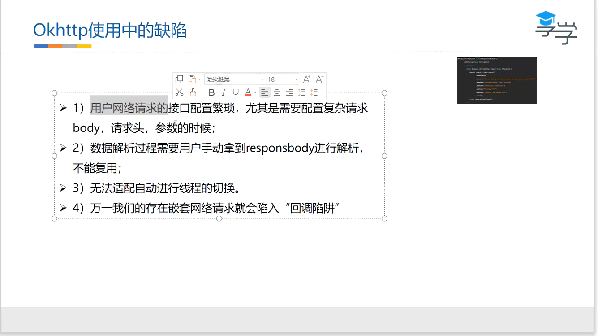

retrofit是对okhttp的封装，解决了okhttp中以上四大问题

基于http协议的8种规则

统一的规则适配网络请求：使用注解按照一定的策略来调配：URL；所以使用注解

retrofit使用**代理模式**——动态代理

retrofit只是okhttp的代理

Retrofit种的Builder方法采用**构建者模式，门面模式**

什么时候采用构建者模式？：构造函数超过5个，而且是可选的默认的

门面模式（外观模式）：Retrofit并没有带来其他别的功能，只是保存了很多东西，并配置好其中的成员变量

retrofit.create使用**反射+动态代理**实现返回一个**接口对象**

静态代理：有一个具体的代理类存在

动态代理：没有具体的代理类存在

