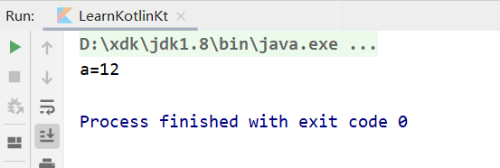
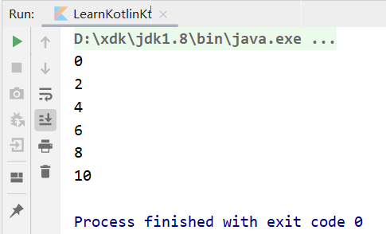
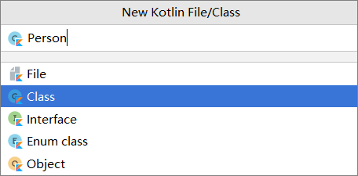
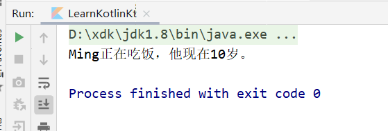

# 2.1 前言

Android可以使用Java和Kotlin进行开发，但是2019年I/O大会上，Kotlin被宣布成为第一开发语言，使用Kotlin开发已经成为了要求，而不是建议。

Kotlin是由JetBrains开发的一款语言，Kotlin和Java百分百兼容，因为它们都是解释型语言，在运行时，都会自动编译成`.class`文件，然后交给Java虚拟机进行执行。

为什么使用Kotlin替代Java？，原因如下：

- Kotlin语法更加简洁，代码量比同等功能的Java代码少近50%；
- 语法更加高级；
- 和Java百分百兼容，Kotlin可以直接调用使用Java编写的代码，可以无缝使用Java第三方开源库；


# 2.2 运行Kotlin代码

方法有三种：

1. 使用IntelliJ IDEA；目前对Kotlin支持得非常好，直接创建一个Kotlin项目即可进行开发；
2. 在线运行Kotlin代码；自行百度；
3. 使用Android Studio；但是不能创建Kotlin项目，只能创建Android项目，所以只能运行Kotlin代码而已；但是我们采取这种方法学习即可；


接下来开始运行第一个Kotlin文件：

1. 首先创建好一个Android项目，然后在MainActivity同级包下创建一个Kotlin文件——LearnKolin；

2. 然后编写一个`main()`函数，在其中向世界问好吧！这里需要注意你自己的包名（**Kotlin不需要加分号！**）；

   ```kotlin
   package com.example.unit_3_kotlin
   
   fun main() {
       println("Hello,World!")
   }
   ```

3. 之后点击`main()`旁边的绿色小三角，运行它，即可发出你的问候；
   


# 2.3 变量和函数

## 2.3.1 变量

Kotlin定义变量不用声明数据类型，Kotlin拥有出色的类型推导机制，声明变量只能使用两个关键字：**val和var**（使用的时候需要注意）

- val（value缩写）：声明一个不可变的变量；
- var（variable的缩写）：声明一个可变的变量；

```kotlin
package com.example.unit_3_kotlin

fun main() {
    var a = 10
    var b = 2
    println("a=" + (a + b))
}
```



但是如果类推导不正常工作的话，我们还是需要声明它的具体类型；**声明具体基本数据类型首字母是大写，这就说明Kotlin在Java的基础上舍弃了基本数据类型，万物都是对象，基本数据类型也是；**

```kotlin
val a: Int = 10
```

声明了变量之后，它的数据类型就是确定的，如果不通过强制转换的话，让它和其他变量做运算，会报类型不匹配异常（当然，这不包括double和int之间的运算这一类）

当你在写Kotlin代码时，一般你要声明一个变量的时候，你开始键入va然后就回车，但是总是使用的val；Kotlin就是这样设计的，为了强调不可变数据类型的重要性；


## 2.3.2 函数/方法

函数和方法都是指的同一个东西，函数的语法规则如下：

```kotlin
fun methodName(param1:Int, param2:Int): Int{
    return 0
}
```

`fun`是定义函数的关键字，所有函数都需要用它来声明；`fun`后面跟着的是函数名，注意命名规范；接着括号里的是参数表，可以任意多个，单个参数的格式是`变量名 : 数据类型`；再然后括号后面的数据类型是返回值类型，如果没有返回值，可以直接不写；最后就是大括号里的函数体了。

例：

```kotlin
package com.example.unit_3_kotlin

import kotlin.math.max

fun main() {
    val a = 20
    val b = 42
    val value = largerNum(a, b)
    println("最大的数字是：" + value)
}

fun largerNum(num1:Int,num2:Int):Int{
    return max(num1, num2)
}
```

该例子当中实现了一个`largerNum`函数，该方法实现了找到两个整型数字的最大值，但看了函数体就会发现，其实只是封装了Kotlin提供的`max`函数。

在Android Studio或者IntelliJ IDEA中编写Kotlin代码，IDE会提供非常智能的代码提示和补全功能，输入部分内容就能提示，使开发更加简单便捷，并且最重要的是，**使用自动补全的代码会自动导包**；

Kotlin特殊语法规定：当一个函数中只有一行代码时，可以不必编写函数体，可以直接将唯一的一行代码写在函数定义的尾部，用等号连接；

```kotlin
fun largerNum(num1:Int, num2:Int):Int = max(num1,num2)
```

但是由于Kotlin有出色的类推导机制，所以max函数计算后的数据类型能够推导出来，可以进一步简化

```kotlin
fun largerNum(num1:Int, num2:Int) = max(num1,num2)
```


# 2.4 程序的逻辑控制

## 2.4.1 if条件语句

Kotlin中if的一种普通用法和Java是一样的，如使用if语句实现上面的`largerNum`方法：

```kotlin
fun largerNum(num1:Int, num2:Int):Int{
    var temp = 0
    if(num1 > num2){
        temp = num1
    }else{
        temp = num2
    }
    return value
}
```

但是Kotlin中的if语句还有一种额外的特性——**if语句可以返回值**，返回值就是if语句每一个条件中最后一行代码的返回值；所以上面的代码可以进一步修改：

```kotlin
fun largerNum(num1:Int, num2:Int):Int{
    val temp = if(num1 > num2){
        num1
    }else{
        num2
    }
    return value
}
```

但是认真的你会发现，temp变量没有修改，所以可以写成val，但是它有用吗？没有，所以，可以进一步简写：

```kotlin
fun largerNum(num1:Int, num2:Int):Int{
    return if(num1 > num2){
        num1
    }else{
        num2
    }
}
```

结合上一小节讲到的语法特性，还可以进一步简写成一行代码：

```kotlin
fun largerNum(num1:Int, num2:Int) = if(num1 > num2) num1 else num2
```


## 2.4.2 when条件语句

Kotlin中的when语句和Java中的switch语句类似，但是强大得多；

Java中的switch语句只能支持整型、字符串等为条件，而且每一个case条件后面还得加break语句，否则会执行之后的内容；

按照Java中的习惯，我们很容易写出这么一个Kotlin代码：

```Kotlin
fun getScore(name:String) = if(name == "TOm"){
    86
    else if(name == "Jim"){
        77
    }else if(name == "Jack"){
        98
    }else if(name == "Lily"){
        100
    }else{
        0
    }
}
```

在Java选手看来，这已经是最简形式了，但是Kotlin能让它更简单：

```kotlin
fun getScore(name: String) = when (name) {
    "Tom" -> 86
    "Jim" -> 77
    "Jack" -> 95
    "Lily" -> 100
    else -> 0
}
```

注意when也支持上面的语法特性；在`->`后面的语句如果多行则需要加大括号，如果只有一行则可以省略

另外，when语句也可以用于类型匹配：

```kotlin
fun checkNum(num: Number) {
    when (num) {
        is Int -> println("Int")
        is Double -> println("Double")
        else-> println("No support")
    }
}
```

上面例子中的`is`类似于Java中的`instanceof`关键字，而`Number`类型是一个抽象类，是所有基本数据类型的父类；

Kotlin中的when语句也支持无参数，这样可以满足更多使用场景，如下：

```kotlin
fun getScore(name: String) = when {
    name.startsWith("Tom") -> 86
    name == "Jim" -> 77
    name == "Jack" -> 95
    else -> 0
}
```

上面例子中需要判断字符串是否开头是“Tom”，就必须得使用无参数的when语句；另外，Kotlin中的判断字符串、对象是否相等一律使用`==`关键字，而不是像Java中需要区分`==`和`equals`方法。


## 2.4.3 循环语句

**while循环：**和Java中完全一致；

**for循环：**Kotlin在for循环上做了很大幅度的修改，Java最常用的for-i循环在Kotlin直接被舍弃了，而for-each循环则被加强，变成了`for-in`循环；

在正式学习`for-in`循环之前，需要了解一下区间的概念，Kotlin表示一个区间有如下方法：

- ```kotlin
  val range = 0..10
  ```

  用`..`关键字表示一个闭区间，数学表达为[0,10]

- ```kotlin
  val range = 0 until 10
  ```

  用`util`关键字表示一个左闭右开区间，数学表达式为[0,10)

- ```kotlin
  val range = 10 downTo 1
  ```

  用`downTo`关键字表示一个降序的闭区间，降序[10,1]

默认情况下，`for-in`循环每次执行循环时会在区间范围内递增1，相当于Java中`for-i`循环的i++，如果想实现i+2效果，可以使用`step`关键字：

```kotlin
fun main() {
    for (i in 0..10 step 2) {
        println(i)
    }
}
```




# 2.5 面向对象编程

## 2.5.1 类于对象

如果我们要创建一个Person类，首先，右键整个包名（如我的是com.example）/ New / Kotlin File/Class，在Name处输入Person，Kind选择Class；Kotlin中，File通常是用于编写Kotlin顶层函数和扩展函数的，要创建类，就需要用Class；



创建完成后，我们可以为Person类添加属性和方法，得到如下的代码：

```kotlin
package com.example.unit_3_kotlin

class Person {
    var name = ""
    var age = 0

    fun eat() {
        println(name + "正在吃饭，他现在" + age + "岁。")
    }
}
```

创建好Person类之后，我们就可以创建Person类对象了，所以我们在main函数中对类实例化：

```kotlin
package com.example.unit_3_kotlin

import kotlin.math.max

fun main() {
    val a = Person()
    a.age = 10
    a.name = "Ming"
    a.eat()
}
```



和java文件的访问权限一样，在同一个包下，有main函数的kotlin文件能访问到同在一个包中的Person文件；Kotlin对类的实例化相比Java更加简化，前面类型统一使用val或者var，后面不用再使用new关键字，因为Kotlin本着最简化的设计原则，觉得许多都没有必要。


## 2.5.2 继承与构造函数

面向对象中一个很重要的特性就是继承，如一个学生也是一个人，所以在描述一个学生的时候，再在学生类中写年龄和姓名的话就会累赘，所以可以使学生继承人的属性，这样就会简化代码。

接下来我们实现一个Student类，使之继承自Person类：

1. 新建一个Student类，添加grade和sno属性

   ```kotlin
   package com.example.unit_3_kotlin
   
   class Student{
       var sno = ""
       var grade = 0
   }
   ```

2. 接下来，我们需要回退到Person类中去，让Person类能够被继承；这一点和Java有很大不同，在Kotlin中，任何一个非抽象类默认都是不可以被继承的，之所以这样设计，其实和val关键字的原因一致，因为类和变量都一样，最好都是不可变的；
   Kotlin中让一个类能够被继承，需要在`class`前加上`open`关键字；

   ```kotlin
   package com.example.unit_3_kotlin
   
   open class Person {
       var name = ""
       var age = 0
   
       fun eat() {
           println(name + "正在吃饭，他现在" + age + "岁。")
       }
   }
   
   ```

3. 让Student类继承自Person类；注意Kotlin中的继承时，父类还需要一对括号，这对括号的原因涉及到Kotlin中的构造函数；

   ```kotlin
   package com.example.unit_3_kotlin
   
   class Student : Person() {
       
       var sno = ""
       var grade = 0
   }
   ```

**Kotlin中的构造函数：**

Kotlin的构造函数比较复杂，分为主构造函数`init`和次构造函数`constructor`

1. 主构造函数最常用，如果没有声明构造函数，则每个类默认都会有一个不带参数的主构造函数，而且没有函数体，直接定义在类后面即可；如果要有其他什么语句，Kotlin提供了`init`关键字，将语句防止在init后的大括号内即可；

   ```Kotlin
   //没有函数体的主构造函数写法
   class Student(val sno: String, val grade: Int) : Person() {
   }
   
   //带有init的主构造函数写法
   class Student(val sno: String, val grade: Int) : Person() {
       init {
           println("sno is " + sno)
           println("grade is " + grade)
       }
   }
   ```

   如果这样写，实例化对象的时候就直接传入了需要的参数，并没有修改操作，所以你会注意到这里的sno和grade属性都使用了val关键字声明；

   Kotlin中继承时，父类需要带上一对括号，这是因为Kotlin需要遵守Java中的一个规定：*子类中的构造函数必须调用父类中的构造函数*。

   因为Kotlin中主构造函数一般都没有函数体，那子类构造函数怎么调用？其实就是一对括号，子类的主构造函数调用父类中的哪个构造函数，在继承的时候通过括号来指定。

   接下来修改Person类的主构造函数，因为在括号里声明了实例域，其生命范围就是整个类，所以就不用在后面再声明，习惯使用Java可能会觉得这只是传参数：

   ```Kotlin
   open class Person(val name:String,val age:Int) {
   
       fun eat() {
           println(name + "正在吃饭，他现在" + age + "岁。")
       }
   }
   
   ```

   修改了Person的主构造函数之后，Person就不存在默认的无参构造函数了，所以在Student中的代码就会报错，我们需要修改，使Student继承自有参数的Person构造函数：

   ```kotlin
   class Student(val sno: String, val grade: Int, name: String, age: Int) : Person(name, age) {
       
       init {
           println("sno is " + sno)
           println("grade is " + grade)
       }
   }
   ```

   注意，在Student类的主构造函数中增加name和age两个字段时，不能再将其生命为val或者var，因为在主构造函数中声明val或者var的参数将自动成为该类的字段，这就会导致和父类中同名的name和age字段造成冲突。

   接下来你就可以创建一个Student类的实例：

   ```kotlin
   val student = Student("a123",5,"Jack",20)
   ```


2. 次构造函数不怎么常用，但也会用到，就像Java中一个类有多个不同参数的构造函数一样；

   次构造函数需要使用关键字`constructor`，函数体写在后面大括号内；

   **但是在Kotlin中，只能有一个主构造函数，但是可以有多个次构造函数；Kotlin规定，当一个类既有主构造函数，又有次构造函数，所有次构造函数必须调用主构造函数**

   ```kotlin
   class Student(val sno: String, val grade: Int, name: String, age: Int) : Person(name, age) {
       constructor(name:String,age:Int) : this("",0,name,age){
           
       }
       
       constructor() : this("",0){}
   }
   ```

   接下来你就可以根据不同参数类型实例化Student对象了：

   ```kotlin
   val student1 = Student("a123",5,"Jack",20)
   val student2 = Student(Jack",20)
   val student3 = Student()   
   ```

   还有一种非常特殊的情况，类中只有次构造函数，没有主构造函数，这时候的写法也很不一样：

   ```kotlin
   class Student : Person{
       constructor(name: String, age: Int): super(name,age){
       }
   }
   ```

   注意这里的代码变化，首先Student类的后面没有显式地定义主构造函数，同时又因为定义了次构造函数，所以现在Student类使没有主构造函数的。那么既然没有主构造函数，继承Person类的时候也就不用再加上括号了。

   另外，由于没有主构造函数，次构造函数只能直接调用父类的构造函数，上述代码也是将`this`关键字替换成了`super`关键字，和Java是一致的。


## 2.5.3 接口

Kotlin中的接口部分和Java几乎是一致的。

接口时用于实现多态编程的重要组成部分。Kotlin和Java一样，时单继承结构的语言，任何一个类最多只能继承一个父类，但是却可以实现任意多个接口。我们可以在接口中定义一系列的抽象行为，然后由具体类去实现。

1. 新建一额`Study`的Kotlin文件，创建类型选择`Interface`，然后再接口中添加有关函数，函数不要求有函数体，也可以有函数体；

   ```Kotlin
   interface Study {
       fun readBooks(){
           println("Parent readBooks")
       }
       fun doHomeWork()
   }
   ```

2. 让Student类实现Study接口，在Kotlin中，继承和实现接口是一样的，都统一使用`:`关键字，如果有多个，使用逗号隔开；
   如果接口中的方法有函数体，在实现类中可以选择执行接口中的函数体，也可以选择不执行，执行的话需要使用`super`关键字，而且不一定在第一行，这和Java中有所区别；

   ```kotlin
   class Student(name: String, age: Int) : Person(name, age),Study {
       override fun doHomeWork() {
           println("do homework")
       }
   
       override fun readBooks() {
   		super.readBooks()
           println("Child readBooks")
       }
   }
   
   fun main() {
       val p = Student( "Jack", 20)
       p.doHomeWork()
       p.readBooks()
   }
   ```

   另外，在Kotlin中，实现接口的类不会强制要求实现接口中有函数体的方法，只会强制要求实现没有函数体的方法；如上面的Study接口中`readBooks`方法是有函数体的，则在Student类中，可以不实现`readBooks`方法，但是一定要实现`doHomeWork`，不然就会报错。


## 2.5.4 访问权限

Kotlin中有四种访问权限：private，public，protected和internal；使用时直接加在fun前面即可，和Java的异同如下：

| 修饰符    | Java                               | Kotlin             |
| --------- | ---------------------------------- | ------------------ |
| public    | 所有类可见                         | 所有类可见（默认） |
| private   | 当前类可见                         | 当前类可见         |
| protected | 当前类、子类、同一包路径下的类可见 | 当前类、子类可见   |
| default   | 同一包路径下的类可见（默认）       | 无                 |
| internal  | 无                                 | 同一模块中的类可见 |


## 2.5.5 数据类

一个标准的Java数据类一般至少需要重写三个方法：equals()、hashCode()、toString()方法。如创建一个Student类，需要重写这三个方法，才能正常工作。

而Kotlin中创建数据类非常简单，在一个类的class关键字前面加上data关键字，即可表示此类是一个数据类，Kotlin会根据主构造函数中的参数自动生成上面固定的三个方法。如果类中没有任何代码，还可以将尾部的大括号省略，如下：

```kotlin
data class Person(val name:String,val age:Int)
```

当然，如果Kotlin提供的重写规则无法满足需求，你也可以自己重写指定方法。


## 2.5.6 单例类

单例模式是最简单、最常用的一种设计模式，它规定一个类的实例只能拥有一个。

Java的实现也不复杂，只是需要保证构造函数是private，然后字段需要是静态的类对象，再使用getInstance方法来获取对象；

但是Kotlin中单例模式的实现更简单，只需将class关键字修改为object即可，如下创建一个Singleton单例类：

```kotlin
object Singleton {
    fun singletonTest() {
        println("singletonTest is called.")
    }
}
```

然后使用此单例类类似于Java中调用静态方法，但其实是Kotlin已经自动帮我们创建了一个Singleton的实例，并且保证全局只会存在一个Singleton实例；

```kotlin
fun main(){
    Singleton.singtonTest()
}
```


# 2.6 Lambda编程

Java在JDK1.8之后引入了Lambda编程的语法支持，但是Kotlin在第一个版本就开始支持了，并且功能极为强大。

## 2.6.1 集合的创建与遍历

传统意义上的集合主要是List、Set和Map；

在Java中，List的实现类有ArrayList和LinkedList；Set的实现类有HashSet；Map的实现类有HashMap。

Kotlin中可以创建一个集合并添加元素可以和Java中一致，如：

```kotlin
fun main() {
    val list = ArrayList<Int>()
    list.add(1)
    list.add(2)
    list.add(3)
    list.add(4)
    println(list)
}
```

但其实在Kotlin中，对集合的创建和遍历进行了简化。

**创建和遍历List：**

1. 创建不可变集合，创建的集合不能修改、添加和删除，只能读取：

   ```kotlin
   val list1 = listOf("Apple", "Banana", "Orange")
   for (fruit in list1) {
       println(fruit)
   }
   ```

2. 创建一般的ArrayList，集合可增删改查，有两种方法，都是返回ArrayList类对象：

   ```kotlin
   val list2 = arrayListOf("Apple", "Banana", "Orange")
   val list3 = mutableListOf("Apple", "Banana","Orange")
   ```

**创建和遍历Set：**

和List的操作一样，创建不可变Set用`setOf()`，返回对象是`LinkedHashSet`；创建可变Set用`mutableSetOf()`，返回类型也是`LinkedHashSet`；

不过Set集合底层是使用Hash映射机制来存放数据的，因此集合中的元素无法保证有序，并且Set集合中的元素不能重复，这是和List集合最大的不同；

```kotlin
val set = setOf("Apple", "Banana", "Orange")
val set1 = hashSetOf("Apple", "Banana", "Orange")
val set2 = mutableSetOf("Apple", "Banana", "Orange")

println(set.javaClass)
println(set1.javaClass)
println(set2.javaClass)

//输出
class java.util.LinkedHashSet
class java.util.HashSet
class java.util.LinkedHashSet
```

```kotlin
val set = setOf("Apple", "Banana", "Orange")
for(fruit in set){
	println(fruit)
}

//输出
Apple
Banana
Orange
```

**创建和遍历map：**

1. 传统的map写法：

   ```kotlin
   val map = HashMap<String, Int>()
   map.put("Apple", 1)
   map.put("Banana", 2)
   map.put("Orange", 3)
   ```

2. Kotlin中可以使用更简单的写法，类似Java中的数组写法：

   ```kotlin
   val map = HashMap<String, Int>()
   map["Apple"] = 1
   map["Banana"] = 2
   map["Orange"] = 3
   
   //读取map
   val number = map["Apple"]
   ```

3. Kotlin中最简单的写法：

   ```kotlin
   fun main() {
       val map = mapOf("Apple" to 1, "Banana" to 2, "Orange" to 3)
       for ((furit, number) in map) {
           println("水果" + furit + "的数字是" + number)
       }
   }
   
   //输出
   水果Apple的数字是1
   水果Banana的数字是2
   水果Orange的数字是3
   ```


## 2.6.2 集合的函数式API

集合的函数式API有很多，其语法结构就是Lambda表达式的语法结构。

**Lambda定义：**Lambda是一小段可以作为参数传递的代码。（一小段没有作限制，但不建议编写太长代码）

Lambda表达式的语法结构：

```
{参数名1：参数类型，参数名2：参数类型 -> 函数体}
```

上面是Lambda表达式最完整的语法结构定义。首先最外层是一对大括号，如果有参数传入到Lambda表达式中的话，我们还需要声明参数列表，参数列表的结尾使用一个 `->` 符号，表示参数列表的结束以及函数体的开始，函数体中可以编写任意行代码（不建议编写太长的代码），并且最后一行代码会自动作为Lambda表达式的返回值。

**接下来实现一个查找String列表中最长的一个元素（如果有重复则为最先出现的一个）功能：**

```kotlin
fun main() {
    val list = listOf("Apple", "Banana", "Orange", "Pear")
    val lambda = {fruit:String -> fruit.length}
    val maxLengthFruit = list.maxBy(lambda)
    println(maxLengthFruit)
}
```

第二行代码就是一个Lambda表达式，第三行代码的就使用list调用maxBy方法，不过接受参数是一个Lambda类型的参数，并且会在遍历集合的时候将每次遍历的值作为参数传递给Lambda表达式。maxBy方法的工作原理是根据传入的条件来遍历遍历集合，从而找到该条件下的最大值，比如说想要找到单词最长的水果，那Lambda表达式内容自然是单词的length。

上述代码还可以进行简化，我们可以不需要lambda这个中间变量：

```kotlin
val maxLengthFruit = list.maxBy({fruit:String -> fruit.length})		
```

Kotlin规定，当Lambda参数是函数的最后一个参数时，可以将Lambda表达式移到函数括号的外面，如下所示：

```kotlin
val maxLengthFruit = list.maxBy(){fruit:String -> fruit.length}	
```

我们还可以继续简化，由于Kotlin拥有出色的类推导机制，所以Lambda表达式中的参数列表其实在大多数情况下不必声明参数类型：

```kotlin
val maxLengthFruit = list.maxBy(){fruit -> fruit.length}
```

然后，当Lambda表达式的参数列表只有一个参数时，也不必声明参数名，而是可以使用`it`关键字来代替：

```kotlin
val maxLengthFruit = list.maxBy{ it.length }
```

所以，求一个String列表中的最开始的最长的一个字符可以简化成下面形式：

```kotlin
fun main() {
    val list = listOf("Apple", "Banana", "Orange", "Pear")
    val maxLengthFruit = list.maxBy { it.length }
    println(maxLengthFruit)
}

//输出
Banana
```


**集合中的map函数：**

集合中的map函数时最常用的一种函数式API，它用于将集合中的每个元素都映射成一个另外的值，映射的规则在Lambda表达式中指定，最终生成一个新的集合。比如如下将list中的水果名变为大写：

```kotlin
fun main() {
    val list = listOf("Apple", "Banana", "Orange")
    val newList = list.map { it.toUpperCase() }
    for (item in newList) {
        println(item)
    }
}

//输出
APPLE
BANANA
ORANGE
```


**函数式API——filter函数：**

filter函数是用来过滤数据的，可以单独使用，也可以配合map函数使用。

```kotlin
fun main() {
    val list = listOf("Apple", "Banana", "Orange", "watermelon")
    val newList = list.filter { it.length <= 5 }
    				  .map { it.toUpperCase() }
    for (item in newList) {
        println(item)
    }
}

//输出
APPLE
```


**any和all函数：**

any函数用于判断集合中是否存在一个元素满足指定条件，all函数用于判断集合中是否所有元素都满足指定条件，两者都返回bool：

```kotlin
fun main() {
    val list = listOf("Apple", "Banana", "Orange", "Pear")
    val anyItem = list.any{ it.length <= 5}
    val allItem = list.all { it.length <= 5 }
    println("list中有元素长度小于等于5：" + anyItem)
    println("list中所有元素长度小于等于5：" + allItem)
}
```


## 2.6.3  Java函数式API的使用

Kotlin中调用Java方法可以使用函数式API，但是有一定限制：如果我们在Kotlin代码中调用了一个Java方法，并且该方法接收一个Java单抽象方法接口参数，就可以使用函数式API。Java单抽象方法接口是指的是接口中只有一个待实现方法，如果接口中有多个待实现方法，则无法使用函数式API。

Java原生API中一个单抽象方法接口——Runnable接口：

```java
public interface Runnable{
    void run();
}
```

Java中创建一个线程：

```kotlin
new Thread(new Runnable(){
    @Override
    public void run(){
        System.out.println("Thread is running");
    }
}).start();
```

不省略地翻译成Kotlin版本，写法如下：

```kotlin
Thread(object : Runnable{
    override fun run(){
        println("Thread is running")
    }
}).start()
```

由于Kotlin中没有`new`关键字，所以创建内部类使用`object`关键字；但由于前面介绍的Kotlin简化机制，当Lambda表达式移到方法括号的外面，同时，如果Lambda表达式还是方法的唯一一个参数，还可以将方法的括号省略。可以将Labmda所以最简化的版本如下：

```kotlin
Thread({
    println("Thread is running")
}).start()
```

同理，Android中一个按钮的点击事件，可以简化成下面形式：

```kotlin
button.setOnClickListener{
	//todo
}
```


# 2.7 空指针检查

## 2.7.1 可空类型系统

Kotlin默认**所有的参数和变量都不可为空**，这一点和Java完全不同，如果试图传入null，则会提示错误。

Kotlin提供了一套可为空的类型系统，只不过在使用可为空的类型系统时，我们需要在编译时期就将所有潜在的空指针异常都处理掉，否则代码将无法通过。

Kotlin规定，在类名后面加上`?`，则表示该类型可为空，如`Int?`

```kotlin
fun main(){
    doStudy(null)
}

fun doStudy(study: Study?){
    if(study != null){
        study.readBooks()
        study.doHomework()
    }
}
```

上面因为Study可为空，所以在函数体中需要通过逻辑来处理空指针异常。

但是只是依靠`if`判断语句来进行处理，处理不了全局变量的判空问题，所以，Kotlin提供了一系列的辅助工具。


## 2.7.2 判空辅助工具

**1. `?.`操作符：**

当对象不为空的时候正常调用相应的方法，当对象为空时什么都不做：

```kotlin
if(a != null){
	a.doSomething()
}

//使用?.操作符实现等效
a?.doSomething()
```


**2. `?:`操作符：**

左右两边都接受一个表达式，如果对象为空不为空，则返回左边的表达式的结果，否则就返回右边表达式的结果，如下：

```kotlin
val c = if(a != null){
    a
}else {
    b
}

//使用?:操作符等效实现
val c = a ?: b
```


虽然可空类型系统很方便，但是Kotlin还没有智能到能能检查到外部是否做了非空检查，如下，要通过编译，`content.toUpperCase()`需要用`?.`或者`!!.`操作符，前面的好理解，不过`!!.`是确信这里的对象不会为空，如果出现问题，会直接抛出空指针异常：

```kotlin
var content: String? = "hello"

fun main() {
    if (content != null) {
        printUpperCase()
    }
}

fun printUpperCase() {
    //报错提示
    val upperCase = content.toUpperCase()	
    println(upperCase)
}
```


**3. let辅助工具**

let不是操作符，也不是关键字，而是一个函数，这个函数提供了函数式API的编程接口，并将原始调用对象作为参数传递到Lambda表达式中，如：

```kotlin
obj.let{obj2 ->
	//todo       
}
```

这里obj对象调用了let函数，然后Lambda表达式中的代码就会立即执行，并且这个obj对象本身还会作为参数传递到Lambda表达式中。不过，为了防止变量重名，这里的参数名修改为了obj2，但实际上它们是同一个对象。

let函数和`?.`配合在空指针检查的时候有很大的作用。

如下doStudy()函数，但很啰嗦，每个语句都使用了`?.`操作符：

```kotlin
fun doStudy(study: Study?){
    study?.readBooks()
    study?.doHomework()
}
```

采用let函数优化：

```kotlin
fun doStudy(study: Study?){
    study?.let{stu->
        study.readBooks()
        study.doHomework()
    }
}
```

如果像此处，Lambda表达式的参数列表只有一个参数，则stu可以去掉，直接使用it即可

```kotlin
fun doStudy(study: Study?){
    study?.let{
        it.readBooks()
        it.doHomework()
    }
}
```

还有重要的一点：let函数可以处理全局变量的判空问题，而if无法做到，如下：

```kotlin
var study: Study? = null

fun doStudy() {
    if (study != null) {
        study.doHomeWork()	//报错
        study.readBooks()	//报错
    }
}
```

这里之所以会报错，是因为全局变量的值随时都有可能被其他线程所修改，即使做了判空处理，仍然无法保证if语句中的study变量没有空指针风险，但是let可以保证。


# 2.8 Kotlin中的小魔术

## 2.8.1 字符串内嵌表达式

Kotlin连接字符串不适用加号，使用嵌入表达式，写法如下：

```kotlin
val str = "hello,${obj.name}, nice to meet you!"
```

如只有一个变量，可以省略，如下：

```kotlin
val brand = "Samsung"
val price = 1299.99
println("Cellphone(brand=$brand, price=$price)")

//输出
Cellphone(brand=Samsung, price=1299.99)
```


## 2.8.2 函数的参数默认值

Kotlin可以给方法参数赋予默认值，要使用参数默认值，应当使用键值对赋值的方式传递参数：

```kotlin
fun printParams(num: Int = 100, str: String) {
    println("num is $num, str is $str")
}

fun main() {
    printParams(str = "world")
}

//输出
num is 100, str is world
```