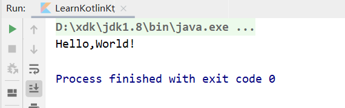

# 2.1 前言

Android可以使用Java和Kotlin进行开发，但是2019年I/O大会上，Kotlin被宣布成为第一开发语言，使用Kotlin开发已经成为了要求，而不是建议。

Kotlin是由JetBrains开发的一款语言，Kotlin和Java百分百兼容，因为它们都是解释型语言，在运行时，都会自动编译成`.class`文件，然后交给Java虚拟机进行执行。

为什么使用Kotlin替代Java？，原因如下：

- Kotlin语法更加简洁，代码量比同等功能的Java代码少近50%；
- 语法更加高级；
- 和Java百分百兼容，Kotlin可以直接调用使用Java编写的代码，可以无缝使用Java第三方开源库；


# 2.2 运行Kotlin代码

方法有三种：

1. 使用IntelliJ IDEA；目前对Kotlin支持得非常好，直接创建一个Kotlin项目即可进行开发；
2. 在线运行Kotlin代码；自行百度；
3. 使用Android Studio；但是不能创建Kotlin项目，只能创建Android项目，所以只能运行Kotlin代码而已；但是我们采取这种方法学习即可；


接下来开始运行第一个Kotlin文件：

1. 首先创建好一个Android项目，然后在MainActivity同级包下创建一个Kotlin文件——LearnKolin；

2. 然后编写一个`main()`函数，在其中向世界问好吧！这里需要注意你自己的包名（**Kotlin不需要加分号！**）；

   ```kotlin
   package com.example.unit_3_kotlin
   
   fun main() {
       println("Hello,World!")
   }
   ```

3. 之后点击`main()`旁边的绿色小三角，运行它，即可发出你的问候；
   


# 2.3 变量和函数

## 2.3.1 变量

Kotlin定义变量，没有数据类型之分，Kotlin拥有出色的类型推导机制，声明变量只能使用两个关键字：**val和var**

- val（value缩写）：声明一个不可变的变量；
- var（variable的缩写）：声明一个可变的变量；

```kotlin
package com.example.unit_3_kotlin

fun main() {
    var a = 10
    var b = 2
    println("a=" + (a + b))
}
```

