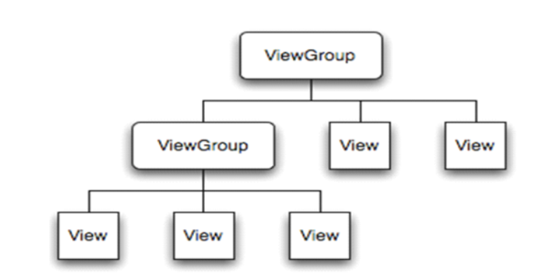
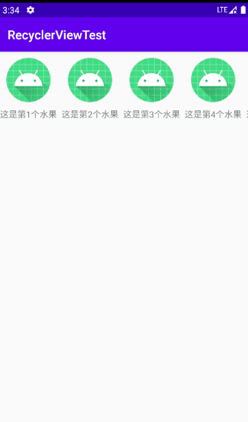
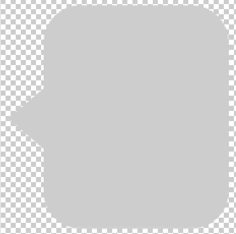
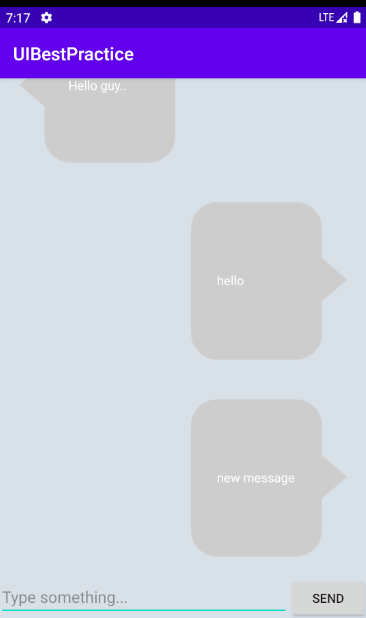

App中的UI开发

一个好的程序不仅需要牛x的功能，还要有好看的页面。

Android也给我们提供了很多的UI开发工具，我们可以使用这些工具构建一些基础的界面；

当然，Android提供的UI一般并不能满足产品经理的业务要求，这就需要学习后续自定义控件的开发。


## 3.1 如何编写程序界面

Android Studio提供了两种进行界面编写的方式：

1. **使用XML进行编写**

   全部根据XML标签语言进行编写，推荐先学习透彻XML，然后使用可视化编辑

2. **通过可视化编辑器来进行拖拽，进行布局的编写**

   目前AS 3.6 版本默认显示为可视化编辑器，Google似乎在这方面做了很多努力，希望开发人员使用可视化进行UI编写，建议读者在学习XML之后自行查阅可视化编辑器的使用


​		可以点击箭头处修改显示：左侧为只显示XML；中间为XML和可视化界面都显示；右侧为只显示可视化界面


## 3.2 常用控件的使用方法

### 3.2.1 TextView

功能：主要用于在界面上显示一段文本信息

```xml
<?xml version="1.0" encoding="utf-8"?>
<LinearLayout android:layout_width="match_parent"
    android:layout_height="match_parent"
    android:orientation="vertical"
    xmlns:android="http://schemas.android.com/apk/res/android">

    <TextView
        android:id="@+id/text_view"
        android:text="Hello, world!"
        android:textColor="#823fff"
        android:textSize="30sp"
        android:gravity="center_horizontal|center_vertical"
        android:layout_width="match_parent"
        android:layout_height="match_parent" />

</LinearLayout>
```

1. 首先，在`TextView`外面包裹有一个`LinearLayout`，这是一个布局控件，一般默认为约束布局，但是使用XML编写的时候一般将其修改为简单的布局，这是一个最外层的一个布局，它的宽和高都是`match_parent`，它外层没有其他布局了，所以它会填充满整个屏幕；`xmlns:android="http://schemas.android.com/apk/res/android"`是必须的，必须声明它，才能使用这些自带的控件；

2. 再看主角`TextView`，第一行使用`android:id`属性给其指定了一个唯一标识符，在所有活动的java代码或者xml文件中都可以使用R，来获取到它，比如在活动中使用`R.id.text_view`来获取，其值为一个整数；

3. 然后使用`android:layout_width`和`android:layout_height`指定其宽和高，其值可选为四种：`match_parent`，`wrap_content`，`fill_parent`和自定义长度如`20dp`。其中`match_parent`和`fill_parent`意义相同，一般都是用`match_parent`。`match_parent`表示让目前控件的大小和父布局的大小意义，也就是由父布局来决定当前控件的大小；`wrap_content`表示让当前控件的大小能够刚好包含著里面的内容，也就是由控件内容决定当前控件的大小；然后自定义长度使用`dp`为单位，但是需要注意，现在手机种类繁多，容易造成适配出现问题；

4. 最后通过`android:text`指定文本的内容，一般情况下会变黄色，这是建议你将文本内容保存到`string.xml`中，然后通过`R.string.name`的方式进行访问，但是我个人觉得没有必要；
5. `TextView`本身文字内容是靠左显示的，可以使用`android:gravity`属性来指定文字对齐方式，可选值为top、bottom、left、right、center等，AS中输入`android:gravity`后就会有自定补全提示，会提示这些可选值；并且，可以使用 “|” 来指定多个值，如`center_horizontal|center_vertical`，表示文字在垂直和水平方向都居中对齐（中间无空格），注意，这里针对的是`TextView`本身的宽和高，在这个范围内垂直水平方向都居中对齐；
6. 还可以修改文字的大小和颜色，大小使用`android:textSize`属性，值使用`sp`为单位进行设置；颜色使用`android:textColor`属性进行设置，值使用3个颜色混合而成，每个颜色由一个十六进制符号来定义，如黑色（#000000），可以通过取色器来得到颜色值。
7. 还要很多属性，可以查阅官方文档，不过都是英文，没关系，我相信你：https://developer.android.google.cn/reference/kotlin/android/widget/TextView?hl=en


### 3.2.2 Button

功能：提供一次点击，触发一次点击事件，是和用户进行交互的重要控件

```xml
<?xml version="1.0" encoding="utf-8"?>
<LinearLayout android:layout_width="match_parent"
    android:layout_height="match_parent"
    android:orientation="vertical"
    xmlns:android="http://schemas.android.com/apk/res/android">

   	...

    <Button
        android:id="@+id/button"
        android:layout_width="match_parent"
        android:layout_height="wrap_content"
        android:text="Button"
        android:textAllCaps="false"/>
    
    <Button
        android:id="@+id/button_2"
        android:layout_width="match_parent"
        android:layout_height="wrap_content"
        android:text="Button_2"
        android:textAllCaps="false"/>

</LinearLayout>
```

1. `Button`可使用的属性和上面`TextView`差不多，针对文字的内容是指`Button`中要显示的内容，默认是全部大写，如果要关闭全部字母大写，可以使用`android:textAllCaps="false"`进行设置；注意`id`属性是必须的，因为设置点击事件需要；

2. `Button`更重要的部分是点击事件的书写，具体有两种写法：

   - 匿名内部类的写法：

     ```java
     public class MainActivity extends BaseActivity {
     
         @Override
         protected void onCreate(Bundle savedInstanceState) {
             super.onCreate(savedInstanceState);
             setContentView(R.layout.activity_main);
     
             Button button = (Button) findViewById(R.id.button);
             button.setOnClickListener(new View.OnClickListener() {
                 @Override
                 public void onClick(View view) {
                     //此处添加点击后的逻辑处理
                     
                 }
             });
         }
     }
     ```

   - 实现接口的写法：

     ```java
     public class MainActivity extends BaseActivity implements View.OnClickListener{
     
         @Override
         protected void onCreate(Bundle savedInstanceState) {
             super.onCreate(savedInstanceState);
             setContentView(R.layout.activity_main);
     
             Button button = (Button) findViewById(R.id.button);
             Button button_2 = (Button) findViewById(R.id.button_2);
     
             button.setOnClickListener(this);
             button_2.setOnClickListener(this);
         }
     
         @Override
         public void onClick(View view) {
             switch (view.getId()) {
                 case R.id.button:
                     //此处添加点击后的逻辑处理
                     Toast.makeText(MainActivity.this,"btn1",Toast.LENGTH_SHORT).show();
                     break;
                 case R.id.button_2:
                     //此处添加点击后的逻辑处理
                     Toast.makeText(MainActivity.this,"btn2",Toast.LENGTH_SHORT).show();
                     break;
                 default:
                     break;
             }
         }
     }
     ```

     

### 3.2.3 EditText

功能：一个输入框，可供用户输入和编辑内容，并可在程序中对这些内容进行处理

```xml
<?xml version="1.0" encoding="utf-8"?>
<LinearLayout android:layout_width="match_parent"
    android:layout_height="match_parent"
    android:orientation="vertical"
    xmlns:android="http://schemas.android.com/apk/res/android">

    ...

    <EditText
        android:id="@+id/edit_text"
        android:layout_width="match_parent"
        android:layout_height="wrap_content"
        android:maxLines="1"
        android:maxLength="10"
        android:hint="输入一段文字"/>

</LinearLayout>
```

1. 现在你可以知道，要使用一个控件很简单，就是指定`id`、宽和高之后，再根据需要添加一些控件特有的属性即可；

2. 使用`android:hint`属性可以在输入框中里显示一段提示性的文字，如果用户输入了内容，这些提示性的文字就会消失，其值为显示的文字；

3.  默认情况下高度设置为`wrap_content`时，如果你输入的内容超过一行，`EditText`的下划线就会向下移动，将所有输入的内容显示出来，但是这样很难看，设配也会出现问题；可以使用`android:maxLines`属性设置最大行数，一般设置为1，这样内容就会上移，始终显示最新一行，下划线不会移动，上下滑动可以看到被遮住的内容；

4. 要限制输入的元素个数，比如说手机号限制为11位，则可以使用`android:maxLength="11"`属性进行设置；

5. 一般情况下，`EditText`和`Button`配合使用，输入一段内容后，点击`Button`，就可以在程序中对输入框中的内容进行处理

   ```java
   public class MainActivity extends BaseActivity implements View.OnClickListener {
   
       private EditText editText;
   
       @Override
       protected void onCreate(Bundle savedInstanceState) {
           super.onCreate(savedInstanceState);
           setContentView(R.layout.activity_main);
   
           Button button = (Button) findViewById(R.id.button);
           Button button_2 = (Button) findViewById(R.id.button_2);
           editText = (EditText) findViewById(R.id.edit_text); 
   
           button.setOnClickListener(this);
           button_2.setOnClickListener(this);
       }
   
       @Override
       public void onClick(View view) {
           switch (view.getId()) {
               case R.id.button:
                   String msg = editText.getText().toString();
                   Toast.makeText(MainActivity.this, msg, Toast.LENGTH_SHORT).show();
                   break;
               case R.id.button_2:
                   Toast.makeText(MainActivity.this, "btn2", Toast.LENGTH_SHORT).show();
                   break;
               default:
                   break;
           }
       }
   }
   ```


### 3.2.4 ImageView

功能：在界面上展示一张图片，可以加载本地图片或者加载网络图片

```xml
<LinearLayout android:layout_width="match_parent"
    android:layout_height="match_parent"
    android:orientation="vertical"
    xmlns:android="http://schemas.android.com/apk/res/android">

    ...
    
    <ImageView
        android:id="@+id/image_view"
        android:layout_width="wrap_content"
        android:layout_height="wrap_content"
        android:src="@drawable/ic_launcher_background" />

</LinearLayout>
```

1. 目前只会使用到加载本地自带的图片，准备的图片通常存放在`res/drawable`下，而不同分辨率的图片需要放在不同的文件夹下，所以我们在`res`下新建一个`drawable-xhdpi`目录（在Project视图下才能看到），然后将准备好的`img_1.png`和`img_2.png`复制进去，这里我们可以使用自带的`ic_launcher_background`图片；

2. 这里使用`android:src`属性给其指定了一张图片，由于每张图片宽高未定，所以都设置为`wrap_content`，所以每张图片都能正常显示，不会被拉伸变形，如果图片尺寸过大，图片就会被缩放，你看起来是正常显示，但是图片内容并不会占满整个ImageView；`android:background`属性也可以设置图片，但是根据其字面意思，会填充满整个屏幕，所以图片会被拉伸变形；

3. 我们还可以设置点击事件，在代码中动态更改ImageView的图片，这样点击图片就会替换为img_1；

   ```java
   public class MainActivity extends BaseActivity implements View.OnClickListener {
   
       private EditText editText;
   
       private ImageView imageView;
   
       @Override
       protected void onCreate(Bundle savedInstanceState) {
           super.onCreate(savedInstanceState);
           setContentView(R.layout.activity_main);
   
           Button button = (Button) findViewById(R.id.button);
           Button button_2 = (Button) findViewById(R.id.button_2);
           editText = (EditText) findViewById(R.id.edit_text);
           imageView = (ImageView) findViewById(R.id.image_view);
   
           button.setOnClickListener(this);
           button_2.setOnClickListener(this);
           imageView.setOnClickListener(this);
       }
   
       @Override
       public void onClick(View view) {
           switch (view.getId()) {
               case R.id.button:
                   String msg = editText.getText().toString();
                   Toast.makeText(MainActivity.this, msg, Toast.LENGTH_SHORT).show();
                   break;
               case R.id.button_2:
                   Toast.makeText(MainActivity.this, "btn2", Toast.LENGTH_SHORT).show();
                   break;
               case R.id.image_view:
                   imageView.setImageResource(R.drawable.img_1);
               default:
                   break;
           }
       }
   }
   ```


### 3.2.5 ProgressBar

功能：用于在界面上显示一个进度条，表示程序正在加载一些耗时的数据

```xml
<LinearLayout android:layout_width="match_parent"
    android:layout_height="match_parent"
    android:orientation="vertical"
    xmlns:android="http://schemas.android.com/apk/res/android">

    ...

    <ProgressBar
        android:id="@+id/progress_bar"
        android:layout_width="match_parent"
        android:layout_height="wrap_content" />

</LinearLayout>
```

1. 这个控件是一直在转圈圈的，需要结合代码来使用，要加载数据时就设置可见，加载完毕就设置为不可见或者消失；

2. `android:visibility`可见属性是所有Android控件共有的，可选值有3种：visible、invisible和gone。visible表示控件可见，为默认值；invisible为不可见，控件变为透明，但是仍占据原来的位置和大小；gone为消失，控件不可见而且不占据位置和大小；可以使用Activity类下的`setVisibility()`属性在代码种设置可见性，可选值为`View.VISIBLE`、`View.INVISIBLE`、`View.GONE` 3个值；下面就是通过Button实现ProgressBar的可见性设置；

   ```java
   public class MainActivity extends BaseActivity implements View.OnClickListener {
   
       private EditText editText;
   
       private ImageView imageView;
   
       private ProgressBar progressBar;
   
       @Override
       protected void onCreate(Bundle savedInstanceState) {
           super.onCreate(savedInstanceState);
           setContentView(R.layout.activity_main);
   
           Button button = (Button) findViewById(R.id.button);
           Button button_2 = (Button) findViewById(R.id.button_2);
           editText = (EditText) findViewById(R.id.edit_text);
           imageView = (ImageView) findViewById(R.id.image_view);
           progressBar = (ProgressBar) findViewById(R.id.progress_bar);
   
           button.setOnClickListener(this);
           button_2.setOnClickListener(this);
           imageView.setOnClickListener(this);
       }
   
       @Override
       public void onClick(View view) {
           switch (view.getId()) {
               case R.id.button:
                   if (progressBar.getVisibility() == View.GONE) {
                       progressBar.setVisibility(View.VISIBLE);
                   } else {
                       progressBar.setVisibility(View.GONE);
                   }
                   break;
               case R.id.button_2:
                   Toast.makeText(MainActivity.this, "btn2", Toast.LENGTH_SHORT).show();
                   break;
               case R.id.image_view:
                   imageView.setImageResource(R.drawable.img_1);
               default:
                   break;
           }
       }
   }
   ```

3. 默认的还有其他样式的进度条，可以在xml文件中修改，其中一种水平样式的进度条，在代码中可以不断地通过ProgressBar对象的setProgress(int )进行进度的修改：

   ```xml
   <ProgressBar
           android:id="@+id/progress_bar"
           android:layout_width="match_parent"
           android:layout_height="wrap_content"
           style="?android:attr/progressBarStyleHorizontal"/>
   ```


### 3.2.6 AlertDialog

功能：在当前界面弹出一个对话框，这个对话框是置顶于所有界面元素之上的，能够屏蔽掉其他控件的交互能力，因此此控件一般都是用于提示一些非常重要的内容和警告信息

1. AlertDialog不需要在xml文件中设置，直接在java代码中使用，如在点击事件中使用，其中`dialog.setCancelable(false)`是指不可以点击Dialog之外的地方退出，必须点击OK或者Cancel；

   ```java
   @Override
   public void onClick(View view) {
       switch (view.getId()) {
           case R.id.button:
               if (progressBar.getVisibility() == View.GONE) {
                   progressBar.setVisibility(View.VISIBLE);
               } else {
                   progressBar.setVisibility(View.GONE);
               }
               break;
           case R.id.button_2:
               AlertDialog.Builder dialog = new AlertDialog.Builder(MainActivity.this);
               dialog.setTitle("This is a dialog");
               dialog.setMessage("Something import.");
               dialog.setCancelable(false);
               dialog.setPositiveButton("OK", new DialogInterface.OnClickListener() {
                   @Override
                   public void onClick(DialogInterface dialogInterface, int i) {
                       Toast.makeText(MainActivity.this, "OK", Toast.LENGTH_SHORT).show();
                   }
               });
               dialog.setNegativeButton("Cancel", new DialogInterface.OnClickListener() {
                   @Override
                   public void onClick(DialogInterface dialogInterface, int i) {
                       Toast.makeText(MainActivity.this, "Cancel", Toast.LENGTH_SHORT).show();
                   }
               });
               dialog.show();
               break;
           case R.id.image_view:
               imageView.setImageResource(R.drawable.img_1);
           default:
               break;
       }
   }
   ```


### 3.2.7 ProgressDialog（已废弃）

功能：和AlertDialog类似，弹出一个在所有界面以上的对话框，但是有一个一直旋转的进度条，一般用于处理重要、耗时的操作，让用户耐心等待。

1. 该控件不用在xml中声明，只用在代码中声明，但是已经

   ```java
    @Override
       public void onClick(View view) {
           switch (view.getId()) {
               case R.id.button:
                   ProgressDialog progressDialog = new ProgressDialog(MainActivity.this);
                   progressDialog.setTitle("This is a ProgressDialog");
                   progressDialog.setMessage("Loading...");
                   progressDialog.setCancelable(true);
                   progressDialog.show();
                   break;
               case R.id.image_view:
                   imageView.setImageResource(R.drawable.img_1);
               default:
                   break;
           }
       }
   ```


## 3.3 四种基本布局

一个丰富的界面是由很多控件组成的，而控件的正确摆放就得借助布局实现；布局是一种可用于放置很多控件的容器，写法和控件类似；布局内可以嵌套控件，甚至可以 嵌套布局；


### 3.3.1 线性布局（LinearLayout）

1. 此布局会将其包含的所有控件在线性方向依次排列，这个线性方向包括**水平方向**、**垂直方向**，通过`android:orentation`来指定，默认为水平方向；

2. 如果方向指定为`vertical`，则控件垂直排列，注意因为控件垂直排列，所以每个控件的高不能设置为`match_parent`，否则一个控件就会占据满整个屏幕；

3. 如果方向指定为`horizontal`，则控件水平排列，同理，因为控件水平排列，所以每个控件的宽不能设置为`match_parent`，否则一个控件就会占据满整个屏幕；

4. 使用`android:layout_gravity`可以指定**控件在布局中的对齐方式**，其可选值和`android:gravity`一致，但它是指定文字在控件中 的对齐方式；需要特别注意的是，在线性布局中，如果方向指定为水平方向，则只有垂直方向的对齐方式才会生效，同样的，如果方向指定为垂直方向，则只有水平方向的对齐方式才会生效；只要记住，线性布局中的每一个控件都是**按照线性依次紧密相连**的；

   ```xml
   <?xml version="1.0" encoding="utf-8"?>
   <LinearLayout xmlns:android="http://schemas.android.com/apk/res/android"
       android:orientation="horizontal"
       android:layout_width="match_parent"
       android:layout_height="match_parent">
   
       <Button
           android:id="@+id/btn_1"
           android:layout_width="wrap_content"
           android:layout_height="wrap_content"
           android:layout_gravity="top"
           android:text="Button1"/>
   
       <Button
           android:id="@+id/btn_2"
           android:layout_width="wrap_content"
           android:layout_height="wrap_content"
           android:layout_gravity="center_vertical"
           android:text="Button2"/>
   
       <Button
           android:id="@+id/btn_3"
           android:layout_width="wrap_content"
           android:layout_height="wrap_content"
           android:layout_gravity="bottom"
           android:text="Button3"/>
   
   </LinearLayout>
   ```

5. 使用`android:layout_weight`属性，可以让我们按照比例来指定多个控件的大小，经常用于屏幕适配问题；如果是线性布局指定为水平方向的话，则每个控件的宽都设置为0dp，系统会自动将线性布局下所有控件指定的`layout_weight`相加，得到一个总值，然后每个控件所占大小的比例就是该控件的值除总值，如下，EditText控件值为2，Button控件值为1，所以EditText占据2/3宽，Button占据1/3宽

   ```xml
   <?xml version="1.0" encoding="utf-8"?>
   <LinearLayout xmlns:android="http://schemas.android.com/apk/res/android"
       android:orientation="horizontal"
       android:layout_width="match_parent"
       android:layout_height="match_parent">
   
       <EditText
           android:id="@+id/edit_text"
           android:layout_width="0dp"
           android:layout_weight="2"
           android:layout_height="wrap_content" />
   
       <Button
           android:id="@+id/btn"
           android:layout_width="0dp"
           android:layout_height="wrap_content"
           android:layout_weight="1"
           android:text="Button" />
   
   </LinearLayout>
   ```

6. 更加常用的一种EditText和Button的组合是，EditText控件的值设置为1，宽还是为0dp，但Button控件的宽设置为`wrap_content`，这样适配得非常好，而且看起来也更加舒服


### 3.3.2 相对布局（RelativeLayout）

1. 此布局中的控件不会按照线性依次排列，可以通过相对定位的方式让控件出现在布局的任何位置，所以相对布局的属性很多，但都有迹可循；

2. 第一种类型是相对于父布局的，如果你英语过关，理解下面的xml文件完全没有问题，其中`android:layout_alignParentStart`和`android:layout_alignParentLeft`是一个意思，同理，Right和End也是一个意思，但是官方推荐使用Start和End；

   ```xml
   <?xml version="1.0" encoding="utf-8"?>
   <RelativeLayout xmlns:android="http://schemas.android.com/apk/res/android"
       android:layout_width="match_parent"
       android:layout_height="match_parent">
   
       <Button
           android:id="@+id/btn_1"
           android:layout_width="wrap_content"
           android:layout_height="wrap_content" 
           android:layout_alignParentStart="true"
           android:layout_alignParentTop="true"
           android:text="btn 1"/>
   
       <Button
           android:id="@+id/btn_2"
           android:layout_width="wrap_content"
           android:layout_height="wrap_content"
           android:layout_alignParentEnd="true"
           android:layout_alignParentTop="true"
           android:text="btn 2"/>
   
       <Button
           android:id="@+id/btn_3"
           android:layout_width="wrap_content"
           android:layout_height="wrap_content"
           android:layout_centerInParent="true"
           android:text="btn 3"/>
   
       <Button
           android:id="@+id/btn_4"
           android:layout_width="wrap_content"
           android:layout_height="wrap_content"
           android:layout_alignParentStart="true"
           android:layout_alignParentBottom="true"
           android:text="btn 4"/>
   
       <Button
           android:id="@+id/btn_5"
           android:layout_width="wrap_content"
           android:layout_height="wrap_content"
           android:layout_alignParentEnd="true"
           android:layout_alignParentBottom="true"
           android:text="btn 5"/>
   
   </RelativeLayout>
   ```

3. 第二种类型是相对于该页面中的某个指定布局的，其他控件根据指定布局的id，进行位置的设置，也非常好理解，直接看例子即可；

   ```xml
   <?xml version="1.0" encoding="utf-8"?>
   <RelativeLayout xmlns:android="http://schemas.android.com/apk/res/android"
       android:layout_width="match_parent"
       android:layout_height="match_parent">
   
       <Button
           android:id="@+id/btn_1"
           android:layout_width="wrap_content"
           android:layout_height="wrap_content"
           android:layout_above="@id/btn_3"
           android:layout_toStartOf="@id/btn_3"
           android:text="btn 1"/>
   
       <Button
           android:id="@+id/btn_2"
           android:layout_width="wrap_content"
           android:layout_height="wrap_content"
           android:layout_above="@id/btn_3"
           android:layout_toEndOf="@id/btn_3"
           android:text="btn 2"/>
   
       <Button
           android:id="@+id/btn_3"
           android:layout_width="wrap_content"
           android:layout_height="wrap_content"
           android:layout_centerInParent="true"
           android:text="btn 3"/>
   
       <Button
           android:id="@+id/btn_4"
           android:layout_width="wrap_content"
           android:layout_height="wrap_content"
           android:layout_below="@id/btn_3"
           android:layout_toStartOf="@id/btn_3"
           android:text="btn 4"/>
   
       <Button
           android:id="@+id/btn_5"
           android:layout_width="wrap_content"
           android:layout_height="wrap_content"
           android:layout_below="@id/btn_3"
           android:layout_toEndOf="@id/btn_3"
           android:text="btn 5"/>
   
   </RelativeLayout>
   ```


### 3.3.3 帧布局（FrameLayout）

1. 此布局相比于前两种布局应用场景少很多，这种布局没有方便的定位方式，所有的布局都会默认地摆放在布局的左上角；

2. 当然，帧布局中还是能够使用`android:layout_gravity`属性进行位置的设置的；

   ```xml
   <?xml version="1.0" encoding="utf-8"?>
   <FrameLayout xmlns:android="http://schemas.android.com/apk/res/android"
       android:layout_width="match_parent"
       android:layout_height="match_parent">
   
       <TextView
           android:id="@+id/text"
           android:layout_width="wrap_content"
           android:layout_height="wrap_content"
           android:layout_gravity="start"
           android:text="This is a Text"/>
   
       <ImageView
           android:id="@+id/img_view"
           android:layout_width="wrap_content"
           android:layout_height="wrap_content"
           android:layout_gravity="end"
           android:src="@mipmap/ic_launcher" />
   
   </FrameLayout>
   ```


### 3.3.4 百分比布局（PercentLayout）

1. 前三种布局都是从Android 1.0 版本就开始支持的，一直沿用到现在，可以满足绝大多数场景的界面设计；

2. 但是只有LinearLayout支持使用`layout_weight`属性来实现按比例指定控件大小的功能，其他两种都不支持，如果在RelativeLayout中来实现两个控件平分布局宽度的效果，是比较难的，当然，你可以取巧，在整个相对布局下嵌套一个线性布局，在线性布局中写要平分的控件即可；

3. Android引入了一种全新的布局来解决2中的问题——百分比布局，此布局中，不用使用`wrap_content`和`match_parent`来指定控件的宽高，而是允许直接指定控件在布局中所占的百分比，这样就能更轻松实现按比例分割布局；

4. 因为线性布局已经支持按比例指定控件宽高，所以百分比布局只为帧布局和相对布局提供了功能扩展，形成了两个全新的布局——`PercentFrameLayout`和`PercentRelativeLayout`

5. 不同于前三种布局，此布局为新增布局，在使用Android官方新增控件或者其他程序员研发的开源控件时，都必须在项目的`app/build.gradle`中的dependencies中添加依赖（注意，《第一行代码》上是AS 2.2版本，添加依赖还是使用的`complie`，这在高版本的AS中会编译报错，因为`complie`已经移除，用`api`代替，更常用的是`implementation`，读者可自行查阅三者区别）

   如果你的AS是低版本的话，你的dependencies闭包下没有androidx，所以恭喜你，直接照着书上内容敲进去就行

   ```java
   compile 'com.android.support:percent:24.2.1'
   ```

   如果不行的话compile换成implementation试一试；如果你有androidx，很抱歉，**androidx库和android.support库不能共存！**

   但是所幸，androidx库中有percentLayout，找到之后，所以你添加的依赖就是如下：

   ```java
   implementation 'androidx.percentlayout:percentlayout:1.0.0'
   ```

   其实也可以通过左上角`File/Project Structure/Dependencies`来添加依赖，如下图，不过，我使用这个搜索percent布局，只得到一个`android.support`包的，并不能得到`androidx`包的，所以这个更多的用作依赖管理，你可以查询目前支持的版本号什么的；最后注意，每次添加完依赖需要点击右上角的`sync now`才能生效；

6. 接下来终于可以使用了！键入percent，就会提示整个包名，如`androidx.percentlayout.widget.PercentFrameLayout`，但是，细心的你一定会发现，怎么多了一条杠？对，没错！百分比布局被废弃了，哈哈哈哈，tmd！不过我们好歹看了看什么样子，我们也学到了很多，不是吗？

7. 写的时候注意，使用该布局不用指定默认的宽高属性，宽高属性使用`app:layout_widthPercent`和`app:layout_heightPercent`指定，而使用app需要指定一个app的命名控件，写完app爆红后可以鼠标指到爆红处，然后快捷键`Alt+Enter`，对错误进行处理，一般第一个就是最佳解决方案；写完后你会发现Button处还是爆红，但是不用管它，程序能够正常运行的；

   ```xml
   <?xml version="1.0" encoding="utf-8"?>
   <androidx.percentlayout.widget.PercentFrameLayout xmlns:android="http://schemas.android.com/apk/res/android"
       android:layout_width="match_parent"
       android:layout_height="match_parent"
       xmlns:app="http://schemas.android.com/apk/res-auto">
   
       <Button
           android:id="@+id/btn_1"
           android:text="btn 1"
           android:layout_gravity="left|top"
           app:layout_widthPercent="50%"
           app:layout_heightPercent="50%" />
   
       <Button
           android:id="@+id/btn_2"
           android:text="btn 1"
           android:layout_gravity="right|top"
           app:layout_widthPercent="50%"
           app:layout_heightPercent="50%" />
   
   </androidx.percentlayout.widget.PercentFrameLayout>
   ```


## 3.4 创建自定义控件



可以看到，所有控件都是直接或者间接继承自View的，所有的布局都是直接或间接继承自ViewGroup的。View是Android中最基本的一种UI组件，它可以在屏幕上绘制一块矩形区域，并能响应这块区域的各种事件，因此，我们使用的各种控件其实就是在View的基础上又添加了各自特有的功能。而ViewGroup则是一种特殊的View，它可以包含很多子View和子ViewGroup，是一个用于放置控件和布局的容器；

创建自定义控件有两种简单方法；


### 3.4.1 引入布局

现在Android应用和iPhone应用一样，在打开一个新活动后如果要退出到上一个活动，不仅支持按`back`键，还可以通过点击标题栏左侧的返回按钮退出到上一个活动；

可是Android本身并没有实现这么一个功能，这需要我们自己去实现，大致方法是隐藏自带标题栏，写一个自己实现的标题栏；而每新建一个活动页面，都要写一个？重复也太多了，所以我们就可以采用引入布局的方式来解决；

1. 在`layout`文件夹下新建一个`title.xml`文件，这个文件中编写标题栏的布局；因为我们创建的此xml文件只是用来在别的文件中作为标题栏引入，所以我们使用一个水平方向的线性布局作为最外层，而此布局的宽为`match_parent`，高设置为和原标题栏一致，颜色选择的是状态栏一致的颜色；返回按钮我们使用一个ImageView，因为它不会被拉伸，而且ImageView也是可设置点击事件的，其中图片我们可以右键drawable/new/Vector assert，然后点击`clip art`找到合适的图标；最后是标题栏字体，大小我们一般使用`20sp`，颜色为白色，和图标一致；

   ```xml
   <?xml version="1.0" encoding="utf-8"?>
   <LinearLayout xmlns:android="http://schemas.android.com/apk/res/android"
       android:orientation="horizontal"
       android:layout_width="match_parent"
       android:layout_height="?actionBarSize"
       android:background="@color/colorPrimaryDark">
   
       <ImageView
           android:id="@+id/img_btn"
           android:layout_width="wrap_content"
           android:layout_height="wrap_content"
           android:layout_margin="5dp"
           android:layout_gravity="center"
           android:src="@drawable/ic_arrow_back_black_24dp" />
   
       <TextView
           android:id="@+id/text"
           android:layout_width="wrap_content"
           android:layout_height="wrap_content"
           android:layout_gravity="center"
           android:layout_margin="5dp"
           android:text="Title"
           android:textColor="#fff"
           android:textSize="22sp" />
   
   </LinearLayout>
   ```

2. 在原活动的xml文件中使用`include`属性包括我们刚写好的`title.xml`文件

   ```xml
   <?xml version="1.0" encoding="utf-8"?>
   <LinearLayout xmlns:android="http://schemas.android.com/apk/res/android"
       android:orientation="vertical"
       android:layout_width="match_parent"
       android:layout_height="match_parent">
   
       <include layout="@layout/title" />
   
   </LinearLayout>
   ```

3. 隐藏原标题栏（ActionBar），我们有两种方式进行隐藏：代码实现，修改活动的`theme`

   - 法一，代码实现：

     ```java
     public class MainActivity extends AppCompatActivity {
     
         @Override
         protected void onCreate(Bundle savedInstanceState) {
             super.onCreate(savedInstanceState);
             setContentView(R.layout.activity_main);
     
             ActionBar actionBar = getSupportActionBar();
             if (actionBar != null) {
                 actionBar.hide();
             }
         }
     }
     ```

   - 法二，修改`Theme`；要实现程序中所有的活动都实现没有系统自带的标题栏很简单，只需在`res/values/styles`中将AppTheme中的parent修改为`Theme.AppCompat.Light.NoActionBar`即可，因为在AndroidManifest.xml文件中，在整个`application`的属性中有一条`android:theme="@style/AppTheme"`；这里我建议在`styles.xml`文件中新建一个`style`样式，这样你哪个活动需要这样的样式就在AndroidManifest.xml文件中哪个活动的activity属性中设置，比如新建一个实现全屏的样式（一位styles.xml，二为AndroidManifest.xml）：

     ```xml
     <resources>
     
         <!-- Base application theme. -->
         <style name="AppTheme" parent="Theme.AppCompat.Light.DarkActionBar">
             <!-- Customize your theme here. -->
             <item name="colorPrimary">@color/colorPrimary</item>
             <item name="colorPrimaryDark">@color/colorPrimaryDark</item>
             <item name="colorAccent">@color/colorAccent</item>
         </style>
     
         <style name="NoTitle_FullScreen" parent="Theme.AppCompat.Light.NoActionBar">
             <item name="android:windowFullscreen">true</item>
         </style>
     </resources>
     ```

     ```xml
     <activity android:name=".MainActivity"
               android:theme="@style/NoTitle_FullScreen">
         <intent-filter>
             <action android:name="android.intent.action.MAIN" />
     
             <category android:name="android.intent.category.LAUNCHER" />
         </intent-filter>
     </activity>
     ```

     **注意：**在自己进行新建style时，如果活动的代码中继承的是AppCompatActivity的话，parent属性必须设置为包含AppCompat的；如果是继承自Activity的则不用；但是如今几乎所有活动都是继承自AppCompatActivity，除非什么公司的远古产品。

     

### 3.4.2 创建自定义控件

引入布局的技巧确实解决了重复编写布局代码的问题，但是如果布局中有一些控件要求能够响应事件，我们还是需要在每个活动中为这些控件单独编写依次事件注册的代码。如我们标题栏上的返回按钮，功能都是一样的——销毁当前活动。所以我们使用创建自定义控件。下面就是创建一个标题栏的自定义控件：

1. 新建TitleLayout继承自LinearLayout；

   ```java
   public class TitleLayout extends LinearLayout {
       
       public TitleLayout(Context context, AttributeSet attrs) {
           super(context, attrs);
           LayoutInflater.from(context).inflate(R.layout.title, this);
       }
   }
   ```

   首先我们重写了LinearLayout中带有两个参数的构造函数，在布局中引入TitleLayout控件就会调用这个构造函数。

   然后在这个构造函数中需要对标题栏布局进行动态加载，这就要借助`LayoutInflater`来实现；通过`LayoutInflater`的`from()`方法可以构建出一个`LayoutInflater`对象，然后调用`inflate()`方法就可以动态加载一个布局文件，`inflate()`方法接受两个参数，第一个参数是要加载的布局文件的id，这里我们传入`R.layout.title`，第二个参数是给加载好的方法再添加一个父布局（ViewGroup对象），这里我们想要指定为`TitleLayout`，于是直接传入this。

2. 在主活动的布局文件中使用此自定义控件，使用时需要指出完整的包名，一般直接写类名会自动提示补全；

   ```xml
   <?xml version="1.0" encoding="utf-8"?>
   <LinearLayout xmlns:android="http://schemas.android.com/apk/res/android"
       android:orientation="vertical"
       android:layout_width="match_parent"
       android:layout_height="match_parent">
   
       <com.example.uilayouttest.TitleLayout
           android:layout_width="match_parent"
           android:layout_height="wrap_content" />
   
   </LinearLayout>
   ```

3. 给自定义控件添加点击事件，直接在新建的TitleLayout类中的重写方法中进行点击事件的注册

   ```java
   public class TitleLayout extends LinearLayout {
   
       public TitleLayout(Context context, AttributeSet attrs) {
           super(context, attrs);
           LayoutInflater.from(context).inflate(R.layout.title, this);
   
           ImageView imageView = findViewById(R.id.img_btn);
   
           imageView.setOnClickListener(new OnClickListener() {
               @Override
               public void onClick(View view) {
                   ((Activity)getContext()).finish();
                   Toast.makeText(getContext(), "退出成功", Toast.LENGTH_SHORT).show();
               }
           });
       }
   }
   ```


## 3.5 最常用和最难用的控件——ListView

功能：允许用户通过手指上下滑动的方式将屏幕外的数据滚动到屏幕内，同时屏幕上原有的数据则会滚出屏幕；每天用的qq，微信，微博等等都是类似ListView。


### 3.5.1 ListView的简单用法

1. 创建一个ListViewTest项目，选择空活动，其他保持默认，让AS自动帮我们创建好活动；然后修改主活动的布局

   ```xml
   <?xml version="1.0" encoding="utf-8"?>
   <LinearLayout xmlns:android="http://schemas.android.com/apk/res/android"
       android:layout_width="match_parent"
       android:layout_height="match_parent">
   
       <ListView
           android:id="@+id/list_view"
           android:layout_width="match_parent"
           android:layout_height="match_parent" />
   
   </LinearLayout>
   ```

2. 修改主活动的代码

   - 准备数据；这些数据可以是从网上下载的，也可以是从数据库中读取的；这里我们简单使用一个String类型的data数组来测试

     ```java
     private String[] data = {"Apple", "Banana", "Orange", "Watermelon",
             "Pear", "Grape", "Pineapple", "Strawberry", "Cherry",
             "Apple", "Banana", "Orange", "Watermelon", "Pear",
             "Grape", "Pineapple", "Strawberry", "Cherry",
             "Apple", "Banana", "Orange", "Watermelon",
             "Pear", "Grape", "Pineapple", "Strawberry", "Cherry"};
     ```

   - 绑定ListView控件；

     ```java
     ListView listView = (ListView) findViewById(R.id.list_view);
     ```

   - 构建一个适配器Adapter，并让绑定的布局设置这个适配器；Android本身提供了很多适配器的实现类，其中比较常用的是ArrayAdapter，它可以通过泛型来指定要适配的数据类型；ArrayAdapter有多个构造函数的重载，应该根据实际情况选择最合适的一种；这里因为数据都是字符串，因此泛型指定为String，然后构造函数参数依次传入：当前上下文，ListView中每个子项目布局的id（这里我们使用的`android.R.layout.simple_list_item_1`是Android内置的布局文件，里面只有一个TextView），要适配的数据；最后，还需要调用ListView的`setAdapter()`方法，将构建好的适配器对象传递进去；

     ```java
     ArrayAdapter<String> adapter = new ArrayAdapter<>(MainActivity.this, android.R.layout.simple_list_item_1, data);
     
     listView.setAdapter(adapter);
     ```

全部代码如下：

```java
public class MainActivity extends AppCompatActivity {

    private String[] data = {"Apple", "Banana", "Orange", "Watermelon",
            "Pear", "Grape", "Pineapple", "Strawberry", "Cherry",
            "Apple", "Banana", "Orange", "Watermelon", "Pear",
            "Grape", "Pineapple", "Strawberry", "Cherry",
            "Apple", "Banana", "Orange", "Watermelon",
            "Pear", "Grape", "Pineapple", "Strawberry", "Cherry"};

    @Override
    protected void onCreate(Bundle savedInstanceState) {
        super.onCreate(savedInstanceState);
        setContentView(R.layout.activity_main);

        ListView listView = (ListView) findViewById(R.id.list_view);
        ArrayAdapter<String> adapter = new ArrayAdapter<>(MainActivity.this, android.R.layout.simple_list_item_1, data);

        listView.setAdapter(adapter);

    }
}
```


### 3.5.2 定制ListView的界面

更为常见的ListView是文字+图片的，实现也变得更复杂，但不变的还是那几步；这里为了简单起见，所有图片我们都默认设置mipmap中自带的图片。

1. 创建一个实体类Fruit，作为ListView适配器的适配类型

   ```java
   public class Fruit {
   
       private String name;
   
       private int imageId;
   
       public Fruit(String name, int imageId) {
           this.name = name;
           this.imageId = imageId;
       }
   
       public String getName() {
           return name;
       }
   
       public int getImageId() {
           return imageId;
       }
   }
   ```

2. 在layout文件夹下创建一个`fruit_item.xml`文件，用作ListView列表中每个子项item的布局，我们设置为左边图片，右边文字；

   ```xml
   <?xml version="1.0" encoding="utf-8"?>
   <LinearLayout xmlns:android="http://schemas.android.com/apk/res/android"
       android:orientation="horizontal"
       android:layout_width="match_parent"
       android:layout_height="wrap_content">
   
       <ImageView
           android:id="@+id/fruit_img"
           android:layout_width="wrap_content"
           android:layout_height="wrap_content" />
   
       <TextView
           android:id="@+id/fruit_name"
           android:layout_width="wrap_content"
           android:layout_height="wrap_content"
           android:layout_gravity="center"
           android:layout_marginStart="10dp" />
       
   </LinearLayout>
   ```

3. 创建一个自定义的适配器，这个适配器继承自ArrayAdapter，并将泛型指定为Fruit类；
   首先，FruitAdpter重写了父类的一组构造函数，将上下文、ListView子项布局的id和数据都传递进来；
   然后又重写了`getView()`方法，这个方法在每个子项被滚动到屏幕内的时候会被调用；在此方法中，首先通过`getItem()`方法得到当前项的Fruit实例，然后使用LayoutInflater来为这个子项加载我们传入的布局；
`inflate()`方法接受三个参数：前两个参数我们已经知道了，第一个参数是要加载的布局文件的id，第二个参数是给加载好的方法再添加一个父布局（ViewGroup对象），这里我们两个参数直接传入`resourceId`和`parent`即可；第三个参数指定为false，表示只让我们在父布局中声明的layout属性生效，但不会为这个View添加父布局，因为一旦View有了父布局之后，它就不能在添加到`ListView`中了；
   接下来调用View的`findViewById()`方法，获取到图像和文字的实例，然后分别调用其方法，设置图片和文字；
   
   ```java
   public class FruitAdapter extends ArrayAdapter<Fruit> {
   
       private int resourceId;
   
       public FruitAdapter(@NonNull Context context, int resource, @NonNull List<Fruit> objects) {
           super(context, resource, objects);
           resourceId = resource;
       }
   
       @NonNull
       @Override
       public View getView(int position, @Nullable View convertView, @NonNull ViewGroup parent) {
           Fruit fruit = getItem(position);    //获取当前项的Fruit实例
           View view = LayoutInflater.from(getContext()).inflate(resourceId, parent, false);
   
           ImageView fruitImage = (ImageView) view.findViewById(R.id.fruit_img);
           TextView fruitName = (TextView) view.findViewById(R.id.fruit_name);
           fruitImage.setImageResource(fruit.getImageId());
           fruitName.setText(fruit.getName());
           return view;
       }
}
   ```

4. 然后修改MainActivity中的代码；步骤和上一节简单用法差不多；

   - 初始化数据；这里我们的数据是存放在ArrayList当中的一个个Fruit对象，有图片和文字，这里我们简单起见，通过一个for循环为每一个Fruit对象赋值，这一步因为一般代码较为繁琐，所以我们将其放在一个方法中，然后在`onCreate()`方法中进行调用；
   - 构建一个适配器；因为数据对象是我们自定义的Fruit对象，所以我们需要自定义一个Adapter，这里我们使用前面写的FruitAdapter，接受三个参数：当前上下文、ListView子项item布局文件、数据；
   - 通过`findViewById()`方法得到ListView的实例，并且调用其方法设置Adapter；

   ```java
   public class MainActivity extends AppCompatActivity {
   
       private List<Fruit> fruitList = new ArrayList<>();
   
       @Override
       protected void onCreate(Bundle savedInstanceState) {
           super.onCreate(savedInstanceState);
           setContentView(R.layout.activity_main);
   
           initFruits();
           FruitAdapter adapter = new FruitAdapter(MainActivity.this, R.layout.fruit_item, fruitList);
           ListView listView = (ListView) findViewById(R.id.list_view);
           listView.setAdapter(adapter);
       }
   
   
       public void initFruits() {
           for (int i = 0; i < 100; i++) {
               fruitList.add(new Fruit("这是第" + i + "个水果", R.mipmap.ic_launcher_round));
           }
       }
   }
   ```


### 3.5.3 提升ListView的效率

目前我们实现的LIstView看似很成功，但是其实运行效率是很低的，因为在`FruitAdapter`的`getView()`方法中，每次都将布局重新加载了一遍，当ListView快速滚动的时候，这就会称为性能的瓶颈；

其实，`getView()`方法中还有一个`convertView`参数，这个参数用于将之前加载好的布局进行缓存，以便之后可以进行重用，修改FruitAdapter代码如下：

```java
public class FruitAdapter extends ArrayAdapter<Fruit> {

    private int resourceId;

    public FruitAdapter(@NonNull Context context, int resource, @NonNull List<Fruit> objects) {
        super(context, resource, objects);
        resourceId = resource;
    }

    @NonNull
    @Override
    public View getView(int position, @Nullable View convertView, @NonNull ViewGroup parent) {
        Fruit fruit = getItem(position);    //获取当前项的Fruit实例
        View view;
        if (convertView == null) {
            view = LayoutInflater.from(getContext()).inflate(resourceId, parent, false);
        } else {
            view = convertView;
        } 

        ImageView fruitImage = (ImageView) view.findViewById(R.id.fruit_img);
        TextView fruitName = (TextView) view.findViewById(R.id.fruit_name);
        fruitImage.setImageResource(fruit.getImageId());
        fruitName.setText(fruit.getName());
        return view;
    }
}
```

然后，每次在`getView()`方法中都会调用View的`findViewById()`方法来获取一次控件的实例，我们可以借助一个ViewHolder来对这部分进行优化，修改FruitAdapter的代码如下：

```java
public class FruitAdapter extends ArrayAdapter<Fruit> {

    private int resourceId;

    public FruitAdapter(@NonNull Context context, int resource, @NonNull List<Fruit> objects) {
        super(context, resource, objects);
        resourceId = resource;
    }

    @NonNull
    @Override
    public View getView(int position, @Nullable View convertView, @NonNull ViewGroup parent) {
        Fruit fruit = getItem(position);    //获取当前项的Fruit实例
        View view;
        ViewHolder viewHolder;
        if (convertView == null) {
            view = LayoutInflater.from(getContext()).inflate(resourceId, parent, false);
            viewHolder = new ViewHolder();
            viewHolder.fruitImage = (ImageView) view.findViewById(R.id.fruit_img);
            viewHolder.fruitName = (TextView) view.findViewById(R.id.fruit_name);
            view.setTag(viewHolder);    //将ViewHolder存储在View中
        } else {
            view = convertView;
            viewHolder = (ViewHolder) view.getTag();    //重新获取ViewHolder
        }

        viewHolder.fruitImage.setImageResource(fruit.getImageId());
        viewHolder.fruitName.setText(fruit.getName());
        return view;
    }

    class ViewHolder {
        ImageView fruitImage;

        TextView fruitName;
    }
}
```


### 3.5.4 ListView的点击事件

实现ListView的点击事件，即是实现ListView中每个子项Item的点击事件；实现方式很简单，直接使用ListView对象，调用`setOnItemClickListener()`方法即可，然后在参数表中重写方法，在`onItemClick()`方法中编写逻辑即可；

修改MainActivity的代码如下：

```java
public class MainActivity extends AppCompatActivity {

    private List<Fruit> fruitList = new ArrayList<>();

    @Override
    protected void onCreate(Bundle savedInstanceState) {
        super.onCreate(savedInstanceState);
        setContentView(R.layout.activity_main);

        initFruits();
        FruitAdapter adapter = new FruitAdapter(MainActivity.this, R.layout.fruit_item, fruitList);
        ListView listView = (ListView) findViewById(R.id.list_view);
        listView.setAdapter(adapter);
        listView.setOnItemClickListener(new AdapterView.OnItemClickListener() {
            @Override
            public void onItemClick(AdapterView<?> parent, View view, int position, long id) {
                //编辑逻辑代码
                Fruit fruit = fruitList.get(position);
                Toast.makeText(MainActivity.this, fruit.getName(), Toast.LENGTH_SHORT).show();
            }
        });
    }


    public void initFruits() {
        for (int i = 0; i < 1000; i++) {
            fruitList.add(new Fruit("这是第" + i + "个水果", R.mipmap.ic_launcher_round));
        }
    }
}
```


## 3.6 更强大的滚动控件——RecyclerView

相比ListView，Android官方现在更推荐使用RecyclerView；

- ListView：功能强大，但是往往需要使用一些技巧来提升它的运行效率，不然效率会非常差；然后它只支持数据单条纵向滚动；
- RecyclerView：增强版的ListView，实现同样效果更方便，并且提供多种滚动样式；

接下来新建一个RecyclerViewTest项目


### 3.6.1 RecyclerView基本用法

1. RecyclerView布局也是新增控件，在使用`compile`添加依赖的时代，Android官方是将此控件集成在support库当中的，但是我们之前也讲过，随着Android Studio的更新，Androidx库的脱颖而出，现在更常用的是用`implementation`添加依赖；而Androidx库和support库并不能共存，所以Android官方现在基本将原support库当中的控件移植到Androidx库中，RecyclerView也在其中；
   可以使用在app/build.gradle文件下的dependencies中添加如下代码，也可以在Project structure中，打开dependencies属性，通过搜索RecyclerView来添加依赖，当然，我更倾向于后者，如果真出错，百度即可；添加完后别忘记点击一下`Sync Now`进行同步；后续再有添加依赖的问题，我们直接略过，只贴代码；

   ```java
   implementation 'androidx.recyclerview:recyclerview:1.0.0'
   ```

2. 修改MainActivity的布局文件，使用RecyclerView，记得指出所有包名，一般输入recyclerview，会自动补全；

   ```xml
   <?xml version="1.0" encoding="utf-8"?>
   <LinearLayout xmlns:android="http://schemas.android.com/apk/res/android"
       android:layout_width="match_parent"
       android:layout_height="match_parent">
   
       <androidx.recyclerview.widget.RecyclerView
           android:id="@+id/recycler_view"
           android:layout_width="match_parent"
           android:layout_height="match_parent" />
   
   </LinearLayout>
   ```

3. 和前一节的ListView一样，我们还是实现左边图片，右边文字，图片我们仍旧用系统默认的图标；Fruit类、fruit_item.xml都是一致的，依次如下：

   ```java
   package com.example.recyclerviewtest;
   
   public class Fruit {
   
       private int fruitImageId;
   
       private String fruitName;
   
       public Fruit(int fruitImage, String fruitName) {
           this.fruitImageId = fruitImage;
           this.fruitName = fruitName;
       }
   
       public int getFruitImage() {
           return fruitImageId;
       }
   
       public String getFruitName() {
           return fruitName;
       }
   }
   ```

   ```xml
   <?xml version="1.0" encoding="utf-8"?>
   <LinearLayout xmlns:android="http://schemas.android.com/apk/res/android"
       android:orientation="horizontal"
       android:layout_width="match_parent"
       android:layout_height="wrap_content">
   
       <ImageView
           android:id="@+id/fruit_img"
           android:layout_width="wrap_content"
           android:layout_height="wrap_content" />
   
       <TextView
           android:id="@+id/fruit_name"
           android:layout_width="wrap_content"
           android:layout_height="wrap_content"
           android:layout_gravity="center"
           android:layout_marginStart="10dp" />
   
   </LinearLayout>
   ```

4. 为RecyclerView准备一个适配器；新建一个FruitAdapter类，让其继承自RecyclerView.Adapter，并将泛型指定为FruitAdapter.ViewHolder；其中，ViewHolder是我们在FruitAdapter中定义的一个内部类；

   ```java
   public class FruitAdapter extends RecyclerView.Adapter<FruitAdapter.ViewHolder> {
   
       private List<Fruit> fruitList;
   
       static class ViewHolder extends RecyclerView.ViewHolder {
   
           ImageView fruitImage;
   
           TextView fruitName;
   
           public ViewHolder(@NonNull View itemView) {
               super(itemView);
               fruitImage = (ImageView) itemView.findViewById(R.id.fruit_img);
               fruitName = (TextView) itemView.findViewById(R.id.fruit_name);
           }
       }
   
       public FruitAdapter(List<Fruit> fruitList) {
           this.fruitList = fruitList;
       }
   
       @NonNull
       @Override
       public ViewHolder onCreateViewHolder(@NonNull ViewGroup parent, int viewType) {
           View view = LayoutInflater.from(parent.getContext()).inflate(R.layout.fruit_item, parent, false);
           return new ViewHolder(view);
       }
   
       @Override
       public void onBindViewHolder(@NonNull ViewHolder holder, int position) {
           Fruit fruit = fruitList.get(position);
           holder.fruitImage.setImageResource(fruit.getFruitImage());
           holder.fruitName.setText(fruit.getFruitName());
       }
   
       @Override
       public int getItemCount() {
           return fruitList.size();
       }
   }
   ```

   虽然这段代码看上去比较长，但是它比ListView的适配器更好理解；

   1. 这里我们首先等一了一个内部类ViewHolder，ViewHolder要继承自RecyclerView.ViewHolder；
      然后ViewHolder的构造函数要传入一个View参数，这个参数通常就是RecyclerView子项的最外层布局，那么我们就可以通过`findViewById()`方法来获取到布局中的ImageView和TextView的实例；
   2. 然后，FruitAdapter中也有一个构造函数，这个方法用于将要展示的数据源传进来并赋值给我们定义的全局变量fruitList，我们后续的操作都将在这个数据源的基础上进行；
   3. 然后因为继承自RecyclerView.Adapter，所以必须实现三个方法：
      - `onCreateViewHolder()`；用于创建ViewHolder实例，我们在这个方法中将fruit_item布局加载进来，然后创建一个ViewHolder实例，并把加载出来的布局传入到构造函数中，最后将ViewHolder的实例返回；
      - `onBindViewHolder()`；用于对RecyclerView子项的数据进行赋值，会在每个子项被滚动到屏幕内的时候执行，这么我们通过position参数得到当前项的Fruit实例，然后再将数据设置到ViewHolder的ImageView和TextView中，
      - `getItemCount()`；用于告诉RecyclerView一共有多少子项，直接返回数据源的长度即可；

5. 使用RecyclerView；修改MainActivity中的代码；
   首先我们还是先使用`initFruits()`方法初始化数据源；
   然后在onCreate()方法中先获取到一个RecyclerView的实例，然后创建了一个LinearLayoutManager对象，并将它设置到RecyclerView对象当中；LayoutManager用于指定RecyclerView的布局方式，这里使用的LinearLayoutManager是线性布局的意思，可以实现和ListView类似的效果；
   接下来我们创建了FruitAdapter的实例，并将水果数据传入到起构造函数中，最后调用RecyclerView的setAdapter()方法来完成适配器的设置，这样RecyclerView和数据之间的关联就建立完成了；
   这样，我们就实现了和ListView一样效果的RecyclerView版本了，当然，这只是基本用法。

   ```java
   public class MainActivity extends AppCompatActivity {
   
       private List<Fruit> fruitList = new ArrayList<>();
   
       @Override
       protected void onCreate(Bundle savedInstanceState) {
           super.onCreate(savedInstanceState);
           setContentView(R.layout.activity_main);
   
           initFruits();
           RecyclerView recyclerView = (RecyclerView) findViewById(R.id.recycler_view);
           LinearLayoutManager layoutManager = new LinearLayoutManager(this);
           recyclerView.setLayoutManager(layoutManager);
           FruitAdapter adapter = new FruitAdapter(fruitList);
           recyclerView.setAdapter(adapter);
       }
   
       private void initFruits() {
           for (int i = 0; i < 1000; i++) {
               fruitList.add(new Fruit("这是第" + (i + 1) + "个水果", R.mipmap.ic_launcher_round));
           }
       }
   }
   ```


### 3.6.2 实现横向滚动和瀑布流布局

我们已经知道，ListView只能实现单行纵向的滚动列表，但是RecyclerView强大到能够实现横向滚动和瀑布流滚动，而且非常简单。

**实现横向滚动：**

1. 在上一节基础上修改fruit_item布局文件，因为之前的布局是在纵向滚动的基础上的，要实现横向滚动，就需要修改子项布局，让其看起来更正常，所以是上面图片，下面文字，所以整个线性布局设置为垂直方向；其中宽度设置为100dp，如果设置为wrap_content，则由于每一个item的文字长度不一，会显得不美观；

   ```xml
   <?xml version="1.0" encoding="utf-8"?>
   <LinearLayout xmlns:android="http://schemas.android.com/apk/res/android"
       android:orientation="vertical"
       android:layout_width="100dp"
       android:layout_height="wrap_content">
   
       <ImageView
           android:id="@+id/fruit_img"
           android:layout_width="wrap_content"
           android:layout_height="wrap_content"
           android:layout_gravity="center_horizontal"
           android:layout_marginTop="10dp"/>
   
       <TextView
           android:id="@+id/fruit_name"
           android:layout_width="wrap_content"
           android:layout_height="wrap_content"
           android:layout_gravity="center_horizontal"
           android:layout_marginTop="10dp" />
   
   </LinearLayout>
   ```

2. 修改MainActivity，其实只需添加一行即可，即调用LinearLayoutManager对象的`setOrientation()`方法，将方向设置为水平即可；

   ```java
   public class MainActivity extends AppCompatActivity {
   
       private List<Fruit> fruitList = new ArrayList<>();
   
       @Override
       protected void onCreate(Bundle savedInstanceState) {
           super.onCreate(savedInstanceState);
           setContentView(R.layout.activity_main);
   
           initFruits();
           RecyclerView recyclerView = (RecyclerView) findViewById(R.id.recycler_view);
           LinearLayoutManager layoutManager = new LinearLayoutManager(this);
           layoutManager.setOrientation(LinearLayoutManager.HORIZONTAL);
           recyclerView.setLayoutManager(layoutManager);
           FruitAdapter adapter = new FruitAdapter(fruitList);
           recyclerView.setAdapter(adapter);
       }
   
       private void initFruits() {
           for (int i = 0; i < 1000; i++) {
               fruitList.add(new Fruit("这是第" + (i + 1) + "个水果", R.mipmap.ic_launcher_round));
           }
       }
   }
   ```




**实现瀑布流滚动：**

1. 修改fruit_item布局文件；因为瀑布流布局每个item是紧紧相连的，为了美观，所以在最外层的线性布局设置`android:layout_margin="5dp"`，这会使整个item和上下左右都会间隔5dp；

   ```xml
   <?xml version="1.0" encoding="utf-8"?>
   <LinearLayout xmlns:android="http://schemas.android.com/apk/res/android"
       android:orientation="vertical"
       android:layout_width="match_parent"
       android:layout_height="wrap_content"
       android:layout_margin="5dp">
   
       <ImageView
           android:id="@+id/fruit_img"
           android:layout_width="wrap_content"
           android:layout_height="wrap_content"
           android:layout_gravity="center_horizontal"/>
   
       <TextView
           android:id="@+id/fruit_name"
           android:layout_width="wrap_content"
           android:layout_height="wrap_content"
           android:layout_gravity="start"
           android:layout_marginTop="10dp" />
   
   </LinearLayout>
   ```

2. 修改MainActivity；实际上，需要修改的也只有一行代码，就是将`LinearLayoutManager`实例变成`StaggeredGridLayoutManager`实例，其构造函数接受两个参数：第一个参数用于指定布局的列数，一般传入3；第二个参数用于指定布局的排列方向，这里传入常量表示垂直方向；
   但是由于瀑布流布局需要item之间高度不一才能看出效果，所以，这里选择使用随机数，将名字赋值为随机次数；

   ```java
   public class MainActivity extends AppCompatActivity {
   
       private List<Fruit> fruitList = new ArrayList<>();
   
       @Override
       protected void onCreate(Bundle savedInstanceState) {
           super.onCreate(savedInstanceState);
           setContentView(R.layout.activity_main);
   
           initFruits();
           RecyclerView recyclerView = (RecyclerView) findViewById(R.id.recycler_view);
   //        LinearLayoutManager layoutManager = new LinearLayoutManager(this);
   //        layoutManager.setOrientation(LinearLayoutManager.HORIZONTAL);
           StaggeredGridLayoutManager layoutManager = new StaggeredGridLayoutManager(3, StaggeredGridLayoutManager.VERTICAL);
   
           recyclerView.setLayoutManager(layoutManager);
           FruitAdapter adapter = new FruitAdapter(fruitList);
           recyclerView.setAdapter(adapter);
       }
   
       private void initFruits() {
           for (int i = 0; i < 1000; i++) {
               fruitList.add(new Fruit(getRandomLengthName("这是第" + (i + 1) + "个水果"), R.mipmap.ic_launcher_round));
           }
       }
   
       private String getRandomLengthName(String name) {
           Random random = new Random();
           int length = random.nextInt(20) + 1;
           StringBuilder builder = new StringBuilder();
           for (int i = 0; i < length; i++) {
               builder.append(name);
           }
           return builder.toString();
       }
   }
   ```


**网格布局：**

另外还有一种网格布局——GridLayoutManager，效果和瀑布流布局类似，可以设置多列，但是不同列之间是水平对齐的；

实现也非常简单，创建一个GridLayoutManager实例即可，其构造器接受两个参数：第一个参数为上下文，一般设置为当前活动；第二个参数为列数，如在MainActivity中；

```java
GridLayoutManager layoutManager = new GridLayoutManager(MainActivity.this, 2);
```


### 3.6.2 RecyclerView的点击事件

和ListView一样，RecyclerView也必须要能响应点击事件才行，不然就没有什么实际用途；

不过，RecyclerView并没有提供类似于setOnItemClickListener()这样的注册监听器方法，而是需要我们自己给子项具体的View去注册点击事件，相比于ListView，显得更复杂一些；

但其实RecyclerView的解决方案更好一些，因为ListView的点击事件并不人性化，其点击事件注册的是子项的点击事件，即一整个item，但如果一个item有多个按钮呢？接下来具体学习一下RecyclerView的点击事件。

1. 修改FruitAdapter中的代码；

   ```java
   public class FruitAdapter extends RecyclerView.Adapter<FruitAdapter.ViewHolder> {
   
       private List<Fruit> fruitList;
   
       static class ViewHolder extends RecyclerView.ViewHolder {
   
           View fruitView;
   
           ImageView fruitImage;
   
           TextView fruitName;
   
           public ViewHolder(@NonNull View itemView) {
               super(itemView);
               fruitView = itemView;
               fruitImage = (ImageView) itemView.findViewById(R.id.fruit_img);
               fruitName = (TextView) itemView.findViewById(R.id.fruit_name);
           }
       }
   
       public FruitAdapter(List<Fruit> fruitList) {
           this.fruitList = fruitList;
       }
   
       @NonNull
       @Override
       public ViewHolder onCreateViewHolder(@NonNull ViewGroup parent, int viewType) {
           View view = LayoutInflater.from(parent.getContext()).inflate(R.layout.fruit_item, parent, false);
   
           final ViewHolder holder = new ViewHolder(view);
           holder.fruitView.setOnClickListener(new View.OnClickListener() {
               @Override
               public void onClick(View view) {
                   int position = holder.getAdapterPosition();
                   Fruit fruit = fruitList.get(position);
                   Toast.makeText(view.getContext(), "你点击了文字" + fruit.getFruitName(), Toast.LENGTH_SHORT).show();
               }
           });
           holder.fruitImage.setOnClickListener(new View.OnClickListener() {
               @Override
               public void onClick(View view) {
                   int position = holder.getAdapterPosition();
                   Fruit fruit = fruitList.get(position);
                   Toast.makeText(view.getContext(), "你点击了图片" + fruit.getFruitName(), Toast.LENGTH_SHORT).show();
               }
           });
           return holder;
       }
   
       @Override
       public void onBindViewHolder(@NonNull ViewHolder holder, int position) {
           Fruit fruit = fruitList.get(position);
           holder.fruitImage.setImageResource(fruit.getFruitImage());
           holder.fruitName.setText(fruit.getFruitName());
       }
   
       @Override
       public int getItemCount() {
           return fruitList.size();
       }
   }
   ```

   我们先是在ViewHolder中添加了一个View实例fruitView，来保存子项最外层布局的实例；

   然后在`onCreateViewHolder()`方法中注册点击事件即可；而在点击事件当中，我们分别注册了点击图像和点击文字的点击事件，两者都先使用holder得到用户点击的position，然后通过position来获取Fruit实例，在Toast中就告诉用户点击到了什么。


## 3.7 编写界面的最佳实践

本节，会综合应用这一章的内容，实现一个简单的聊天界面（说是简单，但是还是有那么一丢丢复杂），那我们开始吧，老规矩，先创建一个UIBestPractice项目。


### 3.7.1 制作 9-patch 图片

9-patch图片，即被特殊处理过的图片，能指定哪些特定区域能被拉伸，哪些不能；最常用的应用就是qq、微信的聊天气泡，能随着文字长度的变化而变化。

1. 获得一张气泡图片；你可以百度搜索气泡图片即可，这里我个人推荐[阿里巴巴矢量图库](https://www.iconfont.cn/search/index?q=气泡)，很多图标可以在上面找到，下面就是我下载的一张气泡图片；

   

2. 下载好之后，将其拖至res/drawable目录下，我们就可以使用它了，因为箭头在左边，我们可以将其命名为`message_left.png`，将其旋转180度，可以得到另一张图片，命名为`message_right.png`；如果只是像下面这样直接使用图片，那么图片就会被拉伸变形，非常难看；

   ```xml
   <?xml version="1.0" encoding="utf-8"?>
   <LinearLayout xmlns:android="http://schemas.android.com/apk/res/android"
       android:layout_width="match_parent"
       android:layout_height="match_parent">
   
       <LinearLayout
           android:layout_width="match_parent"
           android:layout_height="wrap_content"
           android:background="@drawable/message_left" />
   
   </LinearLayout>
   ```

3. 创建9-patch图片；右键message_left.png，点击create 9-Patch file，即可创建；创建后，双击后缀为9.png的图片，即可开始制作；制作9-Patch图片是有讲究的：上和左一般用很端的黑线或者黑点覆盖，表示可以被拉伸的地方；右边和下边一般用长的黑线覆盖，交叉组成的部分是文字填充部分，勾选show content即可预览填充部分，按住shift拖动可删除黑点；
   制作完成后，删除原图片，在布局中使用时，直接使用message_left即可使用此9-Patch图片，不用加后缀；
   （下载图片时，可以选择更小尺寸的，这里我用的200的，就显得比较大）

   

   ```xml
   <?xml version="1.0" encoding="utf-8"?>
   <LinearLayout xmlns:android="http://schemas.android.com/apk/res/android"
       android:layout_width="match_parent"
       android:layout_height="match_parent">
   
       <LinearLayout
           android:layout_width="match_parent"
           android:layout_height="500dp"
           android:background="@drawable/message_left"/>
   
   </LinearLayout>
   ```

   

   

### 3.7.2 制作聊天界面

同理，再制作好一张message_right的9-Patch图片；现在我们就可以开始编码工作了；

1. 添加ReyclerView依赖，这里不再赘述；

   ```java
   implementation 'androidx.recyclerview:recyclerview:1.1.0'
   ```

2. 编写主界面，修改主活动的布局文件；在其中，放置了一个RecyclerView，用于显示消息内容，又放置了一个包含输入框和发送按钮的横向排列的线性布局；

   ```xml
   <?xml version="1.0" encoding="utf-8"?>
   <LinearLayout xmlns:android="http://schemas.android.com/apk/res/android"
       android:orientation="vertical"
       android:layout_width="match_parent"
       android:layout_height="match_parent"
       android:background="#d8e0e8">
   
       <androidx.recyclerview.widget.RecyclerView
           android:id="@+id/msg_recycler_view"
           android:layout_width="match_parent"
           android:layout_height="0dp"
           android:layout_weight="1" />
   
       <LinearLayout
           android:layout_width="match_parent"
           android:layout_height="wrap_content" >
   
           <EditText
               android:id="@+id/input_text"
               android:layout_width="0dp"
               android:layout_height="wrap_content"
               android:hint="Type something..."
               android:maxLines="2"
               android:layout_weight="1"/>
   
           <Button
               android:id="@+id/send"
               android:text="send"
               android:layout_width="wrap_content"
               android:layout_height="wrap_content" />
   
       </LinearLayout>
   
   </LinearLayout>
   ```

3. 定义消息的实体类——Msg；其中只有两个字段，content表示消息内容，type表示消息类型，有两个可选常量值，表示收到的消息，和发出的消息；

   ```java
   package com.example.uibestpractice;
   
   public class Msg {
   
       public static final int TYPE_RECEIVED = 0;
   
       public static final int TYPE_SENT = 1;
   
       private String content;
   
       private int type;
   
       public Msg(String content, int type) {
           this.content = content;
           this.type = type;
       }
   
       public String getContent() {
           return content;
       }
   
       public int getType() {
           return type;
       }
   }
   ```

4. 编写RecyclerView子项的布局，新建msg_item.xml；这里让所有消息都放在同一个布局，如果让某一条消息不显示，使用前面学到的可见属性，设置为gone即可；

   ```xml
   <?xml version="1.0" encoding="utf-8"?>
   <LinearLayout xmlns:android="http://schemas.android.com/apk/res/android"
       android:orientation="vertical" android:layout_width="match_parent"
       android:layout_height="wrap_content"
       android:padding="10dp">
   
       <LinearLayout
           android:id="@+id/left_layout"
           android:layout_width="wrap_content"
           android:layout_height="wrap_content"
           android:layout_gravity="start"
           android:background="@drawable/message_left"
           android:orientation="horizontal" >
   
           <TextView
               android:id="@+id/left_msg"
               android:layout_width="wrap_content"
               android:layout_height="wrap_content"
               android:layout_gravity="center"
               android:layout_margin="10dp"
               android:textColor="#fff" />
   
       </LinearLayout>
   
       <LinearLayout
           android:id="@+id/right_layout"
           android:layout_width="wrap_content"
           android:layout_height="wrap_content"
           android:layout_gravity="end"
           android:background="@drawable/message_right"
           android:orientation="horizontal" >
   
           <TextView
               android:id="@+id/right_msg"
               android:layout_width="wrap_content"
               android:layout_height="wrap_content"
               android:layout_gravity="center"
               android:layout_margin="10dp"
               android:textColor="#fff" />
   
       </LinearLayout>
   
   </LinearLayout>
   ```

5. 创建RecyclerView的Adapter类，新建类MsgAdapter；

   ```java
   public class MsgAdapter extends RecyclerView.Adapter<MsgAdapter.ViewHolder> {
   
       private List<Msg> msgList;
   
       static class ViewHolder extends RecyclerView.ViewHolder {
   
           LinearLayout leftLayout, rightLayout;
   
           TextView leftMsg, rightMsg;
   
           public ViewHolder(@NonNull View itemView) {
               super(itemView);
               leftLayout = itemView.findViewById(R.id.left_layout);
               rightLayout = itemView.findViewById(R.id.right_layout);
               leftMsg = itemView.findViewById(R.id.left_msg);
               rightMsg = itemView.findViewById(R.id.right_msg);
           }
       }
   
       public MsgAdapter(List<Msg> msgList) {
           this.msgList = msgList;
       }
   
       @NonNull
       @Override
       public MsgAdapter.ViewHolder onCreateViewHolder(@NonNull ViewGroup parent, int viewType) {
           View view = LayoutInflater.from(parent.getContext()).inflate(R.layout.msg_item, parent, false);
           return new ViewHolder(view);
       }
   
       @Override
       public void onBindViewHolder(@NonNull MsgAdapter.ViewHolder holder, int position) {
           Msg msg = msgList.get(position);
           if (msg.getType() == Msg.TYPE_RECEIVED) {
               holder.leftLayout.setVisibility(View.VISIBLE);
               holder.rightLayout.setVisibility(View.GONE);
               holder.leftMsg.setText(msg.getContent());
           } else if (msg.getType() == Msg.TYPE_SENT) {
               holder.rightLayout.setVisibility(View.VISIBLE);
               holder.leftLayout.setVisibility(View.GONE);
               holder.rightMsg.setText(msg.getContent());
           }
       }
   
       @Override
       public int getItemCount() {
           return msgList.size();
       }
   
   }
   ```

6. 接下来修改主活动的代码，主要为RecyclerView的初始化和数据的初始化

   ```java
   package com.example.uibestpractice;
   
   import androidx.appcompat.app.AppCompatActivity;
   import androidx.recyclerview.widget.LinearLayoutManager;
   import androidx.recyclerview.widget.RecyclerView;
   
   import android.os.Bundle;
   import android.view.View;
   import android.widget.Button;
   import android.widget.EditText;
   import android.widget.LinearLayout;
   
   import java.util.ArrayList;
   import java.util.List;
   
   public class MainActivity extends AppCompatActivity {
   
       private List<Msg> msgList = new ArrayList<>();
   
       private EditText inputText;
   
       private Button send;
   
       private RecyclerView msgRecyclerView;
   
       private MsgAdapter adapter;
   
       @Override
       protected void onCreate(Bundle savedInstanceState) {
           super.onCreate(savedInstanceState);
           setContentView(R.layout.activity_main);
   
           initMsgs();
           bindViews();
   
           LinearLayoutManager layoutManager = new LinearLayoutManager(this);
           msgRecyclerView.setLayoutManager(layoutManager);
           adapter = new MsgAdapter(msgList);
           msgRecyclerView.setAdapter(adapter);
           send.setOnClickListener(new View.OnClickListener() {
               @Override
               public void onClick(View view) {
                   String content = inputText.getText().toString();
                   if (!"".equals(content)) {
                       Msg msg = new Msg(content, Msg.TYPE_SENT);
                       msgList.add(msg);
                       adapter.notifyItemInserted(msgList.size() - 1);
                       msgRecyclerView.scrollToPosition(msgList.size() - 1);
                       inputText.setText("");
                   }
               }
           });
       }
   
       private void initMsgs() {
           Msg msg1 = new Msg("Hello guy..", Msg.TYPE_RECEIVED);
           msgList.add(msg1);
           Msg msg2 = new Msg("hello", Msg.TYPE_SENT);
           msgList.add(msg2);
           Msg msg3 = new Msg("this is ", Msg.TYPE_RECEIVED);
       }
   
       private void bindViews() {
           inputText = findViewById(R.id.input_text);
           send = findViewById(R.id.send);
           msgRecyclerView = findViewById(R.id.msg_recycler_view);
       }
   }
   ```

   

我们终于成功地实现了一个聊天界面，只是我下载的这个气泡尺寸太大，太影响体验了；

