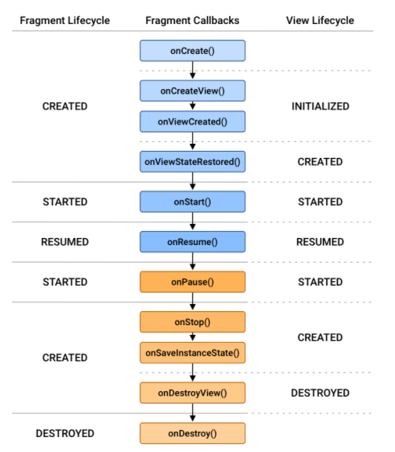
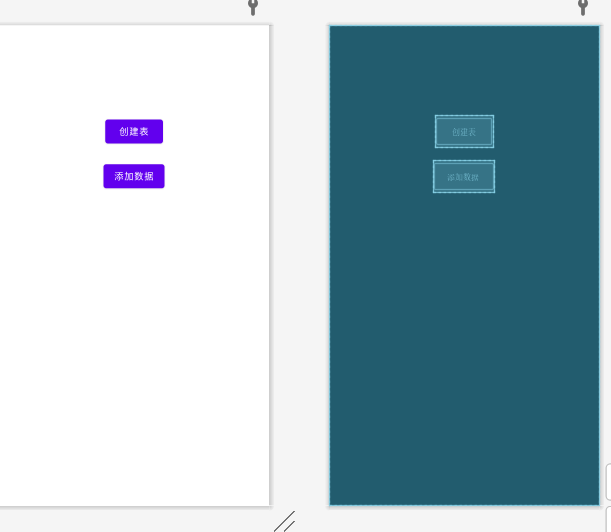

# 第1章 简介

## 1.1 简介

Android已经占领了越来越大的市场份额，除了苹果手机，Android手机似乎已经不可获取，而Android开发者也变得不可或缺。

### 1.1.1 Android系统架构

Android大致可以分为四层架构：Linux内核层、系统运行库层、应用框架层和应用层。如图所示：


1. **Linux内核层**

   Android系统是基于Linux内核的，这一层为Android设备的各种硬件提供了底层的驱动，如图中所提到的内容。

2. **系统运行层**

   这一层通过一些C/C++库来为Android系统提供了主要的特性支持。如SQLite库提供了数据库的支持，OpenGL|ES库提供了3D绘图的支持，Webkit提供了浏览器内核的支持等。

   同样在这一层还有Android运行时库，它主要提供了一些核心库，能够允许开发者使用Java语言来编写Android应用。另外，Android运行时库中还包含了Dalvik虚拟机（5.0系统之后改为ART运行环境），它使得每一个Android应用都能运行在独立的进程当中，并且拥有一个自己的Dalvik虚拟机实例。相较于Java虚拟机，Dalvik是专门为移动设备定制的，它针对手机内存、CPU性能有限等情况做了优化处理。

3. **应用框架层**

   这一层主要提供了构建应用程序时可能用到的各种API，Android自带的一些核心应用就是使用这些API完成的，开发者也可以通过使用这些API来构建自己的应用程序。

4. **应用层**

   所有安装在手机上的应用程序都属于这一层的。

### 1.1.2 Android已发布版本

2008年9月，谷歌正式发布了Android 1.0系统，至此，目前已经更新到9.0，11.0很快就会发布。可以在https://developer.android.google.cn/about/dashboards查看目前已经发布的Android系统版本和详细信息。

### 1.1.3 Andorid特色

1. **四大组件**

   **活动（Activity）**：是所有Android应用程序的门面，凡是在应用中能看到的东西，都是放在活动中的；

   **服务（Service）**：无法看见，但它会一直在后台默默地运行，即使用户退出了应用，服务仍然是可以继续运行的；

   **广播接收器（Broadcast Receiver）**：允许你的应用接收来自各处的广播消息，比如电话、短信等，当然你的应用同样也可以向外发出广播消息。

   **内容提供器（Content Provider）**：为应用程序之间共享数据提供了可能，比如你想要读取系统电话簿中的联系人，就需要通过其来实现。

2. **丰富的系统控件**

   Android系统为开发者提供了丰富的系统控件，但是一般情况下都是按照需求进行设计；使用第三方控件比较常见，值得一提的是Material Design的控件。

3. **SQLite数据库**

   Android自带的轻量级、运算速度极快的嵌入式关系型数据库。它不仅支持标准的SQL语法，还可以通过Android封装好的API进行操作，让使用更简单。

4. **强大的多媒体**

   如音乐、视频、录音、拍照、闹钟等，这一切都可以在程序中通过代码进行控制。

5. **地理位置定位**

   目前使用地理位置定位使用第三方比较多，如高德地图API。

## 1.2 安装

需要安装的东西：

1. JDK：是Java语言的软件开发工具包，包含了Java的运行环境、工具集合、基础类库等内容。确保你安装的JDK版本在8或者以上。
2. Android SDK：是谷歌提供的Android开发工具包，在开发Android程序时，必须引入该工具包，来使用Android相关的API。
3. Android Studio：谷歌退出的官方IDE工具，相比于Eclipse，AS要强大和方便得多。

首先安装JDK，网上很多详细教程，我在Java部分也发过，一句话概括就是下载+修改环境变量；

其次时安装Android Studio，值得庆幸的是，你不用自己下载SDK，直接下载安装Android Studio，附带就有SDK的下载。

在官网下载好Android Studio，如果你害怕解决问题，可以选择前几个版本的Android Studio，因为最新版本可能存在一些新特性并不熟悉，你遇到了问题查不到解决方案，但其实更新的都是稳定版本，更新内容也都在谷歌开发者——Android部分有详细介绍，只不过有些部分可能会是英文。但是，下载最新版的AS，你会发现编写代码会更加简单和方便，而这些新特性是你需要熟悉运用的。

**接下来就是安装部分了：**

保持默认，勾选全部内容

然后就是选择安装AS的目录，一般修改到非C盘即可，接下来一直下一步即可

安装结束后，打开AS，会出现下面提示，这是因为我们还没有安装SDK，点击cancel取消，就会跳转到下载页面

一般情况下，都会默认勾选最新的SDK，点击下一步安装即可

安装结束后再打开AS，就可以新建项目了

## 1.3 运行第一条代码

点击新建一个项目，选择Empty Project即可，点击下一步

然后修改项目名和存放位置，其他地方保持不变即可，点击完成

点击右上角绿色三角旁，然后点击open AVD Manager，创建一个新的模拟器

然后随便点击一个系统版本进行下载

选中Accept之后才能点击下一步开始下载

下载结束后点击三角符号即可打开模拟器

点击AS右上角的绿色三角，即可将此应用在模拟器上打开

## 1.4 日志工具的使用

Android本身为我们提供了五个方法来打印日志：

1. Log.v()
   这个方法用于打印那些最为琐碎的，意义最小的日志信息。对应级别verbose，是Android 日志里面级别最低的一种。
2. Log.d()
   这个方法用于打印一些调试信息，这些信息对你调试程序和分析问题应该是有帮助的。对应级别debug，比verbose 高一级。
3. Log.i()
   这个方法用于打印一些比较重要的数据，这些数据应该是你非常想看到的，可以帮你分析用户行为的那种。对应级别info，比debug 高一级。
4. Log.w()
   这个方法用于打印一些警告信息，提示程序在这个地方可能会有潜在的风险，最好去修复一下这些出现警告的地方。对应级别warn，比info 高一级。
5. Log.e()
   这个方法用于打印程序中的错误信息，比如程序进入到了catch 语句当中。当有错误信息打印出来的时候，一般都代表你的程序出现严重问题了，必须尽快修复。对应级别error，比warn 高一级。

使用Log而不是System.out是为了更好的过滤不同级别的日志

一般情况下Log方法结合Logcat使用

下面介绍一个好用的方法,能在项目上线后取消所有的Log

```java
/**
 * 日志工具类
 */
public class LogUtil {

    public static final int VERBOSE = 1;
    public static final int DEBUG = 2;
    public static final int INFO = 3;
    public static final int WARN = 4;
    public static final int ERROR = 5;
    public static final int NOTHING = 6;
    public static int LEVEL = VERBOSE;

    /**
     * 设置LEVEL的类型
     *
     * @param type
     */
    public static void setLEVEL(int type) {
        LEVEL = type;
    }

    public static void v(String tag, String msg) {
        if (LEVEL <= VERBOSE) {
            Log.v(tag, msg);
        }
    }

    public static void d(String tag, String msg) {
        if (LEVEL <= DEBUG) {
            Log.d(tag, msg);
        }
    }

    public static void i(String tag, String msg) {
        if (LEVEL <= INFO) {
            Log.i(tag, msg);
        }
    }

    public static void w(String tag, String msg) {
        if (LEVEL <= WARN) {
            Log.w(tag, msg);
        }
    }

    public static void e(String tag, String msg) {
        if (LEVEL <= ERROR) {
            Log.e(tag, msg);
        }
    }
}

//当项目上线后就调用此方法，可注释掉所有Log方法
//LogUtil.setLEVEL(LogUtil.NOTHING);

```

## 1.5 项目结构

Android Studio 中的每个项目都包含一个或多个含源代码文件和资源文件的模块。模块类型包括：

- Android 应用模块
- 库模块
- Google App Engine 模块

默认情况下，Android Studio 会在 Android 项目视图中显示您的项目文件（如图所示）。该视图按模块组织结构，方便您快速访问项目的关键源文件。

所有编译文件都在顶层的 **Application** 下显示，且每个应用模块都包含以下文件夹：

- **manifests**：包含 `AndroidManifest.xml` 文件。
- **java**：包含 Java 源代码文件，包括 JUnit 测试代码。
- **res**：包含所有非代码资源，例如 XML 布局、界面字符串和位图图像。

磁盘上的 Android 项目结构与此扁平表示形式的项目结构有所不同。要查看项目的实际文件结构，请从 **Project** 下拉菜单中选择 **Project**（在图 1 中显示为 **Android**）。


# 第2章

## 2.1 关于android gradle依赖

> 博客来源：https://www.jianshu.com/p/f34c179bc9d0

在Gradle 2.x版本中，添加依赖主要是使用`compile`

在Gradle 3.x版本及以后，添加依赖被`api`和`implementation`替代：

> **api**：跟 2.x 版本的 `compile`完全相同
> **implementation**：使用了该命令编译的依赖，它仅仅对当前的`Module`提供接口。
>
> **建议**
> 在`Google IO` 相关话题的中提到了一个建议，就是依赖首先应该设置为`implement`的，如果没有错，那就用`implement`，如果有错，那么使用`api`指令，这样会使编译速度有所增快。所以应该优先使用`implementation`
>
> **那为什么要这么做呢？**
> 答案是： 1. 加快编译速度。2. 隐藏对外不必要的接口。
>
> **为什么能加快编译速度呢？**
> 这对于大型项目含有多个`Module`模块的， 以上图为例，比如我们改动 `LibraryC` 接口的相关代码，这时候编译只需要单独编译`LibraryA`模块就行， 如果使用的是`api`或者旧时代的`compile`，由于`App Module` 也可以访问到 `LibraryC`,所以 `App Module`部分也需要重新编译。当然这是在全编的情况下。


## 2.2 布局Layout

目前（可能是AS 3.6及其以后）更加注重视图和逻辑的分离，并且默认显示的是可视化窗口，而不是xml文件代码，是希望开发者习惯通过拖拽的形式**使用约束布局**进行快速界面构造；但是，身为Android开发者，两者都应该要熟练使用。不过，谷歌官方更倾向于开发者使用约束布局，熟练之后，使用约束布局能提高开发效率


## 2.3 Android Manifest

所有的活动必须在Android Manifest中注册，并且必须至少拥有一个主活动，主活动的声明如下；主活动中设置了`android:lable`属性后，会覆盖外层的该属性，并且主活动的标题栏、该App名称都会变成主活动中设置的`lable`；

```xml
<?xml version="1.0" encoding="utf-8"?>
<manifest xmlns:android="http://schemas.android.com/apk/res/android"
    package="com.example.activitytest">

    <application
        android:allowBackup="true"
        android:icon="@mipmap/ic_launcher"
        android:label="@string/app_name"
        android:roundIcon="@mipmap/ic_launcher_round"
        android:supportsRtl="true"
        android:theme="@style/AppTheme">
        <activity
            android:name=".FirstActivity"
            android:label="Android测试">
            <intent-filter>
                <action android:name="android.intent.action.MAIN" />
                <category android:name="android.intent.category.LAUNCHER" />
            </intent-filter>
        </activity>
    </application>

</manifest>
```


## 2.4 新建一个活动

虽然现在新建一个活动很简单，直接右键`java`文件夹下的包名，然后new -> Activity -> 选择合适的Activity，然后修改活动名字，其他默认即可，AS会自动帮你完成好后续操作，但是我们有必要清楚具体流程：

1. 直接右键`java`文件夹下的包名 -> new -> Activity -> 选择合适的Activity，然后在新建页面取消选中`Generate Layout File`，修改名字为`FirstActivity`后点击`Finish`，AS会自动定义一个`onCreate()`方法

2. 右键`res`文件夹新建一个`Dorectory`，命名为`layout`，注意是小写；然后右键`layout`新建一个`Layout resource file`，命名为`first_layout`，注意，全是小写，用下划线分隔，一般名字和活动名保持一致

3. 在Android Manifest中注册，但是你会发现AS自动帮你写好了你创建的这个活动，但是由于目前只有一个活动，没有主活动，所以你需要将你创建的这个活动声明为主活动，添加如下内容即可

   ```xml
   <activity android:name=".FirstActivity">
       <intent-filter>
           <action android:name="android.intent.action.MAIN" />
           <category android:name="android.intent.category.LAUNCHER" />
       </intent-filter>
   </activity>
   ```

   

### 2.4.1 使用Toast

Toast是Android提供的一种提醒方式，可以在一小段时间内提供一段信息给用户，在之后自动消失，并且不会占用任何屏幕空间；一般情况下Toast结合点击事件使用；

Toast调用的`makeText`方法传入三个参数：

1. 上下文（Context对象，一般都是本活动，如`MainActivity.this`，注意一定要加`.this`）
2. 显示的文本内容（String）
3. 显示的时长，需为两个内置常量之一：`Toast.LENGTH_SHORT`和`Toast.LENGTH_LONG`

最后不要忘记调用`show()`方法

注意：这种方法是使用Android自带的Toast样式，但是一般情况下的需求都需要自定义Toast

```java
import androidx.appcompat.app.AppCompatActivity;

import android.os.Bundle;
import android.util.Log;
import android.view.View;
import android.widget.Button;
import android.widget.Toast;

public class MainActivity extends AppCompatActivity {
    private static final String TAG = "MainActivity";

    @Override
    protected void onCreate(Bundle savedInstanceState) {
        super.onCreate(savedInstanceState);
        setContentView(R.layout.activity_main);

        //绑定button
        Button button = findViewById(R.id.button);

        //添加点击事件
        button.setOnClickListener(new View.OnClickListener() {
            @Override
            public void onClick(View view) {
                //传入三个参数编写Toast
                Toast.makeText(MainActivity.this, "这是一个Toast", Toast.LENGTH_LONG).show();
            }
        });
    }
}

```


### 2.4.2 在活动中使用Menu

Android的Menu会显示在右上方，即标题栏的最右侧，一般是竖着的三个点；

1. 右键res目录 -> New -> Directory，输入文件夹名mnu，点击OK；

2. 右键menu文件夹 -> New -> Menu resource file，新建一个名为main的文件，然后添加几个item

3. 然后回到待创建Menu的活动中，重写`onCreateOptionsMenu()`方法，重写快捷键为`ctrl+O`

   ```java
   @Override
   public boolean onCreateOptionsMenu(Menu menu) {
       getMenuInflater().inflate(R.menu.main,menu);
       //此处返回为true，表示允许创建的菜单显示出来
       return true;
   }
   ```

注意：使用这种方法的时候是不需要在该活动的Layout文件中编写布局的


### 2.4.3 销毁一个活动

两种方法：

1. 按back键销毁活动
2. 使用Activity类提供的`finish()`方法


## 2.5 使用Intent

Intent一般用于活动间的跳转和活动间数据的传递，还可以打开手机上某些应用

### 2.5.1 显示Intent

假如你现在创建有两个活动：`MainActivity`和`SecondActivity`，那么在`MainActivity`跳转到另一个的代码就很简单；一般是在一个点击事件中进行跳转，比如说按下一个`Button`，就进行跳转；跳转之后按下back键即可销毁当前活动回到前一个活动

```java
	Button button = findViewById(R.id.button);
	button.setOnClickListener(new View.OnClickListener){
        @Override
        public void onClick(){
            Intent intent = new Intent(MainActivity.this, SecondActivity.class);
			startActivity(intent);                
        }
    }
```

注意：`Intent`的构造函数有多个重载，显示`Intent`最常用的就是上面这种两个参数，第一个参数为启动活动的上下文（Context），第二个参数为指定想要启动的目标活动（Class），注意后缀。


### 2.5.2 隐式Intent

隐式Intent不明确指出要启动哪一个活动，而是通过设置Android Mainfest中的action和category然后交给系统去分析这个Intent，让其找出合适的活动去启动。具体方法如下：

1. 在Android Manifest中对指定活动下的<intent-filter>设置action和category；（注意：action只有一个，category可以有多个）

   ```xml
   <activity android:name=".SecondActivity">
        <!--注意此处最好指定包名，提高辨识度-->
       <intent-filter>
           <action android:name="com.eaxmple.helloworld.new_ACTION" />
   
           <category android:name="android.intent.category.DEFAULT" />
       </intent-filter>
   
   </activity>
   ```

2. 在要使用的点击事件中使用隐式Intent，使用`Intent(String action)`构造方法传入指定`action`，使用`intent.addCategory(String category)`来添加指定`category`，如果1中设置的为`android.intent.category.DEFAULT`，则不用使用`intent.addCategory(String category)`

   ```java
   Button button = findViewById(R.id.button2);
   button.setOnClickListener(new View.OnClickListener() {
       @Override
       public void onClick(View view) {
           Intent a = new Intent("com.eaxmple.helloworld.new_ACTION");
           startActivity(a);
       }
   });
   ```

**注意：**

- 每个Intent只能指定一个action，但却能指定多个category
- 必须action和category都匹配才能正常运行，否则无法正常运行；但是如果是`android.intent.category.DEFAULT`，则不用指明categroy
- 如果多个活动有相同的action，而我们需要通过添加不同的category来实现精确访问，除了在AndroidManifest文件种在指定活动处添加指定的category外，这多个活动还必须都同时声明`android.intent.category.DEFAULT`这一条category
- 无论是action还是category，都必须明确地指出包名（虽然不指明也可以正常运行）


### 2.5.3更多隐式Intent用法

隐式Intent不仅可以启动自己的App中的活动，还可以启动其他应用程序的活动；`Intent`类中提供了许多常量值，用来打开指定的程序；如打开一个网页可用下列方法：

```java
Button button = findViewById(R.id.button);

button.setOnClickListener(new View.OnClickListener() {
    @Override
    public void onClick(View view) {
        Intent intent = new Intent(Intent.ACTION_VIEW);
        intent.setData(Uri.parse("http://www.baidu.com"));
        startActivity(intent);
    }
});
```

注意：

- 这里的`Intent.ACTION_VIEW`就是Android系统内置的动作，为常量值，这里就是`"android.intent.action.VIEW"`
- `Intent.setData()`方法接受一个`Uri`类型的参数，这个类为Android提供的类，类似于Java中的`URL`类
- 除了http协议外，还可以指定很多其他协议，比如geo表示显示地理位置，tel表示拨打电话。
- 与此对应，我们可以在<intent-filter>标签再配置一个<data>标签，用于更精确地指定当前活动能够响应什么类型的数据（注意：只有<data>标签中指定的内容和Intent中携带的Data完全一致时，当前活动才能响应）
  - android：scheme。用于指定数据的协议部分，如http或者https
  - android：host。用于指定数据的主机名部分，如www.bilibili.com
  - android：port。用于指定数据的端口部分，一般紧随在主机名后面
  - android：path。用于指定主机名和端口之后的部分
  - android：mimeType。用于指定可以处理的数据类型，允许使用通配符的方式进行指定


### 2.5.4 向下一个活动传递数据

活动之间一般使用`Intent`传递数据

**传递数据：**

`Intent`中使用`putExtra()`方法传递数据，此方法接受两个参数：参数一为键（String），参数二为值（有多种数据类型的重载）
传递数据后，再使用`startActivity()`跳转到另一个活动

```java
button.setOnClickListener(new View.OnClickListener() {
    @Override
    public void onClick(View view) {
        Intent intent = new Intent(MainActivity.this, SecondActivity.class);
        intent.putExtra("extra_data", "Hello, Second Activity");
        startActivity(intent);
    }
});
```

**接收数据：**

首先使用`Activity`类中的静态方法`getIntent()`得到一个`Intent`实例，再用这个实例获取传递过来的数据，有多种方法接受不同的数据，如接受`String`类型的数据就使用`getStringExtra()`方法，此方法接受一个参数，参数为键（String）

```java
protected void onCreate(Bundle savedInstanceState) {
    super.onCreate(savedInstanceState);
    setContentView(R.layout.activity_second);

    Intent intent = getIntent();
    String msg = intent.getStringExtra("extra_data");
    Log.d(TAG, msg);
}
```


### 2.5.5 返回数据给上一个活动

Activity中的`startActivityForResult()`方法期望再活动销毁的时候能够返回一个结果给上一个活动。
此方法接受两个参数：参数一为`Intent`对象，参数二为请求码，用于在之后的回调中判断数据的来源，一般设置为1

1. 在MainActivity中按钮的点击事件中使用`startActivityForResult()`方法代替`startActivity()`方法

   ```java
   button.setOnClickListener(new View.OnClickListener() {
       @Override
       public void onClick(View view) {
           Intent intent = new Intent(MainActivity.this, SecondActivity.class);
           //参数二为回调onActivityResult中得到的请求码
           startActivityForResult(intent, 1);
       }
   });
   ```

2. 在SecondActivity中也设置一个按钮，添加一个点击事件，用作销毁当前活动，退回到上一个活动，并将数据传送给上一个活动

   ```java
   button.setOnClickListener(new View.OnClickListener() {
       @Override
       public void onClick(View view) {
           Intent intent = new Intent();
           intent.putExtra("data_return", "Hello, MainActivity");
           //setResult()方法非常重要，是专门用于向上一个活动返回数据的，参数一为回调onActivityResult中得到的结果码
           setResult(RESULT_OK, intent);
           finish();
       }
   });
   ```

3. 由于是使用`startActivityForResult()`方法启动SecondActivity的，在SecondActivity被销毁之后会回调上一个活动的`onActivityResult()`方法，因此我们需要在`MainActivity()`中重写这个方法来得到返回的数据

   ```java
   @Override
       protected void onActivityResult(int requestCode, int resultCode, @Nullable Intent data) {
           super.onActivityResult(requestCode, resultCode, data);
           switch (requestCode) {
               case 1:
                   if (resultCode == RESULT_OK) {
                       String returnData = data.getStringExtra("data_return");
                       Log.d(TAG, returnData);
                   }
                   break;
               default:
                   break;
           }
       }
   ```

**注意：**

1. 有请求码和结果码，其中：请求码是处理一个活动中多个按钮打开同一个新的活动；结果码是处理一个活动打开了不同的新活动，但是这些新活动销毁后都是返回同一个活动。具体可参考博客：https://www.cnblogs.com/zgqys1980/p/5286208.html

2. Log中的TAG是一个实例域变量，值为当前活动名

3. 如果用户没有通过点击按钮，而是通过back键回到MainActivity，一般情况下设计为数据返回不成功，但是也可以通过back键设置数据返回，我们则需要在SecondActivity中重写`onBackPressed()`方法来解决

   ```java
   @Override
   public void onBackPressed() {
       Intent intent = new Intent();
       intent.putExtra("data_return", "Hello, First");
       setResult(RESULT_OK, intent);
       finish();
   }
   ```

   

## 2.6 活动的生命周期

### 2.6.1 返回栈

Android是使用任务（Task）来管理活动的，一个任务就是一组存放在栈里的活动的集合，这个栈也被称为**返回栈（Back Stack）**。

栈是一种**先进后出**的数据结构，默认情况下，每启动一个新的活动，这个新活动就被入栈且位于栈顶显示给用户；而每按下Back键或者调用`finish()`方法，则销毁这个活动的同时将位于栈顶的活动出栈，前一个入栈的活动就位于栈顶显示给用户。系统总是会显示处于栈顶的活动给用户。


### 2.6.2 活动状态

每个活动在其生命周期中最多可能会有4种状态

1. **运行状态**

   当一个活动位于返回栈的栈顶时，这时活动就处于运行状态。

2. **暂停状态**

   当一个活动不再处于栈顶位置，但仍然可见时，这时活动就进入了暂停状态。

3. **停止状态**

   当一个活动不再处于栈顶位置，并且完全不可见时，就进入了停止状态。

4. **销毁状态**

   当一个活动从返回栈种移除后就变成了销毁状态


### 2.6.3 活动的生存期

Activity类定义了7个回调方法，覆盖了活动生命周期的每一个环节

1. **onCreate()**

   每个活动必须重写此方法，它会在活动第一次被创建时被调用。你应该在这个方法种完成活动的初始化操作，比如加载布局、绑定事件，当然，更推荐的写法是加载布局和绑定事件用方法分开写，然后再在onCreate()方法中调用

2. **onStart()**

   这个方法在活动由不可见变为可见时调用

3. **onResume()**

   这个方法在活动准备好和用户进行交互时调用。此时的活动一定位于返回栈栈顶，并且处于运行状态

4. **onPause()**

   这个方法在系统准备去启动或者恢复两一个活动的时候调用。我们通常会在这个方法中将一些消耗CPU的资源释放掉，以及保存一些关键数据，但这个方法的执行速度一定要块，不然会影响到新的栈顶活动的使用

5. **onStop()**

   这个方法在活动完全不可用的时候调用。它和`onPause()`方法的主要区别在于，如果启动的新活动是一个对话框活动，那么`onPause()`方法会得到执行，而`onStop()`方法并不会执行

6. **onDestory()**

   这个方法在活动被销毁之前调用，之后活动状态将变为销毁状态

7. **onRestart()**

   这个方法在活动由停止状态变为运行状态之前调用，也就是活动被重新启动了

以上7个方法中除了`onRestart()`方法，其他都是两两相对的，从而又可以将活动分为3种生存期：

1. **完整生存期**

   活动在`onCreate()`方法和`onDestroy()`方法之间所经历的，就是完整生存期。一般情况下，一个活动会在`onCreate()`方法种完成各种初始化操作，而在`onDestroy()`方法种完成释放内存的操作

2. **可见生存期**

   活动在`onStart()`和`onStop()`方法之间所经历的，就是可见生存期。在可见生存期内，活动对于用户总是可见的，即便有可能无法和用户进行交互。我们可以通过这两个方法，合理地管理那些对用户可见的资源。比如在onStart()方法中对资源进行加载，而在onStop()方法中对资源进行释放，从而保证处于停止状态的活动不会占用过多内存

3. **前台生存期**

   活动在onResume()方法和onPause()方法之间所经历的就是前台生存期。在前台生存期内，活动总是处于运行状态的，此时的活动时可以和用户进行交互的，我们平时看到和接触最多的也就是这个状态下的活动


### 2.6.4 体验活动的生命周期

新建一个空活动，两个子活动：一个为`NormalActivity`，一个为`DialogActivity`；其中`DialogActivity`在Android Manifest中设置主题为Dialog；主活动设置两个按钮，分别跳转到这两个活动即可。

```xml
<activity android:name=".DialogActivity"
	android:theme="@style/Theme.AppCompat.Dialog">
</activity>
```

MainActivity代码：

```java
public class MainActivity extends AppCompatActivity {

    private static final String TAG = "MainActivity";

    @Override
    protected void onCreate(Bundle savedInstanceState) {
        super.onCreate(savedInstanceState);
        Log.d(TAG, "onCreate");
        setContentView(R.layout.activity_main);

        Button nor = findViewById(R.id.normal_button);
        Button dia = findViewById(R.id.dialog_button);

        nor.setOnClickListener(new View.OnClickListener() {
            @Override
            public void onClick(View view) {
                startActivity(new Intent(MainActivity.this, NormalActivity.class));
            }
        });

        dia.setOnClickListener(new View.OnClickListener() {
            @Override
            public void onClick(View view) {
                startActivity(new Intent(MainActivity.this, DialogActivity.class));
            }
        });
    }

    @Override
    protected void onStart() {
        super.onStart();
        Log.d(TAG, "onStart");
    }

    @Override
    protected void onResume() {
        super.onResume();
        Log.d(TAG, "onResume");
    }

    @Override
    protected void onPause() {
        super.onPause();
        Log.d(TAG, "onPause");
    }

    @Override
    protected void onStop() {
        super.onStop();
        Log.d(TAG, "onStop");
    }

    @Override
    protected void onDestroy() {
        super.onDestroy();
        Log.d(TAG, "onDestroy");
    }

    @Override
    protected void onRestart() {
        super.onRestart();
        Log.d(TAG, "onRestart");
    }
}
```

使用logcat过滤TAG为MainActivity的日志如下：

```verilog
//打开App
2020-07-23 11:47:16.101 5217-5217/com.example.activitylifecycletest D/MainActivity: onCreate
2020-07-23 11:47:16.189 5217-5217/com.example.activitylifecycletest D/MainActivity: onStart
2020-07-23 11:47:16.191 5217-5217/com.example.activitylifecycletest D/MainActivity: onResume
//打开Normal Activity
2020-07-23 11:49:11.659 5217-5217/com.example.activitylifecycletest D/MainActivity: onPause
2020-07-23 11:49:12.268 5217-5217/com.example.activitylifecycletest D/MainActivity: onStop
//退出Normal Activity到Main Activity
2020-07-23 11:49:45.408 5217-5217/com.example.activitylifecycletest D/MainActivity: onRestart
2020-07-23 11:49:45.411 5217-5217/com.example.activitylifecycletest D/MainActivity: onStart
2020-07-23 11:49:45.412 5217-5217/com.example.activitylifecycletest D/MainActivity: onResume
//打开Dialog Activity
2020-07-23 11:50:31.687 5217-5217/com.example.activitylifecycletest D/MainActivity: onPause
//退出Dialog Activity到Main Activity
2020-07-23 11:50:59.796 5217-5217/com.example.activitylifecycletest D/MainActivity: onResume
//退出Main Activity到桌面
2020-07-23 11:51:36.396 5217-5217/com.example.activitylifecycletest D/MainActivity: onPause
2020-07-23 11:51:37.078 5217-5217/com.example.activitylifecycletest D/MainActivity: onStop
2020-07-23 11:51:37.078 5217-5217/com.example.activitylifecycletest D/MainActivity: onDestroy
```


### 2.6.5 活动被回收了怎么办

在活动A基础上打开活动B，可能会系统内存不足，活动A会被回收掉，这时，如果点击back键返回到活动A，活动A如果有数据输入，会丢失已填写数据；因为这时并不是执行的`onRestart()`方法，而是执行活动A的`onCreate()`方法，严重影响用户体验。

解决办法是使用Activity类提供的`onSaveInstanceState()`回调方法，此方法可以保证在活动被回收之前一定会被调用，因此我们可以通过这个方法来解决数据得不到保存的问题。

1. 在`onSaveInstanceState()`方法中，提供了一个`Bundle`类型的参数，其提供了一系列保存数据的方法，如`putString()`保存字符串，以此类推，其使用键值对进行存储。

   ```java
   @Override
   protected void onSaveInstanceState(@NonNull Bundle outState) {
       super.onSaveInstanceState(outState);
       outState.putString("str_key", "This is data");
   }
   ```

2. 恢复数据：在`onCreate()`方法中，提供的参数也是`Bundle`，一般为null，如果在活动被系统回收之前有通过`onSaveInstanceState()`方法保存数据的话，这个参数就会带有之前所保存的数据

   ```java
   @Override
   protected void onCreate(Bundle savedInstanceState) {
       super.onCreate(savedInstanceState);
       setContentView(R.layout.activity_main);
   
       if (savedInstanceState != null) {
           String data = savedInstanceState.getString("str_key");
           Log.d(TAG, data);
       }
   }
   ```


## 2.7 活动的启动模式

启动模式一共4种，可以在Android Manifest种通过给activity标签指定`android：launchMode`属性来选择启动模式

1. **standard**

   在没有显式指定启动模式，则默认采用此模式

   Android是使用返回栈来管理活动的，在此模式下，每当启动一个新的活动，它就会在返回栈中入栈并位于栈顶的位置。

   但是对于此模式下的活动，系统不会在乎这个活动是否已经在返回栈中存在，每次启动都会创建该活动的一个新的实例

   ```java
   button.setOnClickListener(new View.OnClickListener){
       @override
       public void onClick(View v){
           startActivity(new Intent(MainActivity.this,MainActivity.class));
       }
   };
   ```

   在上面的代码中，每点击一次MainActivity的按钮，就会创建一个新的活动实例，并且跳转过去，比如你点三下，你就得返回三次，挺别扭的，对吧。

2. **singleTop**

   此模式需要在Android Manifest种通过给activity标签指定`android：launchMode`属性来选择`singleTop`启动模式

   此模式下，在启动活动时如果发现返回栈的栈顶已经是该活动，则认为可以直接使用它，不会再创建新的活动实例

   修改了启动模式之后再试试上面的代码，你会发现无论你点多少次按钮都没有反应，因为没有创建新的活动实例

   不过如果活动A声明了singleTop，然后活动A跳转到活动B，活动B又跳转到活动A（不是返回），则还是会创建新的活动A的实例

3. **singleTask**

   此模式需要在Android Manifest种通过给activity标签指定`android：launchMode`属性来选择`singleTask`启动模式

   此模式下，每次启动该活动时系统首先会在返回栈中检查是否存在该活动的实例，如果发现已经存在则直接使用该实例，并把在这个活动之上的所有活动出栈，如果没有发现就会创建一个新的活动实例

   此模式修复了如果活动实例没在顶层的情况下新建活动实例的问题，即声明了singleTask的活动的实例如果没有被回收，那就只有一个实例

4. **singleInstance**

   此模式下的活动会启用一个新的返回栈来管理这个活动（其实如果singleTask模式指定了不同的taskAffinity，也会启动一个新的返回栈）。这样做有什么意义呢？假设我们的程序中有一个活动是允许其他程序调用的，如果我们想实现其他程序和我们程序可以共享这个活动的实例，前三种是办不到的，因为每个程序都有自己的返回栈，同一个活动在不同的返回栈中入栈时必定时创建了新的实例。

   可以调用Activity的`getTaskId()`方法得到当前活动所在的栈 id 。


## 2.8 活动的最佳实践

### 2.8.1 知晓当前是在哪一个活动

当在阅读别人的代码时，找不到某个界面对应的活动是哪个。

可以创建一个`BaseActivity`类，并且修改所有活动的继承结构，让所有活动不继承自`AppCompatActivity`，而是继承`BaseActivity`类，此类如下：

```java
public class BaseActivity extends AppCompatActivity{
    
    @Override
    public void onCreate(Bundle savedInstanceState){
        super.onCreate(savedInstanceState);
        Log.d("BaseActivity",getClass().getSimpleName());
    }
}
```

在运行App的时候，使用logcat筛选BaseActivity标签，即可确定当前活动


### 2.8.2 随即随地退出程序

如果你目前界面停留在ThirdActivity，如果退出的话要按三次back键，或者按home键，再清除所有挂起的程序。如果要实现随时退出程序，只需要用一个专门的集合类对所有活动进行管理。

1. 新建一个ActivityCollector类作为活动管理器

   ```java
   import android.app.Activity;
   
   import java.util.ArrayList;
   import java.util.List;
   
   public class ActivityCollector {
   
       public static List<Activity> activities = new ArrayList<>();
   
       public static void addActivity(Activity activity) {
           activities.add(activity);
       }
   
       public static void removeActivity(Activity activity) {
           activities.remove(activity);
       }
   
       public static void finishAll() {
           for (Activity activity : activities) {
               if (!activity.isFinishing()) {
                   activity.finish();
               }
           }
           activities.clear();
       }
   }
   ```

2. 修改BaseActivity中的代码

   ```java
   import androidx.appcompat.app.AppCompatActivity;
   
   import android.os.Bundle;
   import android.util.Log;
   
   public class BaseActivity extends AppCompatActivity {
   
       @Override
       protected void onCreate(Bundle savedInstanceState) {
           super.onCreate(savedInstanceState);
           Log.d("BaseActivity", getClass().getSimpleName());
           ActivityCollector.addActivity(this);
       }
   
       @Override
       protected void onDestroy() {
           super.onDestroy();
           ActivityCollector.removeActivity(this);
       }
   }
   ```

3. 从此以后，不管你想在什么地方退出程序，只需要调用`ActivityCollector.finishAll()`即可

   注意：此方法关闭了其他所有活动，但是当前进程并没有被销毁，如果要保证完全退出，需要加上一行代码

   ```java
   android.os.Process.killProcess(android.os.Process.myPid());
   ```


### 2.8.3启动活动的最佳玩法

一般的启动活动很简单，无非就是构建好intent的意图，然后使用startActivity或者startActivityForResult方法启动活动

```java
Intent intent = new Intent(FirstActivity.this,SecondActivity.class);
intent.putExtra("param1","data1");
intent.putExtra("param2","data2");
startActivity(intent);
```

有时你接手别人的程序，你并不清楚这个活动需要传递哪些数据，你可以修改一下SecondActivity的代码

```java
public class SecondActivity extends BaseActivity{
    ...;
    public static void actionStart(Context context,String data1,String data2){
		Intent intent = new Intent(context,SeconActivity.class);
        intent.putExtra("param1",data1);
        intent.putExtra("param2",data2);
    }
}
```

然后在FirstActivity中跳转的时候，直接写如下代码即可替代第一种

```java
SecondActivity.actionStart(FirstActivity.this,"data1","data2");
```

这样写的好处重点是一目了然，SecondActivity所需的数据在方法参数中全都体现出来了，这样即使不用阅读SecondActivity中的代码，不去询问负责编写SecondActivity的同事，你也可以非常清晰知道启动SecondActivity需要传递哪些数据。


# 第3章

App中的UI开发

一个好的程序不仅需要牛x的功能，还要有好看的页面。

Android也给我们提供了很多的UI开发工具，我们可以使用这些工具构建一些基础的界面；

当然，Android提供的UI一般并不能满足产品经理的业务要求，这就需要学习后续自定义控件的开发。


## 3.1 如何编写程序界面

Android Studio提供了两种进行界面编写的方式：

1. **使用XML进行编写**

   全部根据XML标签语言进行编写，推荐先学习透彻XML，然后使用可视化编辑

2. **通过可视化编辑器来进行拖拽，进行布局的编写**

   目前AS 3.6 版本默认显示为可视化编辑器，Google似乎在这方面做了很多努力，希望开发人员使用可视化进行UI编写，建议读者在学习XML之后自行查阅可视化编辑器的使用


​		可以点击右上方处修改显示：左侧为只显示XML；中间为XML和可视化界面都显示；右侧为只显示可视化界面


## 3.2 常用控件的使用方法

### 3.2.1 TextView

功能：主要用于在界面上显示一段文本信息

```xml
<?xml version="1.0" encoding="utf-8"?>
<LinearLayout android:layout_width="match_parent"
    android:layout_height="match_parent"
    android:orientation="vertical"
    xmlns:android="http://schemas.android.com/apk/res/android">

    <TextView
        android:id="@+id/text_view"
        android:text="Hello, world!"
        android:textColor="#823fff"
        android:textSize="30sp"
        android:gravity="center_horizontal|center_vertical"
        android:layout_width="match_parent"
        android:layout_height="match_parent" />

</LinearLayout>
```

1. 首先，在`TextView`外面包裹有一个`LinearLayout`，这是一个布局控件，一般默认为约束布局，但是使用XML编写的时候一般将其修改为简单的布局，这是一个最外层的一个布局，它的宽和高都是`match_parent`，它外层没有其他布局了，所以它会填充满整个屏幕；`xmlns:android="http://schemas.android.com/apk/res/android"`是必须的，必须声明它，才能使用这些自带的控件；

2. 再看主角`TextView`，第一行使用`android:id`属性给其指定了一个唯一标识符，在所有活动的java代码或者xml文件中都可以使用R，来获取到它，比如在活动中使用`R.id.text_view`来获取，其值为一个整数；

3. 然后使用`android:layout_width`和`android:layout_height`指定其宽和高，其值可选为四种：`match_parent`，`wrap_content`，`fill_parent`和自定义长度如`20dp`。其中`match_parent`和`fill_parent`意义相同，一般都是用`match_parent`。`match_parent`表示让目前控件的大小和父布局的大小意义，也就是由父布局来决定当前控件的大小；`wrap_content`表示让当前控件的大小能够刚好包含著里面的内容，也就是由控件内容决定当前控件的大小；然后自定义长度使用`dp`为单位，但是需要注意，现在手机种类繁多，容易造成适配出现问题；

4. 最后通过`android:text`指定文本的内容，一般情况下会变黄色，这是建议你将文本内容保存到`string.xml`中，然后通过`R.string.name`的方式进行访问，但是我个人觉得没有必要；
5. `TextView`本身文字内容是靠左显示的，可以使用`android:gravity`属性来指定文字对齐方式，可选值为top、bottom、left、right、center等，AS中输入`android:gravity`后就会有自定补全提示，会提示这些可选值；并且，可以使用 “|” 来指定多个值，如`center_horizontal|center_vertical`，表示文字在垂直和水平方向都居中对齐（中间无空格），注意，这里针对的是`TextView`本身的宽和高，在这个范围内垂直水平方向都居中对齐；
6. 还可以修改文字的大小和颜色，大小使用`android:textSize`属性，值使用`sp`为单位进行设置；颜色使用`android:textColor`属性进行设置，值使用3个颜色混合而成，每个颜色由一个十六进制符号来定义，如黑色（#000000），可以通过取色器来得到颜色值，不过as自带的取色器似乎不太准确。
7. 还要很多属性，可以查阅官方文档，不过都是英文，没关系，我相信你：https://developer.android.google.cn/reference/kotlin/android/widget/TextView?hl=en


### 3.2.2 Button

功能：提供一次点击，触发一次点击事件，是和用户进行交互的重要控件

```xml
<?xml version="1.0" encoding="utf-8"?>
<LinearLayout android:layout_width="match_parent"
    android:layout_height="match_parent"
    android:orientation="vertical"
    xmlns:android="http://schemas.android.com/apk/res/android">

   	...

    <Button
        android:id="@+id/button"
        android:layout_width="match_parent"
        android:layout_height="wrap_content"
        android:text="Button"
        android:textAllCaps="false"/>
    
    <Button
        android:id="@+id/button_2"
        android:layout_width="match_parent"
        android:layout_height="wrap_content"
        android:text="Button_2"
        android:textAllCaps="false"/>

</LinearLayout>
```

1. `Button`可使用的属性和上面`TextView`差不多，针对文字的内容是指`Button`中要显示的内容，默认是全部大写，如果要关闭全部字母大写，可以使用`android:textAllCaps="false"`进行设置；注意`id`属性是必须的，因为设置点击事件需要；

2. `Button`更重要的部分是点击事件的书写，具体有两种写法：

   - 匿名内部类的写法：

     ```java
     public class MainActivity extends BaseActivity {
     
         @Override
         protected void onCreate(Bundle savedInstanceState) {
             super.onCreate(savedInstanceState);
             setContentView(R.layout.activity_main);
     
             Button button = (Button) findViewById(R.id.button);
             button.setOnClickListener(new View.OnClickListener() {
                 @Override
                 public void onClick(View view) {
                     //此处添加点击后的逻辑处理
                     
                 }
             });
         }
     }
     ```

   - 实现接口的写法：

     ```java
     public class MainActivity extends BaseActivity implements View.OnClickListener{
     
         @Override
         protected void onCreate(Bundle savedInstanceState) {
             super.onCreate(savedInstanceState);
             setContentView(R.layout.activity_main);
     
             Button button = (Button) findViewById(R.id.button);
             Button button_2 = (Button) findViewById(R.id.button_2);
     
             button.setOnClickListener(this);
             button_2.setOnClickListener(this);
         }
     
         @Override
         public void onClick(View view) {
             switch (view.getId()) {
                 case R.id.button:
                     //此处添加点击后的逻辑处理
                     Toast.makeText(MainActivity.this,"btn1",Toast.LENGTH_SHORT).show();
                     break;
                 case R.id.button_2:
                     //此处添加点击后的逻辑处理
                     Toast.makeText(MainActivity.this,"btn2",Toast.LENGTH_SHORT).show();
                     break;
                 default:
                     break;
             }
         }
     }
     ```

     

### 3.2.3 EditText

功能：一个输入框，可供用户输入和编辑内容，并可在程序中对这些内容进行处理

```xml
<?xml version="1.0" encoding="utf-8"?>
<LinearLayout android:layout_width="match_parent"
    android:layout_height="match_parent"
    android:orientation="vertical"
    xmlns:android="http://schemas.android.com/apk/res/android">

    ...

    <EditText
        android:id="@+id/edit_text"
        android:layout_width="match_parent"
        android:layout_height="wrap_content"
        android:maxLines="1"
        android:maxLength="10"
        android:hint="输入一段文字"/>

</LinearLayout>
```

1. 现在你可以知道，要使用一个控件很简单，就是指定`id`、宽和高之后，再根据需要添加一些控件特有的属性即可；

2. 使用`android:hint`属性可以在输入框中里显示一段提示性的文字，如果用户输入了内容，这些提示性的文字就会消失，其值为显示的文字；

3. 默认情况下高度设置为`wrap_content`时，如果你输入的内容超过一行，`EditText`的下划线就会向下移动，将所有输入的内容显示出来，但是这样很难看，设配也会出现问题；可以使用`android:maxLines`属性设置最大行数，一般设置为1，这样内容就会上移，始终显示最新一行，下划线不会移动，上下滑动可以看到被遮住的内容；

4. 要限制输入的元素个数，比如说手机号限制为11位，则可以使用`android:maxLength="11"`属性进行设置；

5. 一般情况下，`EditText`和`Button`配合使用，输入一段内容后，点击`Button`，就可以在程序中对输入框中的内容进行处理

   ```java
   public class MainActivity extends BaseActivity implements View.OnClickListener {
   
       private EditText editText;
   
       @Override
       protected void onCreate(Bundle savedInstanceState) {
           super.onCreate(savedInstanceState);
           setContentView(R.layout.activity_main);
   
           Button button = (Button) findViewById(R.id.button);
           Button button_2 = (Button) findViewById(R.id.button_2);
           editText = (EditText) findViewById(R.id.edit_text); 
   
           button.setOnClickListener(this);
           button_2.setOnClickListener(this);
       }
   
       @Override
       public void onClick(View view) {
           switch (view.getId()) {
               case R.id.button:
                   String msg = editText.getText().toString();
                   Toast.makeText(MainActivity.this, msg, Toast.LENGTH_SHORT).show();
                   break;
               case R.id.button_2:
                   Toast.makeText(MainActivity.this, "btn2", Toast.LENGTH_SHORT).show();
                   break;
               default:
                   break;
           }
       }
   }
   ```


### 3.2.4 ImageView

功能：在界面上展示一张图片，可以加载本地图片或者加载网络图片

```xml
<LinearLayout android:layout_width="match_parent"
    android:layout_height="match_parent"
    android:orientation="vertical"
    xmlns:android="http://schemas.android.com/apk/res/android">

    ...
    
    <ImageView
        android:id="@+id/image_view"
        android:layout_width="wrap_content"
        android:layout_height="wrap_content"
        android:src="@drawable/ic_launcher_background" />

</LinearLayout>
```

1. 目前只会使用到加载本地自带的图片，准备的图片通常存放在`res/drawable`下，而不同分辨率的图片需要放在不同的文件夹下，所以我们在`res`下新建一个`drawable-xhdpi`目录（在Project视图下才能看到），然后将准备好的`img_1.png`和`img_2.png`复制进去，这里我们可以使用自带的`ic_launcher_background`图片；

2. 这里使用`android:src`属性给其指定了一张图片，由于每张图片宽高未定，所以都设置为`wrap_content`，所以每张图片都能正常显示，不会被拉伸变形，如果图片尺寸过大，图片就会被缩放，你看起来是正常显示，但是图片内容并不会占满整个ImageView；`android:background`属性也可以设置图片，但是根据其字面意思，会填充满整个屏幕，所以图片会被拉伸变形；

3. 我们还可以设置点击事件，在代码中动态更改ImageView的图片，这样点击图片就会替换为img_1；

   ```java
   public class MainActivity extends BaseActivity implements View.OnClickListener {
   
       private EditText editText;
   
       private ImageView imageView;
   
       @Override
       protected void onCreate(Bundle savedInstanceState) {
           super.onCreate(savedInstanceState);
           setContentView(R.layout.activity_main);
   
           Button button = (Button) findViewById(R.id.button);
           Button button_2 = (Button) findViewById(R.id.button_2);
           editText = (EditText) findViewById(R.id.edit_text);
           imageView = (ImageView) findViewById(R.id.image_view);
   
           button.setOnClickListener(this);
           button_2.setOnClickListener(this);
           imageView.setOnClickListener(this);
       }
   
       @Override
       public void onClick(View view) {
           switch (view.getId()) {
               case R.id.button:
                   String msg = editText.getText().toString();
                   Toast.makeText(MainActivity.this, msg, Toast.LENGTH_SHORT).show();
                   break;
               case R.id.button_2:
                   Toast.makeText(MainActivity.this, "btn2", Toast.LENGTH_SHORT).show();
                   break;
               case R.id.image_view:
                   imageView.setImageResource(R.drawable.img_1);
               default:
                   break;
           }
       }
   }
   ```


### 3.2.5 ProgressBar

功能：用于在界面上显示一个进度条，表示程序正在加载一些耗时的数据

```xml
<LinearLayout android:layout_width="match_parent"
    android:layout_height="match_parent"
    android:orientation="vertical"
    xmlns:android="http://schemas.android.com/apk/res/android">

    ...

    <ProgressBar
        android:id="@+id/progress_bar"
        android:layout_width="match_parent"
        android:layout_height="wrap_content" />

</LinearLayout>
```

1. 这个控件是一直在转圈圈的，需要结合代码来使用，要加载数据时就设置可见，加载完毕就设置为不可见或者消失；

2. `android:visibility`可见属性是所有Android控件共有的，可选值有3种：visible、invisible和gone。visible表示控件可见，为默认值；invisible为不可见，控件变为透明，但是仍占据原来的位置和大小；gone为消失，控件不可见而且不占据位置和大小；可以使用Activity类下的`setVisibility()`属性在代码种设置可见性，可选值为`View.VISIBLE`、`View.INVISIBLE`、`View.GONE` 3个值；下面就是通过Button实现ProgressBar的可见性设置；

   ```java
   public class MainActivity extends BaseActivity implements View.OnClickListener {
   
       private EditText editText;
   
       private ImageView imageView;
   
       private ProgressBar progressBar;
   
       @Override
       protected void onCreate(Bundle savedInstanceState) {
           super.onCreate(savedInstanceState);
           setContentView(R.layout.activity_main);
   
           Button button = (Button) findViewById(R.id.button);
           Button button_2 = (Button) findViewById(R.id.button_2);
           editText = (EditText) findViewById(R.id.edit_text);
           imageView = (ImageView) findViewById(R.id.image_view);
           progressBar = (ProgressBar) findViewById(R.id.progress_bar);
   
           button.setOnClickListener(this);
           button_2.setOnClickListener(this);
           imageView.setOnClickListener(this);
       }
   
       @Override
       public void onClick(View view) {
           switch (view.getId()) {
               case R.id.button:
                   if (progressBar.getVisibility() == View.GONE) {
                       progressBar.setVisibility(View.VISIBLE);
                   } else {
                       progressBar.setVisibility(View.GONE);
                   }
                   break;
               case R.id.button_2:
                   Toast.makeText(MainActivity.this, "btn2", Toast.LENGTH_SHORT).show();
                   break;
               case R.id.image_view:
                   imageView.setImageResource(R.drawable.img_1);
               default:
                   break;
           }
       }
   }
   ```

3. 默认的还有其他样式的进度条，可以在xml文件中修改，其中一种水平样式的进度条，在代码中可以不断地通过ProgressBar对象的setProgress(int )进行进度的修改：

   ```xml
   <ProgressBar
           android:id="@+id/progress_bar"
           android:layout_width="match_parent"
           android:layout_height="wrap_content"
           style="?android:attr/progressBarStyleHorizontal"/>
   ```


### 3.2.6 AlertDialog

功能：在当前界面弹出一个对话框，这个对话框是置顶于所有界面元素之上的，能够屏蔽掉其他控件的交互能力，因此此控件一般都是用于提示一些非常重要的内容和警告信息

1. AlertDialog不需要在xml文件中设置，直接在java代码中使用，如在点击事件中使用，其中`dialog.setCancelable(false)`是指不可以点击Dialog之外的地方退出，必须点击OK或者Cancel；

   ```java
   @Override
   public void onClick(View view) {
       switch (view.getId()) {
           case R.id.button:
               if (progressBar.getVisibility() == View.GONE) {
                   progressBar.setVisibility(View.VISIBLE);
               } else {
                   progressBar.setVisibility(View.GONE);
               }
               break;
           case R.id.button_2:
               AlertDialog.Builder dialog = new AlertDialog.Builder(MainActivity.this);
               dialog.setTitle("This is a dialog");
               dialog.setMessage("Something import.");
               dialog.setCancelable(false);
               dialog.setPositiveButton("OK", new DialogInterface.OnClickListener() {
                   @Override
                   public void onClick(DialogInterface dialogInterface, int i) {
                       Toast.makeText(MainActivity.this, "OK", Toast.LENGTH_SHORT).show();
                   }
               });
               dialog.setNegativeButton("Cancel", new DialogInterface.OnClickListener() {
                   @Override
                   public void onClick(DialogInterface dialogInterface, int i) {
                       Toast.makeText(MainActivity.this, "Cancel", Toast.LENGTH_SHORT).show();
                   }
               });
               dialog.show();
               break;
           case R.id.image_view:
               imageView.setImageResource(R.drawable.img_1);
           default:
               break;
       }
   }
   ```


### 3.2.7 ProgressDialog（已废弃）

功能：和AlertDialog类似，弹出一个在所有界面以上的对话框，但是有一个一直旋转的进度条，一般用于处理重要、耗时的操作，让用户耐心等待。

1. 该控件不用在xml中声明，只用在代码中声明，但是已经

   ```java
    @Override
       public void onClick(View view) {
           switch (view.getId()) {
               case R.id.button:
                   ProgressDialog progressDialog = new ProgressDialog(MainActivity.this);
                   progressDialog.setTitle("This is a ProgressDialog");
                   progressDialog.setMessage("Loading...");
                   progressDialog.setCancelable(true);
                   progressDialog.show();
                   break;
               case R.id.image_view:
                   imageView.setImageResource(R.drawable.img_1);
               default:
                   break;
           }
       }
   ```


## 3.3 四种基本布局

一个丰富的界面是由很多控件组成的，而控件的正确摆放就得借助布局实现；布局是一种可用于放置很多控件的容器，写法和控件类似；布局内可以嵌套控件，甚至可以 嵌套布局；


### 3.3.1 线性布局（LinearLayout）

1. 此布局会将其包含的所有控件在线性方向依次排列，这个线性方向包括**水平方向**、**垂直方向**，通过`android:orentation`来指定，默认为水平方向；

2. 如果方向指定为`vertical`，则控件垂直排列，注意因为控件垂直排列，所以每个控件的高不能设置为`match_parent`，否则一个控件就会占据满整个屏幕；

3. 如果方向指定为`horizontal`，则控件水平排列，同理，因为控件水平排列，所以每个控件的宽不能设置为`match_parent`，否则一个控件就会占据满整个屏幕；

4. 使用`android:layout_gravity`可以指定**控件在布局中的对齐方式**，其可选值和`android:gravity`一致，但它是指定文字在控件中 的对齐方式；需要特别注意的是，在线性布局中，如果方向指定为水平方向，则只有垂直方向的对齐方式才会生效，同样的，如果方向指定为垂直方向，则只有水平方向的对齐方式才会生效；只要记住，线性布局中的每一个控件都是**按照线性依次紧密相连**的；

   ```xml
   <?xml version="1.0" encoding="utf-8"?>
   <LinearLayout xmlns:android="http://schemas.android.com/apk/res/android"
       android:orientation="horizontal"
       android:layout_width="match_parent"
       android:layout_height="match_parent">
   
       <Button
           android:id="@+id/btn_1"
           android:layout_width="wrap_content"
           android:layout_height="wrap_content"
           android:layout_gravity="top"
           android:text="Button1"/>
   
       <Button
           android:id="@+id/btn_2"
           android:layout_width="wrap_content"
           android:layout_height="wrap_content"
           android:layout_gravity="center_vertical"
           android:text="Button2"/>
   
       <Button
           android:id="@+id/btn_3"
           android:layout_width="wrap_content"
           android:layout_height="wrap_content"
           android:layout_gravity="bottom"
           android:text="Button3"/>
   
   </LinearLayout>
   ```

5. 使用`android:layout_weight`属性，可以让我们按照比例来指定多个控件的大小，经常用于屏幕适配问题；如果是线性布局指定为水平方向的话，则每个控件的宽都设置为0dp，系统会自动将线性布局下所有控件指定的`layout_weight`相加，得到一个总值，然后每个控件所占大小的比例就是该控件的值除总值，如下，EditText控件值为2，Button控件值为1，所以EditText占据2/3宽，Button占据1/3宽

   ```xml
   <?xml version="1.0" encoding="utf-8"?>
   <LinearLayout xmlns:android="http://schemas.android.com/apk/res/android"
       android:orientation="horizontal"
       android:layout_width="match_parent"
       android:layout_height="match_parent">
   
       <EditText
           android:id="@+id/edit_text"
           android:layout_width="0dp"
           android:layout_weight="2"
           android:layout_height="wrap_content" />
   
       <Button
           android:id="@+id/btn"
           android:layout_width="0dp"
           android:layout_height="wrap_content"
           android:layout_weight="1"
           android:text="Button" />
   
   </LinearLayout>
   ```

6. 更加常用的一种EditText和Button的组合是，EditText控件的值设置为1，宽还是为0dp，但Button控件的宽设置为`wrap_content`，这样适配得非常好，而且看起来也更加舒服


### 3.3.2 相对布局（RelativeLayout）

1. 此布局中的控件不会按照线性依次排列，可以通过相对定位的方式让控件出现在布局的任何位置，所以相对布局的属性很多，但都有迹可循；

2. 第一种类型是相对于父布局的，如果你英语过关，理解下面的xml文件完全没有问题，其中`android:layout_alignParentStart`和`android:layout_alignParentLeft`是一个意思，同理，Right和End也是一个意思，但是官方推荐使用Start和End；

   ```xml
   <?xml version="1.0" encoding="utf-8"?>
   <RelativeLayout xmlns:android="http://schemas.android.com/apk/res/android"
       android:layout_width="match_parent"
       android:layout_height="match_parent">
   
       <Button
           android:id="@+id/btn_1"
           android:layout_width="wrap_content"
           android:layout_height="wrap_content" 
           android:layout_alignParentStart="true"
           android:layout_alignParentTop="true"
           android:text="btn 1"/>
   
       <Button
           android:id="@+id/btn_2"
           android:layout_width="wrap_content"
           android:layout_height="wrap_content"
           android:layout_alignParentEnd="true"
           android:layout_alignParentTop="true"
           android:text="btn 2"/>
   
       <Button
           android:id="@+id/btn_3"
           android:layout_width="wrap_content"
           android:layout_height="wrap_content"
           android:layout_centerInParent="true"
           android:text="btn 3"/>
   
       <Button
           android:id="@+id/btn_4"
           android:layout_width="wrap_content"
           android:layout_height="wrap_content"
           android:layout_alignParentStart="true"
           android:layout_alignParentBottom="true"
           android:text="btn 4"/>
   
       <Button
           android:id="@+id/btn_5"
           android:layout_width="wrap_content"
           android:layout_height="wrap_content"
           android:layout_alignParentEnd="true"
           android:layout_alignParentBottom="true"
           android:text="btn 5"/>
   
   </RelativeLayout>
   ```

3. 第二种类型是相对于该页面中的某个指定布局的，其他控件根据指定布局的id，进行位置的设置，也非常好理解，直接看例子即可；

   ```xml
   <?xml version="1.0" encoding="utf-8"?>
   <RelativeLayout xmlns:android="http://schemas.android.com/apk/res/android"
       android:layout_width="match_parent"
       android:layout_height="match_parent">
   
       <Button
           android:id="@+id/btn_1"
           android:layout_width="wrap_content"
           android:layout_height="wrap_content"
           android:layout_above="@id/btn_3"
           android:layout_toStartOf="@id/btn_3"
           android:text="btn 1"/>
   
       <Button
           android:id="@+id/btn_2"
           android:layout_width="wrap_content"
           android:layout_height="wrap_content"
           android:layout_above="@id/btn_3"
           android:layout_toEndOf="@id/btn_3"
           android:text="btn 2"/>
   
       <Button
           android:id="@+id/btn_3"
           android:layout_width="wrap_content"
           android:layout_height="wrap_content"
           android:layout_centerInParent="true"
           android:text="btn 3"/>
   
       <Button
           android:id="@+id/btn_4"
           android:layout_width="wrap_content"
           android:layout_height="wrap_content"
           android:layout_below="@id/btn_3"
           android:layout_toStartOf="@id/btn_3"
           android:text="btn 4"/>
   
       <Button
           android:id="@+id/btn_5"
           android:layout_width="wrap_content"
           android:layout_height="wrap_content"
           android:layout_below="@id/btn_3"
           android:layout_toEndOf="@id/btn_3"
           android:text="btn 5"/>
   
   </RelativeLayout>
   ```


### 3.3.3 帧布局（FrameLayout）

1. 此布局相比于前两种布局应用场景少很多，这种布局没有方便的定位方式，所有的布局都会默认地摆放在布局的左上角；

2. 当然，帧布局中还是能够使用`android:layout_gravity`属性进行位置的设置的；

   ```xml
   <?xml version="1.0" encoding="utf-8"?>
   <FrameLayout xmlns:android="http://schemas.android.com/apk/res/android"
       android:layout_width="match_parent"
       android:layout_height="match_parent">
   
       <TextView
           android:id="@+id/text"
           android:layout_width="wrap_content"
           android:layout_height="wrap_content"
           android:layout_gravity="start"
           android:text="This is a Text"/>
   
       <ImageView
           android:id="@+id/img_view"
           android:layout_width="wrap_content"
           android:layout_height="wrap_content"
           android:layout_gravity="end"
           android:src="@mipmap/ic_launcher" />
   
   </FrameLayout>
   ```


### 3.3.4 百分比布局（PercentLayout）

1. 前三种布局都是从Android 1.0 版本就开始支持的，一直沿用到现在，可以满足绝大多数场景的界面设计；

2. 但是只有LinearLayout支持使用`layout_weight`属性来实现按比例指定控件大小的功能，其他两种都不支持，如果在RelativeLayout中来实现两个控件平分布局宽度的效果，是比较难的，当然，你可以取巧，在整个相对布局下嵌套一个线性布局，在线性布局中写要平分的控件即可；

3. Android引入了一种全新的布局来解决2中的问题——百分比布局，此布局中，不用使用`wrap_content`和`match_parent`来指定控件的宽高，而是允许直接指定控件在布局中所占的百分比，这样就能更轻松实现按比例分割布局；

4. 因为线性布局已经支持按比例指定控件宽高，所以百分比布局只为帧布局和相对布局提供了功能扩展，形成了两个全新的布局——`PercentFrameLayout`和`PercentRelativeLayout`

5. 不同于前三种布局，此布局为新增布局，在使用Android官方新增控件或者其他程序员研发的开源控件时，都必须在项目的`app/build.gradle`中的dependencies中添加依赖（注意，《第一行代码》上是AS 2.2版本，添加依赖还是使用的`complie`，这在高版本的AS中会编译报错，因为`complie`已经移除，用`api`代替，更常用的是`implementation`，读者可自行查阅三者区别）

   如果你的AS是低版本的话，你的dependencies闭包下没有androidx，所以恭喜你，直接照着书上内容敲进去就行

   ```java
   compile 'com.android.support:percent:24.2.1'
   ```

   如果不行的话compile换成implementation试一试；如果你有androidx，很抱歉，**androidx库和android.support库不能共存！**

   但是所幸，androidx库中有percentLayout，找到之后，所以你添加的依赖就是如下：

   ```java
   implementation 'androidx.percentlayout:percentlayout:1.0.0'
   ```

   其实也可以通过左上角`File/Project Structure/Dependencies`来添加依赖，如下图，不过，我使用这个搜索percent布局，只得到一个`android.support`包的，并不能得到`androidx`包的，所以这个更多的用作依赖管理，你可以查询目前支持的版本号什么的；最后注意，每次添加完依赖需要点击右上角的`sync now`才能生效；

6. 接下来终于可以使用了！键入percent，就会提示整个包名，如`androidx.percentlayout.widget.PercentFrameLayout`，但是，细心的你一定会发现，怎么多了一条杠？对，没错！百分比布局被废弃了，哈哈哈哈，tmd！不过我们好歹看了看什么样子，我们也学到了很多，不是吗？

7. 写的时候注意，使用该布局不用指定默认的宽高属性，宽高属性使用`app:layout_widthPercent`和`app:layout_heightPercent`指定，而使用app需要指定一个app的命名控件，写完app爆红后可以鼠标指到爆红处，然后快捷键`Alt+Enter`，对错误进行处理，一般第一个就是最佳解决方案；写完后你会发现Button处还是爆红，但是不用管它，程序能够正常运行的；

   ```xml
   <?xml version="1.0" encoding="utf-8"?>
   <androidx.percentlayout.widget.PercentFrameLayout xmlns:android="http://schemas.android.com/apk/res/android"
       android:layout_width="match_parent"
       android:layout_height="match_parent"
       xmlns:app="http://schemas.android.com/apk/res-auto">
   
       <Button
           android:id="@+id/btn_1"
           android:text="btn 1"
           android:layout_gravity="left|top"
           app:layout_widthPercent="50%"
           app:layout_heightPercent="50%" />
   
       <Button
           android:id="@+id/btn_2"
           android:text="btn 1"
           android:layout_gravity="right|top"
           app:layout_widthPercent="50%"
           app:layout_heightPercent="50%" />
   
   </androidx.percentlayout.widget.PercentFrameLayout>
   ```


## 3.4 创建自定义控件


可以看到，所有控件都是直接或者间接继承自View的，所有的布局都是直接或间接继承自ViewGroup的。View是Android中最基本的一种UI组件，它可以在屏幕上绘制一块矩形区域，并能响应这块区域的各种事件，因此，我们使用的各种控件其实就是在View的基础上又添加了各自特有的功能。而ViewGroup则是一种特殊的View，它可以包含很多子View和子ViewGroup，是一个用于放置控件和布局的容器；

创建自定义控件有两种简单方法；


### 3.4.1 引入布局

现在Android应用和iPhone应用一样，在打开一个新活动后如果要退出到上一个活动，不仅支持按`back`键，还可以通过点击标题栏左侧的返回按钮退出到上一个活动；

可是Android本身并没有实现这么一个功能，这需要我们自己去实现，大致方法是隐藏自带标题栏，写一个自己实现的标题栏；而每新建一个活动页面，都要写一个？重复也太多了，所以我们就可以采用引入布局的方式来解决；

1. 在`layout`文件夹下新建一个`title.xml`文件，这个文件中编写标题栏的布局；因为我们创建的此xml文件只是用来在别的文件中作为标题栏引入，所以我们使用一个水平方向的线性布局作为最外层，而此布局的宽为`match_parent`，高设置为和原标题栏一致，颜色选择的是状态栏一致的颜色；返回按钮我们使用一个ImageView，因为它不会被拉伸，而且ImageView也是可设置点击事件的，其中图片我们可以右键drawable/new/Vector assert，然后点击`clip art`找到合适的图标；最后是标题栏字体，大小我们一般使用`20sp`，颜色为白色，和图标一致；

   ```xml
   <?xml version="1.0" encoding="utf-8"?>
   <LinearLayout xmlns:android="http://schemas.android.com/apk/res/android"
       android:orientation="horizontal"
       android:layout_width="match_parent"
       android:layout_height="?actionBarSize"
       android:background="@color/colorPrimaryDark">
   
       <ImageView
           android:id="@+id/img_btn"
           android:layout_width="wrap_content"
           android:layout_height="wrap_content"
           android:layout_margin="5dp"
           android:layout_gravity="center"
           android:src="@drawable/ic_arrow_back_black_24dp" />
   
       <TextView
           android:id="@+id/text"
           android:layout_width="wrap_content"
           android:layout_height="wrap_content"
           android:layout_gravity="center"
           android:layout_margin="5dp"
           android:text="Title"
           android:textColor="#fff"
           android:textSize="22sp" />
   
   </LinearLayout>
   ```

2. 在原活动的xml文件中使用`include`属性包括我们刚写好的`title.xml`文件，不过此方法如果用在我们自定义创建的控件，则控件中的点击事件无法生效，需要使用后面介绍的方法，和使用其他系统控件一样的方法。

   ```xml
   <?xml version="1.0" encoding="utf-8"?>
   <LinearLayout xmlns:android="http://schemas.android.com/apk/res/android"
       android:orientation="vertical"
       android:layout_width="match_parent"
       android:layout_height="match_parent">
   
       <include layout="@layout/title" />
   
   </LinearLayout>
   ```

3. 隐藏原标题栏（ActionBar），我们有两种方式进行隐藏：代码实现，修改活动的`theme`

   - 法一，代码实现：

     ```java
     public class MainActivity extends AppCompatActivity {
     
         @Override
         protected void onCreate(Bundle savedInstanceState) {
             super.onCreate(savedInstanceState);
             setContentView(R.layout.activity_main);
     
             ActionBar actionBar = getSupportActionBar();
             if (actionBar != null) {
                 actionBar.hide();
             }
         }
     }
     ```

   - 法二，修改`Theme`；要实现程序中所有的活动都实现没有系统自带的标题栏很简单，只需在`res/values/styles`中将AppTheme中的parent修改为`Theme.AppCompat.Light.NoActionBar`即可，因为在AndroidManifest.xml文件中，在整个`application`的属性中有一条`android:theme="@style/AppTheme"`；这里我建议在`styles.xml`文件中新建一个`style`样式，这样你哪个活动需要这样的样式就在AndroidManifest.xml文件中哪个活动的activity属性中设置，比如新建一个实现全屏的样式（一位styles.xml，二为AndroidManifest.xml）：

     ```xml
     <resources>
     
         <!-- Base application theme. -->
         <style name="AppTheme" parent="Theme.AppCompat.Light.DarkActionBar">
             <!-- Customize your theme here. -->
             <item name="colorPrimary">@color/colorPrimary</item>
             <item name="colorPrimaryDark">@color/colorPrimaryDark</item>
             <item name="colorAccent">@color/colorAccent</item>
         </style>
     
         <style name="NoTitle_FullScreen" parent="Theme.AppCompat.Light.NoActionBar">
             <item name="android:windowFullscreen">true</item>
         </style>
     </resources>
     ```

     ```xml
     <activity android:name=".MainActivity"
               android:theme="@style/NoTitle_FullScreen">
         <intent-filter>
             <action android:name="android.intent.action.MAIN" />
     
             <category android:name="android.intent.category.LAUNCHER" />
         </intent-filter>
     </activity>
     ```

     **注意：**在自己进行新建style时，如果活动的代码中继承的是AppCompatActivity的话，parent属性必须设置为包含AppCompat的；如果是继承自Activity的则不用；但是如今几乎所有活动都是继承自AppCompatActivity，除非什么公司的远古产品。

     目前似乎如果不适用AppCompat下的theme的话，会直接导致编译不成功
     
     

### 3.4.2 创建自定义控件

引入布局的技巧确实解决了重复编写布局代码的问题，但是如果布局中有一些控件要求能够响应事件，我们还是需要在每个活动中为这些控件单独编写依次事件注册的代码。如我们标题栏上的返回按钮，功能都是一样的——销毁当前活动。所以我们使用创建自定义控件。下面就是创建一个标题栏的自定义控件：

1. 新建TitleLayout继承自LinearLayout；

   ```java
   public class TitleLayout extends LinearLayout {
       
       public TitleLayout(Context context, AttributeSet attrs) {
           super(context, attrs);
           LayoutInflater.from(context).inflate(R.layout.title, this);
       }
   }
   ```

   首先我们重写了LinearLayout中带有两个参数的构造函数，在布局中引入TitleLayout控件就会调用这个构造函数。

   然后在这个构造函数中需要对标题栏布局进行动态加载，这就要借助`LayoutInflater`来实现；通过`LayoutInflater`的`from()`方法可以构建出一个`LayoutInflater`对象，然后调用`inflate()`方法就可以动态加载一个布局文件，`inflate()`方法接受两个参数，第一个参数是要加载的布局文件的id，这里我们传入`R.layout.title`，第二个参数是给加载好的方法再添加一个父布局（ViewGroup对象），这里我们想要指定为`TitleLayout`，于是直接传入this。

2. 在主活动的布局文件中使用此自定义控件，使用时需要指出完整的包名，一般直接写类名会自动提示补全；

   ```xml
   <?xml version="1.0" encoding="utf-8"?>
   <LinearLayout xmlns:android="http://schemas.android.com/apk/res/android"
       android:orientation="vertical"
       android:layout_width="match_parent"
       android:layout_height="match_parent">
   
       <com.example.uilayouttest.TitleLayout
           android:layout_width="match_parent"
           android:layout_height="wrap_content" />
   
   </LinearLayout>
   ```

3. 给自定义控件添加点击事件，直接在新建的TitleLayout类中的重写方法中进行点击事件的注册

   ```java
   public class TitleLayout extends LinearLayout {
   
       public TitleLayout(Context context, AttributeSet attrs) {
           super(context, attrs);
           LayoutInflater.from(context).inflate(R.layout.title, this);
   
           ImageView imageView = findViewById(R.id.img_btn);
   
           imageView.setOnClickListener(new OnClickListener() {
               @Override
               public void onClick(View view) {
                   ((Activity)getContext()).finish();
                   Toast.makeText(getContext(), "退出成功", Toast.LENGTH_SHORT).show();
               }
           });
       }
   }
   ```


## 3.5 最常用和最难用的控件——ListView

功能：允许用户通过手指上下滑动的方式将屏幕外的数据滚动到屏幕内，同时屏幕上原有的数据则会滚出屏幕；每天用的qq，微信，微博等等都是类似ListView。


### 3.5.1 ListView的简单用法

1. 创建一个ListViewTest项目，选择空活动，其他保持默认，让AS自动帮我们创建好活动；然后修改主活动的布局

   ```xml
   <?xml version="1.0" encoding="utf-8"?>
   <LinearLayout xmlns:android="http://schemas.android.com/apk/res/android"
       android:layout_width="match_parent"
       android:layout_height="match_parent">
   
       <ListView
           android:id="@+id/list_view"
           android:layout_width="match_parent"
           android:layout_height="match_parent" />
   
   </LinearLayout>
   ```

2. 修改主活动的代码

   - 准备数据；这些数据可以是从网上下载的，也可以是从数据库中读取的；这里我们简单使用一个String类型的data数组来测试

     ```java
     private String[] data = {"Apple", "Banana", "Orange", "Watermelon",
             "Pear", "Grape", "Pineapple", "Strawberry", "Cherry",
             "Apple", "Banana", "Orange", "Watermelon", "Pear",
             "Grape", "Pineapple", "Strawberry", "Cherry",
             "Apple", "Banana", "Orange", "Watermelon",
             "Pear", "Grape", "Pineapple", "Strawberry", "Cherry"};
     ```

   - 绑定ListView控件；

     ```java
     ListView listView = (ListView) findViewById(R.id.list_view);
     ```

   - 构建一个适配器Adapter，并让绑定的布局设置这个适配器；Android本身提供了很多适配器的实现类，其中比较常用的是ArrayAdapter，它可以通过泛型来指定要适配的数据类型；ArrayAdapter有多个构造函数的重载，应该根据实际情况选择最合适的一种；这里因为数据都是字符串，因此泛型指定为String，然后构造函数参数依次传入：当前上下文，ListView中每个子项目布局的id（这里我们使用的`android.R.layout.simple_list_item_1`是Android内置的布局文件，里面只有一个TextView），要适配的数据；最后，还需要调用ListView的`setAdapter()`方法，将构建好的适配器对象传递进去；

     ```java
     ArrayAdapter<String> adapter = new ArrayAdapter<>(MainActivity.this, android.R.layout.simple_list_item_1, data);
     
     listView.setAdapter(adapter);
     ```

全部代码如下：

```java
public class MainActivity extends AppCompatActivity {

    private String[] data = {"Apple", "Banana", "Orange", "Watermelon",
            "Pear", "Grape", "Pineapple", "Strawberry", "Cherry",
            "Apple", "Banana", "Orange", "Watermelon", "Pear",
            "Grape", "Pineapple", "Strawberry", "Cherry",
            "Apple", "Banana", "Orange", "Watermelon",
            "Pear", "Grape", "Pineapple", "Strawberry", "Cherry"};

    @Override
    protected void onCreate(Bundle savedInstanceState) {
        super.onCreate(savedInstanceState);
        setContentView(R.layout.activity_main);

        ListView listView = (ListView) findViewById(R.id.list_view);
        ArrayAdapter<String> adapter = new ArrayAdapter<>(MainActivity.this, android.R.layout.simple_list_item_1, data);

        listView.setAdapter(adapter);

    }
}
```


### 3.5.2 定制ListView的界面

更为常见的ListView是文字+图片的，实现也变得更复杂，但不变的还是那几步；这里为了简单起见，所有图片我们都默认设置mipmap中自带的图片。

1. 创建一个实体类Fruit，作为ListView适配器的适配类型

   ```java
   public class Fruit {
   
       private String name;
   
       private int imageId;
   
       public Fruit(String name, int imageId) {
           this.name = name;
           this.imageId = imageId;
       }
   
       public String getName() {
           return name;
       }
   
       public int getImageId() {
           return imageId;
       }
   }
   ```

2. 在layout文件夹下创建一个`fruit_item.xml`文件，用作ListView列表中每个子项item的布局，我们设置为左边图片，右边文字；

   ```xml
   <?xml version="1.0" encoding="utf-8"?>
   <LinearLayout xmlns:android="http://schemas.android.com/apk/res/android"
       android:orientation="horizontal"
       android:layout_width="match_parent"
       android:layout_height="wrap_content">
   
       <ImageView
           android:id="@+id/fruit_img"
           android:layout_width="wrap_content"
           android:layout_height="wrap_content" />
   
       <TextView
           android:id="@+id/fruit_name"
           android:layout_width="wrap_content"
           android:layout_height="wrap_content"
           android:layout_gravity="center"
           android:layout_marginStart="10dp" />
       
   </LinearLayout>
   ```

3. 创建一个自定义的适配器，这个适配器继承自ArrayAdapter，并将泛型指定为Fruit类；
   首先，FruitAdpter重写了父类的一组构造函数，将上下文、ListView子项布局的id和数据都传递进来；
   然后又重写了`getView()`方法，这个方法在每个子项被滚动到屏幕内的时候会被调用；在此方法中，首先通过`getItem()`方法得到当前项的Fruit实例，然后使用LayoutInflater来为这个子项加载我们传入的布局；
   `inflate()`方法接受三个参数：前两个参数我们已经知道了，第一个参数是要加载的布局文件的id，第二个参数是给加载好的方法再添加一个父布局（ViewGroup对象），这里我们两个参数直接传入`resourceId`和`parent`即可；第三个参数指定为false，表示只让我们在父布局中声明的layout属性生效，但不会为这个View添加父布局，因为一旦View有了父布局之后，它就不能在添加到`ListView`中了；
   接下来调用View的`findViewById()`方法，获取到图像和文字的实例，然后分别调用其方法，设置图片和文字；

   ```java
   public class FruitAdapter extends ArrayAdapter<Fruit> {
   
       private int resourceId;
   
       public FruitAdapter(@NonNull Context context, int resource, @NonNull List<Fruit> objects) {
           super(context, resource, objects);
           resourceId = resource;
       }
   
       @NonNull
       @Override
       public View getView(int position, @Nullable View convertView, @NonNull ViewGroup parent) {
           Fruit fruit = getItem(position);    //获取当前项的Fruit实例
           View view = LayoutInflater.from(getContext()).inflate(resourceId, parent, false);
   
           ImageView fruitImage = (ImageView) view.findViewById(R.id.fruit_img);
           TextView fruitName = (TextView) view.findViewById(R.id.fruit_name);
           fruitImage.setImageResource(fruit.getImageId());
           fruitName.setText(fruit.getName());
           return view;
       }
   }
   ```

4. 然后修改MainActivity中的代码；步骤和上一节简单用法差不多；

   - 初始化数据；这里我们的数据是存放在ArrayList当中的一个个Fruit对象，有图片和文字，这里我们简单起见，通过一个for循环为每一个Fruit对象赋值，这一步因为一般代码较为繁琐，所以我们将其放在一个方法中，然后在`onCreate()`方法中进行调用；
   - 构建一个适配器；因为数据对象是我们自定义的Fruit对象，所以我们需要自定义一个Adapter，这里我们使用前面写的FruitAdapter，接受三个参数：当前上下文、ListView子项item布局文件、数据；
   - 通过`findViewById()`方法得到ListView的实例，并且调用其方法设置Adapter；

   ```java
   public class MainActivity extends AppCompatActivity {
   
       private List<Fruit> fruitList = new ArrayList<>();
   
       @Override
       protected void onCreate(Bundle savedInstanceState) {
           super.onCreate(savedInstanceState);
           setContentView(R.layout.activity_main);
   
           initFruits();
           FruitAdapter adapter = new FruitAdapter(MainActivity.this, R.layout.fruit_item, fruitList);
           ListView listView = (ListView) findViewById(R.id.list_view);
           listView.setAdapter(adapter);
       }
   
   
       public void initFruits() {
           for (int i = 0; i < 100; i++) {
               fruitList.add(new Fruit("这是第" + i + "个水果", R.mipmap.ic_launcher_round));
           }
       }
   }
   ```


### 3.5.3 提升ListView的效率

目前我们实现的LIstView看似很成功，但是其实运行效率是很低的，因为在`FruitAdapter`的`getView()`方法中，每次都将布局重新加载了一遍，当ListView快速滚动的时候，这就会称为性能的瓶颈；

其实，`getView()`方法中还有一个`convertView`参数，这个参数用于将之前加载好的布局进行缓存，以便之后可以进行重用，修改FruitAdapter代码如下：

```java
public class FruitAdapter extends ArrayAdapter<Fruit> {

    private int resourceId;

    public FruitAdapter(@NonNull Context context, int resource, @NonNull List<Fruit> objects) {
        super(context, resource, objects);
        resourceId = resource;
    }

    @NonNull
    @Override
    public View getView(int position, @Nullable View convertView, @NonNull ViewGroup parent) {
        Fruit fruit = getItem(position);    //获取当前项的Fruit实例
        View view;
        if (convertView == null) {
            view = LayoutInflater.from(getContext()).inflate(resourceId, parent, false);
        } else {
            view = convertView;
        } 

        ImageView fruitImage = (ImageView) view.findViewById(R.id.fruit_img);
        TextView fruitName = (TextView) view.findViewById(R.id.fruit_name);
        fruitImage.setImageResource(fruit.getImageId());
        fruitName.setText(fruit.getName());
        return view;
    }
}
```

然后，每次在`getView()`方法中都会调用View的`findViewById()`方法来获取一次控件的实例，我们可以借助一个ViewHolder来对这部分进行优化，修改FruitAdapter的代码如下：

```java
public class FruitAdapter extends ArrayAdapter<Fruit> {

    private int resourceId;

    public FruitAdapter(@NonNull Context context, int resource, @NonNull List<Fruit> objects) {
        super(context, resource, objects);
        resourceId = resource;
    }

    @NonNull
    @Override
    public View getView(int position, @Nullable View convertView, @NonNull ViewGroup parent) {
        Fruit fruit = getItem(position);    //获取当前项的Fruit实例
        View view;
        ViewHolder viewHolder;
        if (convertView == null) {
            view = LayoutInflater.from(getContext()).inflate(resourceId, parent, false);
            viewHolder = new ViewHolder();
            viewHolder.fruitImage = (ImageView) view.findViewById(R.id.fruit_img);
            viewHolder.fruitName = (TextView) view.findViewById(R.id.fruit_name);
            view.setTag(viewHolder);    //将ViewHolder存储在View中
        } else {
            view = convertView;
            viewHolder = (ViewHolder) view.getTag();    //重新获取ViewHolder
        }

        viewHolder.fruitImage.setImageResource(fruit.getImageId());
        viewHolder.fruitName.setText(fruit.getName());
        return view;
    }

    class ViewHolder {
        ImageView fruitImage;

        TextView fruitName;
    }
}
```


### 3.5.4 ListView的点击事件

实现ListView的点击事件，即是实现ListView中每个子项Item的点击事件；实现方式很简单，直接使用ListView对象，调用`setOnItemClickListener()`方法即可，然后在参数表中重写方法，在`onItemClick()`方法中编写逻辑即可；

修改MainActivity的代码如下：

```java
public class MainActivity extends AppCompatActivity {

    private List<Fruit> fruitList = new ArrayList<>();

    @Override
    protected void onCreate(Bundle savedInstanceState) {
        super.onCreate(savedInstanceState);
        setContentView(R.layout.activity_main);

        initFruits();
        FruitAdapter adapter = new FruitAdapter(MainActivity.this, R.layout.fruit_item, fruitList);
        ListView listView = (ListView) findViewById(R.id.list_view);
        listView.setAdapter(adapter);
        listView.setOnItemClickListener(new AdapterView.OnItemClickListener() {
            @Override
            public void onItemClick(AdapterView<?> parent, View view, int position, long id) {
                //编辑逻辑代码
                Fruit fruit = fruitList.get(position);
                Toast.makeText(MainActivity.this, fruit.getName(), Toast.LENGTH_SHORT).show();
            }
        });
    }


    public void initFruits() {
        for (int i = 0; i < 1000; i++) {
            fruitList.add(new Fruit("这是第" + i + "个水果", R.mipmap.ic_launcher_round));
        }
    }
}
```


## 3.6 更强大的滚动控件——RecyclerView

相比ListView，Android官方现在更推荐使用RecyclerView；

- ListView：功能强大，但是往往需要使用一些技巧来提升它的运行效率，不然效率会非常差；然后它只支持数据单条纵向滚动；
- RecyclerView：增强版的ListView，实现同样效果更方便，并且提供多种滚动样式；

接下来新建一个RecyclerViewTest项目


### 3.6.1 RecyclerView基本用法

1. RecyclerView布局也是新增控件，在使用`compile`添加依赖的时代，Android官方是将此控件集成在support库当中的，但是我们之前也讲过，随着Android Studio的更新，Androidx库的脱颖而出，现在更常用的是用`implementation`添加依赖；而Androidx库和support库并不能共存，所以Android官方现在基本将原support库当中的控件移植到Androidx库中，RecyclerView也在其中；
   可以使用在app/build.gradle文件下的dependencies中添加如下代码，也可以在Project structure中，打开dependencies属性，通过搜索RecyclerView来添加依赖，当然，我更倾向于后者，如果真出错，百度即可；添加完后别忘记点击一下`Sync Now`进行同步；后续再有添加依赖的问题，我们直接略过，只贴代码；

   ```java
   implementation 'androidx.recyclerview:recyclerview:1.0.0'
   ```

2. 修改MainActivity的布局文件，使用RecyclerView，记得指出所有包名，一般输入recyclerview，会自动补全；

   ```xml
   <?xml version="1.0" encoding="utf-8"?>
   <LinearLayout xmlns:android="http://schemas.android.com/apk/res/android"
       android:layout_width="match_parent"
       android:layout_height="match_parent">
   
       <androidx.recyclerview.widget.RecyclerView
           android:id="@+id/recycler_view"
           android:layout_width="match_parent"
           android:layout_height="match_parent" />
   
   </LinearLayout>
   ```

3. 和前一节的ListView一样，我们还是实现左边图片，右边文字，图片我们仍旧用系统默认的图标；Fruit类、fruit_item.xml都是一致的，依次如下：

   ```java
   package com.example.recyclerviewtest;
   
   public class Fruit {
   
       private int fruitImageId;
   
       private String fruitName;
   
       public Fruit(int fruitImage, String fruitName) {
           this.fruitImageId = fruitImage;
           this.fruitName = fruitName;
       }
   
       public int getFruitImage() {
           return fruitImageId;
       }
   
       public String getFruitName() {
           return fruitName;
       }
   }
   ```

   ```xml
   <?xml version="1.0" encoding="utf-8"?>
   <LinearLayout xmlns:android="http://schemas.android.com/apk/res/android"
       android:orientation="horizontal"
       android:layout_width="match_parent"
       android:layout_height="wrap_content">
   
       <ImageView
           android:id="@+id/fruit_img"
           android:layout_width="wrap_content"
           android:layout_height="wrap_content" />
   
       <TextView
           android:id="@+id/fruit_name"
           android:layout_width="wrap_content"
           android:layout_height="wrap_content"
           android:layout_gravity="center"
           android:layout_marginStart="10dp" />
   
   </LinearLayout>
   ```

4. 为RecyclerView准备一个适配器；新建一个FruitAdapter类，让其继承自RecyclerView.Adapter，并将泛型指定为FruitAdapter.ViewHolder；其中，ViewHolder是我们在FruitAdapter中定义的一个内部类；

   ```java
   public class FruitAdapter extends RecyclerView.Adapter<FruitAdapter.ViewHolder> {
   
       private List<Fruit> fruitList;
   
       static class ViewHolder extends RecyclerView.ViewHolder {
   
           ImageView fruitImage;
   
           TextView fruitName;
   
           public ViewHolder(@NonNull View itemView) {
               super(itemView);
               fruitImage = (ImageView) itemView.findViewById(R.id.fruit_img);
               fruitName = (TextView) itemView.findViewById(R.id.fruit_name);
           }
       }
   
       public FruitAdapter(List<Fruit> fruitList) {
           this.fruitList = fruitList;
       }
   
       @NonNull
       @Override
       public ViewHolder onCreateViewHolder(@NonNull ViewGroup parent, int viewType) {
           View view = LayoutInflater.from(parent.getContext()).inflate(R.layout.fruit_item, parent, false);
           return new ViewHolder(view);
       }
   
       @Override
       public void onBindViewHolder(@NonNull ViewHolder holder, int position) {
           Fruit fruit = fruitList.get(position);
           holder.fruitImage.setImageResource(fruit.getFruitImage());
           holder.fruitName.setText(fruit.getFruitName());
       }
   
       @Override
       public int getItemCount() {
           return fruitList.size();
       }
   }
   ```

   虽然这段代码看上去比较长，但是它比ListView的适配器更好理解；

   1. 这里我们首先等一了一个内部类ViewHolder，ViewHolder要继承自RecyclerView.ViewHolder；
      然后ViewHolder的构造函数要传入一个View参数，这个参数通常就是RecyclerView子项的最外层布局，那么我们就可以通过`findViewById()`方法来获取到布局中的ImageView和TextView的实例；
   2. 然后，FruitAdapter中也有一个构造函数，这个方法用于将要展示的数据源传进来并赋值给我们定义的全局变量fruitList，我们后续的操作都将在这个数据源的基础上进行；
   3. 然后因为继承自RecyclerView.Adapter，所以必须实现三个方法：
      - `onCreateViewHolder()`；用于创建ViewHolder实例，我们在这个方法中将fruit_item布局加载进来，然后创建一个ViewHolder实例，并把加载出来的布局传入到构造函数中，最后将ViewHolder的实例返回；
      - `onBindViewHolder()`；用于对RecyclerView子项的数据进行赋值，会在每个子项被滚动到屏幕内的时候执行，这么我们通过position参数得到当前项的Fruit实例，然后再将数据设置到ViewHolder的ImageView和TextView中，
      - `getItemCount()`；用于告诉RecyclerView一共有多少子项，直接返回数据源的长度即可；

5. 使用RecyclerView；修改MainActivity中的代码；
   首先我们还是先使用`initFruits()`方法初始化数据源；
   然后在onCreate()方法中先获取到一个RecyclerView的实例，然后创建了一个LinearLayoutManager对象，并将它设置到RecyclerView对象当中；LayoutManager用于指定RecyclerView的布局方式，这里使用的LinearLayoutManager是线性布局的意思，可以实现和ListView类似的效果；
   接下来我们创建了FruitAdapter的实例，并将水果数据传入到起构造函数中，最后调用RecyclerView的setAdapter()方法来完成适配器的设置，这样RecyclerView和数据之间的关联就建立完成了；
   这样，我们就实现了和ListView一样效果的RecyclerView版本了，当然，这只是基本用法。

   ```java
   public class MainActivity extends AppCompatActivity {
   
       private List<Fruit> fruitList = new ArrayList<>();
   
       @Override
       protected void onCreate(Bundle savedInstanceState) {
           super.onCreate(savedInstanceState);
           setContentView(R.layout.activity_main);
   
           initFruits();
           RecyclerView recyclerView = (RecyclerView) findViewById(R.id.recycler_view);
           LinearLayoutManager layoutManager = new LinearLayoutManager(this);
           recyclerView.setLayoutManager(layoutManager);
           FruitAdapter adapter = new FruitAdapter(fruitList);
           recyclerView.setAdapter(adapter);
       }
   
       private void initFruits() {
           for (int i = 0; i < 1000; i++) {
               fruitList.add(new Fruit("这是第" + (i + 1) + "个水果", R.mipmap.ic_launcher_round));
           }
       }
   }
   ```


### 3.6.2 实现横向滚动和瀑布流布局

我们已经知道，ListView只能实现单行纵向的滚动列表，但是RecyclerView强大到能够实现横向滚动和瀑布流滚动，而且非常简单。

**实现横向滚动：**

1. 在上一节基础上修改fruit_item布局文件，因为之前的布局是在纵向滚动的基础上的，要实现横向滚动，就需要修改子项布局，让其看起来更正常，所以是上面图片，下面文字，所以整个线性布局设置为垂直方向；其中宽度设置为100dp，如果设置为wrap_content，则由于每一个item的文字长度不一，会显得不美观；

   ```xml
   <?xml version="1.0" encoding="utf-8"?>
   <LinearLayout xmlns:android="http://schemas.android.com/apk/res/android"
       android:orientation="vertical"
       android:layout_width="100dp"
       android:layout_height="wrap_content">
   
       <ImageView
           android:id="@+id/fruit_img"
           android:layout_width="wrap_content"
           android:layout_height="wrap_content"
           android:layout_gravity="center_horizontal"
           android:layout_marginTop="10dp"/>
   
       <TextView
           android:id="@+id/fruit_name"
           android:layout_width="wrap_content"
           android:layout_height="wrap_content"
           android:layout_gravity="center_horizontal"
           android:layout_marginTop="10dp" />
   
   </LinearLayout>
   ```

2. 修改MainActivity，其实只需添加一行即可，即调用LinearLayoutManager对象的`setOrientation()`方法，将方向设置为水平即可；

   ```java
   public class MainActivity extends AppCompatActivity {
   
       private List<Fruit> fruitList = new ArrayList<>();
   
       @Override
       protected void onCreate(Bundle savedInstanceState) {
           super.onCreate(savedInstanceState);
           setContentView(R.layout.activity_main);
   
           initFruits();
           RecyclerView recyclerView = (RecyclerView) findViewById(R.id.recycler_view);
           LinearLayoutManager layoutManager = new LinearLayoutManager(this);
           layoutManager.setOrientation(LinearLayoutManager.HORIZONTAL);
           recyclerView.setLayoutManager(layoutManager);
           FruitAdapter adapter = new FruitAdapter(fruitList);
           recyclerView.setAdapter(adapter);
       }
   
       private void initFruits() {
           for (int i = 0; i < 1000; i++) {
               fruitList.add(new Fruit("这是第" + (i + 1) + "个水果", R.mipmap.ic_launcher_round));
           }
       }
   }
   ```


**实现瀑布流滚动：**

1. 修改fruit_item布局文件；因为瀑布流布局每个item是紧紧相连的，为了美观，所以在最外层的线性布局设置`android:layout_margin="5dp"`，这会使整个item和上下左右都会间隔5dp；

   ```xml
   <?xml version="1.0" encoding="utf-8"?>
   <LinearLayout xmlns:android="http://schemas.android.com/apk/res/android"
       android:orientation="vertical"
       android:layout_width="match_parent"
       android:layout_height="wrap_content"
       android:layout_margin="5dp">
   
       <ImageView
           android:id="@+id/fruit_img"
           android:layout_width="wrap_content"
           android:layout_height="wrap_content"
           android:layout_gravity="center_horizontal"/>
   
       <TextView
           android:id="@+id/fruit_name"
           android:layout_width="wrap_content"
           android:layout_height="wrap_content"
           android:layout_gravity="start"
           android:layout_marginTop="10dp" />
   
   </LinearLayout>
   ```

2. 修改MainActivity；实际上，需要修改的也只有一行代码，就是将`LinearLayoutManager`实例变成`StaggeredGridLayoutManager`实例，其构造函数接受两个参数：第一个参数用于指定布局的列数，一般传入3；第二个参数用于指定布局的排列方向，这里传入常量表示垂直方向；
   但是由于瀑布流布局需要item之间高度不一才能看出效果，所以，这里选择使用随机数，将名字赋值为随机次数；

   ```java
   public class MainActivity extends AppCompatActivity {
   
       private List<Fruit> fruitList = new ArrayList<>();
   
       @Override
       protected void onCreate(Bundle savedInstanceState) {
           super.onCreate(savedInstanceState);
           setContentView(R.layout.activity_main);
   
           initFruits();
           RecyclerView recyclerView = (RecyclerView) findViewById(R.id.recycler_view);
   //        LinearLayoutManager layoutManager = new LinearLayoutManager(this);
   //        layoutManager.setOrientation(LinearLayoutManager.HORIZONTAL);
           StaggeredGridLayoutManager layoutManager = new StaggeredGridLayoutManager(3, StaggeredGridLayoutManager.VERTICAL);
   
           recyclerView.setLayoutManager(layoutManager);
           FruitAdapter adapter = new FruitAdapter(fruitList);
           recyclerView.setAdapter(adapter);
       }
   
       private void initFruits() {
           for (int i = 0; i < 1000; i++) {
               fruitList.add(new Fruit(getRandomLengthName("这是第" + (i + 1) + "个水果"), R.mipmap.ic_launcher_round));
           }
       }
   
       private String getRandomLengthName(String name) {
           Random random = new Random();
           int length = random.nextInt(20) + 1;
           StringBuilder builder = new StringBuilder();
           for (int i = 0; i < length; i++) {
               builder.append(name);
           }
           return builder.toString();
       }
   }
   ```


**网格布局：**

另外还有一种网格布局——GridLayoutManager，效果和瀑布流布局类似，可以设置多列，但是不同列之间是水平对齐的；

实现也非常简单，创建一个GridLayoutManager实例即可，其构造器接受两个参数：第一个参数为上下文，一般设置为当前活动；第二个参数为列数，如在MainActivity中；

```java
GridLayoutManager layoutManager = new GridLayoutManager(MainActivity.this, 2);
```


### 3.6.2 RecyclerView的点击事件

和ListView一样，RecyclerView也必须要能响应点击事件才行，不然就没有什么实际用途；

不过，RecyclerView并没有提供类似于setOnItemClickListener()这样的注册监听器方法，而是需要我们自己给子项具体的View去注册点击事件，相比于ListView，显得更复杂一些；

但其实RecyclerView的解决方案更好一些，因为ListView的点击事件并不人性化，其点击事件注册的是子项的点击事件，即一整个item，但如果一个item有多个按钮呢？接下来具体学习一下RecyclerView的点击事件。

1. 修改FruitAdapter中的代码；

   ```java
   public class FruitAdapter extends RecyclerView.Adapter<FruitAdapter.ViewHolder> {
   
       private List<Fruit> fruitList;
   
       static class ViewHolder extends RecyclerView.ViewHolder {
   
           View fruitView;
   
           ImageView fruitImage;
   
           TextView fruitName;
   
           public ViewHolder(@NonNull View itemView) {
               super(itemView);
               fruitView = itemView;
               fruitImage = (ImageView) itemView.findViewById(R.id.fruit_img);
               fruitName = (TextView) itemView.findViewById(R.id.fruit_name);
           }
       }
   
       public FruitAdapter(List<Fruit> fruitList) {
           this.fruitList = fruitList;
       }
   
       @NonNull
       @Override
       public ViewHolder onCreateViewHolder(@NonNull ViewGroup parent, int viewType) {
           View view = LayoutInflater.from(parent.getContext()).inflate(R.layout.fruit_item, parent, false);
   
           final ViewHolder holder = new ViewHolder(view);
           holder.fruitView.setOnClickListener(new View.OnClickListener() {
               @Override
               public void onClick(View view) {
                   int position = holder.getAdapterPosition();
                   Fruit fruit = fruitList.get(position);
                   Toast.makeText(view.getContext(), "你点击了文字" + fruit.getFruitName(), Toast.LENGTH_SHORT).show();
               }
           });
           holder.fruitImage.setOnClickListener(new View.OnClickListener() {
               @Override
               public void onClick(View view) {
                   int position = holder.getAdapterPosition();
                   Fruit fruit = fruitList.get(position);
                   Toast.makeText(view.getContext(), "你点击了图片" + fruit.getFruitName(), Toast.LENGTH_SHORT).show();
               }
           });
           return holder;
       }
   
       @Override
       public void onBindViewHolder(@NonNull ViewHolder holder, int position) {
           Fruit fruit = fruitList.get(position);
           holder.fruitImage.setImageResource(fruit.getFruitImage());
           holder.fruitName.setText(fruit.getFruitName());
       }
   
       @Override
       public int getItemCount() {
           return fruitList.size();
       }
   }
   ```

   我们先是在ViewHolder中添加了一个View实例fruitView，来保存子项最外层布局的实例；

   然后在`onCreateViewHolder()`方法中注册点击事件即可；而在点击事件当中，我们分别注册了点击图像和点击文字的点击事件，两者都先使用holder得到用户点击的position，然后通过position来获取Fruit实例，在Toast中就告诉用户点击到了什么。


## 3.7 编写界面的最佳实践

本节，会综合应用这一章的内容，实现一个简单的聊天界面（说是简单，但是还是有那么一丢丢复杂），那我们开始吧，老规矩，先创建一个UIBestPractice项目。


### 3.7.1 制作 9-patch 图片

9-patch图片，即被特殊处理过的图片，能指定哪些特定区域能被拉伸，哪些不能；最常用的应用就是qq、微信的聊天气泡，能随着文字长度的变化而变化。

1. 获得一张气泡图片；你可以百度搜索气泡图片即可，这里我个人推荐[阿里巴巴矢量图库](https://www.iconfont.cn/search/index?q=气泡)，很多图标可以在上面找到，下面就是我下载的一张气泡图片；

   

2. 下载好之后，将其拖至res/drawable目录下，我们就可以使用它了，因为箭头在左边，我们可以将其命名为`message_left.png`，将其旋转180度，可以得到另一张图片，命名为`message_right.png`；如果只是像下面这样直接使用图片，那么图片就会被拉伸变形，非常难看；

   ```xml
   <?xml version="1.0" encoding="utf-8"?>
   <LinearLayout xmlns:android="http://schemas.android.com/apk/res/android"
       android:layout_width="match_parent"
       android:layout_height="match_parent">
   
       <LinearLayout
           android:layout_width="match_parent"
           android:layout_height="wrap_content"
           android:background="@drawable/message_left" />
   
   </LinearLayout>
   ```

3. 创建9-patch图片；右键message_left.png，点击create 9-Patch file，即可创建；创建后，双击后缀为9.png的图片，即可开始制作；制作9-Patch图片是有讲究的：上和左一般用很端的黑线或者黑点覆盖，表示可以被拉伸的地方；右边和下边一般用长的黑线覆盖，交叉组成的部分是文字填充部分，勾选show content即可预览填充部分，按住shift拖动可删除黑点；
   制作完成后，删除原图片，在布局中使用时，直接使用message_left即可使用此9-Patch图片，不用加后缀；
   （下载图片时，可以选择更小尺寸的，这里我用的200的，就显得比较大，一般选择32）

   

   ```xml
   <?xml version="1.0" encoding="utf-8"?>
   <LinearLayout xmlns:android="http://schemas.android.com/apk/res/android"
       android:layout_width="match_parent"
       android:layout_height="match_parent">
   
       <LinearLayout
           android:layout_width="match_parent"
           android:layout_height="500dp"
           android:background="@drawable/message_left"/>
   
   </LinearLayout>
   ```

   

   

### 3.7.2 制作聊天界面

同理，再制作好一张message_right的9-Patch图片；现在我们就可以开始编码工作了；

1. 添加ReyclerView依赖，这里不再赘述；

   ```java
   implementation 'androidx.recyclerview:recyclerview:1.1.0'
   ```

2. 编写主界面，修改主活动的布局文件；在其中，放置了一个RecyclerView，用于显示消息内容，又放置了一个包含输入框和发送按钮的横向排列的线性布局；

   ```xml
   <?xml version="1.0" encoding="utf-8"?>
   <LinearLayout xmlns:android="http://schemas.android.com/apk/res/android"
       android:orientation="vertical"
       android:layout_width="match_parent"
       android:layout_height="match_parent"
       android:background="#d8e0e8">
   
       <androidx.recyclerview.widget.RecyclerView
           android:id="@+id/msg_recycler_view"
           android:layout_width="match_parent"
           android:layout_height="0dp"
           android:layout_weight="1" />
   
       <LinearLayout
           android:layout_width="match_parent"
           android:layout_height="wrap_content" >
   
           <EditText
               android:id="@+id/input_text"
               android:layout_width="0dp"
               android:layout_height="wrap_content"
               android:hint="Type something..."
               android:maxLines="2"
               android:layout_weight="1"/>
   
           <Button
               android:id="@+id/send"
               android:text="send"
               android:layout_width="wrap_content"
               android:layout_height="wrap_content" />
   
       </LinearLayout>
   
   </LinearLayout>
   ```

3. 定义消息的实体类——Msg；其中只有两个字段，content表示消息内容，type表示消息类型，有两个可选常量值，表示收到的消息，和发出的消息；

   ```java
   package com.example.uibestpractice;
   
   public class Msg {
   
       public static final int TYPE_RECEIVED = 0;
   
       public static final int TYPE_SENT = 1;
   
       private String content;
   
       private int type;
   
       public Msg(String content, int type) {
           this.content = content;
           this.type = type;
       }
   
       public String getContent() {
           return content;
       }
   
       public int getType() {
           return type;
       }
   }
   ```

4. 编写RecyclerView子项的布局，新建msg_item.xml；这里让所有消息都放在同一个布局，如果让某一条消息不显示，使用前面学到的可见属性，设置为gone即可；

   ```xml
   <?xml version="1.0" encoding="utf-8"?>
   <LinearLayout xmlns:android="http://schemas.android.com/apk/res/android"
       android:orientation="vertical" android:layout_width="match_parent"
       android:layout_height="wrap_content"
       android:padding="10dp">
   
       <LinearLayout
           android:id="@+id/left_layout"
           android:layout_width="wrap_content"
           android:layout_height="wrap_content"
           android:layout_gravity="start"
           android:background="@drawable/message_left"
           android:orientation="horizontal" >
   
           <TextView
               android:id="@+id/left_msg"
               android:layout_width="wrap_content"
               android:layout_height="wrap_content"
               android:layout_gravity="center"
               android:layout_margin="10dp"
               android:textColor="#fff" />
   
       </LinearLayout>
   
       <LinearLayout
           android:id="@+id/right_layout"
           android:layout_width="wrap_content"
           android:layout_height="wrap_content"
           android:layout_gravity="end"
           android:background="@drawable/message_right"
           android:orientation="horizontal" >
   
           <TextView
               android:id="@+id/right_msg"
               android:layout_width="wrap_content"
               android:layout_height="wrap_content"
               android:layout_gravity="center"
               android:layout_margin="10dp"
               android:textColor="#fff" />
   
       </LinearLayout>
   
   </LinearLayout>
   ```

5. 创建RecyclerView的Adapter类，新建类MsgAdapter；

   ```java
   public class MsgAdapter extends RecyclerView.Adapter<MsgAdapter.ViewHolder> {
   
       private List<Msg> msgList;
   
       static class ViewHolder extends RecyclerView.ViewHolder {
   
           LinearLayout leftLayout, rightLayout;
   
           TextView leftMsg, rightMsg;
   
           public ViewHolder(@NonNull View itemView) {
               super(itemView);
               leftLayout = itemView.findViewById(R.id.left_layout);
               rightLayout = itemView.findViewById(R.id.right_layout);
               leftMsg = itemView.findViewById(R.id.left_msg);
               rightMsg = itemView.findViewById(R.id.right_msg);
           }
       }
   
       public MsgAdapter(List<Msg> msgList) {
           this.msgList = msgList;
       }
   
       @NonNull
       @Override
       public MsgAdapter.ViewHolder onCreateViewHolder(@NonNull ViewGroup parent, int viewType) {
           View view = LayoutInflater.from(parent.getContext()).inflate(R.layout.msg_item, parent, false);
           return new ViewHolder(view);
       }
   
       @Override
       public void onBindViewHolder(@NonNull MsgAdapter.ViewHolder holder, int position) {
           Msg msg = msgList.get(position);
           if (msg.getType() == Msg.TYPE_RECEIVED) {
               holder.leftLayout.setVisibility(View.VISIBLE);
               holder.rightLayout.setVisibility(View.GONE);
               holder.leftMsg.setText(msg.getContent());
           } else if (msg.getType() == Msg.TYPE_SENT) {
               holder.rightLayout.setVisibility(View.VISIBLE);
               holder.leftLayout.setVisibility(View.GONE);
               holder.rightMsg.setText(msg.getContent());
           }
       }
   
       @Override
       public int getItemCount() {
           return msgList.size();
       }
   
   }
   ```

6. 接下来修改主活动的代码，主要为RecyclerView的初始化和数据的初始化

   ```java
   package com.example.uibestpractice;
   
   import androidx.appcompat.app.AppCompatActivity;
   import androidx.recyclerview.widget.LinearLayoutManager;
   import androidx.recyclerview.widget.RecyclerView;
   
   import android.os.Bundle;
   import android.view.View;
   import android.widget.Button;
   import android.widget.EditText;
   import android.widget.LinearLayout;
   
   import java.util.ArrayList;
   import java.util.List;
   
   public class MainActivity extends AppCompatActivity {
   
       private List<Msg> msgList = new ArrayList<>();
   
       private EditText inputText;
   
       private Button send;
   
       private RecyclerView msgRecyclerView;
   
       private MsgAdapter adapter;
   
       @Override
       protected void onCreate(Bundle savedInstanceState) {
           super.onCreate(savedInstanceState);
           setContentView(R.layout.activity_main);
   
           initMsgs();
           bindViews();
   
           LinearLayoutManager layoutManager = new LinearLayoutManager(this);
           msgRecyclerView.setLayoutManager(layoutManager);
           adapter = new MsgAdapter(msgList);
           msgRecyclerView.setAdapter(adapter);
           send.setOnClickListener(new View.OnClickListener() {
               @Override
               public void onClick(View view) {
                   String content = inputText.getText().toString();
                   if (!"".equals(content)) {
                       Msg msg = new Msg(content, Msg.TYPE_SENT);
                       msgList.add(msg);
                       adapter.notifyItemInserted(msgList.size() - 1);
                       msgRecyclerView.scrollToPosition(msgList.size() - 1);
                       inputText.setText("");
                   }
               }
           });
       }
   
       private void initMsgs() {
           Msg msg1 = new Msg("Hello guy..", Msg.TYPE_RECEIVED);
           msgList.add(msg1);
           Msg msg2 = new Msg("hello", Msg.TYPE_SENT);
           msgList.add(msg2);
           Msg msg3 = new Msg("this is ", Msg.TYPE_RECEIVED);
       }
   
       private void bindViews() {
           inputText = findViewById(R.id.input_text);
           send = findViewById(R.id.send);
           msgRecyclerView = findViewById(R.id.msg_recycler_view);
       }
   }
   ```

   

我们终于成功地实现了一个聊天界面，只是我下载的这个气泡尺寸太大，太影响体验了；一般正常选择32

# 第4章 探究碎片

## 4.1 碎片是什么

## 4.2 碎片的使用方式

### 4.2.1 碎片的简单用法

1. 创建一个FragmentTest项目

2. 新建一个left_fragment.xml的布局文件

   ```xml
   <?xml version="1.0" encoding="utf-8"?>
   <LinearLayout xmlns:android="http://schemas.android.com/apk/res/android"
       android:orientation="vertical"
       android:layout_width="match_parent"
       android:layout_height="match_parent">
   
       <TextView
           android:layout_width="match_parent"
           android:layout_height="wrap_content"
           android:text="这是LeftFragment"
           android:textSize="30sp" />
   
       <Button
           android:id="@+id/btn_first_fragment"
           android:layout_width="match_parent"
           android:layout_height="wrap_content"
           android:text="Button"/>
   
   
   </LinearLayout>
   ```

3. 新建一个right_fragment.xml布局文件

   ```xml
   <?xml version="1.0" encoding="utf-8"?>
   <LinearLayout xmlns:android="http://schemas.android.com/apk/res/android"
       android:orientation="vertical"
       android:background="#0f0"
       android:layout_width="match_parent"
       android:layout_height="match_parent">
   
       <TextView
           android:layout_width="match_parent"
           android:layout_height="wrap_content"
           android:text="这是RightFragment"
           android:textSize="30sp" />
   
   </LinearLayout>
   ```

4. 创建LeftFragment.java和RightFragment.java文件，注意是继承自androidx库

   ```java
   package com.example.fragmenttest;
   
   import android.os.Bundle;
   import android.view.LayoutInflater;
   import android.view.View;
   import android.view.ViewGroup;
   
   import androidx.annotation.NonNull;
   import androidx.annotation.Nullable;
   import androidx.fragment.app.Fragment;
   
   public class LeftFragment extends Fragment {
   
       @Nullable
       @Override
       public View onCreateView(@NonNull LayoutInflater inflater, @Nullable ViewGroup container, @Nullable Bundle savedInstanceState) {
           View view = inflater.inflate(R.layout.left_fragment, container, false);
           return view;
       }
   }
   ```

   ```java
   package com.example.fragmenttest;
   
   import android.os.Bundle;
   import android.view.LayoutInflater;
   import android.view.View;
   import android.view.ViewGroup;
   
   import androidx.annotation.NonNull;
   import androidx.annotation.Nullable;
   import androidx.fragment.app.Fragment;
   
   public class RightFragment extends Fragment {
   
       @Nullable
       @Override
       public View onCreateView(@NonNull LayoutInflater inflater, @Nullable ViewGroup container, @Nullable Bundle savedInstanceState) {
           View view = inflater.inflate(R.layout.right_fragment, container, false);
           return view;
       }
   }
   ```

5. 修改activity_main.xml布局文件，注意需要用`android:name`属性指明对应java类

   ```xml
   <?xml version="1.0" encoding="utf-8"?>
   <LinearLayout xmlns:android="http://schemas.android.com/apk/res/android"
       xmlns:tools="http://schemas.android.com/tools"
       android:layout_width="match_parent"
       android:layout_height="match_parent"
       tools:context=".MainActivity">
   
       <fragment
           android:id="@+id/left_fragment"
           android:name="com.example.fragmenttest.LeftFragment"
           android:layout_weight="1"
           android:layout_width="0dp"
           android:layout_height="match_parent" />
   
       <fragment
           android:id="@+id/right_fragment"
           android:name="com.example.fragmenttest.RightFragment"
           android:layout_weight="1"
           android:layout_width="0dp"
           android:layout_height="match_parent" />
   
   </LinearLayout>
   ```

### 4.2.2 动态添加碎片

1. 新建一个 another_fragment.xml布局文件

   ```xml
   <?xml version="1.0" encoding="utf-8"?>
   <LinearLayout xmlns:android="http://schemas.android.com/apk/res/android"
       android:orientation="vertical"
       android:background="#f00"
       android:layout_width="match_parent"
       android:layout_height="match_parent">
   
       <TextView
           android:layout_width="match_parent"
           android:layout_height="wrap_content"
           android:text="这是AnotherFragment"
           android:textSize="30sp" />
   
   </LinearLayout>
   ```

2. 新建一个AnotherFragment.java文件

   ```java
   package com.example.fragmenttest;
   
   import android.os.Bundle;
   import android.view.LayoutInflater;
   import android.view.View;
   import android.view.ViewGroup;
   
   import androidx.annotation.NonNull;
   import androidx.annotation.Nullable;
   import androidx.fragment.app.Fragment;
   
   public class AnotherFragment extends Fragment {
   
       @Nullable
       @Override
       public View onCreateView(@NonNull LayoutInflater inflater, @Nullable ViewGroup container, @Nullable Bundle savedInstanceState) {
           View view = inflater.inflate(R.layout.another_fragment, container, false);
           return view;
       }
   }
   ```

3. 修改activity_main.xml布局文件

   ```xml
   <?xml version="1.0" encoding="utf-8"?>
   <LinearLayout xmlns:android="http://schemas.android.com/apk/res/android"
       xmlns:tools="http://schemas.android.com/tools"
       android:layout_width="match_parent"
       android:layout_height="match_parent"
       tools:context=".MainActivity">
   
       <fragment
           android:id="@+id/left_fragment"
           android:name="com.example.fragmenttest.LeftFragment"
           android:layout_weight="1"
           android:layout_width="0dp"
           android:layout_height="match_parent" />
   
       <FrameLayout
           android:id="@+id/right_fragment"
           android:layout_weight="1"
           android:layout_width="0dp"
           android:layout_height="match_parent" />
   
   </LinearLayout>
   ```

4. 修改MainActivity.java文件

   ```java
   package com.example.fragmenttest;
   
   import androidx.appcompat.app.AppCompatActivity;
   import androidx.fragment.app.Fragment;
   import androidx.fragment.app.FragmentManager;
   import androidx.fragment.app.FragmentTransaction;
   
   import android.os.Bundle;
   import android.view.View;
   import android.widget.Button;
   import android.widget.FrameLayout;
   
   public class MainActivity extends AppCompatActivity {
   
       Button btn;
   
       FrameLayout frameLayout;
   
       @Override
       protected void onCreate(Bundle savedInstanceState) {
           super.onCreate(savedInstanceState);
           setContentView(R.layout.activity_main);
   
           btn = findViewById(R.id.btn_first_fragment);
           frameLayout = findViewById(R.id.right_fragment);
   
           btn.setOnClickListener(v -> {
               replaceFragment(new AnotherFragment());
           });
   
       }
   
       private void replaceFragment(Fragment fragment) {
           FragmentManager manager = getSupportFragmentManager();
           FragmentTransaction transaction = manager.beginTransaction();
           transaction.replace(R.id.right_fragment, fragment);
           transaction.commit();
       }
   
   }
   ```

### 4.2.3 在碎片中模拟返回栈

可以将Fragment添加到整个app的返回栈中

使用FragmentTransaction对象调用addToBackStack方法即可，参数是描述返回栈的状态，如果不描述，则填null

### 4.2.4 碎片和活动之间进行通信

1. 活动中调用碎片中的方法，使用FragmentManager对象中的findFragmentById方法进行绑定，类似findViewById方法。不过该方法只返回Fragment类型

   ```java
   RightFragment fragment = getFragmentManager().findFragmentById(R.id.right_fragment);
   ```

2. 碎片中调用活动中的的方法，在每个碎片的java文件中调用getActivity方法；另外当碎片中需要使用Context对象时，也可以使用getActivity方法，因为获取到的活动本身就是一个Context对象；

   ```java
    MainActivity activity = (MainActivity) getActivity();
   ```

3. 实现碎片间的通信，在一个碎片中得到与他关联的活动，然后通过这个活动去获取另一个碎片的实例。

## 4.3 碎片生命周期

### 4.3.1 碎片的状态和回调

4个状态：

1. **运行状态；**

   当一个碎片时可见的，并且它所关联的活动正处于运行状态时，该碎片也处于运行状态。

2. **暂停状态；**
   当一个活动进入暂停状态时（由于另一个未占满屏幕的活动被添加到了栈顶)，与它相关联的可见碎片就会进人到暂停状态。

3. **停止状态；**
   当一个活动进入停止状态时，与它相关联的碎片就会进入到停止状态，或者通过调用FragmentTransaction 的remove( )、replace()方法将碎片从活动中移除，但如果在事务提交之前调用addToBackStack()方法，这时的碎片也会进入到停止状态。总的来说，进入停止状态的碎片对用户来说是完全不可见的，有可能会被系统回收。

4. **销毁状态；**
   碎片总是依附于活动而存在的，因此当活动被销毁时，与它相关联的碎片就会进入到销毁状态。或者通过调用FragmentTransaction的remove( )、replace()方法将碎片从活动中移除，但在事务提交之前并没有调用addToBackStack()方法，这时的碎片也会进入到销毁状态

5个回调方法：

1. **onAttach()**
   当碎片和活动建立关联的时候调用。
2. **onCreateView()**
   为碎片创建视图（加载布局)时调用。
3. **onActivityCreated()**
   确保与碎片相关联的活动一定已经创建完毕的时候调用。
4. **onDestroyView()**
   当与碎片关联的视图被移除的时候调用。
5. **onDetach()**
   当碎片和活动解除关联的时候调用。




```java
package com.example.fragmenttest;

import android.content.Context;
import android.os.Bundle;
import android.util.Log;
import android.view.LayoutInflater;
import android.view.View;
import android.view.ViewGroup;

import androidx.annotation.NonNull;
import androidx.annotation.Nullable;
import androidx.fragment.app.Fragment;

public class RightFragment extends Fragment {

    private static final String TAG = "RightFragment";

    @Override
    public void onAttach(@NonNull Context context) {
        super.onAttach(context);
        Log.d(TAG, "onAttach: ");
    }

    @Override
    public void onCreate(@Nullable Bundle savedInstanceState) {
        super.onCreate(savedInstanceState);
        Log.d(TAG, "onCreate: ");
    }

    @Nullable
    @Override
    public View onCreateView(@NonNull LayoutInflater inflater, @Nullable ViewGroup container, @Nullable Bundle savedInstanceState) {
        Log.d(TAG, "onCreateView: ");
        View view = inflater.inflate(R.layout.right_fragment, container, false);
        return view;
    }

    @Override
    public void onActivityCreated(@Nullable Bundle savedInstanceState) {
        super.onActivityCreated(savedInstanceState);
        Log.d(TAG, "onActivityCreated: ");
    }

    @Override
    public void onStart() {
        super.onStart();
        Log.d(TAG, "onStart: ");
    }

    @Override
    public void onResume() {
        super.onResume();
        Log.d(TAG, "onResume: ");
    }

    @Override
    public void onPause() {
        super.onPause();
        Log.d(TAG, "onPause: ");
    }

    @Override
    public void onStop() {
        super.onStop();
        Log.d(TAG, "onStop: ");
    }

    @Override
    public void onDestroyView() {
        super.onDestroyView();
        Log.d(TAG, "onDestroyView: ");
    }

    @Override
    public void onDestroy() {
        super.onDestroy();
        Log.d(TAG, "onDestroy: ");
    }

    @Override
    public void onDetach() {
        super.onDetach();
        Log.d(TAG, "onDetach: ");
    }
}
```

打印的日志（运行，点击replace，点击back键）：

```
2021-01-25 20:50:16.901 8892-8892/com.example.fragmenttest D/RightFragment: onAttach: 
2021-01-25 20:50:16.901 8892-8892/com.example.fragmenttest D/RightFragment: onCreate: 
2021-01-25 20:50:16.902 8892-8892/com.example.fragmenttest D/RightFragment: onCreateView: 
2021-01-25 20:50:16.905 8892-8892/com.example.fragmenttest D/RightFragment: onActivityCreated: 
2021-01-25 20:50:16.906 8892-8892/com.example.fragmenttest D/RightFragment: onStart: 
2021-01-25 20:50:16.913 8892-8892/com.example.fragmenttest D/RightFragment: onResume: 

...
2021-01-25 20:50:57.863 8892-8892/com.example.fragmenttest D/RightFragment: onPause: 
2021-01-25 20:50:57.864 8892-8892/com.example.fragmenttest D/RightFragment: onStop: 
2021-01-25 20:50:57.864 8892-8892/com.example.fragmenttest D/RightFragment: onDestroyView: 

...
2021-01-25 20:51:37.602 8892-8892/com.example.fragmenttest D/RightFragment: onCreateView: 
2021-01-25 20:51:37.606 8892-8892/com.example.fragmenttest D/RightFragment: onActivityCreated: 
2021-01-25 20:51:37.606 8892-8892/com.example.fragmenttest D/RightFragment: onStart: 
2021-01-25 20:51:37.607 8892-8892/com.example.fragmenttest D/RightFragment: onResume: 

```

## 4.4 动态加载布局的技巧

### 4.4.1 使用限定符

一般情况下，要适配不同机型，如Android手机和平板，需要另外创建一个layout文件夹，在其后使用限定符，然后在新建的layout文件中，创建你想要适配的活动的同名布局文件；


### 4.4.2 使用最小宽度限定符

在上一小节中我们使用large 限定符成功解决了单页双页的判断问题，不过很快又有一个新的问题出现了,large到底是指多大呢?有的时候我们希望可以更加灵活地为不同设备加载布局，不管它们是不是被系统认定为large，这时就可以使用最小宽度限定符（Smallest-widthQualifier )了。

最小宽度限定符允许我们对屏幕的宽度指定一个最小值(以dp为单位)，然后以这个最小值为临界点，屏幕宽度大于这个值的设备就加载一个布局，屏幕宽度小于这个值的设备就加载另一个布局。

在res目录下新建layout-sw600dp文件夹，然后在这个文件夹下新建activity_main.xml布局

这就意味着,当程序运行在屏幕宽度大于600dp的设备上时,会加载layout-sw60O0dplactivity_main布局，当程序运行在屏幕宽度小于600dp的设备上时，则仍然加载默认的 layout/activity_main布局。

可以通过图形化界面创建：


## 4.5 碎片的最佳尝试——简易的新闻界面


# 第5章 全局大喇叭——详解广播机制

## 5.1 广播机制简介

发送广播：使用Intent

接收广播：使用广播接收器（Broadcast Receiver）

**广播类型：**

1. **标准广播**(Normal broadcasts )是一种完全异步执行的广播，在广播发出之后，所有的广播接收器几乎都会在同一时刻接收到这条广播消息，因此它们之间没有任何先后顺序可言。这种广播的效率会比较高，但同时也意味着它是无法被截断的。标准广播的工作流程如图5.1所示。
   
2. 有序广播(Ordered broadcasts)则是一种同步执行的广播，在广播发出之后，同一时刻只会有一个广播接收器能够收到这条广播消息，当这个广播接收器中的逻辑执行完毕后，广播才会继续传递。所以此时的广播接收器是有先后顺序的，优先级高的广播接收器就可以先收到广播消息，并且前面的广播接收器还可以截断正在传递的广播，这样后面的广播接收器就无法收到广播消息了。有序广播的工作流程如图5.2所示。
   

## 5.2 接受系统广播

### 5.2.1 动态注册监听网络变化

注册广播的方式：

1. 在代码中注册（动态注册）
2. 在AndroidManifest中注册（静态注册）

创建一个广播接收器——新建一个类，继承自BroadcastReceiver，并重写onReceive方法

```java
package com.example.broadcasttest;

import androidx.appcompat.app.AppCompatActivity;

import android.content.BroadcastReceiver;
import android.content.Context;
import android.content.Intent;
import android.content.IntentFilter;
import android.os.Bundle;
import android.widget.Toast;

public class MainActivity extends AppCompatActivity {

    IntentFilter intentFilter;

    NetworkChangeReceiver networkChangeReceiver;

    @Override
    protected void onCreate(Bundle savedInstanceState) {
        super.onCreate(savedInstanceState);
        setContentView(R.layout.activity_main);

        intentFilter = new IntentFilter();
        intentFilter.addAction("android.net.conn.CONNECTIVITY_CHANGE");
        networkChangeReceiver = new NetworkChangeReceiver();
        registerReceiver(networkChangeReceiver,intentFilter);
    }

    @Override
    protected void onDestroy() {
        super.onDestroy();
        unregisterReceiver(networkChangeReceiver);
    }

    class NetworkChangeReceiver extends BroadcastReceiver {
        @Override
        public void onReceive(Context context, Intent intent) {
            Toast.makeText(context, "连接网络改变", Toast.LENGTH_SHORT).show();
        }
    }

}
```

更人性化，提示当前是否有网络184

```java
package com.example.broadcasttest;

import androidx.appcompat.app.AppCompatActivity;

import android.content.BroadcastReceiver;
import android.content.Context;
import android.content.Intent;
import android.content.IntentFilter;
import android.net.ConnectivityManager;
import android.net.NetworkInfo;
import android.os.Bundle;
import android.widget.Toast;

public class MainActivity extends AppCompatActivity {

    IntentFilter intentFilter;

    NetworkChangeReceiver networkChangeReceiver;

    @Override
    protected void onCreate(Bundle savedInstanceState) {
        super.onCreate(savedInstanceState);
        setContentView(R.layout.activity_main);

        intentFilter = new IntentFilter();
        intentFilter.addAction("android.net.conn.CONNECTIVITY_CHANGE");
        networkChangeReceiver = new NetworkChangeReceiver();
        registerReceiver(networkChangeReceiver,intentFilter);
    }

    @Override
    protected void onDestroy() {
        super.onDestroy();
        unregisterReceiver(networkChangeReceiver);
    }

    class NetworkChangeReceiver extends BroadcastReceiver {
        @Override
        public void onReceive(Context context, Intent intent) {
            ConnectivityManager connectivityManager = (ConnectivityManager) getSystemService(Context.CONNECTIVITY_SERVICE);
            //需要在AndroidManifest中声明访问网络权限
            NetworkInfo networkInfo = connectivityManager.getActiveNetworkInfo();
            if (networkInfo != null && networkInfo.isAvailable()) {
                Toast.makeText(context, "网络可以使用", Toast.LENGTH_SHORT).show();
            } else {
                Toast.makeText(context, "网络不可用", Toast.LENGTH_SHORT).show();
            }
        }
    }

}
```

```xml
<uses-permission android:name="android.permission.ACCESS_NETWORK_STATE" />
```

### 5.2.2 静态注册实现开机启动

动态注册必须要在程序启动之后才能接受广播，因为注册逻辑是写在onCreate()方法中的；

而静态注册可以让程序在未启动的情况下就能接收到广播

1. 右键包名，new / other / BroadcastReceiver，新建一个BootCompleteReceiver，两个都勾选

   ```java
   package com.example.broadcasttest;
   
   import android.content.BroadcastReceiver;
   import android.content.Context;
   import android.content.Intent;
   import android.widget.Toast;
   
   public class BootCompleteReceiver extends BroadcastReceiver {
   
       @Override
       public void onReceive(Context context, Intent intent) {
           // TODO: This method is called when the BroadcastReceiver is receiving
           // an Intent broadcast.
           Toast.makeText(context, "开机完成", Toast.LENGTH_SHORT).show();
       }
   }
   ```

2. 在AndroidManifest中会自动添加receiver，和activity类似

   ```xml
   <?xml version="1.0" encoding="utf-8"?>
   <manifest xmlns:android="http://schemas.android.com/apk/res/android"
       package="com.example.broadcasttest">
   
       <uses-permission android:name="android.permission.ACCESS_NETWORK_STATE" />
       <uses-permission android:name="android.permission.RECEIVE_BOOT_COMPLETED" />
   
       <application
           android:allowBackup="true"
           android:icon="@mipmap/ic_launcher"
           android:label="@string/app_name"
           android:roundIcon="@mipmap/ic_launcher_round"
           android:supportsRtl="true"
           android:theme="@style/Theme.BroadcastTest">
           <receiver
               android:name=".BootCompleteReceiver"
               android:enabled="true"
               android:exported="true">
   
               <intent-filter>
                   <action android:name="android.intent.action.BOOT_COMPLETED" />
               </intent-filter>
           </receiver>
   
           <activity android:name=".MainActivity">
               <intent-filter>
                   <action android:name="android.intent.action.MAIN" />
   
                   <category android:name="android.intent.category.LAUNCHER" />
               </intent-filter>
           </activity>
       </application>
   
   </manifest>
   ```

注意：

1. 在receiver中，通过intent-filter标签来写明要接受的广播action
2. 监听系统的广播应该要声明访问权限，如开机启动的广播需要声明访问权限
3. 在onReceive方法中编写收到广播后的逻辑，但是在其中不能添加过多的逻辑hi哦这任何的耗时操作，因为广播接收器中是不允许开启线程的，当该方法运行了较长时间而没有结束时，程序就会报错。因此广播接收器更多的是扮演一种打开程序其他组件的角色，比如创建一条状态栏通知，或者启动一个服务等。

## 5.3 发送自定义广播

### 5.3.1 发送标准广播

1. 还是使用右键新建一个MyBroadcastReceiver类，让as自动帮我们在AndroidManifest中声明receiver标签

   ```java
   package com.example.broadcasttest;
   
   import android.content.BroadcastReceiver;
   import android.content.Context;
   import android.content.Intent;
   import android.widget.Toast;
   
   public class MyBroadcastReceiver extends BroadcastReceiver {
   
       @Override
       public void onReceive(Context context, Intent intent) {
           // TODO: This method is called when the BroadcastReceiver is receiving
           // an Intent broadcast.
           Toast.makeText(context, "发送并收到广播成功", Toast.LENGTH_SHORT).show();
       }
   }
   ```

2. 在receiver标签中声明intent-filter标签，在其中填写我们要接受的广播的action

   ```xml
   <?xml version="1.0" encoding="utf-8"?>
   <manifest xmlns:android="http://schemas.android.com/apk/res/android"
       package="com.example.broadcasttest">
   
       <uses-permission android:name="android.permission.ACCESS_NETWORK_STATE" />
       <uses-permission android:name="android.permission.RECEIVE_BOOT_COMPLETED" />
   
       <application
           android:allowBackup="true"
           android:icon="@mipmap/ic_launcher"
           android:label="@string/app_name"
           android:roundIcon="@mipmap/ic_launcher_round"
           android:supportsRtl="true"
           android:theme="@style/Theme.BroadcastTest">
           <receiver
               android:name=".MyBroadcastReceiver"
               android:enabled="true"
               android:exported="true">
               
               <intent-filter>
                   <action android:name="com.example.broadcasttest.MY_BROADCAST" />
               </intent-filter>
           </receiver>
           ...
           ...
       </application>
   
   </manifest>
   ```

3.  在MainActivity中添加一个Button，设置其点击事件

   ```java
   Button btn = findViewById(R.id.button);
   btn.setOnClickListener(v -> {
               Intent intent = new Intent("com.example.broadcasttest.MY_BROADCAST");
               //在8.0之后的版本，需要加上下面这句，但是不一定。。
               intent.setComponent(new ComponentName("com.example.broadcasttest", "com.example.broadcasttest.MyBroadcastReceiver"));
               sendBroadcast(intent);
           });
   ```

### 5.3.2 发送有序广播

1. 将sendBroadcast方法，改为sendOrderedBroadcast方法，该方法接受2个参数，参数1为intent，参数2为与权限有关的字符串，这里传入null

2. 在AndroidManifest的相应intent-filter标签位置，通过`android:priority`属性设置优先级，优先级高的广播接收器可以先收到广播，如

   ```
   <receiver
       android:name=".MyBroadcastReceiver"
       android:enabled="true"
       android:exported="true">
       <intent-filter android:priority="100">
           <action android:name="com.example.broadcasttest.MY_BROADCAST" />
       </intent-filter>
   </receiver>
   ```

3. 如果在onReceive()方法中调用了abortBroadcast()方法，就表示将这条广播截断，后面的广播接收器将无法再接收到这条广播。

## 5.4 使用本地广播

前面的广播使用方法是在整个手机应用程序间广播

本地广播发出的广播只能在该应用内部传递

本地广播只能使用动态注册

本地广播主要使用LocalBroadcastManager，来对广播进行管理

```java
package com.example.broadcasttest;

import androidx.appcompat.app.AppCompatActivity;
import androidx.localbroadcastmanager.content.LocalBroadcastManager;

import android.content.BroadcastReceiver;
import android.content.ComponentName;
import android.content.Context;
import android.content.Intent;
import android.content.IntentFilter;
import android.os.Bundle;
import android.util.Log;
import android.widget.Button;
import android.widget.Toast;

public class MainActivity2 extends AppCompatActivity {

    private LocalReceiver localReceiver;

    private LocalBroadcastManager manager;

    @Override
    protected void onCreate(Bundle savedInstanceState) {
        super.onCreate(savedInstanceState);
        setContentView(R.layout.activity_main2);

        manager = LocalBroadcastManager.getInstance(this);
        localReceiver = new LocalReceiver();
        IntentFilter intentFilter = new IntentFilter();
        intentFilter.addAction("com.example.broadcasttest.LOCAL_BROADCAST");
        manager.registerReceiver(localReceiver, intentFilter);

        Button btn = findViewById(R.id.button2);
        btn.setOnClickListener(v -> {
            Intent intent = new Intent();
            intent.setAction("com.example.broadcasttest.LOCAL_BROADCAST");
            manager.sendBroadcast(intent);
        });
    }

    @Override
    protected void onDestroy() {
        super.onDestroy();
        manager.unregisterReceiver(localReceiver);
    }

    class LocalReceiver extends BroadcastReceiver {
        @Override
        public void onReceive(Context context, Intent intent) {
            Toast.makeText(context,"收到本地广播",Toast.LENGTH_SHORT).show();
        }
    }
}
```

## 5.5 广播的最佳实践——实现强制下线功能

## 5.6 Git时间——初始版本控制工具

### 5.6.1 安装GIt

### 5.6.2 创建代码仓库

### 5.6.3 提交本地代码


# 第6章 数据存储全方案——详解持久化技术

## 6.1 持久化技术简介

Android系统中主要提供了3种方式用于简单地实现数据持久化功能，即文件存储、SharedPreference存储以及数据库存储。当然，除了这3种方式之外，你还可以将数据保存在手机的SD卡中，不过使用文件、SharedPreference或数据库来保存数据会相对更简单一些，而且比起将数据保存在SD卡中会更加地安全。

## 6.2 文件存储

文件存储是Android中最基本的一种数据存储方式，它不对存储的内容进行任何的格式化处理，所有数据都是原封不动地保存到文件当中的,因而它比较适合用于存储一些简单的文本数据或二进制数据。如果你想使用文件存储的方式来保存一些较为复杂的文本数据，就需要定义一套自己的格式规范，这样可以方便之后将数据从文件中重新解析出来。

### 6.2.1 将数据存储到文件中

Context类中提供了一个`openFileOutput()`方法，可以用于将数据存储到指定的文件中。这个方法接收两个参数：

- 参数1：文件名，在文件创建的时候使用的就是这个名称，注意这里指定的文件名不可以包含路径，因为所有的文件都是默认存储到`/data/data/<packagename>/files/`目录下的。
- 参数2：文件的操作模式，主要有两种模式可选，MODE_PRIVATE和MODE_APPEND。其中MODE_PRIVATE是默认的操作模式，表示当指定同样文件名的时候，所写入的内容将会覆盖原文件中的内容，而MODE_APPEND则表示如果该文件已存在，就往文件里面追加内容，不存在就创建新文件。

其实文件的操作模式本来还有另外两种:MODE_WORLD_READABLE和 MODE_WORLD_WRITEABLE，这两种模式表示允许其他的应用程序对我们程序中的文件进行读写操作，不过由于这两种模式过于危险,很容易引起应用的安全性漏洞，已在Android 4.2版本中被废弃。

openFile0utput ()方法返回的是一个FileOutputStream 对象，得到了这个对象之后就可以使用Java流的方式将数据写入到文件中了。以下是一段简单的代码示例，展示了如何将一段文本内容保存到文件中:

```java
public void save(String data) {
    FileOutputStream outputStream = null;
    BufferedWriter writer = null;
    try {
        outputStream = openFileOutput("my_data", MODE_PRIVATE);
        writer = new BufferedWriter(new OutputStreamWriter(outputStream));
        writer.write(data);
    } catch (IOException e) {
        e.printStackTrace();
    }finally {
        try {
            if (writer != null) {
                writer.close();
            }
        } catch (IOException e) {
            e.printStackTrace();
        }
    }
}
```

### 6.2.2 从文件中读取数据

```java
public String load() {
    FileInputStream inputStream = null;
    BufferedReader reader = null;
    StringBuilder stringBuilder = new StringBuilder();
    try {
        inputStream = openFileInput("my_data");
        reader = new BufferedReader(new InputStreamReader(inputStream));
        String temp = null;
        while ((temp = reader.readLine()) != null) {
            stringBuilder.append(temp);
        }
    } catch (IOException e) {
        e.printStackTrace();
    }finally {
        try {
            if (reader != null) {
                reader.close();
            }
        } catch (IOException e) {
            e.printStackTrace();
        }
    }
    return stringBuilder.toString();
}
```

一个简单的文件存储的例子，退出的时候将EditText的内容保存到本地文件，然后在打开的时候加载到EditText上面

activity_main.xml:


MainActivity.java:

```java
package com.example.filepersistencetest;

import androidx.appcompat.app.AppCompatActivity;

import android.os.Bundle;
import android.widget.EditText;

import java.io.BufferedReader;
import java.io.BufferedWriter;
import java.io.FileInputStream;
import java.io.FileOutputStream;
import java.io.IOException;
import java.io.InputStreamReader;
import java.io.OutputStreamWriter;

public class MainActivity extends AppCompatActivity {

    EditText editText;

    @Override
    protected void onCreate(Bundle savedInstanceState) {
        super.onCreate(savedInstanceState);
        setContentView(R.layout.activity_main);

        editText = findViewById(R.id.edit_text);
        if (editText.getText() != null) {
            editText.setText(load());
        }
    }

    @Override
    protected void onDestroy() {
        super.onDestroy();
        if (editText.getText() != null) {
            save(editText.getText().toString());
        }
    }

    public void save(String data) {
        FileOutputStream outputStream = null;
        BufferedWriter writer = null;
        try {
            outputStream = openFileOutput("my_data", MODE_PRIVATE);
            writer = new BufferedWriter(new OutputStreamWriter(outputStream));
            writer.write(data);
        } catch (IOException e) {
            e.printStackTrace();
        }finally {
            try {
                if (writer != null) {
                    writer.close();
                }
            } catch (IOException e) {
                e.printStackTrace();
            }
        }
    }

    public String load() {
        FileInputStream inputStream = null;
        BufferedReader reader = null;
        StringBuilder stringBuilder = new StringBuilder();
        try {
            inputStream = openFileInput("my_data");
            reader = new BufferedReader(new InputStreamReader(inputStream));
            String temp = null;
            while ((temp = reader.readLine()) != null) {
                stringBuilder.append(temp);
            }
        } catch (IOException e) {
            e.printStackTrace();
        }finally {
            try {
                if (reader != null) {
                    reader.close();
                }
            } catch (IOException e) {
                e.printStackTrace();
            }
        }
        return stringBuilder.toString();
    }
}
```

运行App之后，在EditText中输入内容，然后按back退出App，再打开App，会发现EditText内容成功加载；

在上面操作后，不要关闭模拟器，打开右侧Device File Explore，打开data\data\当前包名\files，则可找到保存的文件，双击后可下载查看


## 6.3 SharedPreferences存储

不同于文件的存储方式，SharedPreferences是使用键值对的方式来存储数据的。也就是说，当保存一条数据的时候，需要给这条数据提供--个对应的键，这样在读取数据的时候就可以通过这个键把相应的值取出来。而且SharedPreferences还支持多种不同的数据类型存储，如果存储的数据类型是整型，那么读取出来的数据也是整型的;如果存储的数据是一个字符串，那么读取出来的数据仍然是字符串。

### 6.3.1 将数据存储到SharedPreferences中

Android中主要提供了3种方法来得到SharedPreferences对象：

1. Context类中的getSharedPreferences()方法
   参数1：用于指定SharedPreferences 文件的名称，如果指定的文件不存在则会创建一个，SharedPreferences文件都是存放在/data/data/<package name>/shared_prefs/目录下
   参数2：只有MODE_PRIVATE一种模式可选=0，表示只有当前的应用程序才可以对这个SharedPreferences文件进行读写。
2. Activity类中的getPreferences()方法
   参数1：接受模式参数；
   使用这个方法时会自动将当前活动的类名作为SharedPreferences的文件名。
3. PreferenceManager类中的getDefaultSharedPreferences()方法
   这是一个静态方法，它接收一个Context参数，并自动使用当前应用程序的包名作为前缀来命名SharedPreferences 文件。

得到了SharedPreferences对象之后，就可以开始向 Shared-Preferences文件中存储数据了，主要可以分为3步实现。

1. 调用SharedPreferences对象的edit()方法来获取一个SharedPreferences.Editor对象
2. 向SharedPreferences.Editor对象中添加数据，比如添加一个布尔型数据就使用putBoolean()方法，添加一个字符串则使用putString()方法，以此类推。
3. 调用apply()方法将添加的数据提交，从而完成数据存储操作。（一般都使用apply而不是commit）

> 注意：
>
> SharedPreference提交数据时，尽量使用Editor#apply()，而非Editor#commit()。一般来讲，仅当需要确定提交结果，并据此有后续操作时，才使用Editor#commit()。
>
> SharedPreference相关修改使用apply方法进行提交会先写入内存，然后异步写入磁盘，commit方法是直接写入磁盘。如果频繁操作的话apply 的性能会优于commit,apply会将最后修改内容写入磁盘。但是如果希望立刻获取存储操作的结果，并据此做相应的其他操作，应当使用commit。

下面是一个简单的实现，实现点击一下Button，就将内容保存到SharedPreferences文件中


```java
package com.example.filepersistencetest;

import androidx.appcompat.app.AppCompatActivity;

import android.content.SharedPreferences;
import android.os.Bundle;
import android.view.View;
import android.widget.Button;

public class SecondActivity extends AppCompatActivity {

    @Override
    protected void onCreate(Bundle savedInstanceState) {
        super.onCreate(savedInstanceState);
        setContentView(R.layout.activity_second);

        Button button = findViewById(R.id.btn_second_activity);
        button.setOnClickListener(v -> {
            SharedPreferences.Editor editor = getSharedPreferences("my_shared_data", MODE_PRIVATE).edit();
            editor.putString("name", "张三");
            editor.putInt("age", 20);
            editor.putBoolean("isMarried", false);
            editor.apply();
        });
    }
}
```

运行App后，点击按钮，然后打开Device File Explorer，在/data/data/<package name>/shared_prefs/目录下可以找到文件


### 6.3.2 从SharedPreferences中读取数据

你应该已经感觉到了,使用SharedPreferences来存储数据是非常简单的，不过下面还有更好的消息，其实从 SharedPreferences 文件中读取数据会更加地简单。SharedPreferences对象中提供了一系列的 get方法，用于对存储的数据进行读取，每种 get方法都对应了Shared-Preferences.Editor中的一种put方法,比如读取一个布尔型数据就使用getBoolean()方法，读取一个字符串就使用getString()方法。这些get方法都接收两个参数，第一个参数是键，传入存储数据时使用的键就可以得到相应的值了;第二个参数是默认值，即表示当传人的键找个到对应的值时会以什么样的默认值进行返回。

添加一个新的按钮，设置其点击事件，我们取回数据并使用Log显示数据

```java
package com.example.filepersistencetest;

import androidx.appcompat.app.AppCompatActivity;

import android.content.SharedPreferences;
import android.os.Bundle;
import android.util.Log;
import android.view.View;
import android.widget.Button;

public class SecondActivity extends AppCompatActivity {

    private static final String TAG = "SecondActivity";

    @Override
    protected void onCreate(Bundle savedInstanceState) {
        super.onCreate(savedInstanceState);
        setContentView(R.layout.activity_second);

        Button button = findViewById(R.id.btn_second_activity);
        Button button1 = findViewById(R.id.btn2_second_activity);

        button.setOnClickListener(v -> {
            SharedPreferences.Editor editor = getSharedPreferences("my_shared_data", MODE_PRIVATE).edit();
            editor.putString("name", "张三");
            editor.putInt("age", 20);
            editor.putBoolean("isMarried", false);
            editor.apply();
        });
        button1.setOnClickListener(v -> {
            SharedPreferences sharedPreferences = getSharedPreferences("my_shared_data", MODE_PRIVATE);
            String name = sharedPreferences.getString("name", "");
            int age = sharedPreferences.getInt("age", 0);
            boolean isMarried = sharedPreferences.getBoolean("isMarried", false);
            Log.d(TAG, "name: " + name);
            Log.d(TAG, "age: " + age);
            Log.d(TAG, "isMarried: " + isMarried);
        });
    }
}
```


### 6.3.3 实现记住密码的功能


```java
package com.example.filepersistencetest;

import androidx.appcompat.app.AppCompatActivity;

import android.content.Intent;
import android.content.SharedPreferences;
import android.os.Bundle;
import android.text.TextUtils;
import android.util.Log;
import android.view.View;
import android.widget.Button;
import android.widget.CheckBox;
import android.widget.EditText;
import android.widget.RadioButton;

public class PasswordRememberActivity extends AppCompatActivity {

    EditText mNumber, mPassword;

    CheckBox mIsRemember;

    Button btn_login;

    SharedPreferences sharedPreferences;

    SharedPreferences.Editor editor;

    private static final String TAG = "myTag";

    @Override
    protected void onCreate(Bundle savedInstanceState) {
        super.onCreate(savedInstanceState);
        setContentView(R.layout.activity_password_remeber);

        mNumber = findViewById(R.id.edit_number);
        mPassword = findViewById(R.id.edit_password);
        mIsRemember = findViewById(R.id.is_remember);
        btn_login = findViewById(R.id.btn_login);

        sharedPreferences = getSharedPreferences("my_accounts", MODE_PRIVATE);

        boolean isRem = sharedPreferences.getBoolean("isRemember", false);
        Log.d(TAG, "isRem: "+isRem);

        if (isRem) {
            String name = sharedPreferences.getString("number","");
            String password = sharedPreferences.getString("password", "");
            mNumber.setText(name);
            mPassword.setText(password);
            mIsRemember.setChecked(true);
            Log.d(TAG, "success");
        }

        btn_login.setOnClickListener(v -> {
            if (mIsRemember.isChecked()) {
                saveAccount();
            } else {
                //实现如果取消了记住密码，再运行App则不显示
                editor = getSharedPreferences("my_accounts", MODE_PRIVATE).edit();
                editor.clear();
                editor.apply();
            }
            startActivity(new Intent(PasswordRememberActivity.this, MainActivity.class));
            finish();
        });
    }

    private void saveAccount() {
        if (!(TextUtils.equals("", mNumber.getText()) && TextUtils.equals("", mPassword.getText()))) {
            String number = String.valueOf(mNumber.getText());
            String password = String.valueOf(mPassword.getText());
            boolean isRemember = mIsRemember.isChecked();
            editor = getSharedPreferences("my_accounts", MODE_PRIVATE).edit();
            editor.putString("number", number);
            editor.putString("password", password);
            editor.putBoolean("isRemember", isRemember);
            editor.apply();
        }
    }
}
```

## 6.4 SQLite数据库存储


从Android系统架构中可以看到，Android内置了一个数据库——SQLite

前面两种方法只适合存储简单的数据和键值对，对于复杂数据，应该使用数据库

### 6.4.1 创建数据库

首先你要知道SQLiteOpenHelper是一个抽象类，这意味着如果我们想要使用它的话，就需要创建一个自己的帮助类去继承它。SQLiteOpenHelper中有两个抽象方法，分别是onCreate()和onUpgrade()，我们必须在自己的帮助类里面重写这两个方法，然后分别在这两个方法中去实现创建、升级数据库的逻辑。

sQLiteOpenHelper中还有两个非常重要的实例方法: getReadableDatabase()和get-writableDatabase()。这两个方法都可以创建或打开一个现有的数据库（如果数据库已存在则直接打开，否则创建一个新的数据库)，并返回一个可对数据库进行读写操作的对象。不同的是,当数据库不可写人的时候（如磁盘空间已满)，getReadableDatabase()方法返回的对象将以只读的方式去打开数据库，而getwritableDatabase()方法则将出现异常。

SQLiteOpenHelper中有两个构造方法可供重写，一般使用参数少一点的那个构造方法即可。这个构造方法中接收4个参数，

1. 第一个参数是Context，这个没什么好说的，必须要有它才能对数据库进行操作。
2. 第二个参数是数据库名，创建数据库时使用的就是这里指定的名称。
3. 第三个参数允许我们在查询数据的时候返回一个自定义的Cursor，一般都是传入 null。
4. 第四个参数表示当前数据库的版本号，可用于对数据库进行升级操作。

构建出 SQLiteOpenHelper的实例之后，再调用它的 getReadableDatabase()或getwritableDatabase()方法就能够创建数据库了，数据库文件会存放在/data/data/<package name>/databases/目录下。此时，重写的oncreate()方法也会得到执行，所以通常会在这里去处理一些创建表的逻辑。

```sqlite
 create table Book(
 	 id integer primary key autoincrement,
     author text,
     price real,
     pages integer,
     name text
 )
```

只要你对SQL方面的知识稍微有一些了解,上面的建表语句对你来说应该都不难吧。SQLite不像其他的数据库拥有众多繁杂的数据类型，它的数据类型很简单，integer表示整型，real表示浮点型，text表示文本类型，blob表示二进制类型。另外，上述建表语句中我们还使用了primary key将id列设为主键，并用autoincrement关键字表示id列是自增长的。

```java
package com.example.databasetest;

import android.content.Context;
import android.database.sqlite.SQLiteDatabase;
import android.database.sqlite.SQLiteOpenHelper;
import android.widget.Toast;

import androidx.annotation.Nullable;

public class MyDatabaseHelper extends SQLiteOpenHelper {

    private Context context;

    private static final String createBook = "create table Book(" +
            "id integer primary key autoincrement," +
            "author text," +
            "price real," +
            "pages integer," +
            "name text)";

    public MyDatabaseHelper(@Nullable Context context, @Nullable String name, @Nullable SQLiteDatabase.CursorFactory factory, int version) {
        super(context, name, factory, version);
        this.context = context;
    }

    @Override
    public void onCreate(SQLiteDatabase db) {
        db.execSQL(createBook);
        Toast.makeText(context, "创建Book成功", Toast.LENGTH_SHORT).show();
    }

    @Override
    public void onUpgrade(SQLiteDatabase db, int oldVersion, int newVersion) {

    }
}
```

有一个按键的活动

```java
package com.example.databasetest;

import androidx.appcompat.app.AppCompatActivity;

import android.database.sqlite.SQLiteOpenHelper;
import android.os.Bundle;
import android.widget.Button;

public class MainActivity extends AppCompatActivity {

    @Override
    protected void onCreate(Bundle savedInstanceState) {
        super.onCreate(savedInstanceState);
        setContentView(R.layout.activity_main);

        Button btn = findViewById(R.id.btn_main);
        btn.setOnClickListener(v->{
            SQLiteOpenHelper helper = new MyDatabaseHelper(this, "myDB", null, 1);
            helper.getWritableDatabase();
        });
    }
}
```

运行App，点击按钮，第一次会弹出创建成功的Toast，可以在file explorer中看到存在db文件，但因为编码问题无法查看，需要用adb shell工具来进行检查，使用之前需要配置环境变量

`cd`命令进入到/data/data/com.example.databasetest/databases/目录下，并使用`ls`命令查看该目录中的文件，如果显示permission denied，则使用`su`命令申请root权限


使用`sqlite3 db名`就可以进入编辑界面，使用命令`.table`可查看所有表，由于是空表，所以不显示

### 6.4.2 升级数据库

一旦App运行了一次，实现了数据库的建立，如果不删除本地的database文件的话，就不会再执行onCreate方法，所以后续的修改需要使用onUpdate方法

修改onUpdate方法后，只要在创建的MyDatabaseHelper对象的构造器中的第四个版本参数大于你之前设置的值，即可执行onUpdate方法

```java
package com.example.databasetest;

import androidx.appcompat.app.AppCompatActivity;

import android.database.sqlite.SQLiteOpenHelper;
import android.os.Bundle;
import android.widget.Button;

public class MainActivity extends AppCompatActivity {

    @Override
    protected void onCreate(Bundle savedInstanceState) {
        super.onCreate(savedInstanceState);
        setContentView(R.layout.activity_main);

        Button btn = findViewById(R.id.btn_main);
        btn.setOnClickListener(v->{
			//修改版本号为2            
            SQLiteOpenHelper helper = new MyDatabaseHelper(this, "myDB", null, 2);
            helper.getWritableDatabase();
        });
    }
}
```

```java
package com.example.databasetest;

import android.content.Context;
import android.database.sqlite.SQLiteDatabase;
import android.database.sqlite.SQLiteOpenHelper;
import android.widget.Toast;

import androidx.annotation.Nullable;

public class MyDatabaseHelper extends SQLiteOpenHelper {

    private Context context;

    private static final String createBook = "create table Book(" +
            "id integer primary key autoincrement," +
            "author text," +
            "price real," +
            "pages integer," +
            "name text)";

    private static final String createCategory = "create table Category(" +
            "id integer primary key autoincrement," +
            "category_name text," +
            "category_code integer)";

    public MyDatabaseHelper(@Nullable Context context, @Nullable String name, @Nullable SQLiteDatabase.CursorFactory factory, int version) {
        super(context, name, factory, version);
        this.context = context;
    }

    @Override
    public void onCreate(SQLiteDatabase db) {
        db.execSQL(createBook);
        db.execSQL(createCategory);
        Toast.makeText(context, "创建Book成功", Toast.LENGTH_SHORT).show();
    }

    @Override
    public void onUpgrade(SQLiteDatabase db, int oldVersion, int newVersion) {
        db.execSQL("drop table if exists Book");
        db.execSQL("drop table if exists Category");
        onCreate(db);
    }
}
```

### 6.4.3 添加数据

前面我们已经知道，调用SQLiteOpenHelper的 getReadableDatabase()或getwritable-Database()方法是可以用于创建和升级数据库的，不仅如此，这两个方法还都会返回一个sQLiteDatabase对象，借助这个对象就可以对数据进行CRUD（增删改查）操作了，而不需要写详细的SQL语句。

SQLiteDatabase中提供了一个insert()方法，这个方法就是专门用于添加数据的。它接收3个参数，第一个参数是表名，我们希望向哪张表里添加数据，这里就传入该表的名字。第二个参数用于在未指定添加数据的情况下给某些可为空的列自动赋值NULL，一般我们用不到这个功能，直接传入null即可。第三个参数是一个ContentValues对象，它提供了一系列的put()方法重载，用于向ContentValues中添加数据，只需要将表中的每个列名以及相应的待添加数据传入即可。



```java
package com.example.databasetest;

import androidx.appcompat.app.AppCompatActivity;

import android.content.ContentValues;
import android.database.sqlite.SQLiteDatabase;
import android.database.sqlite.SQLiteOpenHelper;
import android.os.Bundle;
import android.widget.Button;

public class MainActivity extends AppCompatActivity {

    private SQLiteOpenHelper helper;

    @Override
    protected void onCreate(Bundle savedInstanceState) {
        super.onCreate(savedInstanceState);
        setContentView(R.layout.activity_main);

        Button btn = findViewById(R.id.btn_main);
        Button btn2 = findViewById(R.id.btn2_main);

        helper = new MyDatabaseHelper(this, "myDB", null, 2);

        btn.setOnClickListener(v->{
            helper.getWritableDatabase();
        });

        btn2.setOnClickListener(v -> {
            SQLiteDatabase database = helper.getWritableDatabase();
            ContentValues values = new ContentValues();
            //第1条数据
            values.put("name", "The Da Vinci Code");
            values.put("author", "Dan Brown");
            values.put("pages", 454);
            values.put("price", 16.96);
            database.insert("Book", null, values);
            values.clear();
            //第2条数据
            values.put("name", "The Lost Symbol");
            values.put("author", "Dan Brown");
            values.put("pages", 510);
            values.put("price", 19.95);
            database.insert("Book", null, values);
        });
    }
}
```

由于我们没有设置不允许重复，所以你点多少次，就有2n条数据存入数据库

### 6.4.4 更新数据

SQLiteDatabase 中也提供了一个非常好用的 update()万法，用于对效据进仃史新，赵个力法按叹‘个参数，第一个参数和insert()方法一样，也是表名，在这里指定去更新哪张表里的数据。第二个参数是ContentValues对象，要把更新数据在这里组装进去。第三、第四个参数用于约界更新某一行或某几行中的数据，不指定的话默认就是更新所有行。

```
package com.example.databasetest;

import androidx.appcompat.app.AppCompatActivity;

import android.content.ContentValues;
import android.database.sqlite.SQLiteDatabase;
import android.database.sqlite.SQLiteOpenHelper;
import android.os.Bundle;
import android.widget.Button;

public class MainActivity extends AppCompatActivity {

    private SQLiteOpenHelper helper;

    @Override
    protected void onCreate(Bundle savedInstanceState) {
        super.onCreate(savedInstanceState);
        setContentView(R.layout.activity_main);

        Button btn = findViewById(R.id.btn_main);
        Button btn2 = findViewById(R.id.btn2_main);
        Button btn3 = findViewById(R.id.btn3_main);

        。。。

        btn3.setOnClickListener(v -> {
            SQLiteDatabase database = helper.getWritableDatabase();
            ContentValues values = new ContentValues();
            values.put("price", 10.99);
            database.update("Book", values, "name=?", new String[]{"The Da Vinci Code"});
        });
    }
}
```

### 6.4.5 删除数据

```java
package com.example.databasetest;

import androidx.appcompat.app.AppCompatActivity;

import android.content.ContentValues;
import android.database.sqlite.SQLiteDatabase;
import android.database.sqlite.SQLiteOpenHelper;
import android.os.Bundle;
import android.widget.Button;

public class MainActivity extends AppCompatActivity {

    private SQLiteOpenHelper helper;

    @Override
    protected void onCreate(Bundle savedInstanceState) {
        super.onCreate(savedInstanceState);
        setContentView(R.layout.activity_main);

        Button btn = findViewById(R.id.btn_main);
        Button btn2 = findViewById(R.id.btn2_main);
        Button btn3 = findViewById(R.id.btn3_main);
        Button btn4 = findViewById(R.id.btn4_main);

        helper = new MyDatabaseHelper(this, "myDB", null, 2);

        。。。
        
        btn4.setOnClickListener(v -> {
            SQLiteDatabase database = helper.getWritableDatabase();
            database.delete("Book", "pages > ?", new String[]{"500"});
        });
    }
}
```

### 6.4.6 查询数据

相信你已经猜到了，SQLiteDatabase中还提供了一个query()方法用于对数据进行查询。这个方法的参数非常复杂，最短的一个方法重载也需要传人7个参数。

第一个参数不用说，当然还是表名，表示我们希望从哪张表中查询数据。

第二个参数用于指定去查询哪几列，如果不指定则默认查闻所有列。

第三、四个参数用于约束查询某一行或某几行的数据，不指定则默认查询所有行的数据。

第五个参数用于指定需要去`group by`的列，不指定则表示不对查询结果进行`group by`操作。

第六个参数用于对`group by`之后的数据进行进一步的过滤，不指定则表示不进行过滤。

第七个参数用于指定查询结果的排序方式，不指定则表示使用默认的排序方式

详细内容参看下表


调用query方法后会返回一个Cursor对象，查询到的所有数据都将从这个对象中取出

```java
package com.example.databasetest;

import androidx.appcompat.app.AppCompatActivity;

import android.content.ContentValues;
import android.database.Cursor;
import android.database.sqlite.SQLiteDatabase;
import android.database.sqlite.SQLiteOpenHelper;
import android.os.Bundle;
import android.util.Log;
import android.widget.Button;

public class MainActivity extends AppCompatActivity {

    private SQLiteOpenHelper helper;

    private static final String TAG = "MainActivity";

    @Override
    protected void onCreate(Bundle savedInstanceState) {
        super.onCreate(savedInstanceState);
        setContentView(R.layout.activity_main);

        Button btn = findViewById(R.id.btn_main);
        Button btn2 = findViewById(R.id.btn2_main);
        Button btn3 = findViewById(R.id.btn3_main);
        Button btn4 = findViewById(R.id.btn4_main);
        Button btn5 = findViewById(R.id.btn5_main);

        helper = new MyDatabaseHelper(this, "myDB", null, 2);

       。。。

        btn5.setOnClickListener(v -> {
            SQLiteDatabase database = helper.getWritableDatabase();
            Cursor cursor = database.query("Book", null, null, null, null, null, null);
            if (cursor.moveToFirst()) {
                do {
                    String name = cursor.getString(cursor.getColumnIndex("name"));
                    String author = cursor.getString(cursor.getColumnIndex("author"));
                    int pages = cursor.getInt(cursor.getColumnIndex("pages"));
                    double price = cursor.getDouble(cursor.getColumnIndex("price"));
                    Log.d(TAG, "name: " + name);
                    Log.d(TAG, "author: " + author);
                    Log.d(TAG, "pages: " + pages);
                    Log.d(TAG, "price: " + price);
                } while (cursor.moveToNext());
            }
            cursor.close();
        });
    }
}
```

### 6.4.7 使用SQL操作数据库

```java
//添加数据
db.execSQL("insert into Book(name,author,pages,price) values(?,?,?,?)",new String[]{"The Da Vinci Code","Dan Brown","454","16.96"});
//更新数据
db.execSQL("update Book set price = ? where name = ?",new String[]{"10.99","The Da Vinci Code"});
//删除数据
db.execSQL("delete from Book where pages > ?",new String[]{"500"});
//查询数据
 db.rawQuery("select * from Book",null);
```

## 6.5 使用LitePal操作数据库

### 6.5.1 LitePal简介

https://github.com/guolindev/LitePal

### 6.5.2 配置LitePal

1. 添加依赖

   ```
   implementation 'org.litepal.guolindev:core:3.2.2'
   ```

2. 配置`litepal.xml`文件，右键app/src/main目录→New→Directory，创建一个assets目录，然后在该目录下新建一个litepal.xml文件，编辑内容如下：

   ```xml
   <?xml version="1.0" encoding="utf-8" ?>
   <litepal>
       <dbname value="BookStore"></dbname>
   
       <version value="1"></version>
   
       <list>
           
       </list>
   </litepal>
   ```

3. 修改AndroidManifest

   ```xml
   <application
       android:name="org.litepal.LitePalApplication"
       android:allowBackup="true"
       android:icon="@mipmap/ic_launcher"
       android:label="@string/app_name"
       android:roundIcon="@mipmap/ic_launcher_round"
       android:supportsRtl="true"
       android:theme="@style/Theme.LitePalTest">
       <activity android:name=".MainActivity">
           <intent-filter>
               <action android:name="android.intent.action.MAIN" />
   
               <category android:name="android.intent.category.LAUNCHER" />
           </intent-filter>
       </activity>
   </application>
   ```

   如果有自己的Application，则用如下方法

   ```java
   public class MyOwnApplication extends Application {
   
       @Override
       public void onCreate() {
           super.onCreate();
           LitePal.initialize(this);
       }
       ...
   }
   ```

### 6.5.3 创建和升级数据库

LitePal 采取的是对象关系映射（ORM）的模式，那么什么是对象关系映射呢?简单点说，我们使用的编程语言是面向对象语言，而使用的数据库则是关系型数据库，那么将面向对象的语言和面向关系的数据库之间建立一种映射关系，这就是对象关系映射了。

1. 新建一个Book类：

   ```java
   package com.example.litepaltest;
   
   public class Book {
   
       private int id;
   
       private String author;
   
       private double price;
   
       private int pages;
   
       private String name;
   
       public int getId() {
           return id;
       }
   
       public void setId(int id) {
           this.id = id;
       }
   
       public String getAuthor() {
           return author;
       }
   
       public void setAuthor(String author) {
           this.author = author;
       }
   
       public double getPrice() {
           return price;
       }
   
       public void setPrice(double price) {
           this.price = price;
       }
   
       public int getPages() {
           return pages;
       }
   
       public void setPages(int pages) {
           this.pages = pages;
       }
   
       public String getName() {
           return name;
       }
   
       public void setName(String name) {
           this.name = name;
       }
   }
   ```

2. 将Book类添加到映射模型列表中，修改litepal.xml文件：

   ```xml
   <?xml version="1.0" encoding="utf-8" ?>
   <litepal>
       <dbname value="BookStore" />
   
       <version value="1" />
   
       <list>
           <mapping class="com.example.litepaltest.Book" />
       </list>
   </litepal>
   ```

3. 和6.4部分的内容不一样，如果我们想要在Book表中添加一个字段，直接修改Book.java文件即可；
4. 如果添加新的表Category，就和Book一样，创建一个Category类，然后在litepal.xml文件中添加映射；
5. **注意：**每次修改之后，version都必须修改，修改值需要大于上一次的version值

### 6.5.4 使用LitePal添加数据

如果要进行CRUD操作，需要Java Bean类继承~~DataSupport类~~（更改为LitePalSupport），操作完后，调用save即可

```java
package com.example.litepaltest;

import org.litepal.crud.LitePalSupport;

public class Book extends LitePalSupport {

    。。。
}
```

```java
package com.example.litepaltest;

import androidx.appcompat.app.AppCompatActivity;

import android.os.Bundle;
import android.widget.Button;

import org.litepal.tablemanager.Connector;

public class MainActivity extends AppCompatActivity {

    @Override
    protected void onCreate(Bundle savedInstanceState) {
        super.onCreate(savedInstanceState);
        setContentView(R.layout.activity_main);

        。。。

        Button addData = findViewById(R.id.btn2_main);
        addData.setOnClickListener(v -> {
            Book book = new Book();
            book.setName("The Da Vinci Code");
            book.setAuthor("Dan Brown");
            book.setPages(454);
            book.setPrice(16.96);
            book.save();
        });
    }
}
```

### 6.5.5 使用LitePal更新数据

```java
package com.example.litepaltest;

import androidx.appcompat.app.AppCompatActivity;

import android.os.Bundle;
import android.widget.Button;

import org.litepal.tablemanager.Connector;

public class MainActivity extends AppCompatActivity {

    @Override
    protected void onCreate(Bundle savedInstanceState) {
        super.onCreate(savedInstanceState);
        setContentView(R.layout.activity_main);

       ...

        Button updateData = findViewById(R.id.btn3_main);
        updateData.setOnClickListener(v -> {
            Book book = new Book();
            book.setPrice(14.95);
            book.updateAll("name = ? and author = ?", "The Da Vinci Code", "Dan Brown");
        });
    }
}
```

不过，在使用updateAll()方法时，还有一个非常重要的知识点是你需要知晓的，就是当你想把一个字段的值更新成默认值时，是不可以使用上面的方式来set 数据的。我们都知道，在Java中任何一种数据类型的字段都会有默认值，例如int类型的默认值是0，boolean类型的默认值是false，String类型的默认值是null。那么当new出一个Book对象时，其实所有字段都已经被初识化成默认值了，比如说pages字段的值就是0。因此，如果我们想把数据库表中的pages 列更新成0，直接调用book.setPages(0)是不可以的,因为即使不调用这行代码,pages字段本身也是0，LitePal此时是不会对这个列进行更新的。对于所有想要将为数据更新成默认值的操作，LitePal统一提供了一个setToDefault()方法，然后传人相应的列名就可以了实现了。比如我们可以这样写:

```java
Book book = new Book();
book.setToDefault("pages");
book.updateAll();
```

### 6.5.6 使用LitePal删除数据

使用LitePal 删除数据的方式主要有两种，第一种比较简单，就是直接调用已存储对象的delete()方法就可以了，对于已存储对象的概念，我们在上一小节中已经学习过了。也就是说，调用过save()方法的对象，或者是通过LitePal提供的查询API查出来的对象，都是可以直接使用delete()方法来删除数据的。这种方式比较简单，我们就不进行代码演示了，下面直接来看另外一种删除数据的方式。

```java
package com.example.litepaltest;

import androidx.appcompat.app.AppCompatActivity;

import android.os.Bundle;
import android.widget.Button;

import org.litepal.LitePal;
import org.litepal.crud.LitePalSupport;
import org.litepal.tablemanager.Connector;

public class MainActivity extends AppCompatActivity {

    @Override
    protected void onCreate(Bundle savedInstanceState) {
        super.onCreate(savedInstanceState);
        setContentView(R.layout.activity_main);

        。。。
        
        Button deleteData = findViewById(R.id.btn4_main);
        deleteData.setOnClickListener(v -> {
            LitePal.deleteAll(Book.class, "price < ?", "15");
        });
    }
}
```


### 6.5.7 使用LitePal查询数据

```java
package com.example.litepaltest;

import androidx.appcompat.app.AppCompatActivity;

import android.os.Bundle;
import android.util.Log;
import android.widget.Button;

import org.litepal.LitePal;
import org.litepal.crud.LitePalSupport;
import org.litepal.tablemanager.Connector;

import java.util.List;

public class MainActivity extends AppCompatActivity {

    private static final String TAG = "MainActivity";

    @Override
    protected void onCreate(Bundle savedInstanceState) {
        super.onCreate(savedInstanceState);
        setContentView(R.layout.activity_main);

        。。。
        
        Button queryData = findViewById(R.id.btn5_main);
        queryData.setOnClickListener(v -> {
            List<Book> books = LitePal.findAll(Book.class);
            for (Book book : books) {
                Log.d(TAG, "name: " + book.getName());
                Log.d(TAG, "author: " + book.getAuthor());
                Log.d(TAG, "pages: " + book.getPages());
                Log.d(TAG, "price: " + book.getPrice());
            }
        });
    }
}
```

还可以通过连缀查询来定制更多的查询功能：

- select方法用于指定查询哪几列数据，如只查询name和author这两列数据：

  ```java
  List<Book> books = LitePal.select("name","author").find(Book.class);
  ```

- where方法用于指定查询的约束条件

  ```java
  List<Book> books = LitePal.where("pages > ?","400").find(Book.class);
  ```

- order方法用于指定结果的排序方式（默认asc升序）

  ```java
  List<Book> books = LitePal.order("price desc").find(Book.class);
  ```

- limit方法用于指定查询结果的数量

  ```java
  List<Book> books = LitePal.limit(3).find(Book.class);
  ```

- offset()方法用于指定查询结果的偏移量，比如查询表中的第2条、第3条、第4条数据，就可以这样写:

  ```java
  List<Book> books = LitePal.limit(3).offset(1).find(Book.class);
  ```

当然，你还可以对这5个方法进行任意的连缀组合，来完成一个比较复杂的查询操作:


# 第7章 跨程序共享数据——探究内容提供器（ContentProvider）

## 7.1 内容提供器简介

内容提供器(Content Provider)主要用于在不同的应用程序之间实现数据共享的功能，它提供了一套完整的机制,允许一个程序访问另一个程序中的数据,同时还能保证被访数据的安全性。目前，使用内容提供器是Android实现跨程序共享数据的标准方式。

不同于文件存储和SharedPreferences存储中的两种全局可读写操作模式，内容提供器可以选择只对哪一部分数据进行共享，从而保证我们程序中的隐私数据不会有泄漏的风险。

## 7.2 运行时权限

Android的权限机制并不是什么新鲜事物，从系统的第一个版本开始就已经存在了。但其实之前Android的权限机制在保护用户安全和隐私等方面起到的作用比较有限，尤其是一些大家都离不开的常用软件，非常容易“店大欺客”。为此，Android开发团队在Android 6.0系统中引用了运行时权限这个功能，从而更好地保护了用户的安全和隐私。

### 7.2.1 Android权限机制详情

第5章我们在AndroidManifest中声明了2个权限，开机启动权限和网络连接权限，使用这样的方法，在低于6.0的版本的手机上安装该软件，会显示地看到有哪些权限，同意就安装，不同意则拒绝安装，但是这样对于很多生活必须的软件如微信等，造成滥用权限，可能危害用户隐私。

所以Android 6.0 引入运行时权限，也就是说，用户不需要在安装软件的时候一次性授权所有申请的权限，而是可以在软件的使用过程中再对某一项权限申请进行授权。比如说一款相机应用在运行时申请了地理位置定位权限，就算我拒绝了这个权限，但是我应该仍然可以使用这个应用的其他功能，而不是像之前那样直接无法安装它。

当然，并不是所有权限都需要在运行时申请，对于用户来说，不停地授权也很烦琐。Android现在将所有的权限归成了两类，**一类是普通权限，一类是危险权限**。普通权限指的是那些不会直接威胁到用户的安全和隐私的权限，对于这部分权限申请，系统会自动帮我们进仃投权，而个而要用户再去手动操作了，比如在 BroadcastTest项目中申请的两个权限就是普通权限。危险权限则表示那些可能会触及用户隐私，或者对设备安全性造成影响的权限，如狄取攻备联系人后忌、疋位设备的地理位置等，对于这部分权限申请，必须要由用户手动点击授权才可以，否则程序就无法使用相应的功能。

危险权限如下表：


注意，表格中每个危险权限都属于一个权限组，我们在进行运行时权限处理时使用的是权限名，但是用户一旦同意授权了,那么该权限所对应的权限组中所有的其他权限也会同时被授权。

### 7.2.2 在程序运行时申请权限

创建一个RuntimePermissionTest项目，申请CALL_PHONE权限

声明权限，注意是CALL_PHONE，是直接拨打电话，不是CALL_DAIL ，打开拨号界面（这个不需要权限）

```xml
<?xml version="1.0" encoding="utf-8"?>
<manifest xmlns:android="http://schemas.android.com/apk/res/android"
    package="com.example.runtimepermissiontest">

    <uses-permission android:name="android.permission.CALL_PHONE" />

    。。。

</manifest>
```

```java
package com.example.runtimepermissiontest;

import androidx.annotation.NonNull;
import androidx.appcompat.app.AppCompatActivity;
import androidx.core.app.ActivityCompat;
import androidx.core.content.ContextCompat;

import android.Manifest;
import android.content.Intent;
import android.content.pm.PackageManager;
import android.net.Uri;
import android.os.Bundle;
import android.widget.Button;
import android.widget.Toast;

public class MainActivity extends AppCompatActivity {

    @Override
    protected void onCreate(Bundle savedInstanceState) {
        super.onCreate(savedInstanceState);
        setContentView(R.layout.activity_main);

        Button btn = findViewById(R.id.btn_main);
        btn.setOnClickListener(v -> {
            if (ContextCompat.checkSelfPermission(MainActivity.this, Manifest.permission.CALL_PHONE) != PackageManager.PERMISSION_GRANTED) {
                ActivityCompat.requestPermissions(MainActivity.this, new String[]{Manifest.permission.CALL_PHONE}, 1);
            } else {
                call();
            }
        });
    }

    private void call() {
        try {
            Intent intent = new Intent(Intent.ACTION_CALL);
            intent.setData(Uri.parse("tel:10086"));
            startActivity(intent);
        } catch (SecurityException e) {
            e.printStackTrace();
        }
    }

    @Override
    public void onRequestPermissionsResult(int requestCode, @NonNull String[] permissions, @NonNull int[] grantResults) {
        switch (requestCode) {
            case 1:
                if (grantResults.length > 0 && grantResults[0] == PackageManager.PERMISSION_GRANTED) {
                    call();
                } else {
                    Toast.makeText(this, "你拒绝了权限", Toast.LENGTH_SHORT).show();
                }
                break;
            default:
        }
    }
}
```

同意一次后，后续就不用再点击，若后悔了，可在设置中对危险权限进行关闭

## 7.3 访问其他程序中的数据

内容提供器的用法一般有两种,一种是使用现有的内容提供器来读取和操作相应程序中的数据，另一种是创建自己的内容提供器给我们程序的数据提供外部访问接口。

如果一个应用程序通过内容提供器对其数据提供了外部访问接口,那么任何其他的应用程序就都可以对这部分数据进行访问。Android系统中自带的电话簿、短信、媒体库等程序都提供了类似的访问接口，这就使得第三方应用程序可以充分地利用这部分数据来实现更好的功能。

### 7.3.1 ContentResolver的基本用法

对于每一个应用程序来说，如果想要访问内容提供器中共享的数据，就一定要借助Content-Resolver类，可以通过Context 中的 getContentResolver()方法获取到该类的实例。Content-Resolver中提供了一系列的方法用于对数据进行CRUD操作,其中insert()方法用于添加数据，update()方法用于更新数据，delete()方法用于删除数据，query()方法用于查询数据。

ContentResolver中的增删改查方法使用一个 Uri参数代替，这个参数被称为内容URI。内容URI给内容提供器中的数据建立了唯一标识符，它主要由两部分组成: authority和 path。authority是用于对不同的应用程序做区分的，一-般为了避免冲突，都会采用程序包名的方式来进行命名。比如某个程序的包名是com.example.app，那么该程序对应的authority就可以命名为com.example.app. provider。path则是用于对同一应用程序中不同的表做区分的,通常都会添加到authority的后面。比如某个程序的数据库里存在两张表: tablel和 table2，这时就可以将path分别命名为/table1和/table2,然后把 authority和path进行组合,内容URI就变成了com.example.app.provider/table1和 com.example.app.provider/table2。不过，目前还很难辨认出这两个字符串就是两个内容URI，我们还需要在字符串的头部加上协议声明。因此，内容URI最标准的格式写法如下:

```
content://com.example.app.provider/table1
content://com.example.app.provider/table2
```

在得到了内容URI字符串之后，我们还需要将它解析成Uri对象才可以作为参数传人。解析的方法也相当简单，代码如下所示:

```java
Uri uri = Uri.parse("content://com.example.app.provider/table1")
```

现在我们就可以使用这个Uri对象来查询table1表中的数据了，代码如下所示:

```java
cursor cursor = getContentResolver( ).query(
	uri,
	projection,
    selection,
	selectionArgs,
    sort0rder) ;
```


1. 查询完成后返回的仍然是一个Cursor对象，这时我们就可以将数据从Cursor对象中逐个读取出来了。读取的思路仍然是通过移动游标的位置来遍历Cursor的所有行，然后再取出每一行中相应列的数据代码如下所示:

```java
if ( cursor != null) {
	while ( cursor.moveToNext()) {
		String column1 = cursor.getString(cursor.getColumnIndex ( " column1"));
        int	column2 = cursor.getInt(cursor.getColumnIndex("column2" )
	}
	cursor.close( );
}
```

2. 向table1表中添加一条数据

   ```java
   ContentValues values = new ContentValues();
   values.put("column1","text");
   values.put("column2",1);
   getContentResolver().insert(uri,values);
   ```

3. 更新上面的数据

   ```java
   ContentValues values = new ContentValues();
   values.put("column1","");
   getContentResolver().update("where column1 = ? and column2 =?",new String[]{"text","1"});
   ```

4. 删除数据

   ```java
    getContentResolver().delete(uri,"column2 = ?",new String[]{"1"});
   ```

### 7.3.2 读取系统联系人

如果用模拟器，首先保证联系人里有联系人，没有就创建

创建ContactsTest项目，在布局文件中就只有一个ListView

```java
package com.example.contactstest;

import androidx.annotation.NonNull;
import androidx.appcompat.app.AppCompatActivity;
import androidx.core.app.ActivityCompat;
import androidx.core.content.ContextCompat;

import android.Manifest;
import android.content.pm.PackageManager;
import android.database.Cursor;
import android.os.Bundle;
import android.provider.ContactsContract;
import android.widget.ArrayAdapter;
import android.widget.ListView;
import android.widget.Toast;

import java.util.ArrayList;
import java.util.List;

public class MainActivity extends AppCompatActivity {

    ArrayAdapter<String> adapter;

    List<String> contactsList = new ArrayList<>();

    @Override
    protected void onCreate(Bundle savedInstanceState) {
        super.onCreate(savedInstanceState);
        setContentView(R.layout.activity_main);

        //初始化ListView
        ListView listView = findViewById(R.id.list_view);
        adapter = new ArrayAdapter<>(this, android.R.layout.simple_list_item_1, contactsList);
        listView.setAdapter(adapter);

        //设置权限
        if (ContextCompat.checkSelfPermission(this, Manifest.permission.READ_CONTACTS) != PackageManager.PERMISSION_GRANTED) {
            ActivityCompat.requestPermissions(this, new String[]{Manifest.permission.READ_CONTACTS}, 1);
        } else {
            readContacts();
        }
    }

    private void readContacts() {
        try (Cursor cursor = getContentResolver().query(ContactsContract.CommonDataKinds.Phone.CONTENT_URI, null, null, null, null)) {
            if (cursor != null) {
                while (cursor.moveToNext()) {
                    //获取联系人姓名
                    String displayName = cursor.getString(cursor.getColumnIndex(ContactsContract.CommonDataKinds.Phone.DISPLAY_NAME));
                    //获取联系人手机号
                    String number = cursor.getString(cursor.getColumnIndex(ContactsContract.CommonDataKinds.Phone.NUMBER));
                    contactsList.add(displayName + "\n" + number);
                }
                adapter.notifyDataSetChanged();
            }
        } catch (Exception e) {
            e.printStackTrace();
        }
    }

    @Override
    public void onRequestPermissionsResult(int requestCode, @NonNull String[] permissions, @NonNull int[] grantResults) {
        switch (requestCode) {
            case 1:
                if (grantResults.length > 0 && grantResults[0] == PackageManager.PERMISSION_GRANTED) {
                    readContacts();
                } else {
                    Toast.makeText(this,"你拒绝了权限", Toast.LENGTH_SHORT).show();
                }
                break;
            default:
        }
    }
}
```

在AndroidManifest中声明权限

```xml
<?xml version="1.0" encoding="utf-8"?>
<manifest xmlns:android="http://schemas.android.com/apk/res/android"
    package="com.example.contactstest">

    <uses-permission android:name="android.permission.READ_CONTACTS" />

    。。。

</manifest>
```

## 7.4 创建自己的内容提供器

### 7.4.1  创建内容提供器的步骤

前面已经提到过，如果想要实现跨程序共享数据的功能，官方推荐的方式就是使用内容提供器，可以通过新建一个类去继承ContentProvider的方式来创建一个自己的内容提供器。6个方法都需要实现

1. onCreate
   初始化内容提供器的时候调用。通常会在这里完成对数据库的创建和升级等操作,返回true表示内容提供器初始化成功，返回false则表示失败。**注意，只有当存在ContentResolver尝试访问我们程序中的数据时，内容提供器才会被初始化。**
2. query
   从内容提供器中查询数据。使用uri参数来确定查询哪张表，projection参数用于确定查询哪些列,selection和 selectionArgs参数用于约束查询哪些行，sortOrder参数用于对结果进行排序，查询的结果存放在 Cursor对象中返回。
3. insert
   向内容提供器中添加一条数据。使用uri 参数来确定要添加到的表，待添加的数据保存在values参数中。添加完成后，返回一个用于表示这条新记录的URI。
4. update
   更新内容提供器中已有的数据。使用uri参数来确定更新哪一张表中的数据，新数据保存在values参数中，selection和 selectionArgs参数用于约束更新哪些行，受影响的行数将作为返回值返回。
5. delete
   从内容提供器中删除数据。使用uri参数来确定删除哪一张表中的数据，selection和selectionArgs参数用于约束删除哪些行，被删除的行数将作为返回值返回。
6. getType
   根据传入的内容URI来返回相应的 MIME类型。

```java
package com.example.contactstest;

import android.content.ContentProvider;
import android.content.ContentResolver;
import android.content.ContentValues;
import android.database.Cursor;
import android.net.Uri;

import androidx.annotation.NonNull;
import androidx.annotation.Nullable;

public class MyProvider extends ContentProvider {
    @Override
    public boolean onCreate() {
        return false;
    }

    @Nullable
    @Override
    public Cursor query(@NonNull Uri uri, @Nullable String[] projection, @Nullable String selection, @Nullable String[] selectionArgs, @Nullable String sortOrder) {
        return null;
    }

    @Nullable
    @Override
    public String getType(@NonNull Uri uri) {
        return null;
    }

    @Nullable
    @Override
    public Uri insert(@NonNull Uri uri, @Nullable ContentValues values) {
        return null;
    }

    @Override
    public int delete(@NonNull Uri uri, @Nullable String selection, @Nullable String[] selectionArgs) {
        return 0;
    }

    @Override
    public int update(@NonNull Uri uri, @Nullable ContentValues values, @Nullable String selection, @Nullable String[] selectionArgs) {
        return 0;
    }
}
```

 标准内容URI：

```
content://com.example.app.provider/table1
```

table1表中id为1的数据：

```
content://com.example.app.provider/table1/1
```

可以使用通配符，规则如下：

- `*`：表示匹配任意长度的任意字符
- `#`：表示匹配任意长度的数字

接着，我们再借助UriMatcher这个类就可以轻松地实现匹配内容URI的功能。UriMatcher中提供了一个addURI()方法，这个方法接收3个参数，可以分别把 authority、 path和-一个自定义代码传进去。这样，当调用UriMatcher的 match()方法时，就可以将一个Uri对象传入，返回值是某个能够匹配这个Uri对象所对应的自定义代码,利用这个代码,我们就可以判断出调用方期望访问的是哪张表中的数据了。修改MyProvider 中的代码，如下所示:

```java
package com.example.contactstest;

import android.content.ContentProvider;
import android.content.ContentResolver;
import android.content.ContentValues;
import android.content.UriMatcher;
import android.database.Cursor;
import android.net.Uri;

import androidx.annotation.NonNull;
import androidx.annotation.Nullable;

public class MyProvider extends ContentProvider {

    public static final int TABLE1_DIR = 0;

    public static final int TABLE1_ITEM = 1;

    public static final int TABLE2_DIR = 2;

    public static final int TABLE2_ITEM = 3;

    private static UriMatcher uriMatcher;

    static {
        uriMatcher = new UriMatcher(UriMatcher.NO_MATCH);
        uriMatcher.addURI("com.example.app.provider", "table1", TABLE1_DIR);
        uriMatcher.addURI("com.example.app.provider", "table1/#", TABLE1_DIR);
        uriMatcher.addURI("com.example.app.provider", "table2", TABLE1_DIR);
        uriMatcher.addURI("com.example.app.provider", "table2/#", TABLE1_DIR);
    }

    @Override
    public boolean onCreate() {
        return false;
    }

    @Nullable
    @Override
    public Cursor query(@NonNull Uri uri, @Nullable String[] projection, @Nullable String selection, @Nullable String[] selectionArgs, @Nullable String sortOrder) {
        switch (uriMatcher.match(uri)) {
            case TABLE1_DIR:
                //查询table1表中的所有数据
                break;
            case TABLE1_ITEM:
                //查询table1表中的单条数据
                break;
            case TABLE2_DIR:
                //查询table2表中的所有数据
                break;
            case TABLE2_ITEM:
                //查询table2表中的单条数据
                break;
            default:
                break;
        }
        return null;
    }

    @Nullable
    @Override
    public String getType(@NonNull Uri uri) {
        return null;
    }

    @Nullable
    @Override
    public Uri insert(@NonNull Uri uri, @Nullable ContentValues values) {
        return null;
    }

    @Override
    public int delete(@NonNull Uri uri, @Nullable String selection, @Nullable String[] selectionArgs) {
        return 0;
    }

    @Override
    public int update(@NonNull Uri uri, @Nullable ContentValues values, @Nullable String selection, @Nullable String[] selectionArgs) {
        return 0;
    }
}
```

上述代码只是以query()方法为例做了个示范，其实insert( )、update()、delete()这几个方法的实现也是差不多的,它们都会携带Uri这个参数,然后同样利用UriMatcher的match()方法判断出调用方期望访问的是哪张表，再对该表中的数据进行相应的操作就可以了。

除此之外,还有一个方法你会比较陌生，即 getType()方法。它是所有的内容提供器都必须提供的一个方法，用于获取Uri对象所对应的MIME类型。一个内容URI所对应的MIME字符串主要由3部分组成,Android对这3个部分做了如下格式规定：

1. 必须以vnd开头
2. 如果内容URI以路径结尾，则后接android.cursor.dir/，如果内容URI以id结尾，则后接android.cursor.item/ 
3. 最后接上 vnd. <authority>.<path>。

所以，对于content://com.example.app.provider/table1这个内容URI，它所对应的 MIME类型就可以写成:

```
vnd.android.cursor.dir/vnd.com.example.app.provider.table1
```

对于content://com.example.app.provider/table1/1这个内容URI，它所对应的MIME类型就可以写成:

```
vnd.android.cursor.item/vnd.com.example.app.provider.table1
```

修改getType方法：

```java
@Nullable
@Override
public String getType(@NonNull Uri uri) {
    switch (uriMatcher.match(uri)) {
        case TABLE1_DIR:
            return "vnd.android.cursor.dir/vnd.com.example.app.provider.table1";
        case TABLE1_ITEM:
            return "vnd.android.cursor.item/vnd.com.example.app.provider.table1";
        case TABLE2_DIR:
            return "vnd.android.cursor.dir/vnd.com.example.app.provider.table2";
        case TABLE2_ITEM:
            return "vnd.android.cursor.item/vnd.com.example.app.provider.table2";
        default:
    }
    return null;
}
```

到这里，一个完整的内容提供器就创建完成了，现在任何一个应用程序都可以使用ContentResolver来访问我们程序中的数据。那么前面所提到的，如何才能保证隐私数据不会泄漏出去呢?其实多亏了内容提供器的良好机制，这个问题在不知不觉中已经被解决了。因为所有的CRUD操作都一定要匹配到相应的内容URI格式才能进行的，而我们当然不可能向UriMatcher中添加隐私数据的URI，所以这部分数据根本无法被外部程序访问到，安全问题也就不存在了。

### 7.4.2 实现跨程序数据共享

使用上一章的DatabaseTest项目

1. 新建内容提供器DatabaseProvider，URI指定为com.example.databasetest.provider，两项内容都勾选；getPathSegments方法会将URI权限之后的部分以`/`划分，并将划分后的数据存入List，位置0存放路径，位置1存放id；

   ```java
   package com.example.databasetest;
   
   import android.content.ContentProvider;
   import android.content.ContentValues;
   import android.content.UriMatcher;
   import android.database.Cursor;
   import android.database.sqlite.SQLiteDatabase;
   import android.net.Uri;
   
   import java.security.UnrecoverableEntryException;
   
   public class DatabaseProvider extends ContentProvider {
   
       public static final int BOOK_DIR = 0;
   
       public static final int BOOK_ITEM = 1;
   
       public static final int CATEGORY_DIR = 2;
   
       public static final int CATEGORY_ITEM = 3;
   
       public static final String AUTHORITY = "com.example.databasetest.provider";
   
       private static UriMatcher uriMatcher;
   
       private MyDatabaseHelper dbHelper;
   
       static {
           uriMatcher = new UriMatcher(UriMatcher.NO_MATCH);
           uriMatcher.addURI(AUTHORITY, "book", BOOK_DIR);
           uriMatcher.addURI(AUTHORITY, "book/#", BOOK_ITEM);
           uriMatcher.addURI(AUTHORITY, "category", CATEGORY_DIR);
           uriMatcher.addURI(AUTHORITY, "category/#", CATEGORY_ITEM);
       }
   
       @Override
       public boolean onCreate() {
           // TODO: Implement this to initialize your content provider on startup.
           dbHelper = new MyDatabaseHelper(getContext(), "BookStore.db", null, 2);
           return true;
       }
   
       @Override
       public Cursor query(Uri uri, String[] projection, String selection,
                           String[] selectionArgs, String sortOrder) {
           // TODO: Implement this to handle query requests from clients.
           SQLiteDatabase db = dbHelper.getReadableDatabase();
           Cursor cursor = null;
           switch (uriMatcher.match(uri)) {
               case BOOK_DIR:
                   cursor = db.query("Book", projection, selection, selectionArgs, null, null, sortOrder);
                   break;
               case BOOK_ITEM:
                   String bookId = uri.getPathSegments().get(1);
                   cursor = db.query("Book", projection, "id = ?", new String[]{bookId}, null, null, sortOrder);
                   break;
               case CATEGORY_DIR:
                   cursor = db.query("Category", projection, selection, selectionArgs, null, null, sortOrder);
                   break;
               case CATEGORY_ITEM:
                   String categoryId = uri.getPathSegments().get(1);
                   cursor = db.query("Book", projection, "id = ?", new String[]{categoryId}, null, null, sortOrder);
                   break;
               default:
                   break;
           }
           return cursor;
       }
   
       @Override
       public int delete(Uri uri, String selection, String[] selectionArgs) {
           // Implement this to handle requests to delete one or more rows.
           SQLiteDatabase db = dbHelper.getWritableDatabase();
           int deleteRows = 0;
           switch (uriMatcher.match(uri)) {
               case BOOK_DIR:
                   deleteRows = db.delete("Book", selection, selectionArgs);
                   break;
               case BOOK_ITEM:
                   String bookId = uri.getPathSegments().get(1);
                   deleteRows = db.delete("Book", "id = ?", new String[]{bookId});
                   break;
               case CATEGORY_DIR:
                   deleteRows = db.delete("Category", selection, selectionArgs);
                   break;
               case CATEGORY_ITEM:
                   String categoryId = uri.getPathSegments().get(1);
                   deleteRows = db.delete("Category", "id = ?", new String[]{categoryId});
                   break;
               default:
                   break;
           }
           return deleteRows;
       }
   
       @Override
       public Uri insert(Uri uri, ContentValues values) {
           // TODO: Implement this to handle requests to insert a new row.
           SQLiteDatabase db = dbHelper.getWritableDatabase();
           Uri uriReturn = null;
           switch (uriMatcher.match(uri)) {
               case BOOK_DIR:
               case BOOK_ITEM:
                   long newBookId = db.insert("Book", null, values);
                   uriReturn = Uri.parse("content://" + AUTHORITY + "/book/" + newBookId);
                   break;
               case CATEGORY_DIR:
               case CATEGORY_ITEM:
                   long newCategoryId = db.insert("Book", null, values);
                   uriReturn = Uri.parse("content://" + AUTHORITY + "/category/" + newCategoryId);
                   break;
               default:
                   break;
           }
           return uriReturn;
       }
   
       @Override
       public String getType(Uri uri) {
           // TODO: Implement this to handle requests for the MIME type of the data
           // at the given URI.
           switch (uriMatcher.match(uri)) {
               case BOOK_DIR:
                   return "vnd.android.dir/vnd.com.example.databasetest.provider.book";
               case BOOK_ITEM:
                   return "vnd.android.item/vnd.com.example.databasetest.provider.book";
               case CATEGORY_DIR:
                   return "vnd.android.dir/vnd.com.example.databasetest.provider.category";
               case CATEGORY_ITEM:
                   return "vnd.android.item/vnd.com.example.databasetest.provider.category";
               default:
           }
           return null;
       }
   
       @Override
       public int update(Uri uri, ContentValues values, String selection,
                         String[] selectionArgs) {
           // TODO: Implement this to handle requests to update one or more rows.
           SQLiteDatabase db = dbHelper.getWritableDatabase();
           int updateRows = 0;
           switch (uriMatcher.match(uri)) {
               case BOOK_DIR:
                   updateRows = db.update("Book", values, selection, selectionArgs);
                   break;
               case BOOK_ITEM:
                   String bookId = uri.getPathSegments().get(1);
                   updateRows = db.update("Book", values, "id = ?", new String[]{bookId});
                   break;
               case CATEGORY_DIR:
                   updateRows = db.update("Category", values, selection, selectionArgs);
                   break;
               case CATEGORY_ITEM:
                   String categoryId = uri.getPathSegments().get(1);
                   updateRows = db.update("Category", values, "id = ?", new String[]{categoryId});
                   break;
               default:
                   break;
           }
           return updateRows;
       }
   }
   ```

2. 检查AndroidManifest中是否注册成功provider，没有则注册

   ```xml
   <?xml version="1.0" encoding="utf-8"?>
   <manifest xmlns:android="http://schemas.android.com/apk/res/android"
       package="com.example.databasetest">
   
       <application
           android:allowBackup="true"
           android:icon="@mipmap/ic_launcher"
           android:label="@string/app_name"
           android:roundIcon="@mipmap/ic_launcher_round"
           android:supportsRtl="true"
           android:theme="@style/Theme.DatabaseTest">
           <provider
               android:name=".DatabaseProvider"
               android:authorities="com.example.databasetest.provider"
               android:enabled="true"
               android:exported="true"></provider>
   
           。。。
       </application>
   
   </manifest>
   ```

3. 新建一个活动SecondActivity，设置四个Button，分别用于添加、查询、修改和删除数据
   

4. 修改SecondActivity文件

   ```java
   package com.example.databasetest;
   
   import androidx.appcompat.app.AppCompatActivity;
   
   import android.content.ContentValues;
   import android.database.Cursor;
   import android.net.Uri;
   import android.os.Bundle;
   import android.util.Log;
   import android.widget.Button;
   
   public class SecondActivity extends AppCompatActivity {
   
       private String newId;
   
       private static final String TAG = "SecondActivity";
   
       @Override
       protected void onCreate(Bundle savedInstanceState) {
           super.onCreate(savedInstanceState);
           setContentView(R.layout.activity_second);
   
           Button btnAdd = findViewById(R.id.btn_add);
           btnAdd.setOnClickListener(v -> {
               //添加数据
               Uri uri = Uri.parse("content://com.example.databasetest.provider/book");
               ContentValues values = new ContentValues();
               values.put("name", "A Clash Of Kings");
               values.put("author", "George Martin");
               values.put("pages", 1040);
               values.put("price", 22.85);
               Uri newUri = getContentResolver().insert(uri, values);
               newId = newUri.getPathSegments().get(1);
           });
   
           Button btnQuery = findViewById(R.id.btn_query);
           btnQuery.setOnClickListener(v -> {
               //查询数据
               Uri uri = Uri.parse("content://com.example.databasetest.provider/book");
               Cursor cursor = getContentResolver().query(uri, null, null, null, null);
               if (cursor != null) {
                   while (cursor.moveToNext()) {
                       String name = cursor.getString(cursor.getColumnIndex("name"));
                       String author = cursor.getString(cursor.getColumnIndex("author"));
                       int pages = cursor.getInt(cursor.getColumnIndex("pages"));
                       double price = cursor.getDouble(cursor.getColumnIndex("price"));
   
                       Log.d(TAG, "name: " + name);
                       Log.d(TAG, "author: " + author);
                       Log.d(TAG, "pages: " + pages);
                       Log.d(TAG, "price: " + price);
                   }
                   cursor.close();
               }
           });
   
           Button btnUpdate = findViewById(R.id.btn_update);
           btnUpdate.setOnClickListener(v -> {
               //更新数据
               Uri uri = Uri.parse("content://com.example.databasetest.provider/book/" + newId);
               ContentValues values = new ContentValues();
               values.put("name", "A Storm of Swords");
               values.put("pages", 1216);
               values.put("price", 24.05);
               getContentResolver().update(uri, values, null, null);
           });
   
           Button btnDelete = findViewById(R.id.btn_delete);
           btnDelete.setOnClickListener(v -> {
               Uri uri = Uri.parse("content://com.example.databasetest.provider/book/" + newId);
               getContentResolver().delete(uri, null, null);
           });
   
       }
   }
   ```

现在就大功告成了，不过我们的实现很简单，只是对最新的一条数据进行操作，所以使用了一个实例变量newId。

## 7.5 Git时间——版本控制工具进阶

### 7.5.1 忽略文件

AdnroidStudio中的 .gitignore文件中的内容会被排除版本控制

### 7.5.2 查看修改内容

git status：查看修改情况

git diff：查看更改的内容

### 7.5.3 撤销未提交的修改

git checkout 路径：撤销未add的文件，但其实这条命令的原意是切换到上一个保存的版本

使用reset命令取消添加：

```git
git reset HEAD app/src/main/java/com/example/providertest/MainActivity.java
```

### 7.5.4 查看提交记录

git log


# 第8章 丰富你的程序——运用手机多媒体

## 8.1 将程序运行到手机上

## 8.2 使用通知

通知(Notification )是Android系统中比较有特色的一个功能，当某个应用程序希望向用户发出一些提示信息，而该应用程序又不在前台运行时,就可以借助通知来实现。发出一条通知后,手机最上方的状态栏中会显示一个通知的图标，下拉状态栏后可以看到通知的详细内容。Android的通知功能获得了大量用户的认可和喜爱，就连iOS系统也在5.0版本之后加入了类似的功能

### 8.2.1 通知的基本用法

一般创建方式：

1. 活动中（少）
2. 广播接收器中
3. 服务中

创建通知的步骤

1. 创建一个新的NotificationChannel，必须创建

   ```java
   private void createNotificationChannel() {
       // Create the NotificationChannel, but only on API 26+ because
       // the NotificationChannel class is new and not in the support library
       if (Build.VERSION.SDK_INT >= Build.VERSION_CODES.O) {
           CharSequence name = getString(R.string.channel_name);
           String description = getString(R.string.channel_description);
           int importance = NotificationManager.IMPORTANCE_HIGH;
           NotificationChannel channel = new NotificationChannel(CHANNEL_ID, name, importance);
           channel.setDescription(description);
           // Register the channel with the system; you can't change the importance
           // or other notification behaviors after this
           NotificationManager notificationManager = getSystemService(NotificationManager.class);
           notificationManager.createNotificationChannel(channel);
       }
   }
   ```

2. 获取NotifaicationManager对象，一般调用Context的getSystemService()方法获取，不过在Android官方文档中，现在使用androidx库中的NotificatoinManagerCompat类进行获取，在Android手机上没有多大区别；

   ```java
   //使用原生android.app库中文件
   NotificationManager manager = (NotificationManager) getSystemService(Context.NOTIFICATION_SERVICE);
   //使用androidx.core.app库
   NotificationManagerCompat manager = NotificationManagerCompat.from(MainActivity.this);
   ```

3. 使用一个Builder构造器来创建Notification对象，这里使用NotificationCompat中的构造器，只有一个context的构造器已弃用，需要使用带String类型的channel_id类型的构造器

   ```java
   //已弃用
   Notification notification = new NotificationCompat.Builder(context).buidld();
   //正确方式
   Notification notification = new NotificationCompat.Builder(context,"My_Chennel").buidld();
   ```

4. 上面代码只是创建了一个空的Notification对象，我们可以在最终的build方法之前连缀任意多的设置方法来创建一个丰富的Notifatoin对象，如：

   ```java
   Notification noti = new NotificationCompat.Builder(MainActivity.this, CHANNEL_ID)
                       .setSmallIcon(R.mipmap.ic_launcher_round)
                       .setContentTitle("Title")
                       .setContentText("Text")
                       .setPriority(NotificationCompat.PRIORITY_HIGH)
       				.build();
   ```

5. 使用NotificationManagerCompat的notify方法让通知显示出来，参数1为id，要保证为每个通知所指定的id都是不同的；

   ```java
   manager.notify(1, noti);
   ```

6. 运行之后可以在设置/应用中设置channel的具体内容
   

**设置点击功能**

使用PendingIntent类（延迟执行的Intent）来执行，有三个静态方法来获取其实例：getActivity，getBroadcast和getService；其参数是一样的：

1. 参数1，Context
2. 参数2，会话id，一般传入0
3. 参数3，Intent对象
4. 参数4，用于确定PendingIntent的行为，可选值有：FLAG_ONE_SHOT、FLAG_NO_CREATE、FLAG_CANCEL_CURRENT、FLAG_UPDATE_CURRENT；通常传入0

前面的NotificationCompat.Builder对象还可以连缀一个setContentIntent方法，接受的参数就是PendingIntent对象。

设置好PendingIntent类后，还需要在Builder中设置ContentIntent，传入PendingIntent对象；

然后设置点击后自动取消Notification，一般使用Builder中的连缀setAutoCancel方法，还可以使用manager的cancel方法，不过较之较复杂；

```java
package com.example.notificationtest;

import androidx.appcompat.app.AppCompatActivity;
import androidx.core.app.NotificationCompat;
import androidx.core.app.NotificationManagerCompat;

import android.app.Notification;
import android.app.NotificationChannel;
import android.app.NotificationManager;
import android.app.PendingIntent;
import android.content.Context;
import android.content.Intent;
import android.graphics.BitmapFactory;
import android.os.Build;
import android.os.Bundle;
import android.widget.Button;

public class MainActivity extends AppCompatActivity {

    public static final String CHANNEL_ID = "my_channel";

    private int notificationId = 1;

    @Override
    protected void onCreate(Bundle savedInstanceState) {
        super.onCreate(savedInstanceState);
        setContentView(R.layout.activity_main);
        createNotificationChannel();

        Button btnSendNotice = findViewById(R.id.btn_send_notice);
        btnSendNotice.setOnClickListener(v -> {
            //设置Notification的点击事件
            Intent intent = new Intent(this, NotificationActivity.class);
            PendingIntent pendingIntent = PendingIntent.getActivity(this, 0, intent, 0);
            Notification noti = new NotificationCompat.Builder(MainActivity.this, CHANNEL_ID)
                    .setSmallIcon(R.mipmap.ic_launcher_round)
                    .setContentTitle("Title")
                    .setContentText("Text")
                    .setContentIntent(pendingIntent)
                    .setAutoCancel(true)
                    .build();

            NotificationManagerCompat manager = NotificationManagerCompat.from(MainActivity.this);
//            NotificationManager manager = (NotificationManager) getSystemService(NOTIFICATION_SERVICE);

            manager.notify(1, noti);
        });
    }

    private void createNotificationChannel() {
        // Create the NotificationChannel, but only on API 26+ because
        // the NotificationChannel class is new and not in the support library
        if (Build.VERSION.SDK_INT >= Build.VERSION_CODES.O) {
            CharSequence name = getString(R.string.channel_name);
            String description = getString(R.string.channel_description);
            int importance = NotificationManager.IMPORTANCE_HIGH;
            NotificationChannel channel = new NotificationChannel(CHANNEL_ID, name, importance);
            channel.setDescription(description);
            // Register the channel with the system; you can't change the importance
            // or other notification behaviors after this
            NotificationManager notificationManager = getSystemService(NotificationManager.class);
            notificationManager.createNotificationChannel(channel);
        }
    }
}
```


### 8.2.2 通知的进阶技巧

本节指使用NotificationCompat.Builder对象的一系列有用的连缀API

1. 设置Notification的声音：setSound

   ```java
   Notification notifi = new NotificationCompat.Builder(this)
       ...
       .setSound(Uri.fromFile(new File("/system/media/audio/ringtones/Luna.ogg")))
       .build();
   ```

2. 设置震动：setVibrate；下标0表示手机静止时长，下标1表示手机震动时长，下标2又表示静止时长，以此类推，都是毫秒；不过，要手机震动，需要声明权限

   ```java
   Notification notifi = new NotificationCompat.Builder(this)
       ...
       .setVibrate(new long[]{0,1000,1000,1000})
       .build();
   ```

   ```xml
   <?xml version="1.0" encoding="utf-8"?>
   <manifest xmlns:android="http://schemas.android.com/apk/res/android"
       package="com.example.notificationtest">
   
       <uses-permission android:name="android.permission.VIBRATE" />
   
       。。。
   
   </manifest>
   ```

3. 设置闪烁前LED灯：setLights；参数1为颜色，参数2为灯亮起的时长，参数3为灯暗去的时长，都是毫秒

   ```java
   Notification notifi = new NotificationCompat.Builder(this)
       ...
       .setLights(Color.GREEN,1000,1000)
       .build();
   ```

4. 使用通知的默认效果：setDefaults

   ```java
   Notification notifi = new NotificationCompat.Builder(this)
       ...
       .setDefaults(NotificationCompat.DEFAULT_ALL)
       .build();
   ```

### 8.2.3 通知的高级功能

介绍NotificationCompat.Builder类中的更多API的用法

1. setStyle，构建富文本的通知内容

   1. 使用长文字

      ```java
      Notification noti = New NotificationCompat.Builder(this)
          ...
          .setStyle(new NotificationCompat.BigTextStyle().bigText("aaaaaaaaaaaaaaaaaaaaaaaaaaaaaaaaaaaaaaaaaaaaaaaaaaaaaaaaaaaaaaaaaaaaaaaaaaaaaaaaaaaaaaaaaaaaaaaaaaaaaaaaaaaaaaaaaaaaaaaaaaaaaaaaaaa"))
          .build();
      ```

   2. 使用大图片

      ```
      Notification noti = New NotificationCompat.Builder(this)
          ...
          .setStyle(new NotificationCompat.BigPictureStyle().bigPicture(BitmapFactory.decodeResource(getResources(),R.drawable.cyber))
          .build();
      ```

2. 设置重要程度：setPriority；接受一个整型参数用于设置重要程度，有5个可选常量值：PRIORITY_DEFAULT，PRIORITY_MIN，PRIORITY_LOW，PRIORITY_HIGH，PRIORITY_MAX；

   注意；在最新版本的实现中，需要实现createNotificationChannel() 方法，在其中需要设置Importance，其值和Priority类似，似乎设置Importance优先级更高

## 8.3 调用摄像头和相册

### 8.3.1 调用摄像头拍照

首先这里创建了一个File对象,用于存放摄像头拍下的图片,这里我们把图片命名为output_image.jpg，并将它存放在手机SD卡的应用关联缓存目录下。什么叫作应用关联缓存目录呢?就是指SD卡中专门用于存放当前应用缓存数据的位置，调用getExternalCacheDir()方法可以得到这个目录，具体的路径是/sdcard/Android/data/<package name>/cache。那么为什么要使用应用关联缓目录来存放图片呢?因为从Android 6.0系统开始，读写SD卡被列为了危险权限，如果将图片存放在SD卡的任何其他目录，都要进行运行时权限处理才行，而使用应用关联目录则可以跳过这一步。

接着会进行一个判断,如果运行设备的系统版本低于Android 7.0,就调用Uri的fromFile()方法将File对象转换成Uri对象,这个Uri对象标识着output_image.jpg这张图片的本地真实路径。否则，就调用FileProvider的 geturiForFile()方法将File对象转换成一个封装过的Uri对象。getUriForFile()方法接收3个参数，第一个参数要求传人Context对象，第二个参数可以是任意唯一的字符串，第三个参数则是我们刚刚创建的File对象。**之所以要进行这样一层转换，是因为从Android 7.0系统开始，直接使用本地真实路径的Uri被认为是不安全的，会抛出FileUriExposedException 异常。而 FileProvider则是一种特殊的内容提供器，它使用了和内容提供器类似的机制来对数据进行保护，可以选择性地将封装过的Uri共享给外部，从而提高了应用的安全性。**

接下来构建出了一个Intent对象，并将这个Intent的action指定为 android.media.action.IMAGE_CAPTURE，再调用Intent 的 putExtra()方法指定图片的输出地址，这里填人刚刚得到的Uri对象，最后调用startActivityForResult()来启动活动。由于我们使用的是一个隐式Intent，系统会找出能够响应这个Intent 的活动去启动，这样照相机程序就会被打开，拍下的照片将会输出到output_image.jpg 中。

注意，刚才我们是使用startActivityForResult()来启动活动的，因此拍完照后会有结果返回到onActivityResult()方法中。如果发现拍照成功，就可以调用 BitmapFactory 的decodeStream()方法将output_image.jpg这张照片解析成Bitmap对象,然后把它设置到 Image-View中显示出来。

不过现在还没结束,刚才提到了内容提供器,那么我们自然要在AndroidManifest.xml中对内容提供器进行注册了


```java
package com.example.cameraalbumtest;

import androidx.annotation.Nullable;
import androidx.appcompat.app.AppCompatActivity;
import androidx.core.content.FileProvider;

import android.content.Intent;
import android.graphics.Bitmap;
import android.graphics.BitmapFactory;
import android.net.Uri;
import android.os.Build;
import android.os.Bundle;
import android.provider.MediaStore;
import android.widget.Button;
import android.widget.ImageView;

import java.io.File;
import java.io.FileNotFoundException;
import java.io.IOException;

public class MainActivity extends AppCompatActivity {

    public static final int TAKE_PHOTO = 1;

    private Button button;

    private ImageView imageView;

    private Uri imgUri;

    @Override
    protected void onCreate(Bundle savedInstanceState) {
        super.onCreate(savedInstanceState);
        setContentView(R.layout.activity_main);

        button = findViewById(R.id.button);
        imageView = findViewById(R.id.imageView);

        button.setOnClickListener(v -> {
            File outputImage = new File(getExternalCacheDir(), "output_image.jpg");
            try {
                if (outputImage.exists()) {
                    outputImage.delete();
                }
                outputImage.createNewFile();
            } catch (IOException e) {
                e.printStackTrace();
            }
            if (Build.VERSION.SDK_INT >= 24) {
                imgUri = FileProvider.getUriForFile(MainActivity.this, "com.example.cameraalbumtest.fileprovider", outputImage);
            } else {
                imgUri = Uri.fromFile(outputImage);
            }

            //启动相机
            Intent intent = new Intent("android.media.action.IMAGE_CAPTURE");
            intent.putExtra(MediaStore.EXTRA_OUTPUT, imgUri);
            startActivityForResult(intent, TAKE_PHOTO);
        });
    }

    @Override
    protected void onActivityResult(int requestCode, int resultCode, @Nullable Intent data) {
        super.onActivityResult(requestCode, resultCode, data);
        switch (requestCode) {
            case TAKE_PHOTO:
                if (resultCode == RESULT_OK) {
                    try {
                        Bitmap bitmap = BitmapFactory.decodeStream(getContentResolver().openInputStream(imgUri));
                        imageView.setImageBitmap(bitmap);
                    } catch (FileNotFoundException e) {
                        e.printStackTrace();
                    }
                }
                break;
            default:
        }
    }
}
```

```xml
<?xml version="1.0" encoding="utf-8"?>
<manifest xmlns:android="http://schemas.android.com/apk/res/android"
    package="com.example.cameraalbumtest">

    <uses-permission android:name="android.permission.WRITE_EXTERNAL_STORAGE" />

    <application
        android:allowBackup="true"
        android:icon="@mipmap/ic_launcher"
        android:label="@string/app_name"
        android:roundIcon="@mipmap/ic_launcher_round"
        android:supportsRtl="true"
        android:theme="@style/Theme.CameraAlbumTest">
        <activity android:name=".MainActivity">
            <intent-filter>
                <action android:name="android.intent.action.MAIN" />

                <category android:name="android.intent.category.LAUNCHER" />
            </intent-filter>
        </activity>

        <provider
            android:authorities="com.example.cameraalbumtest.fileprovider"
            android:name="androidx.core.content.FileProvider"
            android:grantUriPermissions="true"
            android:exported="false" >
            <meta-data
                android:name="android.support.FILE_PROVIDER_PATHS"
                android:resource="@xml/file_paths" />
        </provider>

    </application>

</manifest>
```

file_paths.xml

```xml
<?xml version="1.0" encoding="utf-8"?>
<paths xmlns:android="http://schemas.android.com/apk/res/android">
    <external-path name="my_images" path="" />
</paths>
```

### 8.3.2 从相册中选择照片

注意，以下实现不兼容Android 10.0及以上版本，因为其得到的docId不全为整数，有字母；

兼容实现参考：[Android10 Uri与真实路径转换------------全适配](https://blog.csdn.net/houdada_/article/details/107587762?utm_medium=distribute.pc_relevant.none-task-blog-BlogCommendFromMachineLearnPai2-4.baidujs&depth_1-utm_source=distribute.pc_relevant.none-task-blog-BlogCommendFromMachineLearnPai2-4.baidujs)


```java
package com.example.cameraalbumtest;

import androidx.annotation.NonNull;
import androidx.annotation.Nullable;
import androidx.appcompat.app.AppCompatActivity;
import androidx.core.app.ActivityCompat;
import androidx.core.content.ContextCompat;
import androidx.core.content.FileProvider;

import android.Manifest;
import android.annotation.TargetApi;
import android.content.ContentUris;
import android.content.Intent;
import android.content.pm.PackageManager;
import android.database.Cursor;
import android.graphics.Bitmap;
import android.graphics.BitmapFactory;
import android.net.Uri;
import android.os.Build;
import android.os.Bundle;
import android.provider.DocumentsContract;
import android.provider.MediaStore;
import android.util.Log;
import android.widget.Button;
import android.widget.ImageView;
import android.widget.Toast;

import java.io.File;
import java.io.FileNotFoundException;
import java.io.IOException;

public class MainActivity extends AppCompatActivity {

    public static final int TAKE_PHOTO = 1;

    public static final int CHOOSE_PHOTO = 2;

    private Button btnTakePhoto;

    private Button btnChoosePhoto;

    private ImageView imageView;

    private Uri imgUri;

    private static final String TAG = "MainActivity";

    @Override
    protected void onCreate(Bundle savedInstanceState) {
        super.onCreate(savedInstanceState);
        setContentView(R.layout.activity_main);

        btnTakePhoto = findViewById(R.id.button);
        imageView = findViewById(R.id.imageView);

        btnTakePhoto.setOnClickListener(v -> {
            File outputImage = new File(getExternalCacheDir(), "output_image.jpg");
            try {
                if (outputImage.exists()) {
                    outputImage.delete();
                }
                outputImage.createNewFile();
            } catch (IOException e) {
                e.printStackTrace();
            }
            if (Build.VERSION.SDK_INT >= 24) {
                imgUri = FileProvider.getUriForFile(MainActivity.this, "com.example.cameraalbumtest.fileprovider", outputImage);
            } else {
                imgUri = Uri.fromFile(outputImage);
            }

            //启动相机
            Intent intent = new Intent("android.media.action.IMAGE_CAPTURE");
            intent.putExtra(MediaStore.EXTRA_OUTPUT, imgUri);
            startActivityForResult(intent, TAKE_PHOTO);
        });

        btnChoosePhoto = findViewById(R.id.button2);
        btnChoosePhoto.setOnClickListener(v -> {
            if (ContextCompat.checkSelfPermission(MainActivity.this, Manifest.permission.WRITE_EXTERNAL_STORAGE)
                    != PackageManager.PERMISSION_GRANTED) {
                ActivityCompat.requestPermissions(MainActivity.this, new String[]{Manifest.permission.WRITE_EXTERNAL_STORAGE}, 1);
            } else {
                //打开相册
                openAlbum();
            }
        });
    }

    private void openAlbum() {
        Intent intent = new Intent("android.intent.action.GET_CONTENT");
        intent.setType("image/*");
        startActivityForResult(intent, CHOOSE_PHOTO);
    }

    @Override
    public void onRequestPermissionsResult(int requestCode, @NonNull String[] permissions, @NonNull int[] grantResults) {
        super.onRequestPermissionsResult(requestCode, permissions, grantResults);
        switch (requestCode) {
            case 1:
                if (grantResults.length > 0 && grantResults[0] == PackageManager.PERMISSION_GRANTED) {
                    openAlbum();
                } else {
                    Toast.makeText(MainActivity.this, "你拒绝了权限", Toast.LENGTH_SHORT).show();
                }
                break;
            default:
        }
    }

    @Override
    protected void onActivityResult(int requestCode, int resultCode, @Nullable Intent data) {
        super.onActivityResult(requestCode, resultCode, data);
        switch (requestCode) {
            case TAKE_PHOTO:
                if (resultCode == RESULT_OK) {
                    try {
                        Bitmap bitmap = BitmapFactory.decodeStream(getContentResolver().openInputStream(imgUri));
                        imageView.setImageBitmap(bitmap);
                    } catch (FileNotFoundException e) {
                        e.printStackTrace();
                    }
                }
                break;
            case CHOOSE_PHOTO:
                if (resultCode == RESULT_OK) {
                    //判断手机系统版本号
                    if (Build.VERSION.SDK_INT >= 19) {
                        //4.4及以上系统使用这个方法
                        handleImageOnKitKat(data);
                    } else {
                        //4.4以下系统使用这个方法
                        handleImageBeforeKitKat(data);
                    }
                }
                break;
            default:
        }
    }

    @TargetApi(19)
    private void handleImageOnKitKat(Intent data) {
        String imagePath = null;
        Uri uri = data.getData();
        if (DocumentsContract.isDocumentUri(this, uri)) {
            //如果是document类型的Uri，则通过document id处理
            String docId = DocumentsContract.getDocumentId(uri);
            if ("com.android.providers.media.documents".equals(uri.getAuthority())) {
                String id = docId.split(":")[1];
                String selection = MediaStore.Images.Media._ID + "=" + id;
                imagePath = getImagePath(MediaStore.Images.Media.EXTERNAL_CONTENT_URI, selection);
            } else if ("com.android.providers.downloads.documents".equals(uri.getAuthority())) {
                Uri contentUri = ContentUris.withAppendedId(Uri.parse("content://downloads/public_downloads"), Long.valueOf(docId));
                imagePath = getImagePath(contentUri, null);
            }
        } else if ("content".equalsIgnoreCase(uri.getScheme())) {
            //如果是content类型的Uri，则使用普通方式处理
            imagePath = getImagePath(uri, null);
        } else if ("file".equalsIgnoreCase(uri.getScheme())) {
            //如果是file类型的Uri，直接获取图片路径即可
            imagePath = uri.getPath();
        }
        displayImage(imagePath);
    }

    private void handleImageBeforeKitKat(Intent data) {
        Uri uri = data.getData();
        String imagePath = getImagePath(uri, null);
        displayImage(imagePath);
    }

    private String getImagePath(Uri uri, String selection) {
        String path = null;
        //通过Uri和selection来获取真实的图片路径
        Cursor cursor = getContentResolver().query(uri, null, selection, null, null);
        if (cursor != null) {
            if (cursor.moveToFirst()) {
                path = cursor.getString(cursor.getColumnIndex(MediaStore.Images.Media.DATA));
            }
            cursor.close();
        }
        return path;
    }

    private void displayImage(String imagePath) {
        if (imagePath != null) {
            Bitmap bitmap = BitmapFactory.decodeFile(imagePath);
            imageView.setImageBitmap(bitmap);
        } else {
            Toast.makeText(MainActivity.this, "加载图片失败", Toast.LENGTH_SHORT).show();
        }
    }
}
```

```xml
<?xml version="1.0" encoding="utf-8"?>
<manifest xmlns:android="http://schemas.android.com/apk/res/android"
    package="com.example.cameraalbumtest">

    <uses-permission android:name="android.permission.WRITE_EXTERNAL_STORAGE" />

    <application
        android:allowBackup="true"
        android:icon="@mipmap/ic_launcher"
        android:label="@string/app_name"
        android:roundIcon="@mipmap/ic_launcher_round"
        android:supportsRtl="true"
        android:theme="@style/Theme.CameraAlbumTest">
        <activity android:name=".MainActivity">
            <intent-filter>
                <action android:name="android.intent.action.MAIN" />

                <category android:name="android.intent.category.LAUNCHER" />
            </intent-filter>
        </activity>

        <provider
            android:authorities="com.example.cameraalbumtest.fileprovider"
            android:name="androidx.core.content.FileProvider"
            android:grantUriPermissions="true"
            android:exported="false" >
            <meta-data
                android:name="android.support.FILE_PROVIDER_PATHS"
                android:resource="@xml/file_paths" />
        </provider>

    </application>

</manifest>
```

上面只是简单实现，更完美的功能还有保存到sd卡本地，图片压缩等

## 8.4 播放多媒体文件

### 8.4.1 播放音频

播放音频文件一般使用MediaPlayer类来实现，下表是其中常用的控制方法


创建PlayAudioTest项目


```java
package com.example.playaudiotest;

import androidx.annotation.NonNull;
import androidx.appcompat.app.AppCompatActivity;
import androidx.core.app.ActivityCompat;
import androidx.core.content.ContextCompat;

import android.Manifest;
import android.content.pm.PackageManager;
import android.media.MediaPlayer;
import android.os.Bundle;
import android.os.Environment;
import android.widget.Button;
import android.widget.Toast;

import java.io.File;
import java.io.IOException;

public class MainActivity extends AppCompatActivity {

    private MediaPlayer mediaPlayer = new MediaPlayer();

    @Override
    protected void onCreate(Bundle savedInstanceState) {
        super.onCreate(savedInstanceState);
        setContentView(R.layout.activity_main);
        //运行时权限
        if (ContextCompat.checkSelfPermission(MainActivity.this, Manifest.permission.WRITE_EXTERNAL_STORAGE)
                != PackageManager.PERMISSION_GRANTED) {
            ActivityCompat.requestPermissions(MainActivity.this, new String[]{Manifest.permission.WRITE_EXTERNAL_STORAGE}, 1);
        } else {
            initMediaPlayer();
        }

        //设置点击事件
        Button btnPlay = findViewById(R.id.btn_play);
        btnPlay.setOnClickListener(v -> {
            if (!mediaPlayer.isPlaying()) {
                mediaPlayer.start();
            }
        });

        Button btnPause = findViewById(R.id.btn_pause);
        btnPause.setOnClickListener(v -> {
            if (mediaPlayer.isPlaying()) {
                mediaPlayer.pause();
            }
        });

        Button btnStop = findViewById(R.id.btn_stop);
        btnStop.setOnClickListener(v -> {
            if (mediaPlayer.isPlaying()) {
                mediaPlayer.stop();
            }
        });
    }

    private void initMediaPlayer() {
        try {
            File file = new File(Environment.getExternalStorageDirectory(), "music.mp3");
            mediaPlayer.setDataSource(file.getPath());
            mediaPlayer.prepare();
        } catch (Exception e) {
            e.printStackTrace();
        }
    }

    @Override
    public void onRequestPermissionsResult(int requestCode, @NonNull String[] permissions, @NonNull int[] grantResults) {
        super.onRequestPermissionsResult(requestCode, permissions, grantResults);
        switch (requestCode) {
            case 1:
                if (grantResults.length > 0 && grantResults[0] == PackageManager.PERMISSION_GRANTED) {
                    initMediaPlayer();
                } else {
                    Toast.makeText(MainActivity.this, "你拒绝了权限", Toast.LENGTH_SHORT).show();
                }
                break;
            default:
        }
    }

    @Override
    protected void onDestroy() {
        super.onDestroy();
        if (mediaPlayer != null) {
            mediaPlayer.stop();
            mediaPlayer.release();
        }
    }
}
```

```xml
<?xml version="1.0" encoding="utf-8"?>
<manifest xmlns:android="http://schemas.android.com/apk/res/android"
    package="com.example.playaudiotest">

    <uses-permission android:name="android.permission.WRITE_EXTERNAL_STORAGE" />

    。。。

</manifest>
```

上面只是很简单的一次性播放

### 8.4.2 播放视频

播放视频使用VideoView类实现，这个类将视频的显示和控制集于一身。下面是常用方法


新建PlayVideoTest项目


```java
package com.example.playvideotest;

import androidx.annotation.NonNull;
import androidx.appcompat.app.AppCompatActivity;
import androidx.core.app.ActivityCompat;
import androidx.core.content.ContextCompat;

import android.Manifest;
import android.content.pm.PackageManager;
import android.os.Bundle;
import android.os.Environment;
import android.util.Log;
import android.widget.Button;
import android.widget.Toast;
import android.widget.VideoView;

import java.io.File;

public class MainActivity extends AppCompatActivity {

    private VideoView videoView;

    private static final String TAG = "MainActivity";

    @Override
    protected void onCreate(Bundle savedInstanceState) {
        super.onCreate(savedInstanceState);
        setContentView(R.layout.activity_main);
        videoView = findViewById(R.id.video_view);
        //设置权限
        if (ContextCompat.checkSelfPermission(MainActivity.this, Manifest.permission.WRITE_EXTERNAL_STORAGE)
                != PackageManager.PERMISSION_GRANTED) {
            ActivityCompat.requestPermissions(MainActivity.this, new String[]{Manifest.permission.WRITE_EXTERNAL_STORAGE}, 1);
        } else {
            initVideoPath();
        }

        Button btnPlay = findViewById(R.id.btn_play);
        btnPlay.setOnClickListener(v -> {
            if (!videoView.isPlaying()) {
                videoView.start();
            }
        });

        Button btnPause = findViewById(R.id.btn_pause);
        btnPause.setOnClickListener(v -> {
            if (videoView.isPlaying()) {
                videoView.pause();
            }
        });

        Button btnReplay = findViewById(R.id.btn_replay);
        btnReplay.setOnClickListener(v -> {
            videoView.resume();
        });

    }

    private void initVideoPath() {
        File file = new File(Environment.getExternalStorageDirectory(), "movie.mp4");
        Log.d(TAG, "file.getPath: "+file.getPath());
        Log.d(TAG, "videoView: ");
        videoView.setVideoPath(file.getPath());
    }

    @Override
    public void onRequestPermissionsResult(int requestCode, @NonNull String[] permissions, @NonNull int[] grantResults) {
        super.onRequestPermissionsResult(requestCode, permissions, grantResults);
        switch (requestCode) {
            case 1:
                if (grantResults.length > 0 && grantResults[0] == PackageManager.PERMISSION_GRANTED) {
                    initVideoPath();
                } else {
                    Toast.makeText(MainActivity.this, "你拒绝了权限", Toast.LENGTH_SHORT).show();
                }
                break;
            default:
        }
    }

    @Override
    protected void onDestroy() {
        super.onDestroy();
        if (videoView != null) {
            videoView.suspend();
        }
    }
}
```

```xml
<?xml version="1.0" encoding="utf-8"?>
<manifest xmlns:android="http://schemas.android.com/apk/res/android"
    package="com.example.playvideotest">

    <uses-permission android:name="android.permission.WRITE_EXTERNAL_STORAGE" />

    。。。

</manifest>
```


# 第 9章 看看精彩的世界——使用网络技术

## 9.1 WebView的用法


```java
package com.example.webviewtest;

import androidx.appcompat.app.AppCompatActivity;

import android.os.Bundle;
import android.view.View;
import android.webkit.WebView;
import android.webkit.WebViewClient;

public class MainActivity extends AppCompatActivity {

    @Override
    protected void onCreate(Bundle savedInstanceState) {
        super.onCreate(savedInstanceState);
        setContentView(R.layout.activity_main);

        WebView webView = findViewById(R.id.web_view);
        webView.getSettings().setJavaScriptEnabled(true);
        //声明下面一行则是在App内打开网页，否则使用其他浏览器打开
        webView.setWebViewClient(new WebViewClient());
        webView.loadUrl("https://bilibili.com");
    }
}
```

```
<?xml version="1.0" encoding="utf-8"?>
<manifest xmlns:android="http://schemas.android.com/apk/res/android"
    package="com.example.webviewtest">

    <uses-permission android:name="android.permission.INTERNET" />

    <application
        android:allowBackup="true"
        android:icon="@mipmap/ic_launcher"
        android:label="@string/app_name"
        android:roundIcon="@mipmap/ic_launcher_round"
        android:supportsRtl="true"
        android:theme="@style/Theme.WebViewTest">
        <activity android:name=".MainActivity">
            <intent-filter>
                <action android:name="android.intent.action.MAIN" />

                <category android:name="android.intent.category.LAUNCHER" />
            </intent-filter>
        </activity>
    </application>

</manifest>
```

上面只是使用简单的WebView，不包括地址栏等，而且会非常卡顿

## 9.2 使用HTTP协议访问网络

### 9.2.1 使用HttpURLConnection

1. 创建一个URL对象，传入待访问的网址
2. URL对象调用openConnection方法，得到一个HttpURLConnection对象
3. 设置HTTP请求所使用的方法：setRequestMethod；GET表示希望从服务器获取数据，POST表示希望提交数据给服务器
4. 自由定制其他参数
5. HttpURLConnection对象调用getInputStream方法，得到服务器返回的输入流
6. HttpURLConnection对象调用disconnect方法，关闭HTTP连接

创建一个NetworkTest项目


```java
package com.example.networktest;

import androidx.appcompat.app.AppCompatActivity;

import android.os.Bundle;
import android.util.Log;
import android.widget.Button;
import android.widget.EditText;
import android.widget.TextView;

import com.google.android.material.textfield.TextInputEditText;

import java.io.BufferedInputStream;
import java.io.BufferedReader;
import java.io.IOException;
import java.io.InputStream;
import java.io.InputStreamReader;
import java.net.HttpURLConnection;
import java.net.URL;

public class MainActivity extends AppCompatActivity {

    TextView tvResponse;

    @Override
    protected void onCreate(Bundle savedInstanceState) {
        super.onCreate(savedInstanceState);
        setContentView(R.layout.activity_main);

        EditText inputEditText = findViewById(R.id.input_text);
        Button btnSearch = findViewById(R.id.btn_search);
        tvResponse = findViewById(R.id.tv_response);
        btnSearch.setOnClickListener(v -> {
            //拿到网址
            String strUrl = "";
            if (!"".equals(inputEditText.getText().toString())) {
                strUrl = String.valueOf(inputEditText.getText());
            }
            sendRequestWithHttpURLConnection(strUrl);
        });
    }

    private void sendRequestWithHttpURLConnection(String strUrl) {
//        打开HttpURLConnection
        new Thread(new Runnable() {
            @Override
            public void run() {
//                if (strUrl.startsWith("http")) {
                    HttpURLConnection connection = null;
                    BufferedReader reader = null;
                    try {
                        URL url = new URL(strUrl);
                        connection = (HttpURLConnection) url.openConnection();
                        connection.setRequestMethod("GET");
                        connection.setConnectTimeout(8000);
                        connection.setReadTimeout(8000);
                        //得到服务器返回的输入流，服务器发送来输入流，读取输入
                        InputStream inputStream = connection.getInputStream();
                        reader = new BufferedReader(new InputStreamReader(inputStream));
                        StringBuilder response = new StringBuilder();
                        String line;
                        while ((line = reader.readLine()) != null) {
                            response.append(line);
                        }
                        showResponse(response.toString());
                    } catch (IOException e) {
                        e.printStackTrace();
                    } finally {
                        if (reader != null) {
                            try {
                                reader.close();
                            } catch (IOException e) {
                                e.printStackTrace();
                            }
                        }
                        if (connection != null) {
                            connection.disconnect();
                        }
                    }
                }
//            }
        }).start();
    }

    private void showResponse(String response) {
        runOnUiThread(() -> {
            tvResponse.setText(response);
        });

    }


}
```

注意还要申请网络权限

```xml
<?xml version="1.0" encoding="utf-8"?>
<manifest xmlns:android="http://schemas.android.com/apk/res/android"
    package="com.example.networktest">

    <uses-permission android:name="android.permission.INTERNET" />

    <application
        android:allowBackup="true"
        android:icon="@mipmap/ic_launcher"
        android:label="@string/app_name"
        android:roundIcon="@mipmap/ic_launcher_round"
        android:supportsRtl="true"
        android:theme="@style/Theme.NetworkTest">
        <activity android:name=".MainActivity">
            <intent-filter>
                <action android:name="android.intent.action.MAIN" />

                <category android:name="android.intent.category.LAUNCHER" />
            </intent-filter>
        </activity>
    </application>

</manifest>
```


注意，HttpURLConnection类的实现只针对HTTP协议有效

我们最后使用runOnUiThread方法进行更新界面，因为Android是不允许在子线程中进行UI操作的，我们需要通过这个方法将线程切换到主线程，然后再更新UI元素。

如果使用POST的请求方法要提交数据给服务器，则是类似，不过读取是输入流，**写入是输出流**，另外，数据和数据之间用`&`符号隔开，如：

```java
connection.setRequestMethod("POST");
DataOutputStream out = new DataOutputStream(connection.getOutputStream());
out.writeBytes("username=admin&password=123456");
```

### 9.2.2 使用OkHttp

相比于原始的HttpURLConnection，开发中更常用的是Square公司开发的OkHttp

导入依赖，可在官网查看最新版本：

```
implementation 'com.squareup.okhttp3:okhttp:4.9.1'
```

使用步骤：

1. 创建一个OkHttpClient的实例

2. 如果要发起一条HTTP请求，需要创建一个Request对象，可以在buid方法之前连缀其他方法来丰富Request对象

3. 调用OkHttpClient对象的newCall方法来创建一个Call对象，并调用它的execute方法来发送请求并获取服务器返回的数据，该数据是一个Response对象，使用下列方法得到具体内容：

   ```java
   String responseData = response.body().string() ;
   ```

4. 如果是发起一条POST请求会比GET请求稍微复杂一点，我们需要先构建出一个RequestBody对象来存放待提交的参数,如下所示:

   ```java
   RequestBody requestBody = new FormBody.Builder( )
   	.add ( "username" , "admin" )
   	.add ( "password" , "123456")
       .build();
   ```

   然后在 Request.Builder中调用一下post()方法，并将RequestBody对象传入:

   ```java
   Request request = new Request.Builder( )
   	.url ("http://www.baidu.com")
       .post(requestBody)
   	.build();
   ```

在上一小节代码的基础上添加使用OkHttp进行网络请求的方法

```java
package com.example.networktest;

import androidx.appcompat.app.AppCompatActivity;

import android.net.Uri;
import android.os.Bundle;
import android.util.Log;
import android.widget.Button;
import android.widget.EditText;
import android.widget.TextView;

import com.google.android.material.textfield.TextInputEditText;

import java.io.BufferedInputStream;
import java.io.BufferedReader;
import java.io.DataOutputStream;
import java.io.IOException;
import java.io.InputStream;
import java.io.InputStreamReader;
import java.io.OutputStream;
import java.net.HttpURLConnection;
import java.net.MalformedURLException;
import java.net.URL;

import okhttp3.OkHttpClient;
import okhttp3.Request;
import okhttp3.Response;

public class MainActivity extends AppCompatActivity {

    TextView tvResponse;

    @Override
    protected void onCreate(Bundle savedInstanceState) {
        super.onCreate(savedInstanceState);
        setContentView(R.layout.activity_main);

        EditText inputEditText = findViewById(R.id.input_text);
        Button btnSearch = findViewById(R.id.btn_search);
        tvResponse = findViewById(R.id.tv_response);
        inputEditText.setText("http://www.baidu.com");
        btnSearch.setOnClickListener(v -> {
            //拿到网址
            String strUrl = "";
            if (!"".equals(inputEditText.getText().toString())) {
                strUrl = String.valueOf(inputEditText.getText());
            }
//            sendRequestWithHttpURLConnection(strUrl);
            sendRequestWithOkHttp(strUrl);
        });
    }

    private void sendRequestWithOkHttp(String strUrl) {
        new Thread(()->{
            if (strUrl.startsWith("http")) {
                OkHttpClient client = null;
                Request getRequest = null;
                try {
                    client = new OkHttpClient();
                    getRequest = new Request.Builder()
                            .url(new URL(strUrl))
                            .build();
                    Response response = client.newCall(getRequest).execute();
                    String responseData = response.body().string();
                    showResponse(responseData);
                } catch (Exception e) {
                    e.printStackTrace();
                }
            }
        }).start();
    }

    private void sendRequestWithHttpURLConnection(String strUrl) {
//        打开HttpURLConnection
        new Thread(() -> {
            if (strUrl.startsWith("http")) {
                HttpURLConnection connection = null;
                BufferedReader reader = null;
                try {
                    URL url = new URL(strUrl);
                    connection = (HttpURLConnection) url.openConnection();
                    connection.setRequestMethod("POST");
                    connection.setConnectTimeout(8000);
                    connection.setReadTimeout(8000);
                    //得到服务器返回的输入流，服务器发送来输入流，读取输入
                    InputStream inputStream = connection.getInputStream();
                    reader = new BufferedReader(new InputStreamReader(inputStream));
                    StringBuilder response = new StringBuilder();
                    String line;
                    while ((line = reader.readLine()) != null) {
                        response.append(line);
                    }
                    showResponse(response.toString());
                } catch (IOException e) {
                    e.printStackTrace();
                } finally {
                    if (reader != null) {
                        try {
                            reader.close();
                        } catch (IOException e) {
                            e.printStackTrace();
                        }
                    }
                    if (connection != null) {
                        connection.disconnect();
                    }
                }
            }
        }).start();
    }

    private void showResponse(String response) {
        runOnUiThread(() -> {
            tvResponse.setText(response);
        });
    }
}
```

## 9.3 解析XML格式数据

网络传输最常用格式有：**XML和JSON**

先创建一个Web服务器，这里选择Apache[安装教程](https://www.cnblogs.com/wcwnina/p/8044353.html)

安装完后，本地服务器网站的文件全都存放在Apache/htdocs中

在该目录下新建一个get_data.xml文件：

```xml
<apps>
    <app>
        <id>1</id>
        <name>Google Maps</name>
        <version>1.0</version>
    </app>
    <app>
        <id>2</id>
        <name>Chrome</name>
        <version>2.1</version>
    </app>
    <app>
        <id>3</id>
        <name>Google Play</name>
        <version>2.3</version>
    </app>
</apps>
```

### 9.3.1 Pull解析方式

解析XML的方式一般用**Pull解析和SAX解析**

修改NetworkTest的代码如下：

```java
public class MainActivity extends AppCompatActivity {

    TextView tvResponse;

    private static final String TAG = "myTag";

    @Override
    protected void onCreate(Bundle savedInstanceState) {
        super.onCreate(savedInstanceState);
        setContentView(R.layout.activity_main);

        EditText inputEditText = findViewById(R.id.input_text);
        Button btnSearch = findViewById(R.id.btn_search);
        tvResponse = findViewById(R.id.tv_response);
        btnSearch.setOnClickListener(v -> {
            //拿到网址
            String strUrl = "";
            if (!"".equals(inputEditText.getText().toString())) {
                strUrl = String.valueOf(inputEditText.getText());
            }
//            sendRequestWithHttpURLConnection(strUrl);
            sendRequestWithOkHttp(strUrl);
        });
    }

    private void sendRequestWithOkHttp(String strUrl) {
        new Thread(()->{
            OkHttpClient client = null;
            Request getRequest = null;
            try {
                client = new OkHttpClient();
                getRequest = new Request.Builder()
                        //指定访问的服务器地址是电脑本机
                        .url(new URL("http://10.0.2.2/get_data.xml"))
                        .build();
                Response response = client.newCall(getRequest).execute();
                String responseData = response.body().string();
                parseXMLWithPull(responseData);
//                    showResponse(responseData);
            } catch (Exception e) {
                e.printStackTrace();
            }
        }).start();
    }

    private void parseXMLWithPull(String xmlData) {
        try {
            Log.d(TAG, "parseXMLWithPull: ");
            XmlPullParserFactory factory = XmlPullParserFactory.newInstance();
            XmlPullParser xmlPullParser = factory.newPullParser();
            xmlPullParser.setInput(new StringReader(xmlData));
            int eventType = xmlPullParser.getEventType();
            String id = "";
            String name = "";
            String version = "";
            while (eventType != XmlPullParser.END_DOCUMENT) {
                String nodeName = xmlPullParser.getName();
                switch (eventType) {
                    //开始解析某个节点
                    case XmlPullParser.START_TAG:
                        if ("id".equals(nodeName)) {
                            id = xmlPullParser.nextText();
                        } else if ("name".equals(nodeName)) {
                            name = xmlPullParser.nextText();
                        } else if ("version".equals(nodeName)) {
                            version = xmlPullParser.nextText();
                        }
                        break;
                    case XmlPullParser.END_TAG:
                        if ("app".equals(nodeName)) {
                            Log.d(TAG, "id is " + id);
                            Log.d(TAG, "name is " + name);
                            Log.d(TAG, "version is " + version);
                        }
                        break;
                    default:
                }
                eventType = xmlPullParser.next();
            }
        } catch (XmlPullParserException | IOException e) {
            e.printStackTrace();
        }
    }

   。。。
}
```


### 9.3.2 SAX解析方式

比Pull复杂一些，但语义更清楚

新建一个类继承自DefaultHandler，并重写父类的5个方法：

 startDocument()方法会在开始XML解析的时候调用，startElement()方法会在开始解析某个节点的时候调用, characters()方法会在获取节点中内容的时候调用，endElement()方法会在完成解析某个节点的时候调用，endDocument()方法会在完成整个XML解析的时候调用。其中，startElement( )、 characters()和 endElement()这3个方法是有参数的，从XML 中解析出的数据就会以参数的形式传人到这些方法中。需要注意的是，在获取节点中的内容时,characters()方法可能会被调用多次，一些换行符也被当作内容解析出来，我们需要针对这种情况在代码中做好控制。

```java
public class ContentHandler extends DefaultHandler {

    private String nodeName;

    private StringBuilder id;

    private StringBuilder name;

    private StringBuilder version;

    private static final String TAG = "ContentHandler";

    @Override
    public void startDocument() throws SAXException {
        super.startDocument();
        id = new StringBuilder();
        name = new StringBuilder();
        version = new StringBuilder();
    }

    @Override
    public void startElement(String uri, String localName, String qName, Attributes attributes) throws SAXException {
        super.startElement(uri, localName, qName, attributes);
        //记录当前节点名
        nodeName = localName;
    }

    @Override
    public void characters(char[] ch, int start, int length) throws SAXException {
        super.characters(ch, start, length);
        //根据当前的节点名判断将内容添加到哪一个StringBuilder对象中
        if ("id".equals(nodeName)) {
            id.append(ch, start, length);
        } else if ("name".equals(nodeName)) {
            name.append(ch, start, length);
        } else if ("version".equals(nodeName)) {
            version.append(ch, start, length);
        }
    }

    @Override
    public void endElement(String uri, String localName, String qName) throws SAXException {
        super.endElement(uri, localName, qName);
        if ("app".equals(localName)) {
            Log.d(TAG, "id is " + id.toString().trim());
            Log.d(TAG, "name is " + name.toString().trim());
            Log.d(TAG, "version is " + version.toString().trim());
            //将每一个StringBuilder对象清空
            id.setLength(0);
            name.setLength(0);
            version.setLength(0);
        }
    }

    @Override
    public void endDocument() throws SAXException {
        super.endDocument();
    }
}
```

```java
public class MainActivity extends AppCompatActivity {

    TextView tvResponse;

    private static final String TAG = "myTag";

    @Override
    protected void onCreate(Bundle savedInstanceState) {
        super.onCreate(savedInstanceState);
        setContentView(R.layout.activity_main);

        EditText inputEditText = findViewById(R.id.input_text);
        Button btnSearch = findViewById(R.id.btn_search);
        tvResponse = findViewById(R.id.tv_response);
        btnSearch.setOnClickListener(v -> {
            //拿到网址
            String strUrl = "";
            if (!"".equals(inputEditText.getText().toString())) {
                strUrl = String.valueOf(inputEditText.getText());
            }
//            sendRequestWithHttpURLConnection(strUrl);
            sendRequestWithOkHttp(strUrl);
        });
    }

    private void sendRequestWithOkHttp(String strUrl) {
        new Thread(()->{
            OkHttpClient client = null;
            Request getRequest = null;
            try {
                client = new OkHttpClient();
                getRequest = new Request.Builder()
                        //指定访问的服务器地址是电脑本机
                        .url(new URL("http://10.0.2.2/get_data.xml"))
                        .build();
                Response response = client.newCall(getRequest).execute();
                String responseData = response.body().string();
//                parseXMLWithPull(responseData);
                parseXMLWithSAX(responseData);
//                    showResponse(responseData);
            } catch (Exception e) {
                e.printStackTrace();
            }
        }).start();
    }

    private void parseXMLWithSAX(String xmlData) {
        try {
            SAXParserFactory factory = SAXParserFactory.newInstance();
            XMLReader reader = factory.newSAXParser().getXMLReader();
            ContentHandler handler = new ContentHandler();
            //将ContentHandler的实例设置到XMLReader中
            reader.setContentHandler(handler);
            //开始执行解析
            reader.parse(new InputSource(new StringReader(xmlData)));
        } catch (Exception e) {
            e.printStackTrace();
        }
    }

    。。。
}
```

### 9.3.3 DOM解析

## 9.4 解析JSON格式数据

相比XML，JSON主要优势在于它的体积更小，在网络上传输的时候可以更省流量。但缺点在于，它的语义性较差，看起来不如XML直观。

解析JSON数据一般有：官方的JSONObject，谷歌开源库GSON，第三方的Jackson，FastJSON

在服务器端，即htddocs下新建一个get_data.json文件：

```json
[{"id":"5","vesion":"5.5","name":"Clash of Clans"},
{"id":"6","vesion":"7.0","name":"Boom Beach"},
{"id":"7","vesion":"3.5","name":"Clash Royale"}]
```

### 9.4.1 使用JSONObject

```java
public class MainActivity extends AppCompatActivity {

    TextView tvResponse;

    private static final String TAG = "myTag";

    @Override
    protected void onCreate(Bundle savedInstanceState) {
        super.onCreate(savedInstanceState);
        setContentView(R.layout.activity_main);

        EditText inputEditText = findViewById(R.id.input_text);
        Button btnSearch = findViewById(R.id.btn_search);
        tvResponse = findViewById(R.id.tv_response);
        btnSearch.setOnClickListener(v -> {
            //拿到网址
            String strUrl = "";
            if (!"".equals(inputEditText.getText().toString())) {
                strUrl = String.valueOf(inputEditText.getText());
            }
//            sendRequestWithHttpURLConnection(strUrl);
            sendRequestWithOkHttp(strUrl);
        });
    }

    private void sendRequestWithOkHttp(String strUrl) {
        new Thread(()->{
            OkHttpClient client = null;
            Request getRequest = null;
            try {
                client = new OkHttpClient();
                getRequest = new Request.Builder()
                        //指定访问的服务器地址是电脑本机
                        .url(new URL("http://10.0.2.2/get_data.json"))
                        .build();
                Response response = client.newCall(getRequest).execute();
                String responseData = response.body().string();
                parseJSONWithJSONObject(responseData);
//                parseXMLWithPull(responseData);
//                parseXMLWithSAX(responseData);
//                    showResponse(responseData);
            } catch (Exception e) {
                e.printStackTrace();
            }
        }).start();
    }

    private void parseJSONWithJSONObject(String jsonData) {
        try {
            JSONArray jsonArray = new JSONArray(jsonData);
            for (int i = 0; i < jsonArray.length(); i++) {
                JSONObject object = jsonArray.getJSONObject(i);
                String id = object.getString("id");
                String name = object.getString("name");
                String version = object.getString("version");
                Log.d(TAG, "id is " + id);
                Log.d(TAG, "name is " + name);
                Log.d(TAG, "version is " + version);
            }
        } catch (JSONException e) {
            e.printStackTrace();
        }
    }

    。。。
}
```

### 9.4.2 使用GSON

导入依赖：

```
implementation 'com.google.code.gson:gson:2.8.6'
```

只有一条信息的JSON数据解析：

```
Gson gson = new Gson();
Person person = gson.fromJson(jsonData,Person.class);
```

一般情况下，都是JSON数组，需要借助TypeToken

```java
List<Person> people = gson.fromJson(jsonData,new TypeToken<List<Person>>(){}.getType);
```

例子：

```java
public class App {
    private String id;

    private String name;

    private String version;

    public String getId() {
        return id;
    }

    public void setId(String id) {
        this.id = id;
    }

    public String getName() {
        return name;
    }

    public void setName(String name) {
        this.name = name;
    }

    public String getVersion() {
        return version;
    }

    public void setVersion(String version) {
        this.version = version;
    }
}
```

```java
public class MainActivity extends AppCompatActivity {

    TextView tvResponse;

    private static final String TAG = "myTag";

    @Override
    protected void onCreate(Bundle savedInstanceState) {
        super.onCreate(savedInstanceState);
        setContentView(R.layout.activity_main);

        EditText inputEditText = findViewById(R.id.input_text);
        Button btnSearch = findViewById(R.id.btn_search);
        tvResponse = findViewById(R.id.tv_response);
        btnSearch.setOnClickListener(v -> {
            //拿到网址
            String strUrl = "";
            if (!"".equals(inputEditText.getText().toString())) {
                strUrl = String.valueOf(inputEditText.getText());
            }
//            sendRequestWithHttpURLConnection(strUrl);
            sendRequestWithOkHttp(strUrl);
        });
    }

    private void sendRequestWithOkHttp(String strUrl) {
        new Thread(()->{
            OkHttpClient client = null;
            Request getRequest = null;
            try {
                client = new OkHttpClient();
                getRequest = new Request.Builder()
                        //指定访问的服务器地址是电脑本机
                        .url(new URL("http://10.0.2.2/get_data.json"))
                        .build();
                Response response = client.newCall(getRequest).execute();
                String responseData = response.body().string();
                parseJSONWithGSON(responseData);
//                parseJSONWithJSONObject(responseData);
//                parseXMLWithPull(responseData);
//                parseXMLWithSAX(responseData);
//                    showResponse(responseData);
            } catch (Exception e) {
                e.printStackTrace();
            }
        }).start();
    }

    private void parseJSONWithGSON(String jsonData) {
        Gson gson = new Gson();
        List<App> appList = gson.fromJson(jsonData, new TypeToken<List<App>>() {}.getType());
        for (App app : appList) {
            Log.d(TAG, "id is " + app.getId());
            Log.d(TAG, "name is " + app.getName());
            Log.d(TAG, "version is " + app.getVersion());
        }
    }

    。。。
}
```

## 9.5 网络编程的最佳实践

没错，通常情况下我们都应该将这些通用的网络操作提取到一个公共的类里，并提供一个静态方法，当想要发起网络请求的时候，只需简单地调用一下这个方法即可。

因为网络请求都是耗时操作，所以需要开启线程，但是在工具类中开启线程后，服务器响应的数据无法进行返回。此时，就需要使用Java的回调机制。

首先需要定义一个接口，比如命名为HttpCallBackListener：

```java
public interface HtpCallBackListener {
    void onFinish(String response);

    void onError(Error error);
}
```

编写工具类，使用了HttpURLConnection和OkHttp两种方法

```java
public class HttpUtil {

    public static void sendHttpRequest(String address, HttpCallBackListener listener) {
        new Thread(()->{
            HttpURLConnection connection = null;
            try {
                URL url = new URL(address);
                connection = (HttpURLConnection) url.openConnection();
                connection.setRequestMethod("GET");
                connection.setReadTimeout(8000);
                connection.setConnectTimeout(8000);
                connection.setDoInput(true);
                connection.setDoOutput(true);
                InputStream inputStream = connection.getInputStream();
                BufferedReader reader = new BufferedReader(new InputStreamReader(inputStream));
                StringBuilder response = new StringBuilder();
                String line = null;
                while ((line = reader.readLine()) != null) {
                    response.append(line);
                }
                if (listener != null) {
                    //回调onFinish方法
                    listener.onFinish(response.toString());
                }
            } catch (Exception e) {
                if (listener != null) {
                    //回调onError方法
                    listener.onError(e);
                }
            }
        }).start();
    }

    public static void sendOkHttpRequest(String address, okhttp3.Callback callback) {
        OkHttpClient client = new OkHttpClient();
        Request request = new Request.Builder()
                .url(address)
                .build();
        client.newCall(request).enqueue(callback);
    }
}
```

很明显，使用OkHttp更简单，也更人性化，使用方法如下：

```java
HttpUtil.sendOkHttpRequest("http://www.baidu.com", new okhttp3.Callback() {
	@Override
	public void onFailure(@NotNull Call call, @NotNull IOException e) {
		//异常处理
	}

	@Override
	public void onResponse(@NotNull Call call, @NotNull Response response) throws IOException {
		//得到服务器返回的具体内容
		String responseData = response.body().string();
	}
});
```

**子线程不能更新UI**

另外需要注意的是，不管是使用HttpURLConnection还是OkHttp，最终的回调接口都还是在子线程中运行的，因此我们不可以在这里执行任何的UI操作，除非借助runOnUiThread()方法来进行线程转换。至于具体的原因，我们很快就会在下一章中学习到了。

# 第10章 后台默默的劳动者——探究服务

## 10.1 服务是什么

服务（Service )是 Android中实现程序后台运行的解决方案，它非常适合去执行那些不需要和用户交互而且还要求长期运行的任务。服务的运行不依赖于任何用户界面，即使程序被切换到后台，或者用户打开了另外一个应用程序，服务仍然能够保持正常运行。

不过需要注意的是，**服务并不是运行在一个独立的进程当中的，而是依赖于创建服务时所在的应用程序进程。**当某个应用程序进程被杀掉时，所有依赖于该进程的服务也会停止运行。

另外，也不要被服务的后台概念所迷惑，实际上**服务并不会自动开启线程，所有的代码都是默认运行在主线程当中的。也就是说，我们需要在服务的内部手动创建子线程，并在这里执行具体的任务**，否则就有可能出现主线程被阻塞住的情况。

## 10.2 Android 多线程编程

### 10.2.1 线程的基本用法

三种基本方式，第三种匿名类更常用

1. 继承Thread类
2. 实现Runnable方法
3. 匿名类

注意start

### 10.2.2 在子线程中更新UI

和许多其他的GUI库一样，Android的UI也是线程不安全的。也就是说，**如果想要更新应用程序里的UI元素，则必须在主线程中进行，否则就会出现异常。**


```java
public class MainActivity extends AppCompatActivity {

    @Override
    protected void onCreate(Bundle savedInstanceState) {
        super.onCreate(savedInstanceState);
        setContentView(R.layout.activity_main);

        Button button = findViewById(R.id.button);
        TextView textView = findViewById(R.id.textView);
        button.setOnClickListener(v -> {
            new Thread(() -> {
                textView.setText("子线程中更新TextView");
            }).start();
        });
    }
}
```

运行App，点击按钮后，程序崩溃，run中记录了发生的异常：

```java
E/AndroidRuntime: FATAL EXCEPTION: Thread-2
    Process: com.example.androidthreadtest, PID: 19724
    android.view.ViewRootImpl$CalledFromWrongThreadException: Only the original thread that created a view hierarchy can touch its views.
        at android.view.ViewRootImpl.checkThread(ViewRootImpl.java:7286)
        at android.view.ViewRootImpl.requestLayout(ViewRootImpl.java:1155)
        at android.view.View.requestLayout(View.java:21926)
        at android.view.View.requestLayout(View.java:21926)
        at android.view.View.requestLayout(View.java:21926)
        at android.view.View.requestLayout(View.java:21926)
        at android.view.View.requestLayout(View.java:21926)
        at android.view.View.requestLayout(View.java:21926)
        at androidx.constraintlayout.widget.ConstraintLayout.requestLayout(ConstraintLayout.java:3172)
        at android.view.View.requestLayout(View.java:21926)
        at android.widget.TextView.checkForRelayout(TextView.java:8526)
        at android.widget.TextView.setText(TextView.java:5392)
        at android.widget.TextView.setText(TextView.java:5248)
        at android.widget.TextView.setText(TextView.java:5205)
        at com.example.androidthreadtest.MainActivity.lambda$null$0(MainActivity.java:20)
        at com.example.androidthreadtest.-$$Lambda$MainActivity$9W0dkPkxeXTnP-79iW3_kx6Hmvk.run(Unknown Source:2)
        at java.lang.Thread.run(Thread.java:764)

```

由此证实了Android确实是不允许在子线程中进行UI操作的。但是有些时候，我们必须在子线程里去执行一些耗时任务，然后根据任务的执行结果来更新相应的UI控件，对于这种情况，Android 提供了一套异步消息处理机制，完美地解决了在子线程中进行UI操作的问题。本小节中我们先来学习一下异步消息处理的使用方法，下一小节中再去分析它的原理。

修改MainActivity的代码：

```java
public class MainActivity extends AppCompatActivity {

    public static final int UPDATE_TV = 1;

    private TextView textView;

    private Handler handler = new Handler(Looper.getMainLooper()) {
        public void handleMessage(Message message) {
            switch (message.what) {
                case UPDATE_TV:
                    //这里更新UI
                    textView.setText("异步更新UI");
                    break;
                default:
            }
        }
    };

    @Override
    protected void onCreate(Bundle savedInstanceState) {
        super.onCreate(savedInstanceState);
        setContentView(R.layout.activity_main);

        Button button = findViewById(R.id.button);
        textView = findViewById(R.id.textView);
        button.setOnClickListener(v -> {
            new Thread(() -> {
                Message message = new Message();
                message.what = UPDATE_TV;
                handler.sendMessage(message);
            }).start();
        });
    }
}
```

### 10.2.3 解析异步消息处理机制

Android中的异步消息处理主要由4个部分组成:Message,Handler ,MessageQueue和 Looper

1. Message
   Message是在线程之间传递的消息，它可以在内部携带**少量**的信息，用于在不同线程之间交换数据。上一小节中我们使用到了Message的what字段,除此之外还可以使用arg1和arg2字段来携带一些整型数据，使用obj字段携带一个0bject对象。
2. Handler
   Handler顾名思义也就是处理者的意思，它主要是用于发送和处理消息的。发送消息一般是使用Handler的 sendMessage()方法，而发出的消息经过一系列地辗转处理后，最终会传递到Handler的 handleMessage()方法中。
3. MessageQueue
   MessageQueue是消息队列的意思，它主要用于存放所有通过Handler发送的消息。这部分消息会一直存在于消息队列中，等待被处理。**每个线程中只会有一个MessageQueue对象。**
4. Looper
   Looper是每个线程中的 MessageQueue的管家，调用Looper的loop()方法后，就会进入一个无限循环当中，然后每当发现 MessageQueue中存在一条消息，就会将它取出，并传递到Handler的 handleMessage()方法中。**每个线程中也只会有一个Looper对象。**

了解了Message、Handler、MessageQueue以及Looper的基本概念后，我们再来把异步消息处理的整个流程梳理一遍。首先需要在主线程当中创建一个Handler对象，并重写handleMessage()方法。然后当子线程中需要进行UI操作时，就创建一个Message对象，并通过Handler将这条消息发送出去。之后这条消息会被添加到MessageQueue的队列中等待被处理而Looper则会一直尝试从 MessageQueue中取出待处理消息，最后分发回 Handler 的handleMessage()方法中。由于 Handler 是在主线程中创建的，所以此时 handleMessage()方法中的代码也会在主线程中运行，于是我们在这里就可以安心地进行UI操作了。整个异步消息处理机制的流程示意图如图10.4所示。


而我们在9.2.1小节中使用到的runOnUiThread()方法其实就是一个异步消息处理机制的接口封装，它虽然表面上看起来用法更为简单，但其实背后的实现原理和图10.4中的描述是一模样的。

### 10.2.4 使用AsyncTask(弃用)

不过为了更加方便我们在子线程中对UI进行操作，Android还提供了另外一些好用的工具，比如AsyncTask。借助AsyncTask，即使你对异步消息处理机制完全不了解，也可以十分简单地从子线程切换到主线程。当然，AsyncTask背后的实现原理也是基于异步消息处理机制的，只是Android帮我们做了很好的封装而已。

首先来看一下AsyncTask的基本用法，由于AsyncTask是一个抽象类，所以如果我们想使用它，就必须要创建一个子类去继承它。在继承时我们可以为AsyncTask类指定3个泛型参数，这3个参数的用途如下

1. Params。在执行AsyncTask时需要传入的参数，可用于在后台任务中使用。
2. Progress。后台任务执行时，如果需要在界面上显示当前的进度，则使用这里指定的泛型作为进度单位。
3. Result。当任务执行完毕后，如果需要对结果进行返回，则使用这里指定的泛型作为返
   回值类型。

因此，一个最简单的自定义AsyncTask就可以写成如下形式：

```java
class DownloadTask extends AsyncTask<Void, Integer, Boolean>{
    ...
}
```

DownloadTask类一般需要重写如下4个方法：

1. onPreExecute()
   这个方法会在后台任务开始执行之前调用，用于进行一些界面上的初始化操作，比如显示 一个进度条对话框等。
2. doInBackground()
   这个方法中的所有代码都会在子线程中运行，我们**应该在这里去处理所有的耗时任务**。任务一旦完成就可以通过return语句来将任务的执行结果返回，如果AsyncTask 的第三个泛型参数指定的是Void，就可以不返回任务执行结果。注意，**在这个方法中是不可以进行UI操作的**，如果需要更新UI元素，比如说反馈当前任务的执行进度，可以调用**publishProgress(Progress. . .)**方法来完成。
3. onProgressUpdate()
   当在后台任务中调用了 publishProgress(Progress.. .)方法后，onProgressUpdat(Progress...)方法就会很快被调用，该方法中携带的参数就是在后台任务中传递过来的。在这个方法中可以对UI进行操作，利用参数中的数值就可以对界面元素进行相应的更新。
4. onPostExecute()
   当后台任务执行完毕并通过return语句进行返回时，这个方法就很快会被调用。返回的数据会作为参数传递到此方法中，可以利用返回的数据来进行一些UI操作，比如说提醒任务执行的结果，以及关闭掉进度条对话框等。

一个比较完整的自定义AsyncTask，当然，这里我们没有设置progressDialog和实现doDownload方法：

```java
public class DownloadTask extends AsyncTask<Void, Integer, Boolean> {

    @Override
    protected void onPreExecute() {
        super.onPreExecute();
        progressDialog.show;
    }

    @Override
    protected Boolean doInBackground(Void... voids) {
        try {
            while (true) {
                int downloadPercent = doDownload();
                publishProgress(downloadPercent);
                if (downloadPercent >= 100) {
                    break;
                }
            }
        } catch (Exception e) {
            return false;
        }
        return true;
    }

    @Override
    protected void onProgressUpdate(Integer... values) {
        super.onProgressUpdate(values);
        progressDialog.setMessage("Downloaded " + values[0] + "%");
    }

    @Override
    protected void onPostExecute(Boolean aBoolean) {
        super.onPostExecute(aBoolean);
        progressDialog.dismiss();
        if (aBoolean) {
            Toast.makeText(context, "Download succeeded", Toast.LENGTH_SHORT).show();
        } else {
            Toast.makeText(context, "Download failed", Toast.LENGTH_SHORT).show();
        } 
    }
}
```

如果要启动这个任务，只需一行代码：

```java
new DownloadTask().execute();
```

## 10.3 服务的基本用法

### 10.3.1 定义一个服务

新建一个ServiceTest项目，然后右键包名/New/Service/Service，创建一个名为MyService的服务，Exported表示是否允许除了当前程序之外的其他程序访问这个服务，Enabled属性表示是否启用这个服务，两个都勾选，Android Studio会自动在AndroidManifest中声明我们创建的Service

```java
public class MyService extends Service {
    public MyService() {
    }

    @Override
    public IBinder onBind(Intent intent) {
        // TODO: Return the communication channel to the service.
        throw new UnsupportedOperationException("Not yet implemented");
    }
}
```

要在服务中处理事情，可以重写Service中的另外一些方法；

```java
public class MyService extends Service {
    public MyService() {
    }

    @Override
    public IBinder onBind(Intent intent) {
        // TODO: Return the communication channel to the service.
        throw new UnsupportedOperationException("Not yet implemented");
    }

    //在服务创建的时候调用
    @Override
    public void onCreate() {
        super.onCreate();
    }

    //在每次服务启动的时候调用
    @Override
    public int onStartCommand(Intent intent, int flags, int startId) {
        return super.onStartCommand(intent, flags, startId);
    }

    //在服务销毁的时候调用
    @Override
    public void onDestroy() {
        super.onDestroy();
    }
}
```

### 10.3.2 启动和停止服务

启动和停止服务主要借助Intent来实现

在ServiceTest基础上：


```java
public class MainActivity extends AppCompatActivity {

    @Override
    protected void onCreate(Bundle savedInstanceState) {
        super.onCreate(savedInstanceState);
        setContentView(R.layout.activity_main);

        Button btnStart = findViewById(R.id.btn_start);
        Button btnStop = findViewById(R.id.btn_stop);

        btnStart.setOnClickListener(v -> {
            Intent intent = new Intent(MainActivity.this, MyService.class);
            startService(intent);
        });

        btnStop.setOnClickListener(v -> {
            Intent intent = new Intent(MainActivity.this, MyService.class);
            stopService(intent);
        });
    }
}
```

```java
public class MyService extends Service {

    private static final String TAG = "myTag";

    public MyService() {
    }

    @Override
    public IBinder onBind(Intent intent) {
        // TODO: Return the communication channel to the service.
        throw new UnsupportedOperationException("Not yet implemented");
    }

    @Override
    public void onCreate() {
        super.onCreate();
        Log.d(TAG, "onCreate executed");
    }

    @Override
    public int onStartCommand(Intent intent, int flags, int startId) {
        Log.d(TAG, "onStartCommand executed");
        return super.onStartCommand(intent, flags, startId);
    }

    @Override
    public void onDestroy() {
        super.onDestroy();
        Log.d(TAG, "onDestroy executed");
    }
}
```

```xml
<?xml version="1.0" encoding="utf-8"?>
<manifest xmlns:android="http://schemas.android.com/apk/res/android"
    package="com.example.servicetest">

    <application
        android:allowBackup="true"
        android:icon="@mipmap/ic_launcher"
        android:label="@string/app_name"
        android:roundIcon="@mipmap/ic_launcher_round"
        android:supportsRtl="true"
        android:theme="@style/Theme.ServiceTest">
        <service
            android:name=".MyService"
            android:enabled="true"
            android:exported="true"></service>

        <activity android:name=".MainActivity">
            <intent-filter>
                <action android:name="android.intent.action.MAIN" />

                <category android:name="android.intent.category.LAUNCHER" />
            </intent-filter>
        </activity>
    </application>

</manifest>
```

运行后查看logcat：


程序被杀死之后自动调用onDestory

### 10.3.3 活动和服务进行通信

让活动和服务的关系更紧密一些，需要使用Service中的onBind方法


```java
public class MyService extends Service {

    private static final String TAG = "myTag";

    private DownloadBinder binder = new DownloadBinder();

    class DownloadBinder extends Binder {
        public void startDownload() {
            Log.d(TAG, "startDownload executed");
        }

        public int getProgress() {
            Log.d(TAG, "getProgress executed");
            return 0;
        }
    }

    public MyService() {
    }

    @Override
    public IBinder onBind(Intent intent) {
        // TODO: Return the communication channel to the service.
        return binder;
    }

    @Override
    public void onCreate() {
        super.onCreate();
        Log.d(TAG, "onCreate executed");
    }

    @Override
    public int onStartCommand(Intent intent, int flags, int startId) {
        Log.d(TAG, "onStartCommand executed");
        return super.onStartCommand(intent, flags, startId);
    }

    @Override
    public void onDestroy() {
        super.onDestroy();
        Log.d(TAG, "onDestroy executed");
    }
}
```

```java
public class MainActivity extends AppCompatActivity {

    private MyService.DownloadBinder downloadBinder;

    private ServiceConnection connection = new ServiceConnection() {
        @Override
        public void onServiceConnected(ComponentName name, IBinder service) {
            downloadBinder = (MyService.DownloadBinder) service;
            downloadBinder.startDownload();
            downloadBinder.getProgress();
        }

        @Override
        public void onServiceDisconnected(ComponentName name) {

        }
    };

    @Override
    protected void onCreate(Bundle savedInstanceState) {
        super.onCreate(savedInstanceState);
        setContentView(R.layout.activity_main);

        //开始服务和结束服务的点击事件
        Button btnStart = findViewById(R.id.btn_start);
        Button btnStop = findViewById(R.id.btn_stop);

        btnStart.setOnClickListener(v -> {
            Intent intent = new Intent(MainActivity.this, MyService.class);
            startService(intent);
        });

        btnStop.setOnClickListener(v -> {
            Intent intent = new Intent(MainActivity.this, MyService.class);
            stopService(intent);
        });

        //绑定服务和解绑服务的点击事件
        Button btnBind = findViewById(R.id.btn_bind);
        Button btnUnbind = findViewById(R.id.btn_unbind);

        btnBind.setOnClickListener(v -> {
            Intent intent = new Intent(MainActivity.this, MyService.class);
            bindService(intent, connection, BIND_AUTO_CREATE);
        });
        btnUnbind.setOnClickListener(v -> {
            unbindService(connection);
        });

    }
}
```

注意，任何一个服务在整个应用程序范围内都是通用的，即MyService不仅可以和MainActivity绑定，还可以和任何一个其他的活动进行绑定，而且在绑定完成后它们都可以获取到相同的DownloadBinder实例

## 10.4 服务的生命周期

一旦在项目的任何位置调用了Context的 startService()方法,相应的服务就会启动起来，并回调onStartCommand()方法。如果这个服务之前还没有创建过，onCreate()方法会先于onStartCommand()方法执行。服务启动了之后会一直保持运行状态，直到stopService()或stopSelf()方法被调用。注意，虽然每调用一次startService()方法，onStartCommand()就会执行一次,但实际上每个服务都只会存在一个实例。所以不管你调用了多少次startService()方法，只需调用一次 stopService()或stopSelf()方法，服务就会停止下来了。

另外，还可以调用Context的 bindService()来获取一个服务的持久连接，这时就会回调服务中的 onBind()方法。类似地，如果这个服务之前还没有创建过，onCreate()方法会先于onBind()方法执行。之后，调用方可以获取到onBind()方法里返回的IBinder对象的实例，这样就能自由地和服务进行通信了。只要调用方和服务之间的连接没有断开，服务就会一直保持运行状态。

当调用了startService()方法后，又去调用stopService()方法，这时服务中的onDestroy()方法就会执行，表示服务已经销毁了。类似地，当调用了bindService()方法后，又去调用unbindService()方法，onDestroy()方法也会执行，这两种情况都很好理解。但是需要注意，**我们是完全有可能对一个服务既调用了startService方法，又调用了bindService方法，这种情况下该如何让服务销毁掉呢？**根据Android系统的机制，一个服务只要被启动或者被绑定了之后，就会一直处于运行状态，必须要让以上两种条件同时不满足，服务才能被销毁。所以，**这种情况下要同时调用stopService()和 unbindService()方法onDestroy ()方法才会执行。**

## 10.5 服务的更多技巧

### 10.5.1 使用前台服务

默认的服务是后台服务，有可能被系统回收；相对的是前台服务，它会一直有一个正在运行的图标在系统的状态蓝显示，下拉状态栏后可以看到更加详细的信息，非常类似于通知的效果。

修改MyService中内容：

```java
public class MyService extends Service {

    private static final String TAG = "myTag";

    public static final String CHANNEL_ID = "FOREGROUND_CHANNEL";

    private DownloadBinder binder = new DownloadBinder();

    class DownloadBinder extends Binder {
        public void startDownload() {
            Log.d(TAG, "startDownload executed");
        }

        public int getProgress() {
            Log.d(TAG, "getProgress executed");
            return 0;
        }
    }

    public MyService() {
    }

    @Override
    public IBinder onBind(Intent intent) {
        // TODO: Return the communication channel to the service.
        return binder;
    }

    @Override
    public void onCreate() {
        super.onCreate();
        Log.d(TAG, "onCreate executed");
        createNotificationChannel();
        Intent intent = new Intent(this, MainActivity.class);
        PendingIntent pendingIntent = PendingIntent.getActivity(this, 0, intent, 0);
        Notification notification = new NotificationCompat.Builder(this, CHANNEL_ID)
                .setContentTitle("Title")
                .setContentText("text")
                .setWhen(System.currentTimeMillis())
                .setSmallIcon(R.mipmap.ic_launcher)
                .setLargeIcon(BitmapFactory.decodeResource(getResources(), R.mipmap.ic_launcher))
                .setContentIntent(pendingIntent)
                .build();
        startForeground(1, notification);
    }

    private void createNotificationChannel() {
        // Create the NotificationChannel, but only on API 26+ because
        // the NotificationChannel class is new and not in the support library
        if (Build.VERSION.SDK_INT >= Build.VERSION_CODES.O) {
            CharSequence name = getString(R.string.channel_name);
            String description = getString(R.string.channel_description);
            int importance = NotificationManager.IMPORTANCE_HIGH;
            NotificationChannel channel = new NotificationChannel(CHANNEL_ID, name, importance);
            channel.setDescription(description);
            // Register the channel with the system; you can't change the importance
            // or other notification behaviors after this
            NotificationManager notificationManager = getSystemService(NotificationManager.class);
            notificationManager.createNotificationChannel(channel);
        }
    }

    @Override
    public int onStartCommand(Intent intent, int flags, int startId) {
        Log.d(TAG, "onStartCommand executed");
        return super.onStartCommand(intent, flags, startId);
    }

    @Override
    public void onDestroy() {
        super.onDestroy();
        Log.d(TAG, "onDestroy executed");
    }
}
```

在Android10.0 版本中，前台服务是系统权限，必须在AndroidManifest中声明，否则程序会终止：

```xml
<?xml version="1.0" encoding="utf-8"?>
<manifest xmlns:android="http://schemas.android.com/apk/res/android"
    package="com.example.servicetest">

    <uses-permission android:name="android.permission.FOREGROUND_SERVICE" />

    <application
        android:allowBackup="true"
        android:icon="@mipmap/ic_launcher"
        android:label="@string/app_name"
        android:roundIcon="@mipmap/ic_launcher_round"
        android:supportsRtl="true"
        android:theme="@style/Theme.ServiceTest">
        <service
            android:name=".MyService"
            android:enabled="true"
            android:exported="true"></service>

        <activity android:name=".MainActivity">
            <intent-filter>
                <action android:name="android.intent.action.MAIN" />

                <category android:name="android.intent.category.LAUNCHER" />
            </intent-filter>
        </activity>
    </application>

</manifest>
```

不过此种方式存在一个问题，即启动模式是默认，所以你点几次通知，就会有多少个MainActivity入栈，如果优化的话，可以采取singleTask模式

### 10.5.2 使用IntentService

话说回来，在本章一开始的时候我们就已经知道，服务中的代码都是默认运行在主线程当中的，如果直接在服务里去处理一些耗时的逻辑,就很容易出现ANR(Application Not Responding )的情况。

所以这个时候就需要用到Android多线程编程的技术了，**我们应该在服务的每个具体的方法里开启一个子线程，然后在这里去处理那些耗时的逻辑**。但是，这种服务一旦启动之后，就会一直处于运行状态，必须调用stopService或者stopSelf方法才能让服务停止下来。所以，如果想要实现让一个服务在执行完毕后自动停止的功能，需要这样写：

```java
public class MyService extends Service{
    ...
    @Override
    public int onStartCommand(Intent intent, int flags, int startId){
        new Thread(() -> {
            //处理具体的逻辑
            stopSelf();
        }).start();
        return super.onStartCommand(intent, flags, startId);
    }
}
```

虽说这种写法并不复杂，但是总会有一些程序员忘记开启线程，或者忘记调用stopSelf()方法。为了可以简单地创建一个异步的、会自动停止的服务，Android 专门提供了一个IntentService类。

新建一个MyIntentService类继承自IntentService：

```java
public class MyIntentService extends IntentService {

    private static final String TAG = "MyIntentService";

    /**
     * Creates an IntentService.  Invoked by your subclass's constructor.
     *
     */
    public MyIntentService() {
        super("MyIntentService");
    }

    @Override
    protected void onHandleIntent(@Nullable Intent intent) {
        //打印当前线程的id
        Log.d(TAG, "Thread id is " + Thread.currentThread().getId());
    }

    @Override
    public void onDestroy() {
        super.onDestroy();
        Log.d(TAG, "onDestroy executed");
    }
}
```

可以在onHandleIntent方法中处理一些具体的逻辑，而且不需要担心ANR问题，因为这个方法已经是在子线程中运行的了。这里使用log验证是在子线程中执行，并且服务运行结束后会自动停止，调用onDestroy方法。

在MainActivity布局中新添加一个按钮，然后修改MainActivity代码：

```java
public class MainActivity extends AppCompatActivity {

    private static final String TAG = "MainActivity";

    private MyService.DownloadBinder downloadBinder;

    private ServiceConnection connection = new ServiceConnection() {
        @Override
        public void onServiceConnected(ComponentName name, IBinder service) {
            downloadBinder = (MyService.DownloadBinder) service;
            downloadBinder.startDownload();
            downloadBinder.getProgress();
        }

        @Override
        public void onServiceDisconnected(ComponentName name) {

        }
    };

    @Override
    protected void onCreate(Bundle savedInstanceState) {
        super.onCreate(savedInstanceState);
        setContentView(R.layout.activity_main);

        //开始服务和结束服务的点击事件
        Button btnStart = findViewById(R.id.btn_start);
        Button btnStop = findViewById(R.id.btn_stop);

        btnStart.setOnClickListener(v -> {
            Intent intent = new Intent(MainActivity.this, MyService.class);
            startService(intent);
        });

        btnStop.setOnClickListener(v -> {
            Intent intent = new Intent(MainActivity.this, MyService.class);
            stopService(intent);
        });

        //绑定服务和解绑服务的点击事件
        Button btnBind = findViewById(R.id.btn_bind);
        Button btnUnbind = findViewById(R.id.btn_unbind);

        btnBind.setOnClickListener(v -> {
            Intent intent = new Intent(MainActivity.this, MyService.class);
            bindService(intent, connection, BIND_AUTO_CREATE);
        });
        btnUnbind.setOnClickListener(v -> {
            unbindService(connection);
        });

        //使用IntentService
        Button btnStartIntentService = findViewById(R.id.btn_start_intent_service);
        btnStartIntentService.setOnClickListener(v -> {
            Log.d(TAG, "Thread id is " + Thread.currentThread().getId());
            Intent intentService = new Intent(MainActivity.this, MyIntentService.class);
            startService(intentService);
        });
    }
}
```

最后，记得在AndroidManifest中注册我们新创建的service

```xml
<?xml version="1.0" encoding="utf-8"?>
<manifest xmlns:android="http://schemas.android.com/apk/res/android"
    package="com.example.servicetest">

    <uses-permission android:name="android.permission.FOREGROUND_SERVICE" />

    <application
        android:allowBackup="true"
        android:icon="@mipmap/ic_launcher"
        android:label="@string/app_name"
        android:roundIcon="@mipmap/ic_launcher_round"
        android:supportsRtl="true"
        android:theme="@style/Theme.ServiceTest">
        <service
            android:name=".MyService"
            android:enabled="true"
            android:exported="true"></service>
        <service android:name=".MyIntentService" />

        <activity android:name=".MainActivity">
            <intent-filter>
                <action android:name="android.intent.action.MAIN" />

                <category android:name="android.intent.category.LAUNCHER" />
            </intent-filter>
        </activity>
    </application>

</manifest>
```


## 10.6 服务的最佳实践——完整版的下载实例

见Android Studio

注：在Android 10.0以下完美运行，但是在Android 10.0 会不正常下载


主要原因似乎在DownloadTask文件中savedFile对象的创建，暂未解决


# 第11章 Android特色开发——基于位置的服务

## 11.1 基于位置的服务简介

分为GPS定位和网络定位，不过Google原生API在国内无法使用，国内一般使用第三方SDK，如百度和高德。

Android官方文档有定位一栏，但是不知现在国内是否能用，待测试

## 11.2 申请API Key

1. 创建百度账号

2. 登录百度开发者官网，选择开发者资源/百度地图开发平台

3. 选择控制台，注册成为开发者

4. 打开命令行，cd进入C:\Users\Administrator\.android，然后使用命令得到开发板SHA1

   ```
   keytool -list -v -keystore debug.keystore
   ```

   然后回车得到SHA1

   ```
   PS C:\Users\Administrator\.android> keytool -list -v -keystore debug.keystore                                           输入密钥库口令:
   
   *****************  WARNING WARNING WARNING  *****************
   * 存储在您的密钥库中的信息的完整性  *
   * 尚未经过验证!  为了验证其完整性, *
   * 必须提供密钥库口令。                  *
   *****************  WARNING WARNING WARNING  *****************
   
   密钥库类型: jks
   密钥库提供方: SUN
   
   您的密钥库包含 1 个条目
   
   别名: androiddebugkey
   创建日期: 2020-7-9
   条目类型: PrivateKeyEntry
   证书链长度: 1
   证书[1]:
   所有者: C=US, O=Android, CN=Android Debug
   发布者: C=US, O=Android, CN=Android Debug
   序列号: 1
   有效期为 Thu Jul 09 17:38:26 CST 2020 至 Sat Jul 02 17:38:26 CST 2050
   证书指纹:
            MD5:  DC:60:69:72:99:97:8B:7E:E3:2C:DC:6C:C3:CE:50:F0
            SHA1: 82:49:10:2E:38:1A:34:83:C4:B4:3D:F5:15:31:82:28:5D:94:E0:79
            SHA256: FE:F3:08:9E:31:D0:5E:6D:66:C7:2A:50:5E:F4:E5:B4:C0:0D:6B:B1:F1:FF:27:D0:2A:45:55:E8:A0:5D:62:F8
   签名算法名称: SHA1withRSA
   主体公共密钥算法: 2048 位 RSA 密钥
   版本: 1
   
   
   *******************************************
   *******************************************
   
   
   
   Warning:
   JKS 密钥库使用专用格式。建议使用 "keytool -importkeystore -srckeystore debug.keystore -destkeystore debug.keystore -deststoretype pkcs12" 迁移到行业标准格式 PKCS12。
   ```

5. 在应用管理/我的应用界面创建新的应用，填完后提交生成AK：
   

## 11.3 使用百度定位

### 11.3.1 准备LBS SDK

在百度地图开放平台/开发文档/Android地图SDK的开发指南中可以得到LBS SDK的下载地址

现在的地址：http://lbsyun.baidu.com/index.php?title=sdk/download&action#selected=mapsdk_basicmap,mapsdk_searchfunction,mapsdk_lbscloudsearch,mapsdk_calculationtool,mapsdk_radar

在本书需要的SDK，我们需要下载基础地图和基础定位

下载后得到的jar文件时Java层需要的，放在app/libs下，然后add as Library。其他文件时so文件，时Nativie层需要的，放在app/src/jinLibs文件夹下，导入完成之后，最后需要sync一下，如果jar文件多出一个向右的箭头，则导入成功

获取经纬度使用的是定位SDK

导入SDK成功后，需要在AndroidManifest中添加AK，在Application标签中添加：

```xml
<meta-data
    android:name="com.baidu.lbsapi.API_KEY"
    android:value="GiAptYy1c4z25XpBvELnUnLft91iP1Dp" >
</meta-data>
```

使用定位SDK，需在AndroidManifest.xml文件中Application标签中声明service组件，每个App拥有自己单独的定位service，代码如下：

```xml
<service android:name="com.baidu.location.f" android:enabled="true" android:process=":remote"> </service>
```

添加如下权限：

```xml
<!-- 这个权限用于进行网络定位-->
<uses-permission android:name="android.permission.ACCESS_COARSE_LOCATION" />
<!-- 这个权限用于访问GPS定位-->
<uses-permission android:name="android.permission.ACCESS_FINE_LOCATION" />
<!-- 用于访问wifi网络信息，wifi信息会用于进行网络定位-->
<uses-permission android:name="android.permission.ACCESS_WIFI_STATE" />
<!-- 获取运营商信息，用于支持提供运营商信息相关的接口-->
<uses-permission android:name="android.permission.ACCESS_NETWORK_STATE" />
<!-- 这个权限用于获取wifi的获取权限，wifi信息会用来进行网络定位-->
<uses-permission android:name="android.permission.CHANGE_WIFI_STATE" />
<!-- 写入扩展存储，向扩展卡写入数据，用于写入离线定位数据-->
<uses-permission android:name="android.permission.WRITE_EXTERNAL_STORAGE" />
<!-- 访问网络，网络定位需要上网-->
<uses-permission android:name="android.permission.INTERNET" />
```

其中，下列两个属于运行时权限

```xml
<!-- 这个权限用于访问GPS定位-->
<uses-permission android:name="android.permission.ACCESS_FINE_LOCATION" />
<!-- 写入扩展存储，向扩展卡写入数据，用于写入离线定位数据-->
<uses-permission android:name="android.permission.WRITE_EXTERNAL_STORAGE" />
```

### 11.3.2 确定自己位置的经纬度

1. 创建一个LocationClient的实例，构造函数传入getApplicationContext()方法
2. 然后LocationClient对象调用注册监听函数，监听函数继承自BDAbstractLocationListenter
3. 实现运行时权限
4. 使用LocationClientOption类配置定位SDK参数
5. 实现BDAbstractLocationListenter接口，在onReceiverLocation方法中写处理逻辑
6. LocationClient对象调用start方法获取经纬度