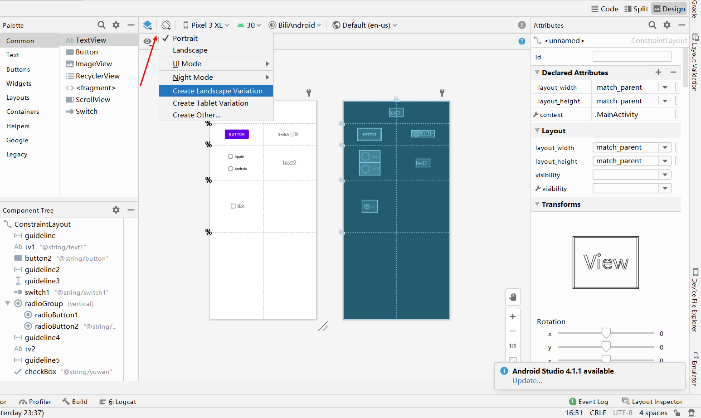
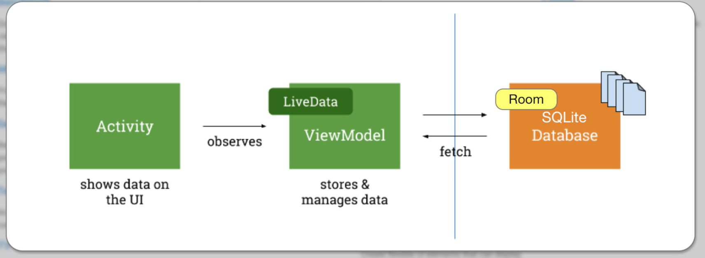
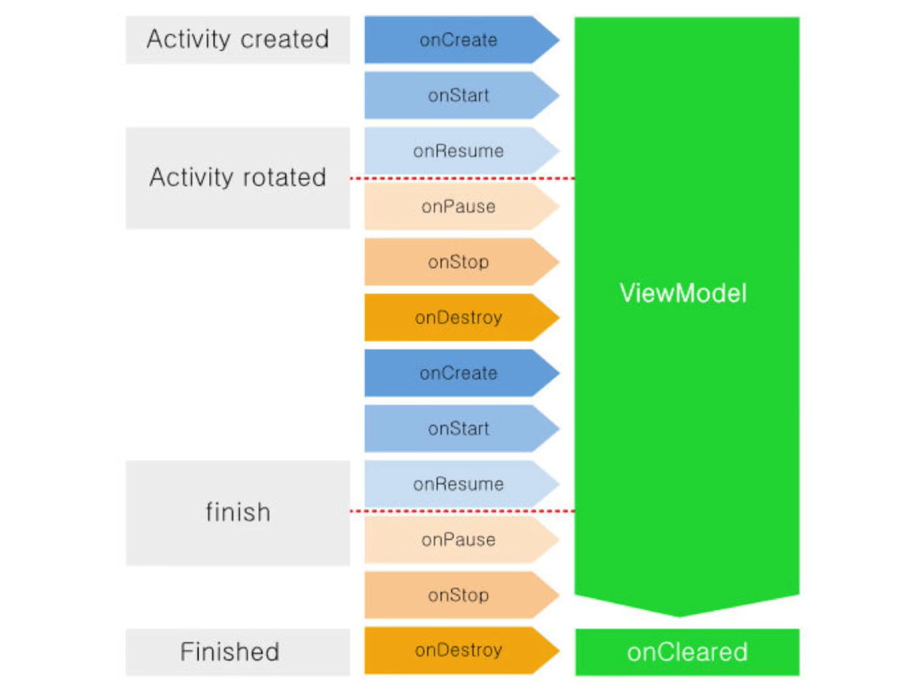
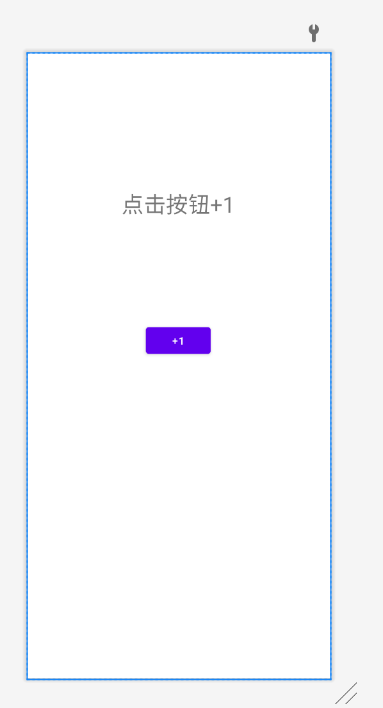
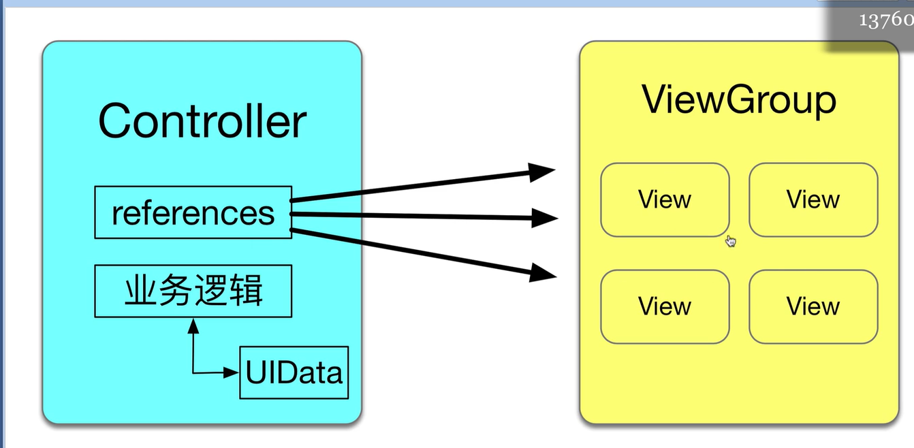
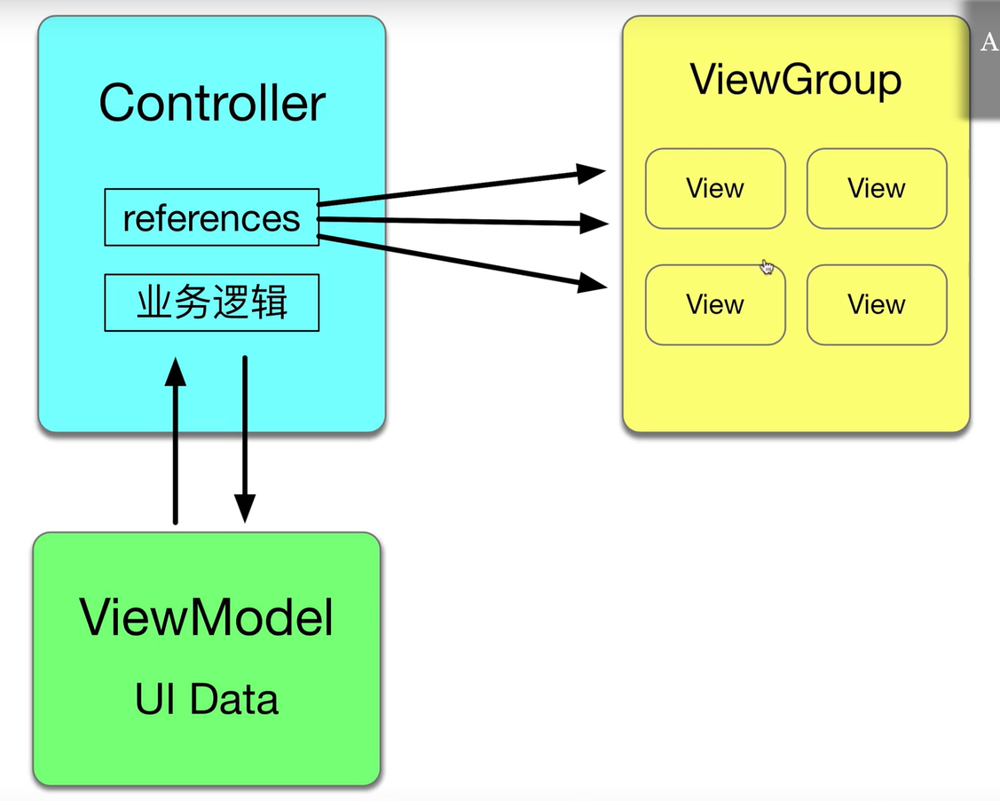
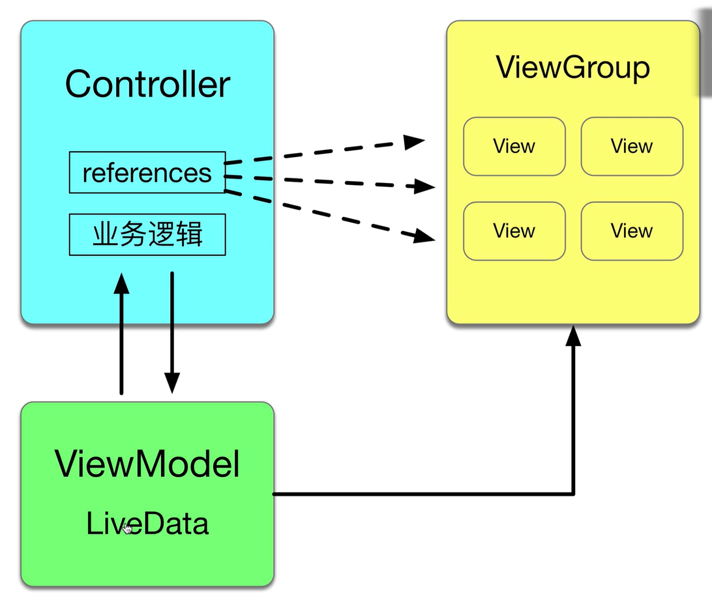
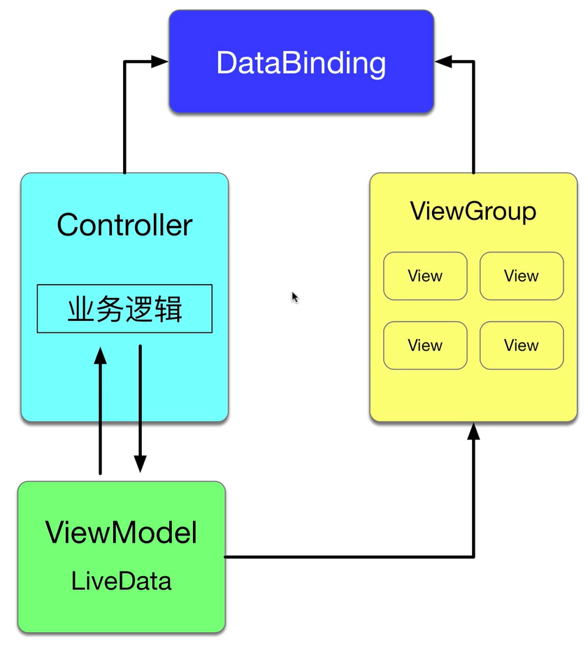
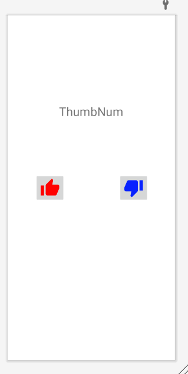

## P7 控件基础

2. 约束布局中辅助线的使用
2. button、radioGroup、checkBok等控件的点击事件 。这里使用的都是基本情况，button是点击事件，其他的是选择内容变更做出的动作。

```java
package com.example.biliandroid;

import androidx.appcompat.app.AppCompatActivity;

import android.os.Bundle;
import android.view.View;
import android.widget.Button;
import android.widget.CheckBox;
import android.widget.CompoundButton;
import android.widget.RadioGroup;
import android.widget.Switch;
import android.widget.TextView;

public class MainActivity extends AppCompatActivity {

    TextView tv1, tv2;
    Button btn;
    Switch aSwitch;
    RadioGroup radioGroup;
    CheckBox checkBox;

    @Override
    protected void onCreate(Bundle savedInstanceState) {
        super.onCreate(savedInstanceState);
        setContentView(R.layout.activity_main);

        //绑定控件
        tv1 = findViewById(R.id.tv1);
        tv2 = findViewById(R.id.tv2);
        btn = findViewById(R.id.button2);
        aSwitch = findViewById(R.id.switch1);
        radioGroup = findViewById(R.id.radioGroup);
        checkBox = findViewById(R.id.checkBox);

        //普通按钮的点击事件
        btn.setOnClickListener(new View.OnClickListener() {
            @Override
            public void onClick(View v) {
                tv1.setText(R.string.btnString);
            }
        });

        //Switch的点击事件
        aSwitch.setOnCheckedChangeListener(new CompoundButton.OnCheckedChangeListener() {
            @Override
            public void onCheckedChanged(CompoundButton buttonView, boolean isChecked) {
                if (isChecked) {
                    tv1.setText(R.string.switchON);
                } else {
                    tv1.setText(R.string.switchOFF);
                }
            }
        });

        //radioGroup的点击事件
        radioGroup.setOnCheckedChangeListener(new RadioGroup.OnCheckedChangeListener() {
            @Override
            public void onCheckedChanged(RadioGroup group, int checkedId) {
                if (checkedId == R.id.radioButton1) {
                    tv1.setText(R.string.radioGroupApple);
                } else {
                    tv1.setText(R.string.radioGroupAndroid);
                }

            }
        });

        //checkBox的使用
        checkBox.setOnCheckedChangeListener(new CompoundButton.OnCheckedChangeListener() {
            @Override
            public void onCheckedChanged(CompoundButton buttonView, boolean isChecked) {
                tv1.setText(checkBox.getText());
            }
        });
    }
}
```


## P8 本地化及多语言支持

在控件上显示的字符串，建议都使用string.xml存储, 这样更适合国际化编程

添加另外的语言, 只需要在string.xml文件中点击右上角open editer, 然后点击左上方的地球, 添加每一个字符的指定语言值


## P9 屏幕方向旋转

默认情况下，屏幕可以旋转，旋转后，页面会经历OnDestory，所以页面之前的数据会丢失。

可以在AndroidManifest文件中使**指定活动**的屏幕的指定方向，使其无法旋转，如下代码可以使MainActivity始终为竖直方向。

```xml
<activity android:name=".MainActivity"
    android:screenOrientation="portrait">
    <intent-filter>
        <action android:name="android.intent.action.MAIN" />

        <category android:name="android.intent.category.LAUNCHER" />
    </intent-filter>
</activity>
```

但一般情况下，支持旋转屏幕的应用，大部分是为了横竖屏的布局不一样，所以需要设置两个布局，分别对应横竖屏。



在此处选择创建一个水平方向的布局即可，AS会自动创建一个水平方向布局的layout文件，在屏幕旋转到水平时，就会自动使用水平方向的布局文件。

**保存数据：**

这个方法只适用于暂时保存，如果是退出程序，则无法保存


```java
@Override
protected void onSaveInstanceState(@NonNull Bundle outState) {
    super.onSaveInstanceState(outState);
    outState.putString("KEY", tv1.getText().toString());
}

@Override
protected void onCreate(Bundle savedInstanceState) {
    super.onCreate(savedInstanceState);
    setContentView(R.layout.activity_main);

    //绑定控件
    tv1 = findViewById(R.id.tv1);
    //这里要放在初始化后面，不然tv1是null
    if (savedInstanceState != null) {
        String s = "";
        s = savedInstanceState.getString("KEY");
        tv1.setText(s);
    }
}
```


## P10 ViewModel（从MVC到MVVM）



ViewModel主要是将数据都存放在ViewModel中，实现data和view的分离，使用ViewModel也可以更简单地解决活动destory后重建导致数据丢失的问题。使用ViewModel存取数据就不用像上节中使用`onSaveInstanceState`方法来保存数据。

ViewModel所在包：androidx.lifecycle.ViewModel



活动经历onDestory场景：

- 屏幕翻转
- 切换语言 

一个使用ViewModel的例子：

MainActivity2.java：

```java
public class MainActivity2 extends AppCompatActivity {

    TextView textView;
    Button button;
    MyViewModel viewModel;

    @Override
    protected void onCreate(Bundle savedInstanceState) {
        super.onCreate(savedInstanceState);
        setContentView(R.layout.activity_main2);
        viewModel = new ViewModelProvider(this,new ViewModelProvider.NewInstanceFactory()).get(MyViewModel.class);

        textView = findViewById(R.id.tv_act2);
        button = findViewById(R.id.btn_act2);

        int temp = viewModel.getValue();
        if (temp != 0) {
            //这里注意setText接受CharSequence，不能接受int，不然会报错
            //需要使用String.valueOf()
            textView.setText(String.valueOf(temp));
        }

        button.setOnClickListener(v -> {
            viewModel.setValue(viewModel.getValue() + 1);
            textView.setText(String.valueOf(viewModel.getValue()));
        });

    }
}
```

MyViewModel.java：

```java
public class MyViewModel extends ViewModel {

    private int value = 0;

    public int getValue() {
        return value;
    }

    public void setValue(int value) {
        this.value = value;
    }

}
```

activity_main2.xml：

```xml
<androidx.constraintlayout.widget.ConstraintLayout xmlns:android="http://schemas.android.com/apk/res/android"
    xmlns:app="http://schemas.android.com/apk/res-auto"
    xmlns:tools="http://schemas.android.com/tools"
    android:layout_width="match_parent"
    android:layout_height="match_parent"
    tools:context=".MainActivity2">

    <TextView
        android:id="@+id/tv_act2"
        android:layout_width="wrap_content"
        android:layout_height="wrap_content"
        android:text="@string/text"
        android:textSize="30sp"
        app:layout_constraintBottom_toBottomOf="parent"
        app:layout_constraintEnd_toEndOf="parent"
        app:layout_constraintHorizontal_bias="0.498"
        app:layout_constraintStart_toStartOf="parent"
        app:layout_constraintTop_toTopOf="parent"
        app:layout_constraintVertical_bias="0.229" />

    <Button
        android:id="@+id/btn_act2"
        android:layout_width="wrap_content"
        android:layout_height="wrap_content"
        android:text="@string/btn_act2"
        app:layout_constraintBottom_toBottomOf="parent"
        app:layout_constraintEnd_toEndOf="parent"
        app:layout_constraintHorizontal_bias="0.498"
        app:layout_constraintStart_toStartOf="parent"
        app:layout_constraintTop_toTopOf="parent"
        app:layout_constraintVertical_bias="0.458" />
</androidx.constraintlayout.widget.ConstraintLayout>
```




## P11 LiveData

LiveData，在底层数据库更改时通知视图

MVC架构，不包含Model：









MyViewModel：

```java
public class MyViewModel extends ViewModel {

    private int value = 0;

    //LiveData的变量
    private MutableLiveData<Integer> thumbNum;

    public MutableLiveData<Integer> getThumbNum() {
        //因为实例域thumbNum是类变量，所以采取懒汉模式进行初始化
        if (thumbNum == null) {
            thumbNum = new MutableLiveData<>();
            thumbNum.setValue(0);
        }
        return thumbNum;
    }

    public void addThumb(int value) {
        thumbNum.setValue(thumbNum.getValue()+value);
    }

    public int getValue() {
        return value;
    }

    public void setValue(int value) {
        this.value = value;
    }

}
```

LiveDataTest.java：

```java
public class LiveDataTest extends AppCompatActivity {

    MyViewModel myViewModel;
    TextView textView;
    ImageButton thumbUp, thumbDown;

    @Override
    protected void onCreate(Bundle savedInstanceState) {
        super.onCreate(savedInstanceState);
        setContentView(R.layout.activity_live_data_test2);
        //在Activity中得到ViewModel的方法
        myViewModel = new ViewModelProvider(this, new ViewModelProvider.NewInstanceFactory()).get(MyViewModel.class);

        textView = findViewById(R.id.tv_liveData);
        thumbUp = findViewById(R.id.img_btn_thumbUp);
        thumbDown = findViewById(R.id.img_btn_thumbDown);

        //使用观察者模式实现LiveData的监听
        myViewModel.getThumbNum().observe(this, new Observer<Integer>() {
            @Override
            public void onChanged(Integer integer) {
                textView.setText(String.valueOf(integer));
            }
        });

        thumbUp.setOnClickListener(new View.OnClickListener() {
            @Override
            public void onClick(View v) {
                myViewModel.addThumb(1);
            }
        });

        thumbDown.setOnClickListener(new View.OnClickListener() {
            @Override
            public void onClick(View v) {
                myViewModel.addThumb(-1);
            }
        });

    }
}
```

activity_live_data_test2.xml：

```xml
<androidx.constraintlayout.widget.ConstraintLayout xmlns:android="http://schemas.android.com/apk/res/android"
    xmlns:app="http://schemas.android.com/apk/res-auto"
    xmlns:tools="http://schemas.android.com/tools"
    android:layout_width="match_parent"
    android:layout_height="match_parent"
    tools:context=".LiveDataTest">

    <TextView
        android:id="@+id/tv_liveData"
        android:layout_width="wrap_content"
        android:layout_height="wrap_content"
        android:text="@string/text_thumbNum"
        android:textSize="30sp"
        app:layout_constraintBottom_toBottomOf="parent"
        app:layout_constraintEnd_toEndOf="parent"
        app:layout_constraintHorizontal_bias="0.5"
        app:layout_constraintStart_toStartOf="parent"
        app:layout_constraintTop_toTopOf="parent"
        app:layout_constraintVertical_bias="0.266" />

    <ImageButton
        android:id="@+id/img_btn_thumbUp"
        android:layout_width="wrap_content"
        android:layout_height="wrap_content"
        android:contentDescription="@string/btn_thumbUp"
        app:layout_constraintBottom_toBottomOf="parent"
        app:layout_constraintEnd_toEndOf="parent"
        app:layout_constraintHorizontal_bias="0.2"
        app:layout_constraintStart_toStartOf="parent"
        app:layout_constraintTop_toTopOf="parent"
        app:layout_constraintVertical_bias="0.5"
        app:srcCompat="@drawable/ic_baseline_thumb_up_24" />

    <ImageButton
        android:id="@+id/img_btn_thumbDown"
        android:layout_width="wrap_content"
        android:layout_height="wrap_content"
        android:contentDescription="@string/btn_thumbDown"
        app:layout_constraintBottom_toBottomOf="parent"
        app:layout_constraintEnd_toEndOf="parent"
        app:layout_constraintHorizontal_bias="0.811"
        app:layout_constraintStart_toStartOf="parent"
        app:layout_constraintTop_toTopOf="parent"
        app:layout_constraintVertical_bias="0.5"
        app:srcCompat="@drawable/ic_baseline_thumb_down_24" />
</androidx.constraintlayout.widget.ConstraintLayout>
```

