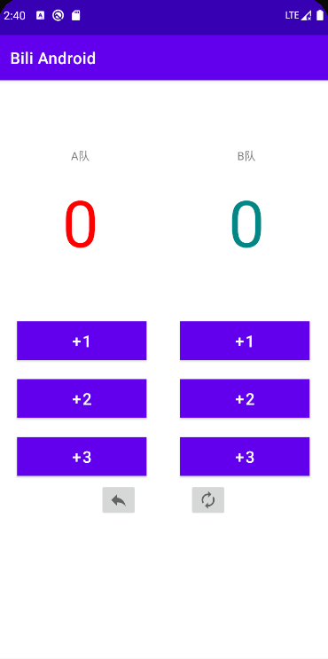

## P7 控件基础

2. 约束布局中辅助线的使用
2. button、radioGroup、checkBok等控件的点击事件 。这里使用的都是基本情况，button是点击事件，其他的是选择内容变更做出的动作。

```java
package com.example.biliandroid;

import androidx.appcompat.app.AppCompatActivity;

import android.os.Bundle;
import android.view.View;
import android.widget.Button;
import android.widget.CheckBox;
import android.widget.CompoundButton;
import android.widget.RadioGroup;
import android.widget.Switch;
import android.widget.TextView;

public class MainActivity extends AppCompatActivity {

    TextView tv1, tv2;
    Button btn;
    Switch aSwitch;
    RadioGroup radioGroup;
    CheckBox checkBox;

    @Override
    protected void onCreate(Bundle savedInstanceState) {
        super.onCreate(savedInstanceState);
        setContentView(R.layout.activity_main);

        //绑定控件
        tv1 = findViewById(R.id.tv1);
        tv2 = findViewById(R.id.tv2);
        btn = findViewById(R.id.button2);
        aSwitch = findViewById(R.id.switch1);
        radioGroup = findViewById(R.id.radioGroup);
        checkBox = findViewById(R.id.checkBox);

        //普通按钮的点击事件
        btn.setOnClickListener(new View.OnClickListener() {
            @Override
            public void onClick(View v) {
                tv1.setText(R.string.btnString);
            }
        });

        //Switch的点击事件
        aSwitch.setOnCheckedChangeListener(new CompoundButton.OnCheckedChangeListener() {
            @Override
            public void onCheckedChanged(CompoundButton buttonView, boolean isChecked) {
                if (isChecked) {
                    tv1.setText(R.string.switchON);
                } else {
                    tv1.setText(R.string.switchOFF);
                }
            }
        });

        //radioGroup的点击事件
        radioGroup.setOnCheckedChangeListener(new RadioGroup.OnCheckedChangeListener() {
            @Override
            public void onCheckedChanged(RadioGroup group, int checkedId) {
                if (checkedId == R.id.radioButton1) {
                    tv1.setText(R.string.radioGroupApple);
                } else {
                    tv1.setText(R.string.radioGroupAndroid);
                }

            }
        });

        //checkBox的使用
        checkBox.setOnCheckedChangeListener(new CompoundButton.OnCheckedChangeListener() {
            @Override
            public void onCheckedChanged(CompoundButton buttonView, boolean isChecked) {
                tv1.setText(checkBox.getText());
            }
        });
    }
}
```


## P8 本地化及多语言支持

在控件上显示的字符串，建议都使用string.xml存储, 这样更适合国际化编程

添加另外的语言, 只需要在string.xml文件中点击右上角open editer, 然后点击左上方的地球, 添加每一个字符的指定语言值


## P9 屏幕方向旋转

默认情况下，屏幕可以旋转，旋转后，页面会经历OnDestory，所以页面之前的数据会丢失。

可以在AndroidManifest文件中使**指定活动**的屏幕的指定方向，使其无法旋转，如下代码可以使MainActivity始终为竖直方向。

```xml
<activity android:name=".MainActivity"
    android:screenOrientation="portrait">
    <intent-filter>
        <action android:name="android.intent.action.MAIN" />

        <category android:name="android.intent.category.LAUNCHER" />
    </intent-filter>
</activity>
```

但一般情况下，支持旋转屏幕的应用，大部分是为了横竖屏的布局不一样，所以需要设置两个布局，分别对应横竖屏。


在此处选择创建一个水平方向的布局即可，AS会自动创建一个水平方向布局的layout文件，在屏幕旋转到水平时，就会自动使用水平方向的布局文件。

**保存数据：**

这个方法只适用于暂时保存，如果是退出程序，则无法保存

```java
@Override
protected void onSaveInstanceState(@NonNull Bundle outState) {
    super.onSaveInstanceState(outState);
    outState.putString("KEY", tv1.getText().toString());
}

@Override
protected void onCreate(Bundle savedInstanceState) {
    super.onCreate(savedInstanceState);
    setContentView(R.layout.activity_main);

    //绑定控件
    tv1 = findViewById(R.id.tv1);
    //这里要放在初始化后面，不然tv1是null
    if (savedInstanceState != null) {
        String s = "";
        s = savedInstanceState.getString("KEY");
        tv1.setText(s);
    }
}
```


## P10 ViewModel（从MVC到MVVM）


ViewModel主要是将数据都存放在ViewModel中，实现data和view的分离，使用ViewModel也可以更简单地解决活动destory后重建导致数据丢失的问题。使用ViewModel存取数据就不用像上节中使用`onSaveInstanceState`方法来保存数据。

ViewModel所在包：androidx.lifecycle.ViewModel


活动经历onDestory场景：

- 屏幕翻转
- 切换语言 

一个使用ViewModel的例子：

MainActivity2.java：

```java
public class MainActivity2 extends AppCompatActivity {

    TextView textView;
    Button button;
    MyViewModel viewModel;

    @Override
    protected void onCreate(Bundle savedInstanceState) {
        super.onCreate(savedInstanceState);
        setContentView(R.layout.activity_main2);
        viewModel = new ViewModelProvider(this,new ViewModelProvider.NewInstanceFactory()).get(MyViewModel.class);

        textView = findViewById(R.id.tv_act2);
        button = findViewById(R.id.btn_act2);

        int temp = viewModel.getValue();
        if (temp != 0) {
            //这里注意setText接受CharSequence，不能接受int，不然会报错
            //需要使用String.valueOf()
            textView.setText(String.valueOf(temp));
        }

        button.setOnClickListener(v -> {
            viewModel.setValue(viewModel.getValue() + 1);
            textView.setText(String.valueOf(viewModel.getValue()));
        });

    }
}
```

MyViewModel.java：

```java
public class MyViewModel extends ViewModel {

    private int value = 0;

    public int getValue() {
        return value;
    }

    public void setValue(int value) {
        this.value = value;
    }

}
```

activity_main2.xml：

```xml
<androidx.constraintlayout.widget.ConstraintLayout xmlns:android="http://schemas.android.com/apk/res/android"
    xmlns:app="http://schemas.android.com/apk/res-auto"
    xmlns:tools="http://schemas.android.com/tools"
    android:layout_width="match_parent"
    android:layout_height="match_parent"
    tools:context=".MainActivity2">

    <TextView
        android:id="@+id/tv_act2"
        android:layout_width="wrap_content"
        android:layout_height="wrap_content"
        android:text="@string/text"
        android:textSize="30sp"
        app:layout_constraintBottom_toBottomOf="parent"
        app:layout_constraintEnd_toEndOf="parent"
        app:layout_constraintHorizontal_bias="0.498"
        app:layout_constraintStart_toStartOf="parent"
        app:layout_constraintTop_toTopOf="parent"
        app:layout_constraintVertical_bias="0.229" />

    <Button
        android:id="@+id/btn_act2"
        android:layout_width="wrap_content"
        android:layout_height="wrap_content"
        android:text="@string/btn_act2"
        app:layout_constraintBottom_toBottomOf="parent"
        app:layout_constraintEnd_toEndOf="parent"
        app:layout_constraintHorizontal_bias="0.498"
        app:layout_constraintStart_toStartOf="parent"
        app:layout_constraintTop_toTopOf="parent"
        app:layout_constraintVertical_bias="0.458" />
</androidx.constraintlayout.widget.ConstraintLayout>
```


## P11 LiveData

LiveData，在底层数据库更改时通知视图

MVC架构，不包含Model：


MyViewModel：

```java
public class MyViewModel extends ViewModel {

    private int value = 0;

    //LiveData的变量
    private MutableLiveData<Integer> thumbNum;

    public MutableLiveData<Integer> getThumbNum() {
        //因为实例域thumbNum是类变量，所以采取懒汉模式进行初始化
        if (thumbNum == null) {
            thumbNum = new MutableLiveData<>();
            thumbNum.setValue(0);
        }
        return thumbNum;
    }

    public void addThumb(int value) {
        thumbNum.setValue(thumbNum.getValue()+value);
    }

    public int getValue() {
        return value;
    }

    public void setValue(int value) {
        this.value = value;
    }

}
```

LiveDataTest.java：

```java
public class LiveDataTest extends AppCompatActivity {

    MyViewModel myViewModel;
    TextView textView;
    ImageButton thumbUp, thumbDown;

    @Override
    protected void onCreate(Bundle savedInstanceState) {
        super.onCreate(savedInstanceState);
        setContentView(R.layout.activity_live_data_test2);
        //在Activity中得到ViewModel的方法
        myViewModel = new ViewModelProvider(this, new ViewModelProvider.NewInstanceFactory()).get(MyViewModel.class);

        textView = findViewById(R.id.tv_liveData);
        thumbUp = findViewById(R.id.img_btn_thumbUp);
        thumbDown = findViewById(R.id.img_btn_thumbDown);

        //使用观察者模式实现LiveData的监听
        myViewModel.getThumbNum().observe(this, new Observer<Integer>() {
            @Override
            public void onChanged(Integer integer) {
                textView.setText(String.valueOf(integer));
            }
        });

        thumbUp.setOnClickListener(new View.OnClickListener() {
            @Override
            public void onClick(View v) {
                myViewModel.addThumb(1);
            }
        });

        thumbDown.setOnClickListener(new View.OnClickListener() {
            @Override
            public void onClick(View v) {
                myViewModel.addThumb(-1);
            }
        });

    }
}
```

activity_live_data_test2.xml：

```xml
<androidx.constraintlayout.widget.ConstraintLayout xmlns:android="http://schemas.android.com/apk/res/android"
    xmlns:app="http://schemas.android.com/apk/res-auto"
    xmlns:tools="http://schemas.android.com/tools"
    android:layout_width="match_parent"
    android:layout_height="match_parent"
    tools:context=".LiveDataTest">

    <TextView
        android:id="@+id/tv_liveData"
        android:layout_width="wrap_content"
        android:layout_height="wrap_content"
        android:text="@string/text_thumbNum"
        android:textSize="30sp"
        app:layout_constraintBottom_toBottomOf="parent"
        app:layout_constraintEnd_toEndOf="parent"
        app:layout_constraintHorizontal_bias="0.5"
        app:layout_constraintStart_toStartOf="parent"
        app:layout_constraintTop_toTopOf="parent"
        app:layout_constraintVertical_bias="0.266" />

    <ImageButton
        android:id="@+id/img_btn_thumbUp"
        android:layout_width="wrap_content"
        android:layout_height="wrap_content"
        android:contentDescription="@string/btn_thumbUp"
        app:layout_constraintBottom_toBottomOf="parent"
        app:layout_constraintEnd_toEndOf="parent"
        app:layout_constraintHorizontal_bias="0.2"
        app:layout_constraintStart_toStartOf="parent"
        app:layout_constraintTop_toTopOf="parent"
        app:layout_constraintVertical_bias="0.5"
        app:srcCompat="@drawable/ic_baseline_thumb_up_24" />

    <ImageButton
        android:id="@+id/img_btn_thumbDown"
        android:layout_width="wrap_content"
        android:layout_height="wrap_content"
        android:contentDescription="@string/btn_thumbDown"
        app:layout_constraintBottom_toBottomOf="parent"
        app:layout_constraintEnd_toEndOf="parent"
        app:layout_constraintHorizontal_bias="0.811"
        app:layout_constraintStart_toStartOf="parent"
        app:layout_constraintTop_toTopOf="parent"
        app:layout_constraintVertical_bias="0.5"
        app:srcCompat="@drawable/ic_baseline_thumb_down_24" />
</androidx.constraintlayout.widget.ConstraintLayout>
```


## P12 Data Binding

数据绑定：以声明方式将可观察数据绑定到界面元素


1. 在Modle模块下的build.gradle文件下添加数据绑定，添加完后点击sync now：

   ```gradle
   android {
   
       compileSdkVersion 30
       buildToolsVersion "30.0.1"
   
       defaultConfig {
           ...
       }
   //	  已过时
   //    dataBinding{
   //        enabled true
   //    }
   	//目前方法
       buildFeatures{
           dataBinding true
       }
   
       buildTypes {
           release {
               ...
           }
       }
       
   }
   ```

2. 在layout文件中，鼠标点击最外层的控件，使用快捷键alt+enter，选择convert to data binding layout，生成DataBingding的布局文件，这个布局文件中可以创建变量，变量相当于是在我们创建的ViewModel类中：
   可以在其中插入代码和方法，如插入代码`android:text="@{String.valueOf(data.num)}"`，调用button的onClick方法`android:onClick="@{()->data.add()}"`

   ```xml
   <?xml version="1.0" encoding="utf-8"?>
   <layout xmlns:android="http://schemas.android.com/apk/res/android"
       xmlns:app="http://schemas.android.com/apk/res-auto"
       xmlns:tools="http://schemas.android.com/tools">
   
       <data>
           <variable
               name="data"
               type="com.example.biliandroid.ViewModelWithDataBing" />
       </data>
   
       <androidx.constraintlayout.widget.ConstraintLayout
           android:layout_width="match_parent"
           android:layout_height="match_parent"
           tools:context=".DataBindingTest">
   
           <TextView
               android:id="@+id/textView"
               android:layout_width="wrap_content"
               android:layout_height="wrap_content"
               android:text="@{String.valueOf(data.num)}"
               android:textSize="30sp"
               app:layout_constraintBottom_toBottomOf="parent"
               app:layout_constraintEnd_toEndOf="parent"
               app:layout_constraintStart_toStartOf="parent"
               app:layout_constraintTop_toTopOf="parent"
               app:layout_constraintVertical_bias="0.276" />
   
           <Button
               android:id="@+id/button"
               android:layout_width="wrap_content"
               android:layout_height="wrap_content"
               android:text="@string/btn_data_bind_act"
               android:onClick="@{()->data.add()}"
               app:layout_constraintBottom_toBottomOf="parent"
               app:layout_constraintEnd_toEndOf="parent"
               app:layout_constraintStart_toStartOf="parent"
               app:layout_constraintTop_toTopOf="parent" />
       </androidx.constraintlayout.widget.ConstraintLayout>
   </layout>
   ```

   

3. 编写ViewModel类：

   ```java
   import androidx.lifecycle.MutableLiveData;
   import androidx.lifecycle.ViewModel;
   
   public class ViewModelWithDataBing extends ViewModel {
   
       /**
        * 使用LiveData创建数据
        */
       private MutableLiveData<Integer> num;
   
       public MutableLiveData<Integer> getNum() {
           //使用饿汉模式初始化
           if (num == null) {
               num = new MutableLiveData<>();
               //这里设置为0是必须的，不然没有元素，数据为null
               num.setValue(0);
           }
           return num;
       }
   
       /**
        * 一个累加器
        */
       public void add() {
           num.setValue(num.getValue() + 1);
       }
   }
   ```

4. 编写Activity类：

   ```java
   import androidx.appcompat.app.AppCompatActivity;
   import androidx.databinding.DataBindingUtil;
   import androidx.lifecycle.ViewModelProvider;
   
   import android.os.Bundle;
   
   import com.example.biliandroid.databinding.ActivityDataBindingTestBinding;
   
   public class DataBindingTest extends AppCompatActivity {
   
       ActivityDataBindingTestBinding binding;
       ViewModelWithDataBing viewModel;
   
       @Override
       protected void onCreate(Bundle savedInstanceState) {
           super.onCreate(savedInstanceState);
   //        setContentView(R.layout.activity_data_binding_test);
           //使用此方法来初始化binding对象和替代setContentView方法
           binding = DataBindingUtil.setContentView(this, R.layout.activity_data_binding_test);
           viewModel = new ViewModelProvider(this, new ViewModelProvider.NewInstanceFactory()).get(ViewModelWithDataBing.class);
   
           binding.setData(viewModel);
           binding.setLifecycleOwner(this);
       }
   }
   ```


## P13 阶段练习：篮球比赛记分器

主界面：



在使用之前需要在模块的build.gradle中加入使用dataBinding的声明：

```gradle
buildFeatures{
    dataBinding true
}
```

xml文件：

```xml
<?xml version="1.0" encoding="utf-8"?>
<layout xmlns:android="http://schemas.android.com/apk/res/android"
    xmlns:app="http://schemas.android.com/apk/res-auto"
    xmlns:tools="http://schemas.android.com/tools">

    <data>
        <variable
            name="team"
            type="com.example.biliandroid.RecordViewModel" />
    </data>

    <androidx.constraintlayout.widget.ConstraintLayout
        android:layout_width="match_parent"
        android:layout_height="match_parent"
        tools:context=".RecordTest">

        <androidx.constraintlayout.widget.Guideline
            android:id="@+id/guideline10"
            android:layout_width="wrap_content"
            android:layout_height="wrap_content"
            android:orientation="horizontal"
            app:layout_constraintGuide_percent="0.6" />

        <androidx.constraintlayout.widget.Guideline
            android:id="@+id/guideline11"
            android:layout_width="wrap_content"
            android:layout_height="wrap_content"
            android:orientation="horizontal"
            app:layout_constraintGuide_percent="0.7" />

        <androidx.constraintlayout.widget.Guideline
            android:id="@+id/guideline6"
            android:layout_width="wrap_content"
            android:layout_height="wrap_content"
            android:orientation="vertical"
            app:layout_constraintGuide_percent="0.5" />

        <androidx.constraintlayout.widget.Guideline
            android:id="@+id/guideline13"
            android:layout_width="wrap_content"
            android:layout_height="wrap_content"
            android:orientation="vertical"
            app:layout_constraintGuide_percent="0.06" />

        <androidx.constraintlayout.widget.Guideline
            android:id="@+id/guideline15"
            android:layout_width="wrap_content"
            android:layout_height="wrap_content"
            android:orientation="vertical"
            app:layout_constraintGuide_percent="0.55" />

        <androidx.constraintlayout.widget.Guideline
            android:id="@+id/guideline17"
            android:layout_width="wrap_content"
            android:layout_height="wrap_content"
            android:orientation="vertical"
            app:layout_constraintGuide_percent="0.45" />

        <androidx.constraintlayout.widget.Guideline
            android:id="@+id/guideline16"
            android:layout_width="wrap_content"
            android:layout_height="wrap_content"
            android:orientation="vertical"
            app:layout_constraintGuide_percent="0.06" />

        <androidx.constraintlayout.widget.Guideline
            android:id="@+id/guideline14"
            android:layout_width="wrap_content"
            android:layout_height="wrap_content"
            android:orientation="vertical"
            app:layout_constraintGuide_percent="0.94" />

        <TextView
            android:id="@+id/textView2"
            android:layout_width="wrap_content"
            android:layout_height="wrap_content"
            android:text="@string/tv_team_a"
            app:layout_constraintBottom_toBottomOf="parent"
            app:layout_constraintEnd_toStartOf="@+id/guideline6"
            app:layout_constraintHorizontal_bias="0.5"
            app:layout_constraintStart_toStartOf="parent"
            app:layout_constraintTop_toTopOf="parent"
            app:layout_constraintVertical_bias="0.12" />

        <TextView
            android:id="@+id/textView3"
            android:layout_width="wrap_content"
            android:layout_height="wrap_content"
            android:text="@string/tv_team_b"
            app:layout_constraintBottom_toBottomOf="parent"
            app:layout_constraintEnd_toEndOf="parent"
            app:layout_constraintHorizontal_bias="0.5"
            app:layout_constraintStart_toStartOf="@+id/guideline6"
            app:layout_constraintTop_toTopOf="parent"
            app:layout_constraintVertical_bias="0.12" />

        <TextView
            android:id="@+id/textView4"
            android:layout_width="wrap_content"
            android:layout_height="wrap_content"
            android:text="@{String.valueOf(team.num_a)}"
            android:textColor="#FF0000"
            android:textSize="80sp"
            app:layout_constraintBottom_toBottomOf="parent"
            app:layout_constraintEnd_toStartOf="@+id/guideline6"
            app:layout_constraintHorizontal_bias="0.5"
            app:layout_constraintStart_toStartOf="parent"
            app:layout_constraintTop_toTopOf="parent"
            app:layout_constraintVertical_bias="0.2" />

        <TextView
            android:id="@+id/textView5"
            android:layout_width="wrap_content"
            android:layout_height="wrap_content"
            android:text="@{String.valueOf(team.num_b)}"
            android:textColor="@color/teal_700"
            android:textSize="80sp"
            app:layout_constraintBottom_toBottomOf="parent"
            app:layout_constraintEnd_toEndOf="parent"
            app:layout_constraintHorizontal_bias="0.5"
            app:layout_constraintStart_toStartOf="@+id/guideline6"
            app:layout_constraintTop_toTopOf="parent"
            app:layout_constraintVertical_bias="0.2" />

        <androidx.constraintlayout.widget.Guideline
            android:id="@+id/guideline8"
            android:layout_width="wrap_content"
            android:layout_height="wrap_content"
            android:orientation="horizontal"
            app:layout_constraintGuide_percent="0.4" />

        <androidx.constraintlayout.widget.Guideline
            android:id="@+id/guideline9"
            android:layout_width="wrap_content"
            android:layout_height="wrap_content"
            android:orientation="horizontal"
            app:layout_constraintGuide_percent="0.5" />

        <Button
            android:id="@+id/button3"
            android:layout_width="0dp"
            android:layout_height="wrap_content"
            android:background="#FF0000"
            android:onClick="@{()->team.addA(1)}"
            android:text="@string/btn_1"
            android:textSize="@dimen/scoreTextSize"
            app:layout_constraintBottom_toTopOf="@+id/guideline9"
            app:layout_constraintEnd_toStartOf="@+id/guideline17"
            app:layout_constraintStart_toStartOf="@+id/guideline13"
            app:layout_constraintTop_toTopOf="@+id/guideline8" />

        <Button
            android:id="@+id/button4"
            android:layout_width="0dp"
            android:layout_height="wrap_content"
            android:background="@color/teal_700"
            android:onClick="@{()->team.addB(1)}"
            android:text="@string/btn_1"
            android:textSize="@dimen/scoreTextSize"
            app:layout_constraintBottom_toTopOf="@+id/guideline9"
            app:layout_constraintEnd_toStartOf="@+id/guideline14"
            app:layout_constraintStart_toStartOf="@+id/guideline15"
            app:layout_constraintTop_toTopOf="@+id/guideline8" />

        <Button
            android:id="@+id/button5"
            android:layout_width="0dp"
            android:layout_height="wrap_content"
            android:background="#FF0000"
            android:onClick="@{()->team.addA(2)}"
            android:text="@string/btn_2"
            android:textSize="@dimen/scoreTextSize"
            app:layout_constraintBottom_toTopOf="@+id/guideline10"
            app:layout_constraintEnd_toStartOf="@+id/guideline17"
            app:layout_constraintStart_toStartOf="@+id/guideline13"
            app:layout_constraintTop_toTopOf="@+id/guideline9" />

        <Button
            android:id="@+id/button6"
            android:layout_width="0dp"
            android:layout_height="wrap_content"
            android:background="@color/teal_700"
            android:onClick="@{()->team.addB(2)}"
            android:text="@string/btn_2"
            android:textSize="@dimen/scoreTextSize"
            app:layout_constraintBottom_toTopOf="@+id/guideline10"
            app:layout_constraintEnd_toStartOf="@+id/guideline14"
            app:layout_constraintStart_toStartOf="@+id/guideline15"
            app:layout_constraintTop_toTopOf="@+id/guideline9" />

        <Button
            android:id="@+id/button7"
            android:layout_width="0dp"
            android:layout_height="wrap_content"
            android:background="#FF0000"
            android:onClick="@{()->team.addA(3)}"
            android:text="@string/btn_3"
            android:textSize="@dimen/scoreTextSize"
            app:layout_constraintBottom_toTopOf="@+id/guideline11"
            app:layout_constraintEnd_toStartOf="@+id/guideline17"
            app:layout_constraintStart_toStartOf="@+id/guideline13"
            app:layout_constraintTop_toTopOf="@+id/guideline10" />

        <Button
            android:id="@+id/button8"
            android:layout_width="0dp"
            android:layout_height="wrap_content"
            android:background="@color/teal_700"
            android:onClick="@{()->team.addB(3)}"
            android:text="@string/btn_3"
            android:textSize="@dimen/scoreTextSize"
            app:layout_constraintBottom_toTopOf="@+id/guideline11"
            app:layout_constraintEnd_toStartOf="@+id/guideline14"
            app:layout_constraintStart_toStartOf="@+id/guideline15"
            app:layout_constraintTop_toTopOf="@+id/guideline10" />

        <androidx.constraintlayout.widget.Guideline
            android:id="@+id/guideline12"
            android:layout_width="wrap_content"
            android:layout_height="wrap_content"
            android:orientation="horizontal"
            app:layout_constraintGuide_percent="0.75" />

        <ImageButton
            android:id="@+id/imageView"
            android:layout_width="wrap_content"
            android:layout_height="wrap_content"
            android:onClick="@{()->team.backToLastStep()}"
            app:layout_constraintBottom_toTopOf="@+id/guideline12"
            app:layout_constraintEnd_toStartOf="@+id/guideline6"
            app:layout_constraintHorizontal_bias="0.8"
            app:layout_constraintStart_toStartOf="parent"
            app:layout_constraintTop_toTopOf="@+id/guideline11"
            app:srcCompat="@drawable/ic_baseline_reply_24" />

        <ImageButton
            android:id="@+id/imageView2"
            android:layout_width="wrap_content"
            android:layout_height="wrap_content"
            android:onClick="@{()->team.clearAll()}"
            app:layout_constraintBottom_toTopOf="@+id/guideline12"
            app:layout_constraintEnd_toEndOf="parent"
            app:layout_constraintHorizontal_bias="0.2"
            app:layout_constraintStart_toStartOf="@+id/guideline6"
            app:layout_constraintTop_toTopOf="@+id/guideline11"
            app:srcCompat="@drawable/ic_baseline_autorenew_24" />

    </androidx.constraintlayout.widget.ConstraintLayout>
</layout>
```

ViewModel类，实现几个功能：

```java
import androidx.lifecycle.MutableLiveData;
import androidx.lifecycle.ViewModel;

import java.util.HashMap;
import java.util.Queue;
import java.util.Stack;

public class RecordViewModel extends ViewModel {

    private MutableLiveData<Integer> num_a;

    private MutableLiveData<Integer> num_b;

    private Stack<String> team = new Stack<>();

    private Stack<Integer> num = new Stack<>();

    public MutableLiveData<Integer> getNum_a() {
        if (num_a == null) {
            num_a = new MutableLiveData<>();
            num_a.setValue(0);
        }
        return num_a;
    }

    public MutableLiveData<Integer> getNum_b() {
        if (num_b == null) {
            num_b = new MutableLiveData<>();
            num_b.setValue(0);
        }
        return num_b;
    }

    public void addA(int i) {
        num_a.setValue(num_a.getValue() + i);
        team.push("A");
        num.push(i);
    }

    public void addB(int i) {
        num_b.setValue(num_b.getValue() + i);
        team.push("B");
        num.push(i);
    }

    public void clearAll() {
        num_a.setValue(0);
        num_b.setValue(0);
    }

    public void backToLastStep() {
        if (!team.empty()) {
            String s = team.pop();
            int v = num.pop();

            if (s.equals("A")) {
                num_a.setValue(num_a.getValue() - v);
            } else if (s.equals("B")){
                num_b.setValue(num_b.getValue() - v);
            }
        }
    }

}
```

主活动类：

```java
import android.os.Bundle;

import androidx.appcompat.app.AppCompatActivity;
import androidx.databinding.DataBindingUtil;
import androidx.lifecycle.ViewModelProvider;

import com.example.biliandroid.databinding.ActivityRecordTestBinding;

public class RecordTest extends AppCompatActivity {

    RecordViewModel viewModel;
    ActivityRecordTestBinding binding;

    @Override
    protected void onCreate(Bundle savedInstanceState) {
        super.onCreate(savedInstanceState);
        binding = DataBindingUtil.setContentView(this, R.layout.activity_record_test);
        viewModel = new ViewModelProvider(this, new ViewModelProvider.NewInstanceFactory()).get(RecordViewModel.class);

        binding.setTeam(viewModel);
        binding.setLifecycleOwner(this);
    }
}
```


## P14 ViewModelSavedState（即使进程在后台被杀死，数据也能活）

在一般情况下，将app置于后台，如果Android后台任务过多，该app可能会被杀死；我们可以在开发者模式下，设置为点击home键返回界面后，界面就被杀死的情况下来模拟。


如果要实现app置于后台，保证数据不会丢失，可以有新旧两种方法：

比较旧的处理方式：重写`onSaveInstanceState(Bundle)`方法；

更新的处理方式，使用ViewModelSavedState：


添加依赖：

```gradle
def lifecycle_version = "2.2.0"

implementation "androidx.lifecycle:lifecycle-viewmodel-savedstate:$lifecycle_version"
```

xml代码：

```xml
<?xml version="1.0" encoding="utf-8"?>
<layout xmlns:android="http://schemas.android.com/apk/res/android"
    xmlns:app="http://schemas.android.com/apk/res-auto"
    xmlns:tools="http://schemas.android.com/tools">

    <data>
        <variable
            name="data"
            type="com.example.biliandroid.ViewModelRestoreViewModel" />
    </data>

    <androidx.constraintlayout.widget.ConstraintLayout
        android:layout_width="match_parent"
        android:layout_height="match_parent"
        tools:context=".ViewModelRestore">

        <TextView
            android:id="@+id/textView"
            android:layout_width="wrap_content"
            android:layout_height="wrap_content"
            android:text="@{String.valueOf(data.getNum())}"
            android:textSize="24sp"
            app:layout_constraintBottom_toBottomOf="parent"
            app:layout_constraintEnd_toEndOf="parent"
            app:layout_constraintStart_toStartOf="parent"
            app:layout_constraintTop_toTopOf="parent"
            app:layout_constraintVertical_bias="0.288" />

        <Button
            android:id="@+id/button"
            android:layout_width="wrap_content"
            android:layout_height="wrap_content"
            android:text="Button"
            android:onClick="@{()->data.add()}"
            app:layout_constraintBottom_toBottomOf="parent"
            app:layout_constraintEnd_toEndOf="parent"
            app:layout_constraintStart_toStartOf="parent"
            app:layout_constraintTop_toTopOf="parent" />
    </androidx.constraintlayout.widget.ConstraintLayout>
</layout>
```

ViewModel:

```java
import androidx.lifecycle.MutableLiveData;
import androidx.lifecycle.SavedStateHandle;
import androidx.lifecycle.ViewModel;

public class ViewModelRestoreViewModel extends ViewModel {

    private SavedStateHandle handle;

    public static final String KEY = ViewModelRestore.VM_KEY;

    public ViewModelRestoreViewModel(SavedStateHandle handle) {
        this.handle = handle;
    }

    public MutableLiveData<Integer> getNum() {
        if (!handle.contains(KEY)) {
            handle.set(KEY, 0);
        }
        return handle.getLiveData(KEY);
    }

    public void add() {
        getNum().setValue(getNum().getValue()+1);
    }
}
```

Activity:

```java
import androidx.appcompat.app.AppCompatActivity;
import androidx.databinding.DataBindingUtil;
import androidx.lifecycle.SavedStateViewModelFactory;
import androidx.lifecycle.ViewModel;
import androidx.lifecycle.ViewModelProvider;

import android.app.Application;
import android.os.Bundle;

import com.example.biliandroid.databinding.ActivityViewModelRestoreBinding;

public class ViewModelRestore extends AppCompatActivity {

    ViewModelRestoreViewModel viewModel;

    ActivityViewModelRestoreBinding binding;

    public static final String VM_KEY = "KEY";

    @Override
    protected void onCreate(Bundle savedInstanceState) {
        super.onCreate(savedInstanceState);
        binding = DataBindingUtil.setContentView(this, R.layout.activity_view_model_restore);
        viewModel = new ViewModelProvider(this, new SavedStateViewModelFactory(getApplication(), this))
                .get(ViewModelRestoreViewModel.class);
        binding.setData(viewModel);
        binding.setLifecycleOwner(this);
    }
}
```

**注意：**

- 状态必须是简单的轻量级状态。对于复杂或大型数据，您应该使用[本地持久性存储]；
- 此种方法只是运用在app在后台被杀死的情况，如果是点击back键摧毁，则仍无法恢复，若要恢复，需要使用本地持久性存储。


## P15 SharedPreferences

Android数据存储的四种方式

- **App-specific storage:** Store files that are meant for your app's use only, either in dedicated directories within an internal storage volume or different dedicated directories within external storage. Use the directories within internal storage to save sensitive information that other apps shouldn't access.
- **Shared storage:** Store files that your app intends to share with other apps, including media, documents, and other files.
- **Preferences:** Store private, primitive data in key-value pairs.
- **Databases:** Store structured data in a private database using the Room persistence library.

SharedPreferences静态构造方法有两种：

- getPreferences（int mode）：以本Activity为名创建一个文件，独有的

  ```java
  //存入内存
  //ShardPreferences shp = getPreferences(Context.MODE_PRIVATE);
  ShardPrefences shp = getShardPrefences("MY_DATA",Context.MODE_PRIVATE);
  ShardPreferences.Editor editor = shp.edit();
  editor.putInt("NUMBER",100);
  editor.apply();
  //读取
  int x = shp.getInt("NUMBER",0);	//第二为缺省值
  
  ```

  

- getShardPreferences（String name, int mode)：可以用于多Activity间的分享


如果在其他非Activity类下，调用getShardPrefences方法需要传入Context对象。

MyData：

```java
package com.example.shardpreferences;

import android.content.Context;
import android.content.SharedPreferences;

public class MyData {

    private Context context;

    public MyData(Context context) {
        this.context = context;
    }

    public void save(String data) {
        String file_name = context.getString(R.string.file_name);
        SharedPreferences shp = context.getSharedPreferences(file_name, Context.MODE_PRIVATE);
        SharedPreferences.Editor editor = shp.edit();
        String key = context.getString(R.string.key);

        editor.putString(key, data);
        editor.apply();
    }

    public String load() {
        String key = context.getString(R.string.key);
        SharedPreferences shp = context.getSharedPreferences(key, Context.MODE_PRIVATE);
        return shp.getString(key, "");
    }

}
```

Activity：

```java
package com.example.shardpreferences;

import androidx.appcompat.app.AppCompatActivity;

import android.os.Bundle;
import android.widget.Toast;

public class MainActivity extends AppCompatActivity {

    @Override
    protected void onCreate(Bundle savedInstanceState) {
        super.onCreate(savedInstanceState);
        setContentView(R.layout.activity_main);

        //注意：这里context参数需传入这个，如果传入this的话会造成内存泄漏
        // getApplicationContext得到的context对象伴随着整个app生命周期且只有一个
        MyData data = new MyData(getApplicationContext());
        data.save("这是一条数据");
        Toast.makeText(this, data.load(), Toast.LENGTH_SHORT).show();
    }
}
```


