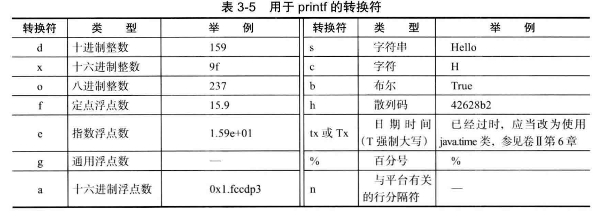
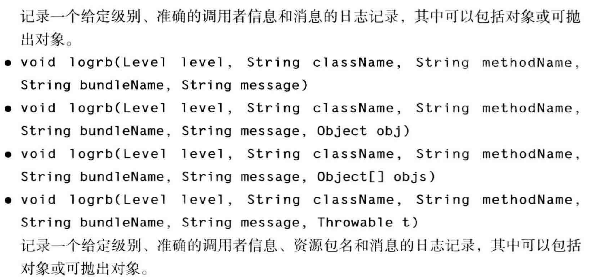
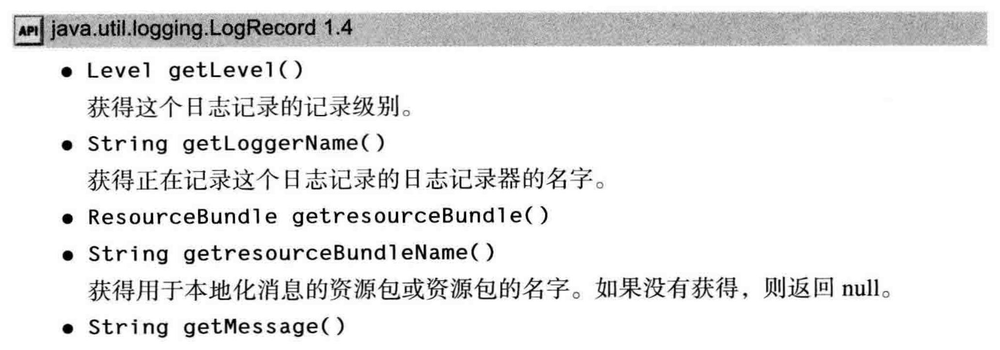
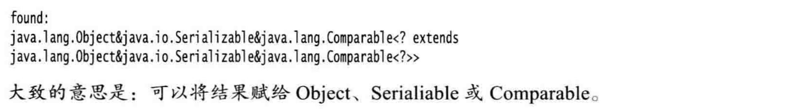
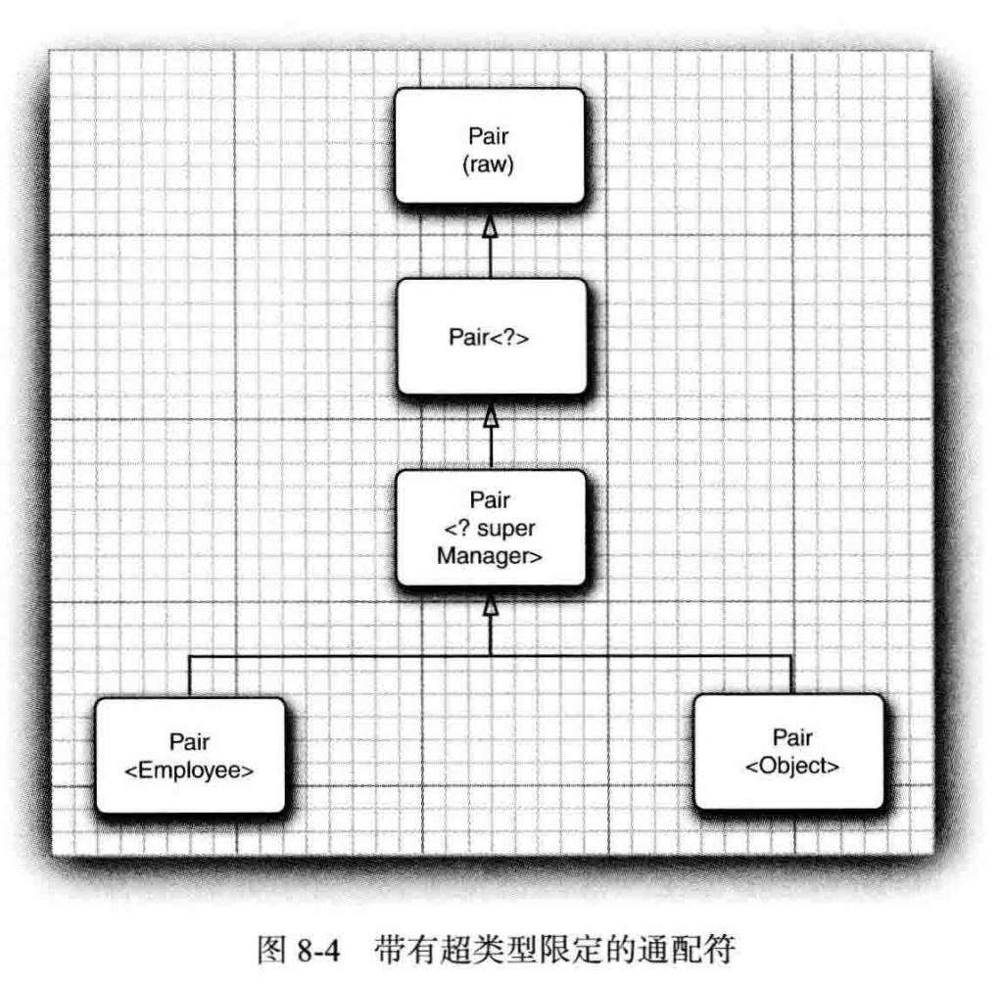

[TOC]


# 第三章 Java的基本程序设计结构

## 3.1 一个简单的java应用程序

```java
public Class Test
{
	public static void main(String[] args)
    {
		System.out.print("Hello,world!");
    }
}
```

要在命令行中运行此代码，需要输入以下命令：

```dos
javac Test.java
java Test
```

​		javac命令是编译java文件为可执行的 .class 文件

​		java命令是运行 .class 文件，所以不用加后缀

**注意：**

  1. Java中所有的函数都属于某个类的方法，因此，Java中的main方法必须有一个外壳类；

  2. 该java文件的命名必须和代码中public class的命名一致，比如这里必须是Test，否则无法编译通过；

  3. 如果采用命令行的方式编译并运行java代码，需要注意字符串中的编码格式，可以以情况设置；

  4. 因为java区分大小写，所以注意代码大小写；

  5. java类名一般采用首字母大写，多个单词采用驼峰命名法；

  6. 所有语言都中英文敏感，所以逗号，分号，括号等注意中英文；

  7. 如果直接用idea打开这个java代码，无法运行，左下角有黄色 J 警告标志，这是因为没有设置output的路径，无法编译；解决方法如下：

     1. 先移除右边的出问题的java代码，然后再将有问题的代码加上**Sources**

        

     2. 在Modules设置path里勾选”Inherit project compilepath” ，如果已经勾选则不管它

        

     3. 设置Project中的”Project compiler output”，路径设置为你的项目下的out文件夹，这个文件夹是用来存储编译后的 .class 文件

        

## 3.2 注释

总共三种注释方法，如下：

1. //用于简单的注释，一般用于单行或者比较少行的注释；
2. /* 这是一段注释 */ 一般用于较长的注释；
3. /** 这是一段注释 */ 可以用来生成javadoc文档，可用在下面几个方面：
   1. 包
   2. 公有类与接口
   3. 公有的和受保护的构造器和方法
   4. 公有的和受保护的域

```java
/**
 * 学生类 Student
 */
public class Student
{
    //姓名
	private String name;
    
    //年龄
    private int age;
    
    //性别
    private String sex;
    
    /**
     * 构造函数，用给定参数构造一个Student对象
     * @param name	姓名
     * @param age	年龄
     * @param sex	性别
     */
    public Student(String name, int age, String sex)
    {
		this.name = name;
        this.age = age;
        this.sex = sex;
    }
    
	/**
     * 得到Student对象的name
     * @return	Student对象的name
     */
    private String getName()
    {
		return name;
    }
}


```

**具体内容可参看《java核心计数卷Ⅰ》p140**

## 3.3 数据类型

**分类：八大基本数据类型+引用类型：**

1. 4整型：
   1. byte（8位1字节）范围 -2^7——2^7-1，默认0
   2. short（16位2字节）范围 -2^15——2^15-1，默认0
   3. int（32位4字节）范围 -2^31——2^31-1，默认0 （最常用）
   4. long（64位8字节）范围 -2^63——2^63-1，默认0l
2. 2浮点：
   1. float（32位4字节）默认：0.0f 必须标注f
   2. double（64位8字节）默认：0.0d或省略0.0 （最常用）

3. 1字符：
   1. char（16位2字节）默认' '，为空，因为采用unicode编码
4. 1布尔
   1. boolean（只有true和false两种取值）默认为false

5. 引用
   1. 比如像String类一样的其他用户自定义类或者java自带类，**默认为null**

**注意：**

1. 基本数据据类型有对应的BigNumber，其为Java对象，可以表示任意精度；

2. java中整型值不能和布尔值进行相互转换，c++中可以互相转换；

3. 从Java7开始，加上前缀0b或者0B可以表示二进制数；还可以在字面量比如整型数隔三加下划线"__"，java编译器会除去这些下划线；

4. 浮点数值计算可能存在出乎意料的误差，这是由于浮点数是由二进制系统表示的，所以在金融计算中不能使用浮点类型，而应该使用BigDecimal类；

5. 浮点型表示溢出和出错情况的三种特殊的浮点数值：

   - 正无穷大
   - 负无穷大
   - NaN（不是一个数字）

   对应的Java中的表示为：

   - Double.POSITIVE_INFINITY
   - Double.NEGATIVE_INFINITY
   - Double.NaN

   检测一个特定值为非数值采取下面这种方法：

   ```java
   	if（Double.isNaN(x)）	//检查x是否是非数值
   ```

## 3.4 变量

1. java不像c++一样区分变量的声明和定义，但是java中变量必须被初始化赋值；

2. 变量名一般采取小写驼峰命名法，常量一般采用全大写；

3. 使用final关键字指示常量，static final 指示类常量，定义在main方法之外，常用的定义和使用方式如下：

   ```java
   	public static final PI = 3.1415926;		
   	int a = Math.PI;		//因为PI常量定义在Math类中
   ```

## 3.5 运算符

1. +，-，*，/，%

2. Math函数当中的数学方法，常用方法如下：

   - Math.sqrt(x);		//对x开根号 
   - Math.pow(x,a);    //求x的a次方
   - Math.abs(x);        //对x求绝对值
   - Math.ceil(x);        //x向上取整
   - Math.floor(x);     //x向下取整
   - Math.round(x);    //对x四舍五入，返回结果类型为long
   - Math.PI;                //∏=3.14159265358979323846
   - Math.E;                  //e=2.7182818284590452354

3. floorMod，floorDiv

4. **注意**，在Math类中，为了达到最快的性能，所有的方法都使用计算机中的浮点运算，所以会导致有时计算不准确；**但是如果结果的准确性更加重要的话**，那么就应该使用StrictMath类，才能得到准确的运算结果；

5. 类型转换：

   1. 小范围 -> 大范围：结果准确，自动转换类型
   2. 大范围 -> 小范围：结果可能不准确，需要强制类型转换

   （将浮点型转换为整型的话，是通过截断小数部分，所以会造成信息丢失）

6. 自增与自减：

   ```java
   int a =b =2 ;
   int temp1 = ++a;	//此时a=3，temp=3；因为前自增先进行a的其他运算，再进行自增运算；（前缀自增）
   int temp2 = b++;	//此时b=3，temp=2；因为后自增先进行自增，再进行其它运算；（后缀自增）
   ```

7. 位运算符与关系运算符

   位运算符：&，|，^，~

   条件运算符：&&，||，!，>，<，>=，<=，=

8. 括号和运算符级别：

   《Java核心技术卷Ⅰ》p44表3-4

9. 枚举类型：

   如果没有对枚举赋值，则按顺序依次被初始化为0，1，2,....,n

   例子：

   ```java
   	enum Size{SAMLL,MEDIUM,LAGGE,EXTRA_LARGE};
   	Size s = Size.LARGE;
   ```

10. instanceof ：

    判断一个对象是否是一个类的实例

## 3.6 字符串

### 3.7.1 基础知识

1. String和StingBuilder的API文档

2. Java没有内置的字符串类型，而是在标准Java类库中提供了一个预定义类——String，每个用双引号括起来的字符串都是String类的一个实例。

3. String类的subString（）方法可以得到一个字符串的子串，得到的子串即使内容和另外一个字符串内容相同，但是`==`得到的使false，不过使用equals方法得到的还是true，所以字符串的比较不能用`==`，必须用equals方法。

   ```java
   String s = "abcd";
   //普通方法，接受两个整型，得到s中下标从0到2的子串，包括0不包括2
   String temp1 = s.subString(0,2);	//temp1 = "ab"
   //接受一个整型，得到从该下标到结尾的子串
   String temp2 = s.subString(1);		//temp2 = "bcd"
   ```

4. 拼接，String对象可以互相拼接，使用`+`连接，拼接得到的字符串又是一个新的String实例；字符串和非字符串的值进行拼接，会将后者转换成字符串（即，任何一个java对象都可以转换成字符串）；
   如果需要把多个字符串放在一起，并用一个分隔符分开，可以使用join方法

   ```java
   String lal = String.join("/", "S", "M", "L");
   System.out.println(lal);
   //得到；S/M/L
   ```

5. String为不可变字符串，如果修改字符串就只能使用拼接，这样会造成性能低下，不过String被设计为如此不让修改，如果想要高效地实现修改字符串，可以使用StringBuilder，不可变字符串的优点：编译器可以让字符串共享；

6. java中的字符串不像c++中一样等于一个char数组，而是类似于char*指针，**因为java有自动垃圾回收机制**，所以尽管是将字符串放置在堆内存中，但是程序员可以不用管它，虚拟机会自动回收垃圾。

7. **检测字符串是否相等**：

   1. 想要监测两个字符串是否相等，而不区分大小写，可以使用equalsIgnoreCase方法；
   2. **必须使用`equals`方法，不能使用`==`；**

   ​	如果比较的是两个值相同的String类型字符串用“==“结果为true，这是因为String字符串是共享的；如果换	成”+“或者substring，得到的字符串不是共享的，即使值相同，结果也会是false；

   ​	（上面的内容是《java核心技术卷一》当中的内容，但是在IDEA中发现使用“+”连接的字符串仍旧相等，只有使用substring结果是false，结果如下：）

   ```java
    public static void main(String[] args) {
           System.out.println("\"abc\".equals(\"abc\")" + "：" + "abc".equals("abc"));
           System.out.println("\"abc\".equals(\"a\" + \"b\" + \"c\")" + "：" + "abc".equals("a" + "b" + "c"));
           System.out.println("\"abc\".equals(\"abcd\".substring(0,3))" + "：" + "abc".equals("abcd".substring(0, 3)));
           System.out.println("\"abc\" == \"abc\"" + "：" + ("abc" == "abc"));
           System.out.println("\"abc\"==(\"a\"+\"b\"+\"c\")" + "：" + ("abc" == ("a" + "b" + "c")));
           System.out.println("\"abc\" == \"abcd\".substring(0, 3)" + "：" + ("abc" == "abcd".substring(0, 3)));
       }
   ```

   ```
   //结果
   "abc".equals("abc")：true
   "abc".equals("a" + "b" + "c")：true
   "abc".equals("abcd".substring(0,3))：true
   "abc" == "abc"：true
   "abc"==("a"+"b"+"c")：true
   "abc" == "abcd".substring(0, 3)：false
   ```

8. 空串与Null串

   1. 空串判断：

      ```java
      	if(str.length() == 0)	//法一
          if(str.equals(""))		//法二
      ```

   2. Null串判断

      ```java
      	if(str == null)
      ```

   3. **两种都需要判断（&&采用短路判断方式，必须要首先检查str不为Null，因为在null值上调用方法会出现错误）**

      ```java
      	if(str != null && str.length() != 0)	
      ```

9. 码点与代码单元：大多数常用的Unicode字符使用一个代码单元就可以表示，而辅助字符需要一对代码单元表示，如使用 UTF-16 编码表示字符⑪(U+1D546) 需要两个代码单元。调用 char ch = sentence.charAt(l) 返回的不是一个空格，而是⑪的第二个代码单元。为了避免这个问题， 不要使用 char 类型。 这太底层了。；

   **注意，length方法得到的是代码单元的数量。**

   码点即是字符的Unicode编码，如a的码点为为97；码点可以通过s.codePointAt方法得到，也可以通过字符强转为int类型得到，但是一种更方便得到码点的方法是使用codePoints方法

   ```java
   String s = "abcd";
   int[] co = s.codePoints().toArray();
   System.out.println(Arrays.toString(co));
   //输出：[97, 98, 99, 100]
   ```

   反之，将一个码点数组转换为一个字符串，可以使用构造函数

   ```java
   String str = new String(codePoints,0,codePoints.length);
   ```

   

10. **使用可变长度的字符串的两个类**：（对象的值能进行多次修改，而且不产生新的未使用对象） 

   1. StringBuilder：用于**单线程**中编辑，**线程不安全（不能同步访问），但是速度快**
   2. StringBuffer：用于**多线程**，**线程安全，但速度较之较慢**

   （两种类的API是相同的，但是单线程中StringBuilder的效率更高）

   面试题：

   **JAVA 中的 StringBuilder 和 StringBuffer 适用的场景是什么？**

   最简单的回答是，stringbuffer 基本没有适用场景，你应该在所有的情况下选择使用 stringbuiler，除非你真的遇到了一个需要线程安全的场景，如果遇到了，请务必在这里留言通知我。

   然后，补充一点，关于线程安全，即使你真的遇到了这样的场景，很不幸的是，恐怕你仍然有 99.99....99% 的情况下没有必要选择 stringbuffer，因为 stringbuffer 的线程安全，仅仅是保证 jvm 不抛出异常顺利的往下执行而已，它可不保证逻辑正确和调用顺序正确。大多数时候，我们需要的不仅仅是线程安全，而是锁。

   最后，为什么会有 stringbuffer 的存在，如果真的没有价值，为什么 jdk 会提供这个类？答案太简单了，因为最早是没有 stringbuilder 的，sun 的人不知处于何种愚蠢的考虑，决定让 stringbuffer 是线程安全的，然后大约 10 年之后，人们终于意识到这是一个多么愚蠢的决定，意识到在这 10 年之中这个愚蠢的决定为 java 运行速度慢这样的流言贡献了多大的力量，于是，在 jdk1.5 的时候，终于决定提供一个非线程安全的 stringbuffer 实现，并命名为 stringbuilder。顺便，javac 好像大概也是从这个版本开始，把所有用加号连接的 String 运算都隐式的改写成 stringbuilder，也就是说，从 jdk1.5 开始，用加号拼接字符串已经没有任何性能损失了。

   如诸多评论所指出的，我上面说，"用加号拼接字符串已经没有任何性能损失了"并不严谨，严格的说，如果没有循环的情况下，单行用加号拼接字符串是没有性能损失的，java 编译器会隐式的替换成 stringbuilder，但在有循环的情况下，编译器没法做到足够智能的替换，仍然会有不必要的性能损耗，因此，用循环拼接字符串的时候，还是老老实实的用 stringbuilder 吧。

### 3.7.2 格式化

1. 格式化输出可以使用System.out.printf，而如果用字符串存储，可以使用format方法。

   ```java
   String name = "luis";
   int age = 20;
   String s = String.format("Hello, %s. Next year, you'll be %d",name,age);
   ```

2. printf转换符
   

3. 用于printf的标志
   

4. 基于完整性的考虑， 下面简略地介绍 printf方法中日期与时间的格式化选项。在新代码中， 应当使用卷 II 第 6 章中介绍的 java.time 包的方法。 不过你可能会在遗留代码中看到 Date 类和相关的格式化选项。格式包括两个字母， 以 t 开始， 以表中的任意字母结束。

   

   如下代码：

   ```java
   System.out.printf("%tc",new Date());
   //输出：周三 11月 25 15:51:38 CST 2020
   ```

5. 从表 3-7 可以看到， 某些格式只给出了指定 丨期的部分信息 t 。例如， 只有 FI 期 或 月 份 如 果需要多次对口期操作才能实现对每一部分进行格式化的 Q 的就太笨拙了为此， 可以采用一 个格式化的字符串指出要被格式化的参数索引。索引必须紧跟在 ％ 后面， 并以 $ 终止。 例如（提示，参数索引是从1开始），

   ```java
   System.out.printf("l$s %2$tB %2$te, %2$tY", "Due date:", new DateQ);
   //打印：Due date: February 9, 2015 
   ```

    还可以选择使用 < 标志它指示前而格式说明中的参数将被再次使用。也就是说， 下列 语句将产生与前面语句同样的输出结果： 

   ```java
   System.out .printf("%s %tB %<te, %<tY", "Due date:", new DateO);
   ```

   

## 3.7 输入输出

1. 在控制台的简单输入输出:

   1. 控制台输出：

      ```java
      	System.out.print("输出信息1");	//输出内容后，接下来的内容紧跟该输出内容后
      	System.out.println("输出信息2");	//输出内容后换行，常用作无参，表示空一行
      	System.out.prnitf("%8.2f",x);	//格式化输出，更多内容参看《Java核心技术卷Ⅰ》p58，或者菜鸟教程JAVA
      	（每一个以%字符开始的格式说明符都用相应的参数替换）
      ```

   2. 控制台输入（调用Scanner类进行输入）：

      ```java
      	Scanner in = new Scanner(System.in);
      	in.nextInt; 		//in.nextDouble,in.nextLine,常用方法参看p57页Scanner类
      ```

      需要知道的是：in.next读取的是一段不包括空格的字符串，而不是一个字符；

      ```java
      	public static void main(String[] args) {
              Scanner in = new Scanner(System.in);
              ArrayList<String> arrayList = new ArrayList<>();
              while (!in.hasNext("exit")) {
                  arrayList.add(in.next());
              }
              for (String a : arrayList) {
                  System.out.println(a);
              }
          }
      //输入：（注意exit也必须是一个next，所以不能包含其他字符）
      我是1号 我是2号 我是3号，这是附加内容 exit
      //输出：
      我是1号
      我是2号
      我是3号，这是附加内容
      ```

      使用Console类进行控制台输入不可见的输入：

      > 注意：
      >
      > 1. 这个在输入密码的时候不是全是***，而是完全不可见的状态
      > 2. Console这个类在IDEA等编译器下不能使用，会报空指针错误；在我尝试下，目前我知道的是在Windows的Power Shell下可以编译并运行
      >
      > 

      ```java
          public static void main(String[] args) {
              Console console = System.console();
              String name = console.readLine("Name:");
              char[] password = console.readPassword("Password:");
              System.out.println();
              
              System.out.println("Name:"+name);
              System.out.print("Password:");
              for (char aPassword : password) {
                  System.out.print(aPassword);
              }
          }
      ```

2. 文件输入和输出（更常用的方法应该是IO流中的工具类）

   1. 如果对文件进行读取，需要一个用File对象构造一个Scanner对象，如下所示

   ```java
   	Scanner in = new Scanner(Paths.get("myfile.txt"),"UTF-8");
   	//如果文件名中包含反斜杠，记住每个反斜杠之前再加一个额外的反斜杠
   
   	//注意：如果使用下面这种方式，则Scanner将字符串解释为数据，而不是文件名	
   	Scanner in = new Scanner("myfile.txt"); 
   ```

   > 注释： 在这里指定了 UTF-8 字符编码， 这对于互联网上的文件很常见（不过并不是普遍 适用）。读取一个文本文件时，要知道它的字符编码—更多信息参见卷 n 第 2 章。如果 省略字符编码， 则会使用运行这个 Java 程序的机器的“ 默认编码”。 这不是一个好主意， 如果在不同的机器上运行这个程序， 可能会有不同的表现。

   2. 如果写入文件，需要构造一个PrintWriter对象，如下所示

   ```java
   	PrintWriter out = new PrintWriter("myfile.txt"，"UTF-8");
   	//如果文件不存在，则创建该文件，和Scanner不同
   ```

   注意：

    1. 在IDE中启动路径由IDE控制，得到路径位置用下面语句

       ```java
       	String dir = System.getProperty("user.dir");
       ```

   2. 定位文件可以使用相对路径和绝对路径，如果觉得定位文件位置比较烦恼，可以使用绝对路径,例如：“ c:\\mydirectory\\ myfile.txt ” 或者“ /home/me/mydirectory/myfile.txt” 、

   3. 如果文件名中包含反斜杠符号，就要记住在每个反斜杠之前再加一个**额外的反斜杠**

   4. **如果用一个不存在的文件构造一个Scanner进行文件读取，或者用一个不能被创建的文件名构造一个PrintWriter，那么就会发生异常，而且Java编译器认为这些异常比”被0除“更严重，所以我们需要在方法中用throw子句标记，如下所示：**

      ```java
      public static void main(String[] args) throw IOException
      {
          //假如”myfile.txt“不存在
      	Scanner in = new Scanner(Pahts.get("myfile.txt"),"UTF-8");
          ...
      }
      ```

    5. 可以构造一个只带有一个字符串参数的Scannner，但是这个Scannner将字符串解释为数据，而不是文件名。

    6. 当使用命令行方式启动一个程序时，可以利用Shell的重定向语法将任意文件关联到System.in和System.out，这样就不必担心处理IOException异常了

       ```powershell
       	java MyProgram <myfile.txt> output.txt
       ```

## 3.8 控制流程

### 3.8.1 块作用域

1. 由一对大括号括起来的若干条简单语句叫块；
2. 块可以嵌套，但是不能在嵌套的两个块中声明同名的变量；（注：在c++中在嵌套的语句中重定义一个变量，内层定义的变量会覆盖外层定义的变量，java认为这样可能会导致程序设计错误，因此不允许这样做）
3. 块中定义的变量一般生命周期只覆盖该块及其嵌套的子块，除非是常量和类变量；

### 3.8.2 条件语句

1. if-else

### 3.8.3 循环

1. while语句

2. do-while语句

3. break；分为带标签和不带标签的写法，不带标签的会跳出当前循环，而带标签的会跳过标签下的循环语句；break只能跳出循环，不能跳进循环；

   ```java
   int counter = 0;
   read_data:
   while(true){
       counter++;
   	for(int i=0;i<10;i++){
           counter++;
           if(counter == 4){
               break read_data;
               //跳出while循环
           }
       }
   }
   ```

4. continue；直接开始下一次循环；

### 3.8.4 确定循环

1. for循环

2. 注意：for循环使用浮点数的时候需要注意，由于0.1无法精确地用二进制表示，所以可能由于舍入的误差，最终得到到精确值，程序可能永远不会结束。

3. 计算从n个数字中随机抽取k个数字，使用如下方法:

   ```java
   int lotteryOdds = 1;
   for(int i=0; i<k; i++)
   {
   	lotteryOdds = lotteryOdds * (n-i+1)/i;
   }
   ```

4. for each循环：依次处理数组中的每个元素，而不必为指定下标值而分心（其实是迭代器Iterator的实现）

   ```java
   	for(变量 : 集合/实现了Iterable接口的类对象)
       {
   		statement;
           ...
       }
   	//例如：
   	for(int element ; a)
       {
   		System.out.println(element);
       }
   	
   ```

   我们知道了可以用循环语句来进行打印数组内容，这里还有一种更方便的方式，采用java.util包内的Arrays类中的toString方法，即可返回一个包含数组元素的字符串，这些元素被放置在括号内，用逗号分隔（针对基本数据类型数组或者多重数组，有一个toString（Object[]）的方法，但是只会输出引用对象的地址

   ```java
   	int[] a= {2,5,8,6};
   	System.out.println(Arrays.toString(a));
   	//输出：[2,5,8,6]
   ```

### 3.8.5 多重选择：switch语句

```java
	//例子
	Scanner in = new Scanner(System.in);
	System.out.println("请输入一个选项：1，2，3/n");
	int choice = in.nextInt();
	switch(choice)
    {
        case 1:
            ...;
            break;
        case 2:
            ...;
            break;
        case 3:
            ...;
            break;
        default:
            ...;
            break;
    }
```

注意：

1. 特别注意break的书写，如果不添加break，程序就会一直执行后面的case语句，例如，都不写break，如果输入1，则程序会执行case1，2，3，default的语句内容。
2. case标签可以是**char、byte、short或int的常量表达式或者其包装类，枚举常量**，从java SE 7 开始，还可以是字符串字面量String，其他的数据类型不支持，**所以浮点类型也是不支持的**；

## 3.9 大数值

1. 由于基本的整型和浮点型数据类型不能够满足需求，所以可以使用java.math包中的两个类：

   **BigInteger，BigDecimal**

   可以处理任意长度数字序列的数值

2. 可以使用静态的valueOf方法将普通的数值转换为大数值：

   ```java
   	BigInteger a = BigInteger.valueOf(100);
   ```

3. 不能使用人们熟悉的（+，-，*，/，%）操作符，因为是自定义的类，需要使用对应的方法进行运算；

4. 常用的BigInteger构造方法：

   ```java
   BigInteger a = new BigInteger("111");
   BigInteger b = BigInteger.valueOf(1);
   ```

   

## 3.10 数组

数组中常用使用方式如下：

```java
	int[] a;	//声明一个整型数组a
	int[] a = new int[10];	//实例化一个长度为10的整型数组
	int[] b = {1，5，6，4，4};	//或采取这种方式实例化，不需要用到new
	int[] b = new int[]{1，5，6，4，4};	//也可以加上new操作
	System.out.println(a.length);	//得到数组的长度
```

1. 创建一个数组后，如果没有初始化数组中的值，会自动初始化为默认值：整型为0，浮点型为0.0，char为空，布尔型为false，String及其他引用类型为null；
2. 一旦创建了数组，就不能再改变它的长度，如果需要再运行过程中改变数组长度，需要用到另外一种数据结构----数组列表（ArrayList）；
3. 数组的输出可以使用循环遍历，也可以使用java.util包中的Arrays类中的toString方法：Arrays.toString()；
4. 匿名数组
5. 在java中，允许数组长度为0。注意，数组长度为0

### 3.10.1 数组和字符串的相互转换

1. 基本类型转字符串：

   1. 使用Arrays.toString()方法，得到的字符串为中括号括起，中间逗号隔开，**此方法对所有基本数据类型甚至是String或者其他自定义引用类型都适用**，的如：[1,2,3]
   2. 如果是多维数组，则使用Arrays.deepToString()方法
   3. 使用StringBuffer或者StringBuilder类，利用循环来构造字符串，不推荐使用String来构造，因为String为不可变字符，将数组中元素依次进String中，每一次都会产生新的字符串，空间消耗大（虽然我们知道一条比较短的使用“+”连接的String字符串在jdk1.5之后会被默认的转化为StringBuilder，几乎没有什么损耗，但是在循环的时候，如果你仍旧使用“+”来修改String，那对内存的损耗是巨大的）

2. 字符串转基本类型数组（只能转换为char数组）：

   1. 使用String类的toCharArray（）方法，一行代码解决

   2. 使用StringBuffer或者StringBuilder类，通过循环赋值到新建char数值中。

   3. 每一个基本类型的包装类都有一个将指定字符串转为该包装类的方法，如

      ```java
      String a = "123";
      int num = Integer.parseInt(a);
      System.out.println(num + 3);	
      //输出：
      126
      ```

> 具体代码内容，参看Chapter3 / 3.10 / ExchangeTest

### 3.10.2 数组拷贝

1. 在java中，允许将一个数组变量拷贝给另一个数组变量，这时，两个变量将引用同一个数组（浅拷贝）

2. 如果要将一个数组的所有值拷贝到一个新的数组中去，可以使用Arrays类的copyOf方法（深拷贝）

   **注意：c++中深拷贝是使用new操作符即可，java中使用new操作符再进行拷贝，会提示多余；java中实现深拷贝使用Arrays.copyOf()方法（适用于所有基本类型和引用类型数组），或者你直接自己实现，创建新的同类型数组变量然后循环赋值**

3. 注意：java中的数组相当于c++中的指针，但是不能使用a++得到下一个元素（c++可以通过直接地址++得到下一位）

### 3.10.3 java.util.Arrays

这里简单提一下Arrays常用的API

```java
	1. static String toString(T[] a){}
		//返回a数组中所有数据元素的字符串，这些数据元素被放在[]中，用逗号分隔
		//对所有基本数据类型和和String适用，对其他自定义类不适用，只会输出其地址
	2. static T copyOf(T[] a, int length){}
	3. static T copyOf(T[] a, int start, int end){}
		//start	起始下标（包含这个值）
		//end	终止下标（不包含这个值）
		//适用于所有数据类型和引用类型的数组
	4. static void sort(T[] a){}
		//采用优化的快速排序对数组进行排序
	5. static int binarySearch(T[] a, T tag){}
	6. static int binarySearch(T[] a, int start, int end, T tag){}
		//采用二分查找查找tag，查找成功给出下标，否则返回一个负数
	7. static void fill(T[] a, T v){}
		//将数组的所有元素设置为v
	8. static boolean equals(T[] a, T[] b)
```

### 3.10.4 多维数组

1. 一般常用是二维数组（矩阵），其他多维几乎用不到

2. 二维数组声明方法

   ```java
   	int[][] a = new int[2][3];
   	
   	int[][] b = {
           {1,2,3,4},
           {2,5,9,6}
       };
   ```

3. 二维数组的处理（使用双重for循环）

   ```java
   		for (int i = 0; i < a.length; i++) {
               for (int j = 0; j < a[i].length; j++) {
                   ...
                   ...
               }
           }
   ```

4. for each循环语句不能自动处理二维数组的每一个元素，要访问二维数组所有元素，如下：

   ```java
   		for (int[] row : a) {
               for (int[] value : row) {
                   do someting with value
               }
           }	
   ```

5. 要想快速打印一个二维数组列表，可以调用**Arrays.deepToString（）**

### 3.10.5 不规则数组

1. 注意：虽然看起来java中的数组和其他语言差别不大，但是java实际上没有多维数组，只有一维数组，多维数组被解释为“**数组的数组**”。

   > 代码参看 Chapter / 3.10 / LotterArray


# 第四章 对象与类

## 4.1 面向对象程序设计概述

1. 明白OOP的概念，在OOP中，数据放在第一位，然后再考虑操作数据的算法；

### 4.1.1 类

1. 由类构造对象（construct）的过程称为 **创建类的实例**
2. 封装是与对象有关的一个重要概念。实现封装的关键在于绝对不能让类中的方法直接地访问其他类的实例域，即在类的设计中，一般情况下**实例域用private修饰，方法用public修饰**
3. 通过扩展一个类来建立另外一个类的过程称为继承（inheritance），所有类都继承自一个超类——Object；

### 4.1.2 对象

通过下面对象的三个特性来运用OOP：

- 对象的行为（behavior）——可以对对象施加哪些操作，或可以对对象施加哪些方法？
- 对象的装填（state）——当施加那些方法时，对象如何响应？
- 对象标识（identity）——如何辨别具有相同行为与状态的不同对象？

### 4.1.3 识别类

面向过程的语言从main函数开始编写程序

面向对象的语言从设计类开始，然后再往每个类中添加方法，最后在main函数中调用

### 4.1.4 类之间的关系

类之间常见的关系有：

- 依赖（“uses-a”）：如果一个类的方法操作另一个类的对象（应该尽可能将相互依赖的类减至最少，即降低耦合）
- 聚合（“has-a”）：一个类A中包含另一个类B的对象
- 继承（“is-a”）：类B继承类A，则类B包含A的所有方法，还包含B中自己扩展的方法

1. 通常用UML绘制类图（可参看P94，或者自行搜索）

## 4.2 使用预定义类

### 4.2.1 对象与对象变量

要想使用对象，就必须首先构造对象，并指定其初始状态。然后，让对象使用方法。

java使用构造器来构造新实例，用来构造并初始化对象，如：

```java
	System.out.println(new Date());
	Date date = new Date();
```

1. 注意：一个对象变量并没有实际包含一个对象，而仅仅引用一个对象，必须初始化对象变量（即new操作，会给变量分配地址，也可以赋值为null，表示没有地址指向，）

   ```java
   	Date d;	//对象变量
   	Date a = new Date();
   
   	//初始化方法
   	d = new Date();		//动态构造，使用new
   	d = Date.；			//静态构造，工厂方法
       d = a;				//引用已初始化对象
   	d = null;			//表示这个对象变量目前没有引用任何变量
   ```

2. 在java中，任何对象变量的值都是对存储在另外一个地方的一个对象的引用，new操作符的返回值也是一个引用

3. 如果将一个方法应用于一个值为null的对象上，那么就会产生运行时错误，**注意：赋值为null之后绝对不能再调用方法，因为是在null上调用方法，所以会报空指针java.lang.NullPointerException**

4. java对象变量与c++中的对象指针类似，所有的java对象都存储在堆中，在c++中，指针运算容易造成内存溢出，但是在java中不存在，在java中如果使用一个没有初始化的指针，运行系统将会产生一个运行时错误，而不是生成一个随机的结果，同时不必担心内存管理问题，垃圾回收机制将处理相关事宜。

### 4.2.2 Java类库中的LocalDate类

1. Date类介绍（java.util.Date）：时间是距离UTC时间（与格林威治标准时间一样1970年1月1日00：00：00）的毫秒数（可正可负），这个点称为纪元（epoch）。**缺点：Date提供的日期处理并没有太大的用途，而且无法表示阴历和其他比如火星历**

2. LocalDate类介绍（java.time.LocalDate）：用来表示日历表示法，**构造LocalDate类必须使用静态工厂方法，不能使用构造器来构造其对象**，有以下两种构造方式：

   ```java
   	LocalDate now = LocalDate.now();
   	LocalDate now1 = LocalDate.of(2020, 12, 21);
   ```

3. 常用API:

   ```java
   	static LocalDate now();
   	static LocalDate of(int year, int month, int day);
   	LocalDate plusDays(int n);
   	LocalDate minusDays(int n);
   	int getYear();
   	int getMonthValue();
    	int getDayOfMonth();
   	DayOfWeek getDayOfWeek();
   ```

### 4.2.3 更改器方法与访问器方法

1. 更改器方法：调用此方法后，对象的状态会发生改变
2. 访问器方法：只访问对象，不修改对象的方法

> CalendarTest程序，代码参看Chapter4 / src / Unit4_1

## 4.3 用户自定义类

### 4.3.1 自定义Employee类

java中，最简单的类定义如下：

```java
class ClassName
{
	field_1;
    field_2;
    ...
        
    constructor_1;
    constructor_2;
    ...;
    
    method_1;
    method_2;
    ...
}
```

下面介绍一个非常简单的Employee类：

（在IDEA里面，可以使用**Alt+Insert**键快速选择构建构造函数和getter和setter方法）

```java
public class Employee {
    //instance fields   实例域
    private String name;
    private double salary;
    private LocalDate hireDay;

    //constructors  构造函数
    public Employee(String name, double salary, int year, int month, int day) {
        this.name = name;
        this.salary = salary;
        this.hireDay = LocalDate.of(year, month, day);
    }
    //无参构造函数
    public Employee() { }

    //methods   方法
    public String getName() {
        return name;
    }

    public void setName(String name) {
        this.name = name;
    }

    public double getSalary() {
        return salary;
    }

    public void setSalary(double salary) {
        this.salary = salary;
    }

    public LocalDate getHireDay() {
        return hireDay;
    }

    public void setHireDay(LocalDate hireDay) {
        this.hireDay = hireDay;
    }
    public static void main(String[] args) {
        Employee[] staffs = new Employee[3];
        staffs[0] = new Employee("1号", 2000, 2000, 12, 20);
        staffs[1] = new Employee("2号", 2000, 2000, 12, 20);
        staffs[2] = new Employee("3号", 2000, 2000, 12, 20);

        for (Employee e : staffs) {
            System.out.println("name = " + e.getName() + " , salary = " + e.getSalary()
                    + " , hireDay = " + e.getHireDay());
        }
    }
}
```

1. 如果将不带public修饰Employee类和带public修饰的EmployeeTest类（包含main函数）放在一个java文件中，javac之后会产生Employee.class和EmployeeTest.class两个文件，之后再使用字节码解释器运行带main函数的.class文件：java EmployeeTest

### 4.3.2 多个源文件的使用

一般大的工程，是会将单个类和主要的main函数分开的，即放置在不同的java文件中。但是整个工程项目只有一个main函数入口，其他单个的类可以使用main函数，但是只是充当单个类的测试。

一个工程如果其main函数入口的java文件为EmployeeTest.java，当使用javac命令进行编译EmployeeTest.java时，会自动也编译里面使用的Employee.java文件。

> 注意：规范的文件使用方式是**一个java源文件只存放一个类**

### 4.3.3 剖析Employee类

1. 实例域一般强烈建议设置为**private**，因为需要实现封装，如果使用public，其他类可以直接访问和修改该类的实例域数据，这是不安全的，破坏了封装性；
2. 方法一般设置为**public**，意味着任何类的任何方法都可以调用这些方法；

### 4.3.4 从构造器开始

1. 构造器可以重载，即构造器可以使用不同参数列表实现不同功能来构造对象；

2. 构造器与其他方法有一个重要的不同：构造器总是伴随着new操作符的执行被调用，而不能对一个已经存在的对象调用构造器来达到重新设置实例域的目的，例如：

   ```java
   	james.Employee("James",200000,,2000,6,12);	//将会产生编译错误
   ```

3. 需要记住如下几点：

   - 构造器与类同名
   - 每个类可以有一个以上的构造器
   - 构造器可以有0，1或多个参数
   - 构造器没有返回值
   - 构造器总是伴随着new操作一起调用

4. 注意：java构造对象是在堆中构建的，类似c++堆上创建指针对象，必须使用new，c++程序员最容易将new遗忘掉；

5. 不要在构造器中定义与实例域重名的局部变量（但是构造器传入的参数一般习惯和实例域命名一致，如下）。

   ```java
   public class Student
   {
   	private String name;
       private String number;
       
       public Student(String name, String number)
       {
           this.name = name;
           this.number = number;
       }
   }
   ```

   

### 4.3.5 隐式参数与显式参数

1. 隐式参数：调用方法的类对象（在一个类中，每个方法的隐式参数为**this**）

2. 显式参数：方法名后面括号中的数值

   ```java
   	//隐式参数：james
   	//显式参数：5
   	james.rasieSalary(5);
   ```

3. 在c++中，类方法在类外部定义，如果在类内部定义方法，这个方法将被自动设置为内联（inline）方法；

   在java中，所有的方法都必须在类的内部定义，但并不表示他们是内联（inline）方法。是否将某个方法设置为内联方法是Java虚拟机的任务。即时编译器会监视调用那些简洁、经常被调用、没有被重载以及可优化的方法。

### 4.3.6 封装的优点

在java中，使用封装屏蔽了类的具体实现，使得类的数据更加安全

java中的类一般需要提供以下三项内容：

- 私有的数据域
- 公有的域访问器方法（getter）
- 公有的域更改器方法（setter）

好处:

1. 可以改变类的内部实现，除了该类的方法外，不会影响其他代码
2. 更改器方法可以执行错误检查，然而直接对域进行赋值将不会进行这些处理，听起来就很糟糕

> **!!!警告：**不要编写返回引用可变对象的访问器方法，如果需要返回一个可变对象的引用，首先应该对它进行clone（）。具体内容参看P110

### 4.3.7 基于类的访问权限

从前面已经知道，方法可以访问所调用对象的私有数据。一个方法可以访问所属类的所有对象的私有数据（这里需要注意以下普通变量和static变量的区别）

### 4.3.8 私有方法

1. 我们知道，应该将所有的数据域都设置为私有的
2. 一般的方法设置为公有的
3. 如果方法是为了某个公有方法的计算的辅助方法，则它不需要在公有接口中出现，所以将其设置为private方法。如果算法改进，不再需要此private方法，可以将其删除

### 4.3.9 final实例域

可以将实例域定义为final。**构建对象时必须初始化这样的域**。

即必须确保在每一个构造器执行之后，这个域的值被设置，并且在后面的操作中，不能再对它进行修改

1. final修饰符大都应用于基本类型域，或不可变类的域（如果类中每个方法都不会改变其对象，这种类就是不可变的类，例如 String 类 ）

2. final关键字只是表示存储在变量中的对象引用不会再指示其他类对象，但是这个对象可以更改（基本数据类型及其包装类当然不能修改，因为包装类没有域更改器），如下：

   ```java
   public class Employee
   {
       ...;
       private final StringBuilder evaluations;
      	...;
       
       public Employee()
       {
   		evaluations = new StringBuilder();
       }
       
       public void giveGoldStar()
       {
   		evaluations.append(LocalDate.now() + ": Gold star!\n");
       }
   }
   ```

   

## 4.4 静态域与静态方法

*定义：属于类但不属于类对象的变量和函数*

更多内容参看：[ java static关键字]([https://peachluis.github.io/2019/04/08/java%E4%B8%ADstatic%E7%9A%84%E9%83%A8%E5%88%86%E7%90%86%E8%A7%A3/](https://peachluis.github.io/2019/04/08/java中static的部分理解/))

### 4.4.1 静态域

1. 如果将一个域定义为static，则每个类中只有这么一个这样的域，而每一个对象对于所有的实例域却都有自己的一份拷贝。例如下面代码：**每一个Student对象都有自己的commonID域，但这个类的所有实例（对象）将共享一个staticID域。如果没有类对象，普通域不存在，但是静态域存在，静态域属于类，而不属于任何独立的对象**换句话说，如果有1000个Student类对象，则有1000个实例域commonID，但是只有一个静态域staticID。

   ```java
   class Student
   {
   	private static int staticID =1;
       private int commonID;
   }
   ```

### 4.4.2 静态常量

使用频率：静态变量（少）

​					静态常量（常），如`Math.PI`，`System.out`

所有创建的对象都共享类中的静态常量，可以使用 **“类名.常量名”** 的方式来得到这个常量值，如`Math.PI`

```java
public Math
{
    ...;
    public static final double PI = 3.14159265358979323846;
    ...;
}

	System.out.print(Math.PI);
```

### 4.4.3 静态方法

1. 普通方法使用 **“对象名.方法名”** 来进行方法调用
2. 静态方法使用 **“类名.静态方法名”** 来进行静态方法调用，也可以使用使用对象名来调用静态方法，但是不建议这样做，因为容易造成混淆。可以认为静态方法是没有this参数的方法
3. **注意：**静态方法不能访问普通变量实例域，只能访问静态域；但是，普通方法静态域和实例域都可以访问
4. 静态方法适用场景：
   - 一个方法不需要访问对象状态，其所需参数都是通过显式参数提供（如：`Math.pow`）
   - 一个方法只需要访问类的静态域（如上`Student.getStaticID`）

### 4.4.4 工厂方法

1. 工厂方法全称**静态工厂方法**，如`LocalDate.now`，`LocalDate.of`，还有NumberFormat类使用工厂方法生成不同的格式化对象：

   ```java
   NumberFormat currencyFormatter = NumberFormat.getCurencyInstance();
   NumberFormat percentFormatter = NumberFormat.getPercentInstance();
   double x = 0.1;
   System.out.println(currencyFormatter.format(x));
   System.out.println(percentFormatter.format(x));
   ```

2. 为什么使用工厂方法原因：

   - 无法命名构造器。构造器的名字必须与类名相同。但是，这里希望将得到的货币实例和百分比实例采用不同的名字。
   - 当使用构造器时，无法改变所构造对象的类型。而工厂方法将返回一个DecimalFormat类对象，这是NumberFormat的子类

### 4.4.5 main方法

1. main方法不对任何对象进行操作。事实上，在启动程序时还没有任何一个对象。静态的main方法将执行并创建程序所需要的对象。
2. 每个类都可以有一个main方法，这是一个常用于对类进行单元测试的技巧。单元测试该类就只使用java命令编译运行该类，运行整个程序就使用java命令编译并运行程序入口的java文件，其他单元测试的类的main函数不会运行。

## 4.5 方法参数

1. 先介绍下程序设计语言中关于**按值调用（call by value）**和**按引用调用（call by reference）**

   - 按值调用：方法接收的是调用者提供的值

   - 按引用调用：方法接受的是调用者提供的变量地址

     注意：一个方法可以修改**传递引用** 所对应的变量值，而不能修改**传递值**调用的所对应的变量值

2. **在java中，总是采用按值调用。**也就是说，方法得到的是所有参数值的一个拷贝，特别是，方法不能修改传递给它的任何参数变量的内容。

3. 然而方法参数有两种类型：

   - 基本数据类型（数值型，布尔值）

   - 对象引用

     **这里需要特别注意：**一个方法不可能修改一个基本数据类型的参数。但对于对象引用就不同了，因为方法得到的是对象引用的拷贝，对象引用及其他的拷贝同时引用了同一个对象。具体参看书上三个例子 P118。

4. 还有一点需要注意，c++中提供两种参数传递方式：值调用和引用调用。有些人认为java中对对象采用的是引用调用，所以java中不能像c++那样通过引用实现两个对象的交换函数`swap`实际上，java还是采取的值调用，具体参看p119例子

5. 总结一下java中方法参数使用情况：

   - 一个方法不能修改一个基本数据类型的参数（布尔值或数值型）
   - 一个方法可以改变一个对象参数的状态
   - 一个方法不能让对象参数引用一个新的对象

## 4.6 对象构造

### 4.6.1 重载

1. 定义：多个方法名字相同，参数类型不同
2. 方法的签名：方法名+参数表（返回类型不是方法签名的一部分，也就是说，**不能有两个名字相同、参数类型也相同却返回不同类型值的方法**）

### 4.6.2 默认域初始化

1. 首先我们需要知道java中的默认初始化

   ```java
   //1.基本方法创建一个数组
   int[] a;	//声明
   a = new int[3];	//使用new构造
   for(int i=0;i<3;i++)	//依次将整型数组初始化为0
   {
   	a[i] = 0;
   }	
   
   //2.简单的初始化一个整型数组,此方法一行代码等效于上面方法，数组中所有元素被默认赋值为0
   int[] a = new int[3];
   
   ```

2. 如果在构造器中没有显式地给域赋予初值，那么域就会被自动赋值为默认值，即数值型为0，布尔值为false，对象引用为null。但是，如果这样的话影响可读性，**一般情况下，都必须在构造器中给域赋值**。

3. 方法中局部变量与类域变量的区别：

   - 方法中的局部变量必须明确初始化，不初始化，编译无法通过
   - 域变量可以不初始化，值被自动赋值为默认值，但一般情况下都需要在构造器中明确初始化

### 4.6.3 无参数的构造器

1. 当一个类没有提供构造函数时，系统会自动提供无参数的构造函数，这个默认构造函数会将实例域变量都初始化为默认值；

2. 只有当一个类没有提供构造函数时，系统默认构造函数才存在；而如果一个类有一个有参数的构造函数，在构造对象的时候却采取无参构造函数构造对象，系统会报错：

   ```java
   	Student a = new Student();	//Student类没有提供构造函数，系统提供默认构造函数来构造对象
   	Student a = new Student();	//Student类提供了有参构造函数，没有提供无参构造函数，再使用无参构造，系统会报错
   ```

### 4.6.4 显式域初始化

1. 可以在类定义中，直接将一个值赋给任何域，这个值不一定是常量值，也可以是调用类方法对域进行初始化；
2. 执行顺序如下：先执行域变量的赋值操作，再执行构造器的内容；
3. 在c++中，不能直接初始化类的实例域，所有的域必须在构造器中设置

### 4.6.5 参数名

方法的参数名，不同的程序员有不同的风格，主要有以下几种：

1. 使用单个字母（简单，但可读性差，不推荐）；

2. 使用参数的具体意思的英文单词（可读性强，推荐），在构造器中，常用如下方法：

   ```java
   public Student(String name, int age)
   {
       this.name = name;
       this.age = age;
   }
   ```

### 4.6.6 调用另一个构造器

this关键字的用处：

1. 作为引用方法的隐式参数；

2. 使用this（）语句，调用同一个类的另一个构造器，采用这种方式对公共的构造器代码部分只需编码一部分即可，如下：

   ```java
   public Student(String name)
   {
       //调用Student(String,int)
       this(name,20);		//注意：这里的this必须放在该构造器的第一行语句
   }
   ```

### 4.6.7 初始化块

这里总结以下初始化数据域的方法：

1. 在构造器中设置值

2. 在数据域后面直接声明赋值

3. 初始化块赋值，如下：

   下面这个代码执行顺序为:

   1. static语句块
   2. main函数
   3. 如果构造一个对象，则调用如下：
      1. 初始化块
      2. 构造器

   ```java
   public class BlockTest {
       private String name;
       private int age;
   
       {
           System.out.println("初始化块");
       }
   
       static {
           System.out.println("静态初始化块");
       }
   
       public BlockTest(String name, int age) {
           this();
           System.out.println("有参构造函数");
           this.name = name;
           this.age = age;
       }
   
       public BlockTest() {
           System.out.println("自定义无参构造函数");
       }
   
       public static void main(String[] args) {
           System.out.println("main主函数");
           BlockTest a = new BlockTest();
           BlockTest b = new BlockTest("name", 15);
       }
   
   }
   
   ```

注意：初始化块不常用，但是使用时需注意，**建议将初始化块放在域定义之后，避免循环定义**

由于初始化数据域有多种途径，所以列出构造过程的所有路径可能相当混乱。下面是调用构造器的具体处理步骤：

1. 所有的数据域被初始化为默认值（0，0.0，false或null）
2. 按照在类声明中出现的次序，依次执行所有域初始化语句和初始化块
3. 如果构造器第一行调用了第二个构造器，则执行第二个构造器主体
4. 然后执行该构造器主体

如果对类的静态域进行初始化的代码比较复杂，可以将其代码放置在static块（静态的初始化块）中

## 4.7 包

1. java允许使用包（package）将类组织起来。借助于包可以方便地组织自己的代码，并将自己的代码和别人提供的代码库分开管理；
2. 标准的java类库分布在多个包中，包括java.lang、java.util、java.net等。标准的java包具有一个层次结构。如同硬盘的目录嵌套一样，也可以使用嵌套层次组织包。所有标准的java包都处于java和javax包层次中；
3. 使用包的**主要原因是确保类名的唯一性**。事实上，为了保证包名的绝对唯一性，Sun公司建议将公司的因特网域名（这显然是独一无二的）以逆序的形式作为包名。例如horstmann.com，包名则为com.horstmann，这个包还可以进一步划分为子包，如com.horstmann.corejava；
4. 从编译器的角度看，嵌套的包之间没有任何关系。例如，java.util包与java.util.jar包毫无关系，每一个都拥有独立的类集合。

### 4.7.1 类的导入

一个类可以使用所属包中的所有类，以及其他包中的公有类（public），我们可以采取两种方式访问另外一个包中的公有类：

1. 法一：在每个类名之前添加完整的包名，例如：

   ```java
   	java.time.localDate today = java.time.LocalDate.now()
   ```

   此方法繁琐，但是能明确指出所导入的类，不常用

2. 法二：使用import语句导入一个特定的类或者整个包，而无须在前面加上包前缀，import语句应该位于源文件顶部（但位于package语句的后面）,

   ```java
   import java.util.*;
   
   LocalDate today = LocalDate.now();
   ```

   可以导入一个包的特定类，如：import java.util.LocalDate;

   也可以使用导入整个包，如：import java.util.*;

   此方法语法简单，常用；

   但是，需要注意的是，只能使用星号导入一个包，而不能使用import java.*或者 import java.星号.星号导入以java为前缀的所有包，这一点看过jdk文件下的这些包的结构就明白了。

   在大多数情况下，只需导入所需的包，并不必过多地理睬他们。但在发生命名冲突的时候，就不能不注意包的名字了。例如 java.util 和 java.sql 包都有Date类，如果在程序中导入者两个包，编译器就无法识别到底调用的是哪个包的Date类，可以采用增加一个特定的import语句来解决，或者明确指出包名

   ```java
   //法一：增加一个特定的import语句
   import java.util.*;
   import java.sql.*;
   import java.util.Date;
   
   Date a = new Date();
   
   //法二：指出明确的包名
   java.util.Date a = new java.util.Date();
   java.sql.Date a = new java.sql.Date(..);
   ```

   注意：java中的import语句与c++中的include并不类似，而是与c++中的命名空间（namespace）类似

### 4.7.2 静态导入

静态导入，导入静态方法和静态域

```java
//使用静态导入，但对于特定的熟悉的类，比如说System.out,System.exit不利于代码的清晰度
import static java.util.System.*;

out.print("Hello!");
```

### 4.7.3 将类放入包中

要想将一个类放入包中，就必须将包的名字放在源文件的开头，包中定义类的代码之前，如果没有在源文件中放置package语句，这个源文件中的类就被放置在一个默认包中（default package）中。例如：

```java
package com.horstmann.corejava;

public class Student
{
	...
}
```

将包中的文件放到与完整的包名匹配的子目录中。例如，com.horstmann.corejava包中的所有源文件应该被放置在子目录com/horstmann/corejava中。编译器将类文件也放在相同的目录结构中。

如果包与目录不匹配，虚拟机就找不到类，虽然可以编译，但是程序无法正常运行。

### 4.7.4 包作用域

1. public可以被任意的类使用；
2. private只能被定义他们的类使用；
3. protected只能是该包内或者其父子类使用
4. default只能是包内使用

一般变量必须显式地标记为private，不然的话缺省值将默认为包可见，这样会破坏封装性。在java.awt包中的Window类中部分域例如String warningString值为缺省值，这就意味着java.awt包中的所有类的方法都可以访问该变量并修改它，因此应该将它设置为私有变量。这个问题至今还没有得到纠正，不仅如此，这个类还增加了一些新域，其中大约一般也不是私有的。

从1.2版本开始，JDK的实现者修改了类加载器，明确地禁止加载用户自定义的、包名以“java.”开始的类。但是，用户自定义的类无法从这种保护中受益。然而，可以通过包密封（package sealing）机制来解决各种包混杂在一起的问题。如果将一个包密封起来，就不能再向这个包添加类了。在第9章中，将介绍制作包含密封包的jar文件的方法。

## 4.8 类路径

我们已经知道，类存储在文件系统的子目录中。类的路径必须与包名匹配。

另外，类文件也可以存储在 JAR 文件（java归档）文件中。在一个JAR文件中，可以包含多个压缩形式的类文件和子目录，这样既可以节省空间又可以改善性能。在程序中用到第三方库文件时，通常会给出一个或多个需要包含的JAR文件。JAR文件使用ZIP格式组织文件和子目录。

为了使类能够被多个程序共享（例如jdk的使用），需要做到下面几点：

1. 把类放到一个目录中，例如 /home/user/classdir。需要注意，这个目录是包树状结构的基目录。如果希望将com.horstmann.corejava.Employee 类添加到其中，这个**Employee.class**类文件就必须位于子目录 /home/user/classdir/com/horstmann/corejava 中。

2. 将jar文件放在同一目录中，例如：/home/user/archives。

3. 设置类路径（class path）。类路径使所有包含类文件的路径的集合。

   在UNIX环境中，类路径中的不同项目之间采用冒号（：）分隔；

   而在Windows环境中，则以分号（；）分隔：

   c:\classdir;.;c:\archives\archive.jar

   句点（.）表示当前目录。

   类路径包括：

   - 基目录c:\classes；
   - 当前目录（.）；

   - JAR文件 c:\archives\archive.jar；

   从 java SE 6开始，可以在jar文件目录中指定通配符，如下：

   ​	c:\classdir;.;c:\archives\*

   在archives目录中的所有 JAR 文件（但不包括.class文件）都包含在类路径中。

   由于运行时库文件（ rt.jar 和在 jre/lib 与 jre/lib/ext 目录下的一些其他的 JAR 文件）会被自动地搜索，所以不必将它们显式地列在类路径中。

   > **警告：**javac编译器总是在当前的目录中查找文件，但java虚拟机仅在类路径中有 ”.“ 目录的时候才查看当前目录。如果没有设置类路径，那也不会产生声明问题，默认的类路径包含 ”.“ 目录。然而如果设置了类路径却忘记了包含 ”.“ 目录，则程序仍然可以通过编译，但不能运行。

   类路径所列出的目录和归档文件总是搜寻类的起始点

**在Windows环境下，可以在命令行窗口中通过`set CLASSPATH = 文件地址`来设置，但是关闭命令行窗口后就失效了**

**更好的方法是在环境变量中添加`CLASSPATH = .`进行全局的指定**

总的来说：

- JVM通过环境变量`classpath`决定搜索`class`的路径和顺序；
- 不推荐设置系统环境变量`classpath`，始终建议通过`-cp`命令传入；
- java -classpath一般用在命令行操作的时候，在IDEA，Eclipse等当中不需要你配置，系统会自动配置

> 更多内容参看[廖雪峰的教程](https://www.liaoxuefeng.com/wiki/1252599548343744/1260466914339296)

## 4.9 文档注释

jdk中的一个工具——javadoc：由源文件生成一个HTML文档。

在源代码中添加以 /**开始的注释，形成 javadoc 。

如果将文档存入一个独立的文件中，可能随着时间的推移，出现代码和注释不一致。然而，由于文档注释与源代码在同一个文件中，在修改源代码的同时，重新运行 javadoc 就可以轻而易举地保持两者的一致性。

### 4.9.1 注释的插入

javadoc 从下面几个特性中抽取信息：

- 包
- 公有类与接口
- 公有的和受保护的构造器和方法
- 公有的和受保护的域

每个文档注释在标记之后紧跟着自由格式文本。标记由@开始，如@author或@param。

自由格式文本第一句应该是一个概要性的句子。Javadoc实用程序自动将这些句子抽取出来形成概要页。

在自由格式文本中，可以使用HTML修饰符，例如：

```html
<em>用于强调</em>
<strong>用于着重强调</strong>
图像

不能使用，因为会与文档的格式产生冲突：
<h1>...</h1>
<hr>...</hr>

输入等宽代码：
因为会产生代码中<>转义不能使用：<code>...</code>
需要使用：{@code ...}
```

### 4.9.2 类注释

类注释必须放在import语句之后，类定义之前。

### 4.9.3 方法注释

每一个方法注释必须放在所描述的方法之前。除了通用标记之外，还可以使用下面的标记：

- @param变量描述

  这个标记将对当前方法的 “param” （参数）部分添加一个条目。这个描述可以占据多行，并可以使用HTML标记。一个方法的所有@param标记必须放在一起。

- @return描述

  这个标记将对当前方法添加 “return” （返回）部分。这个描述可以跨越多行，并可以使用HTML标记。

- @throw类描述

  这个标记将添加一个注释，用于表示这个方法有可能抛出异常。有关异常的详细内容将在第10章讨论

### 4.9.4 域注释

只需要对公有域（通常指的是静态常量）建立文档。

### 4.9.5 通用注释

下面的标记可以用在**类文档的注释**中：

- @author 姓名

  这个标记将产生一个 “author”（作者）条目。可以使用多个@author标记，每个标记对应一个作者。

- @version 文本

  这个标记将产生一个 "version"（版本）标目。这里的文本可以是对当前版本的任何描述

下面的标记可以用于所有的文档注释中：

- @since 文本

  这个标记将产生一个 “since”（始于）条目。这里的文本可以是对引入特性的版本描述。例如：@since version 1.7.1

- @deprecated 文本

  这个标记将对类、方法或变量添加一个不再使用的注释。文本中给出了取代的建议。例如：

  ```java
  @deprecated Use <code> setVisible(true) </code> instead
  ```

- @see 引用

  这个标记将在 “see also” 部分增加一个超链接。它可以用于类中，也可以用于方法中。如：

  ```java
  @see com.horstmann.corejava.Employee#raiseSalary(double)
  //如果是在该包下，可以省略包名；在该类中，可以省略类名
  //需要注意，一定要使用（#），而不要使用句号（.）分隔类名与方法名，或类名与变量名
  ```

  如果@see 标记后面有一个 ”<“ 字符，就需要指定一个超链接。可以链接到任何URL。例如：

  ```java
  @see <a href="www.horstmann.com/corejava.html">The Core Java home page</a>
  ```

  在上述各种情况下，都可以指定一个可选的标签（lable）作为链接锚。如果省略了lable，用户看到的锚的名称就是目标代码或URL。

  如果@see标记后面有个双引号字符，文本就会显式在双引号中部分，例如：

  ```java
  @see "Core Java volum 2"
  ```

  可以为一个特性添加多个@see标记，但必须将它们放在一起

- 如果愿意的话，还可以在注释中的任何位置放置指向其他类或方法的超级链接，以及插入一个专用的标记，例如：

  ```java
  {@link package.class#featrue lable}
  //这里的特性描述规则与@see标记规则一样
  ```

### 4.9.6 包与概述注释

要产生包注释，需要在每一个包目录中添加一个单独的文件。可以有2中选择：

1. 提供一个以package.html命名的HTML文件。在标记<body>...</body>之间的所有文本都会被抽取出来
2. 提供一个以package-info.java命名的java文件。这个文件必须包含一个初始的以/**标示的 Javadoc 注释，跟随在一个包语句之后。它不应该包含更多的代码或注释。

还可以为所有的源文件提供一个概述性的注释，这个注释被放置在一个名为overview.html的文件中，这个文件位于包含所有源文件的父目录中。标记<body>...</body>之间的所有内容将被抽取出来。

### 4.9.7 注释的抽取

。。。

## 4.10 类设计技巧

1. 一定要保证数据私有
2. 一定要对数据初始化
3. 不要在类中使用过多的基本类型
4. 不是所有的域都需要独立的域访问器和域更改器
5. 将职责过多的类进行分解
6. 类名和方法名要能够体现它们的职责
7. 优先使用不可变的类

# 第五章 继承

利用继承，可以基于已存在的类构造一个新类。继承已存在的类就是复用（继承）这些类的方法和域。在此基础上，还可以添加一些新的方法和域，以满足新的需求。

反射是指在程序运行期间发现更多的类及其属性的能力。

## 5.1 类、超类、子类

注释：在这一章中，我们使用员工和经理的传统示例，不过必须提醒你对这个例子要有所保留。在真实世界里，员工也可能会成为经理，所以你建模时可能希望经理也是员工，而不是一个子类。不过，在我们的例子中，假设公司里只有两类人：一些人一直是员工，另一些人一直是经理。

### 5.1.1 定义子类

使用extends关键字，所有的继承都是公有继承：

```java
public class Manager extends Employee
{
    ...
}
```

关键字extends表明正在构造的新类派生于一个已存在的类。已存在的类称为超类（superclass）（常用）、基类（base class）或父类（parent class）；新类称为子类（subclass）（常用）、派生类（derived class）或孩子类（child class）。

子类比超类拥有的功能更加丰富。

**超类不能使用子类定义的方法和域；子类拥有超类的所有域和方法，但是在子类只有构造器中使用super（）访问超类的构造器的这种方法能访问访问超类的private数据域，其他方法中不能访问到超类中的private数据域和方法**

在通过扩展超类定义子类的时候，仅需指出子类与超类的不同之处。因此在设计类的时候，应该将通用的方法放在超类中，而将具有特殊用途的方法放在子类中。

### 5.1.2 覆盖方法（即重写override）

在`Manager`和`Employee`类的例子中：

`Manager`类的`getSalary（）`方法不能直接访问超类的私有域（但能访问非public域）。也就是说，尽管每个`Manager`对象都拥有一个名为`salary`的域，但在`Manager`类的`getSalary（）`方法并不能直接地访问私有域。只有`Employee`类的方法才能够访问私有部分。如果`Manager`类的方法一定要访问私有域，就必须借助于公有的接口，`Employee`类中的公有方法`getSalary（）`正是这样的一个接口。

**在子类中调用超类的非私有方法和域，使用`super`关键字，格式为：`super.域名`，`super.方法名()`。**

> 注释：有些人认为`super`与`this`引用是类似的盖帘，实际上，这样比较并不太恰当。这是因为`super`不是一个对象的引用，不能将`super`赋给另一个对象变量，它只是一个指示编译器调用超类方法的特殊关键字。

在子类中可以增加域、增加方法或覆盖超类的方法，然而绝对不能删除继承的任何域和方法。

### 5.1.3 子类构造器

```java
public Manager(String name,double salary,int year,int month,int day)
{
    super(name,salary,year,month,day);
    bonus = 0;
}
```

这里的super关键字具有另外的含义：即调用超类的相同参数的构造函数的简写形式

需要记住：子类中的构造器必须包含有超类中的构造器，子类构造器中第一条语句也必须是使用`super`关键字传入超类构造器（在超类中有无参构造函数时，子类构造函数可以不包括其他超类构造函数，也不用使用super关键字，但是这是java默认的省略，实际上这些构造器都是包含自超类的无参构造函数内容），如下：

```java
public class Person
{
	private String name;
    
    public Person(String name)
    {
		this.name = name;
        System.out.println("这是Person（String name）构造器");
    }
    
    public Person()
    {
        System.out.print("这是Person（）构造器");
    }
}

class Student extends Person
{
	private int num;
    
    public Student(String name, int num)
    {
		super(name);
    	this.num = num;
    }
    
    public Student(int num)
    {
		this.num = num;
    }
    
    public static void main(String[] args)
    {
		Student a = new Student("小王",2000);
    	Student b = new Student(1200);
    }
}

//输出结果：
这是Person（String name）构造器
这是Person（）构造器
```

**使用super调用构造器的语句必须是子类构造器的第一条语句。**

如果子类构造器没有显式地调用超类的构造器，则将自动地调用超类默认（没有参数）的构造器。如果超类没有不带参数的构造器，并且在子类的构造器中又没有显式地调用超类的其他构造器，则java编译器将报告错误。

> `this`关键字两个用途：
>
> 1. 引用隐式参数（当作隐身的对象）
> 2. 调用该类的其他构造器
>
> `super`关键字两个用途：
>
> 1. 调用超类的非私有方法和域
> 2. 调用超类的构造器
>
> 注意：两个关键字相似，在调用构造器时，都必须作为构造器的第一条语句

一个对象变量可以指示多种实际类型的现象称为**多态**，在运行时能自动地选择调用哪个方法的现象称为**动态绑定**

> 在 Java 中，不需要将方法声明为虚拟方法（c++中将多态方法声明为虚拟方法）。动态绑定是默认的处理方式。如果不希望一个方法具有虚拟特性，可以将它标记为`final`。

### 5.1.4 继承层次

由一个公共超类派生出来的所有类的集合被称为**继承层次**，如p154所示，在继承层次中，从某个特定的类到其祖先的路径被称为该类的**继承链**。通常，一个祖先类可以有多个子孙继承链，它们彼此之间没有关系。

> java不支持多继承：即A既继承于B，又继承于C；java采取的方法是接口

### 5.1.5 多态

有一个用来判断是否应该设计为继承关系的简单规则，就是 ”is-a" 规则，它表明子类的每个对象也是超类的对象。

“is-a” 规则的另一种表述法是置换法则：程序中出现超类对象的任何地方都可以用子类对象置换。**可以将一个子类的对象赋给超类变量，但是注意：绝对不能将超类变量赋给子类变量。如下：**

```java
//Manager类继承自Employee
Employee employee = null;
System.out.println(employee.toString());
employee = new Manager("Manager", 100,"Boss");
System.out.println(employee.toString());
```

在 Java 中，对象变量是多态的。一个`Employee`变量既可以引用`Employee`类对象，也可以引用一个`Employee`类的任何一个子类的对象。

> 警告⚠：在 Java 中，子类数组的引用可以转换成超类数组的引用，而不需要采用强制类型转换，如：
>
> ```java
> Manager[] managers = new Manager[10];
> Employee[] staffs = managers;	//OK
> ```
>
> 具体更多内容参看 P155

### 5.1.6 理解方法调用

下面假设要调用 x.f(args)，隐式参数x声明为类C的一个对象，下面是调用过程的描述：

1. 编译器查看对象的声明类型和方法名。编译器将一一列举C类中名为f的方法和其超类中访问类型为public且名为f的方法。（超类的私有方法不可访问）

   至此，编译器已获得所有可能被调用的候选方法。

2. 编译器将查看调用方法时提供的参数类型。如果在所有名为 f 的方法中存在一个与提供的参数类型完全匹配，就选择这个方法。这个过程称为**重载解析**。如果编译器没有找到与参数类型匹配的方法，或者发现经过类型转换后有多个方法与之匹配，就会报告一个错误。

   至此，编译器已获得需要调用的方法名字和参数类型（即签名）。

   > 方法名字+参数类型 = 签名。但返回类型不属于签名。如果子类中定义了一个与超类签名相同的方法，则称子类方法覆盖超类方法。
   >
   > 允许子类将覆盖方法的返回类型定义为原返回类型的子类型（对于自定义类来说就是子类），如：
   >
   > ```java
   > public Employee getBuddy(){...}
   > 
   > public Manager getBuddy(){...}
   > ```
   >
   > 我们称这个两个getBuddy（）方法具有可协变的返回类型

3. 如果是private方法、static方法、final方法或者构造器，那么编译器将可以准确地知道应该调用哪个方法，我们将这种调用方式称为**静态绑定**。与此对应的是，调用方法依赖于隐式参数的实际类型，并且在运行时实现的**动态绑定**。

4. 当程序运行，并且采用动态绑定调用方法时，虚拟机一定调用了于与x所引用对象的实际类型最合适的那个类的方法。

   > 每次调用方法时都要进行搜索，时间开销相当大。因此，虚拟机预先为每个类创建了一个方法表（method table），其中列出了所有的方法的签名和实际调用的方法。这样一来，在真正调用方法时，虚拟机仅查找这个表就可以了。

   动态绑定有一个非常重要的特性：无需对现存的代码进行修改，就可以对程序进行扩展。

   > 警告⚠：在覆盖一个方法的时候，子类方法不能低于超类方法的可见性。特别是，如果超类方法是public，子类方法一定要声明为public。经常发生这类错误：在声明子类方法的时候，遗漏了public修饰符。此时，编译器将会把它解释为试图提供更严格的访问权限。

### 5.1.7 阻止继承：final类和方法

1. 有时候，可能希望阻止人们利用某个类定义子类。不允许扩展的类被称为final类。如果在定义类的时候使用了final修饰符就表示这个类是fianl类。

2. **类中的特定方法也可以被声明为final。如果这样做，子类就不能覆盖这个方法**（fianl类中的所有方法自动地称为final方法，但不包括域）。

3. 将方法或类声明为final主要目的是：确保它们不会在子类中改变语义。
4. 如果一个方法没有被覆盖而且很短，编译器就能对它进行优化处理，这个过程称为内联（inline）。然而，如果被覆盖，那么编译器就无法知道覆盖的代码将会做什么操作，因此就不能对它进行内联处理了。
5. 幸运的是，虚拟机中的即时编译器比传统编译器的处理能力强得多。这种编译器可以准确地知道类之间的继承关系，并能够检测出类中是否真正地覆盖给定的方法。如果方法很简短、被频繁调用且没有真正地被覆盖，那么既时编译器就会将这个方法进行内联处理，如果虚拟机加载了另一个子类，而在这个子类中包含了对内联方法的覆盖，那么将会发生什么情况呢？优化器将取消对覆盖方法的内联。这个过程很慢，但却很少发生。

### 5.1.8 强制类型转换

1. 超类转子类会出现一个ClassCastException，需要加上`（）`强转（即使加上强转在一般情况仍会报异常）；子类转超类不需要加上强转。
2. 进行类型转换的唯一原因：在暂时忽视对象的实际类型之后，使用对象的全部功能。

> 一个简单的记忆方式是：
>
> - 大范围的类（子类）转小范围的类（超类）就相当于切割掉子类的一部分，但是超类的信息完全保留，直接转换即可；
> - 小范围的类（超类）转大范围的类（子类）范围会变大，但是子类的扩展内容超类都没有，这些内容都会是空白，会引起异常，所以需要加上强制转换

### 5.1.9 抽象类

在类的继承层次结构当中，越往上的类就越具有通用性，这就是我们说的*越抽象*

要创建一个抽象类，只需要加上`abstract`即可，如`public abstract class Person`；

抽象方法没有body，所以抽象方法以分号`;`结尾；

> 抽象方法充当着占位的角色，它们的具体实现在子类中。
>
> 扩展抽象类可以有两个选择：
>
> - 一种是在抽象子类中定义部分抽象类方法或不定义抽象类方法，这样就必须将子类也标记为抽象类；
> - 另一种是定义全部的抽象方法，这样一来，子类就不是抽象的了；

注意**声明**和**定义**的区别，不然会将上面内容混淆。

所以上面的话简单来说就是：**一个类继承了一个抽象类就要实现抽象类中的所有抽象方法；若不能全部实现，则这个类就必须为抽象类；**

注意：

- 抽象类中可以包含非抽象方法，这些非抽象方法可以有自己的具体实现

- 类即使不含抽象方法，也可以将类声明为抽象类

- 抽象类不能被实例化；但是可以定义一个抽象类的对象变量，但是它只能应用非抽象子类的对象，如`Person p = new Student("小王",123456);`（这里Person是抽象类，Student继承自Person类，但是非抽象）

- 抽象类可以通过这种方法来实例化，在Android中的点击事件中常用：

  ```java
  public abstract class Person {
      private String name;
  
      private int age;
  
      private enum sex{MAN, WOMAN}
  
      public Person(String name, int age) {
          this.name = name;
          this.age = age;
      }
  
      public abstract void fun1();
  
      public String getName() {
          return name;
      }
  
      public void setName(String name) {
          this.name = name;
      }
  
      public int getAge() {
          return age;
      }
  
      public void setAge(int age) {
          this.age = age;
      }
  
      public static void main(String[] args) {
          Person p = new Person("Name", 20) {
              @Override
              public void fun1() {
                  //TODO
              }
          };
      }
  }
  
  ```

  

### 5.1.10 受保护访问

1. 在java的使用中，一种不成文的规定为：最好将类中的域标记为`private`，方法标记为`public`。任何声明为private的内容对其他类都不可见，对子类也一样。

2. 有的时候，对于超类中的不可见域和方法，人们可能希望子类能访问到，所以有了`protected`关键字；

   但是，`protected`对域作用会违反OOP提倡的数据封装原则，不建议使用；

   `protected`修饰的方法却更具有实际意义，这表明子类（可能很熟悉祖先类）得到信任，可以正确地使用这个方法，而其他类则不行；一个最好的示例就是`Object`类中的`clone`方法；

3. 归纳以下java中用于控制可见性的4个访问修饰符：

   - 仅对本类可见——`private`
   - 对所有类可见——`public`
   - 对本类和所有子类可见——`protected`
   - 对本包可见——默认（很遗憾），不需要修饰符

## 5.2 Object：所有类的超类

`Object`类是Java中所有类的始祖，在Java中每个类都是由它扩展而来的。

熟悉这个类提供的所有服务十分重要。

可以使用Object类型的变量来引用任何类型的对象，但要想对其中的内容进行具体的操作，还需要清楚对象的原始类型，并进行相应的类型转换：

```java
Object obj = new Employee("Harry",3500);
Employee e = (Employee) obj;
```

在Java中，只有基本类型不是对象，但是所有的数组类型，无论是对象数组还是基本类型数组都扩展了Object类。

### 5.2.1 equals方法

`Object`类中的`equals`方法用于检测一个对象是否等于另一个对象，但是只是简单的判断引用是否相等`return (this == obj)`；但是实际用处不大，所以一般自定义的类进行判断都会**重写`equals`方法**

```java
//java.util.Object
public boolean equals(Object boj)
{
	return (this == obj);
}

//java.util.Objects
public static bool equals(Object a, Object b)
{
    return (a == b) || (a != null && a.equals(b));
}
```

如在Employee类中重写Object类的equals方法，是如下（在IDEA里可以自动补全）：

```java
import java.util.Objects;

/**
 * Employee 类
 */
public class Employee{

    private String name;

    private double salary;

    /**
     * 构造器方法
     * @param name  姓名
     * @param salary    薪水
     */
    public Employee(String name, double salary) {
        this.name = name;
        this.salary = salary;
    }

    public String getName() {
        return name;
    }

    public void setName(String name) {
        this.name = name;
    }

    public double getSalary() {
        return salary;
    }

    public void setSalary(double salary) {
        this.salary = salary;
    }


    @Override
    public String toString() {
        return "Employee{" +
                "name='" + name + '\'' +
                ", salary=" + salary +
                '}';
    }

    @Override
    public boolean equals(Object o) {
        if (this == o) return true;
        if (o == null || getClass() != o.getClass()) return false;
        Employee employee = (Employee) o;
        //使用Objects.equals方法是为了防止其中有参数为null
        return Double.compare(employee.salary, salary) == 0 &&
                Objects.equals(name, employee.name);
    }
}

```

### 5.2.2 相等测试与继承

如果隐式和显式的参数不属于同一个类，equals方法将如何处理呢?这是一个很有争议的问题。 在前面的例子中， 如果发现类不匹配， equals 方法就返冋 false； 但是， 许多程序员却喜欢使用 instanceof 进行检测：

```java
if(!(otherObject instanceof Employee)) return false;
```

这样做不但没有解决 otherObject 是子类的情况，并且还有可能会招致一些麻烦。这就是建议 不要使用这种处理方式的原因所在。Java 语言规范要求 equals 方法具有下面的特性：

1)自反性:对于任何非空引用x，x.equals(x)应该返回true。
2）对称性:对于任何引用x和y，当且仅当y.equals(x)返回true，x.equals(y)也应该返回true。
3）传递性:对于任何引用x、y和z,如果x.equals(y)返回true，y.equals(z)返回 true,x.equals(z)也应该返回 true。
4)一致性:如果x和y引用的对象没有发生变化，反复调用x.equals(y)应该返回同样的结果。
5）对于任意非空引用x,x.equals(null)应该返回false。

这些规则十分合乎情理，从而避免了类库实现者在数据结构中定位一个元素时还要考虑调用x.equals(y)，还是调用y.equals(x)的问题。

然而，就对称性来说，当参数不属于同一个类的时候需要仔细地思考一下，如下面一个调用:

```java
e.equals(m)
```

这里的e是一个 Employee对象,m是一个Manager对象，并且两个对象具有相同的姓名、薪水和雇佣日期。如果在Employee.equals 中用 `instanceof`进行检测，则返回 true。然而这意味着反过来调用:

```java
m.equals(e)
```

也需要返回true。对称性不允许这个方法调用返回false，或者抛出异常。

这就使得Manager类受到了束缚。这个类的equals方法必须能够用自己与任何一个 Employee对象进行比较，而不考虑经理拥有的那部分特有信息!猛然间会让人感觉instanceof测试并不是完美无瑕。

所以可以从两个截然不同的情况来看这个问题：

- 如果子类能够拥有自己的相等概念， 则对称性需求将强制采用 getClass 进行检测；
- 如果由超类决定相等的概念，那么就可以使用 imtanceof进行检测， 这样可以在不同 子类的对象之间进行相等的比较。

在雇员和经理的例子中，只要对应的域相等，就认为两个对象相等。如果两个Manager对象所对应的姓名、薪水和雇佣日期均相等，而奖金不相等，就认为它们是不相同的，因此，可以使用getClass检测。

但是，假设使用雇员的ID作为相等的检测标准，并且这个相等的概念适用于所有的子类，就可以使用`instanceof`进行检测，并应该将Employee.equals声明为final。

**下面给出编写一个完美的equals方法的建议:**

1. 显式参数命名为otherObject，稍后需要将它转换成另一个叫做other的变量。

2. 检测this与otherObject是否引用同一个对象:

   ```java
   if (this == otherObject) return true;
   ```

   这条语句只是一个优化。实际上，这是一种经常采用的形式。因为计算这个等式要比一个一个地比较类中的域所付出的代价小得多。

3. 检测otherObject是否为null，如果为null，返回false。这项检测是很必要的。

   ```java
   if (otherObject == null) return false;
   ```

4. 比较this与otherObject是否属于同一个类。如果equals的语义在每个子类中有所改变，就使用getClass检测：

   ```java
   if (getClass() != otherObject.getClass()) return false;
   ```

   如果所有的子类都拥有统一的语义，就使用instanceof检测:

   ```java
   if (!(otherObject instanceof ClassName)) return false;
   ```

5. 将otherObject转换为相应的类类型变量:

   ```java
   ClassName other = (ClassName)otherObject
   ```

6. 现在开始对所有需要比较的域进行比较了。使用==比较基本类型域，使用equals 比较对象域。如果所有的域都匹配,就返回true;否则返回false。

   ```java
   return field1 == other.field1
   	&& Objects.equals(field2，other.field2)
   	&& ...;
   ```

如果在子类中重新定义equals，就要在其中包含调用super.equals(other)

> 提示：对于数组类型的域， 可以使用静态的 Arrays.equals 方法检测相应的数组元素是否相等
>
> 警告：要在一个类中重写equals方法，需要重写Object类的equals方法，即传入的参数需要为Object，而不是详细的数据类型（参数不同，并不是equals方法的重写，而是重载）

### 5.2.3 hashCode方法

散列码(hash code)是由对象导出的一个整型值。散列码是没有规律的。如果x和y是两个不同的对象，x.hashCode( )与y.hashCode( )基本上不会相同。String类使用下列算法计算散列码：

```java
public int hashCode() {
        int h = hash;
        if (h == 0 && value.length > 0) {
            char val[] = value;

            for (int i = 0; i < value.length; i++) {
                h = 31 * h + val[i];
            }
            hash = h;
        }
        return h;
    }
```

如果两个String类型的字符串内容是一样的，则得到的hashCode值是一样的，由上可以看出，因为字符串的散列码是由内容导出的。

其他类一般都是调用的Object类中的hashCode方法得到的HashCode。

hashCode方法应该返回一个整型数值（也可以是负数），并合理地组合实例域的散列码，以便能够让各个不同的对象产生的散列码更加均匀。如Employee类的hashCode方法：

```java
public class Employee{
    public int hashCode(){
        return 7* name.hashCode()
            + 11 * new Double(salary).hashCode;
    }
}
```

不过，最好使用null安全的方法`Objects.hashCode`，如果参数为null，这个方法会返回0，否则返回对参数调用hashCode的结果。另外，使用静态方法`Double.hashCode`来避免创建Double对象。

还有更好的做法，需要组合多个散列值时，可以调用Objects.hash并提供多个参数，这个方法会对各个参数调用Objects.hashCode方法，并组合这些散列值，如下：

```java
public int hashCode(){
	return Objects.hash(name,salary);
}
```

Equals 与 hashCode的定义必须一致:如果x.equals(y)返回true，那么x.hashCode()就必须与y.hashCode()具有相同的值。例如，如果用定义的 Employee.equals 比较雇员的ID，那么hashCode方法就需要散列ID，而不是雇员的姓名或存储地址。

### 5.2.4 toString方法

Object类中的`toString`方法：

```java
public String toString() {
    return getClass().getName() + "@" + Integer.toHexString(hashCode());
}
```

因为所有类继承自Object类，而这个类的toString方法只是显示类名和hash值，并没有什么实际作用，所以一般子类都会重写该方法；在IDEA中，重写可以根据实例域来自动生成，一般的格式如下：

```java
@Override
public String toString() {
    return "Employee{" +
        "name='" + name + '\'' +
        ", salary=" + salary +
        '}';
}
```

但是继承链上如果有更多的话，类名可以更加通用，如下：

```java
@Override
public String toString() {
    return  getClass().getName()+
        "{name='" + name + '\'' +
        ", salary=" + salary +
        '}';
}
```

**数组的打印：**

普通数组：Arrays.toString(args)，支持基本类型和引用类型

多维数组：Arrays.deepToString(args)，支持基本类型和引用类型

**日志功能：**

建议在每个自定义类都重写自己的toString方法，方便日志记录，更好的方式是第7章的日志功能：

```java
Logger.global.info("Current position = " + position);
```

## 5.3 泛型数组列表

泛型数组列表使用起来像数组，但是能够**自动调节数组容量**，可以理解为是无限大；

是采用类型参数的泛型类，需要用`<>`将类名包括，只支持引用类型，如果是基本类型，需要使用其包装类，如Integer、Double等；


```java
//基本使用方法
ArrayList<Integer> nums = new ArrayList<>();
nums.add(1);
nums.add(2);
```

> **注释：**java SE 5.0以前没有泛型类，而是有一个ArrayList类，其中保存类型为Object的元素，它是“自适应大小”的集合。如果一定要使用老版本的Java，则需要将所有的后缀<...>删掉。在Java SE 5.0以后的版本中，没有后缀<...>仍然可以使用ArrayList，它将被认为是一个删去了类型参数的“原始”类型。
>
> **注释：**在Java的老版本中，程序员使用Vector类实现动态数组。不过，ArrayList类更加有效，没有任何理由一定要使用 Vector类。

### 5.3.1 访问数组列表元素

普通数组：

```java
int[] nums = {1,2,3};
//得到元素
int temp = nums[0];
//设置元素
nums[0] = 2;
```

数组列表，因为是实现类，所以需要使用方法：

```java
ArrayList<Integer> nums = new ArrayList<>();
nums.add(1);
nums.add(2);
nums.add(3);
//得到元素
int temp = nums.get(0);
//设置元素
nums.set(0,2);
```

上面**得到元素**和**设置元素**的操作，两者等效

> **警告：**只有i小于或等于数组列表的大小时，才能够调用`list.set(i,x)`。如果数组列表为空，应使用add方法添加元素。

一种既可以灵活扩展数组，又可以方便访问数组元素的方法：

```java
//初始化数组列表
ArrayList<Integer> nums = new ArrayList<>();
nums.add(1);
nums.add(2);
nums.add(3);

//转化为
Integer[] a = new Integer[nums.size()];
a = nums.toArray(a);
System.out.println(Arrays.toString(a));
```

`nums.add(n,e)`方法会在第n位插入一个值e，其后面的内容会自动后移一位，并且size+1；

同理`nums.remoe(n)`方法会移除第n位的元素，后面内容会前移一位，并且size-1；

对数组列表使用插入和删除元素的效率比较低，如果数组列表存储的元素比较多，又经常需要插入和删除，就应该使用链表。

一个完整的例子：

```java
//初始化数组列表
ArrayList<Integer> nums = new ArrayList<>();
nums.add(1);
nums.add(2);
nums.add(3);

//转化为
Integer[] a = new Integer[nums.size()];
a = nums.toArray(a);
System.out.println(Arrays.toString(a));

//foreach遍历数组列表
for (int temp : nums) {
    System.out.println(temp);
}

//for循环遍历数组列表
for (int i = 0; i < nums.size(); i++) {
    System.out.println(nums.get(i));
}
```

### 5.3.2 类型化与原始数组列表的兼容性

此节是讲如何用类型化参数的数组列表去和Java SE 5.0以前的原始数组列表进行交互操作，在重构以前的代码时可能出现。

参看《java核心技术卷Ⅰ》P183

## 5.4 对象包装器与自动装箱

所有基本类型都有一个引用类型的类，称之为 *对象包装器（wrapper）*：

​	Integer、Long、Float、Double、Short、Byte、Character、Void和Boolean（前6个类派生于公共的超类Number）。

对象包装器类时不可变的，一旦构造了包装器，就不允许更改其中的值；

对象包装器类都声明为`final`，即不可以定义其子类。

对象包装器的效率**远不如**基本类型，但很多时候必须使用包装器类，如在ArrayList的类型化参数；

**自动装箱：**

```java
//原调用
nums.add(3);
//编译器会将原调用自动变换成下面内容
nums.add(Integer.valueOf(3));
```

**自动拆箱：**

```java
//原调用
int temp = nums.get(0);
//编译器会将原调用自动变换成下面内容
int temp = nums.get(0).intValue();
```

大多数情况下，自动装/拆箱容易有一种假象，即**基本类型与它们的对象包装器是一样**的，只是它们的相等性不同。大家知道，==运算符也可以应用于对象包装器对象，只不过检测的是对象是否指向同一个存储区域,因此，下面的比较通常不会成立：

```java
Integer a= 1000;
Integer b = 1000;
System.out.println(a==b);
```

但是现在已经是成立的了，因为在Integer中的hashCode方法是直接返回Integer的值本身，如果本身值相等，则hashCode也相等。但稳妥起见，还是强烈建议使用equals方法来进行判断。

> **注释：**自动装箱规范要求 boolean、byte、char 127， 介于 -128 ~ 127 之间的 short 和 int 被包装到固定的对象中。例如，如果在前面的例子中将 a 和 b 初始化为 100，对它们进行比较的结果一定成立。

装箱和拆箱是**编译器认可**的，而不是虚拟机。编译器在生成类的字节码 时， 插人必要的方法调用。虚拟机只是执行这些字节码。


## 5.5 参数数量可变的方法

在Java SE 5.0及以后，可以使用变参（参数数量可变）方法。

如printf方法，定义和使用如下：

```java
//定义
public PrintStream printf(String format, Object ... args) {
    return format(format, args);
}

//使用
String name = "Jack";
int age = 10;
System.out.printf("age = %d", age);
System.out.printf("name = %s, age = %d", name, age);
```

这里的`...`是Java代码的一部分，它表明这个方法可以接收任意数量的对象（除 fmt 参数之外)。

`Object ...`在方法内部等效为`Object []`，但是不同在调用方法时，传递参数时，一个是传不定数量的参数，一个是传数组。

## 5.6 枚举类

简单的在类中实例域创建Enum，若没有初始化，则从0开始按顺序默认初始化：

```java
public enum Size {SMALL,MEDIUM,LARGER};
```

其实这个声明定义的类型是一个类，如下：

```java
public enum Size {
    SMALL("S"),MEDIUM("M"), LARGE("L");

    private String dsc;

    Size(String dsc) {
        this.dsc = dsc;
    }

    public String getDsc() {
        return dsc;
    }
}

```

所有枚举类型都继承自Enum类，可以使用Enum的许多方法。比较常用的如下：

```java
Size s = Size.SMALL;
String sStr = Size.SMALL.toString();
System.out.println(sStr);

Size m = Enum.valueOf(Size.class, "MEDIUM");
System.out.println(m);
```

## 5.7 反射

使用反射库，能编写能够动态操作Java代码的程序，大量运用于JavaBean。

反射：能够分析类能力的程序，作用如下：

- 在运行时分析类的能力。
- 在运行时查看对象，例如，编写一个toString 方法供所有类使用。
- 实现通用的数组操作代码。
- 利用Method对象，这个对象很像C++中的函数指针。

### 5.7.1 Class类

在程序运行期间，Java运行时系统始终为所有的对象维护一个被称为运行时的类型标识。这个信息跟踪着每个对象所属的类。虚拟机利用运行时类型信息选择相应的方法执行。

然而，可以通过专门的Java类访问这些信息。保存这些信息的类被称为**Class**，这个名字很容易让人混淆。Object类中的 `getClass( )`方法将会返回一个Class类型的实例。

```java
Employee employee = new Employee("Jack", 100);
Random random = new Random();

//使用getClass方法得到Class类对象
Class c = employee.getClass();
Class c2 = random.getClass();

//使用toString输出类对象
System.out.println(c);
//调用Class类中的getName方法，将返回一个类名，若在包内，则输出完整包名
System.out.println(c.getName());
System.out.println(c2.getName());

//输出：
class Employee
Employee
java.util.Random
```

还可以调用静态方法forName获得类名对应的Class对象。如果类名保存在字符串中，并可在运行中改变，就可以使用这个方法。当然，这个方法**只有在className是类名或接口名时才能够执行**。否则，forName方法将抛出一个checkedexception(已检查异常)。无论何时使用这个方法，都应该提供一个异常处理器（ exceptionhandler)。

```java
String className = "java.util.Random";
try {
    Class cRandom = Class.forName(className);
} catch (ClassNotFoundException e) {
    e.printStackTrace();
}
```

> **提示：**在启动时，包含main方法的类被加载。它会加载所有需要的类。这些被加载的类又要加载它们需要的类，以此类推。对于一个大型的应用程序来说，这将会消耗很多时间，用户会因此感到不耐烦。可以使用下面这个技巧给用户一种启动速度比较快的幻觉。不过，要确保包含main方法的类没有显式地引用其他的类。
>
> 首先，显示一个启动画面;然后，通过调用Class.forName手工地加载其他的类。

总结获取Class类的三种方法：

```java
//使用getClass方法
Employee e = new Employee("Jack",100);
Class cl1 = e.getClass();

//使用静态方法forName，需要添加异常处理
Class cl2 = Class.forName("Employee");	//假定Employee类位于classpath下，即没有外层package

//加后缀class
Class cl3 = Random.class;	//假如导入了java.util.*
Class cl4 = int.class;
Class cl5 = Double[].class;
```

请注意，一个Class 对象实际上表示的是一个类型，而这个类型未必一定是一种类。例如，int不是类，但 int.class是一个 Class类型的对象。

虚拟机为每个类型管理一个Class对象。因此，可以利用==-运算符实现两个类对象比较的操作。例如：

```java
Employee e = new Employee("Jack",100);
if(e.getClass == Employee.class)
```

Class类中还有一个`newInstance`方法，会返回一个泛型类的实例，它会自动调用默认的构造函数（无参构造函数），如果没有则会抛出异常。

```java
String s = "java.util.Random";
try {
    Object m = Class.forName(s).newInstance();
    System.out.println(m);
} catch (InstantiationException | IllegalAccessException | ClassNotFoundException e) {
    e.printStackTrace();
}

```

> **注释：**如果需要对有参构造函数使用上面方法，不能使用Class类中的newInstance方法，而需要使用Constructor类中的newInstance方法。

### 5.7.2 捕获异常

异常分类：

- 已检查异常，IDEA会报错，提示你需要修改，才能运行，如Class.forName方法
- 未检查异常，IDEA不会提示，在运行时才可能报错

```java
try {
    String className = "java.util.Random";
    Class cRandom = Class.forName(className);		//可能抛出异常
} catch (ClassNotFoundException e) {
    e.printStackTrace();
}
```

### 5.7.3 利用反射分析类的能力

主要是得到类的内部信息：类名、超类名、实例域、构造器和方法

在java.lang.reflect包中有三个类`Field`、`Method`和 `Constructor`分别用于描述类的域、方法和构造器。这三个类都有一个叫做`getName`的方法，用来返回项目的名称Field类有一个`getType`方法，用来返回描述域所属类型的Class对象。Method和 Constructor类有能够报告参数类型的方法，Method类还有一个可以报告返回类型的方法。

这三个类还有一个叫做`getModifiers` 的方法，它将返回一个整型数值，用不同的位开关描述public 和 static 这样 的修饰符使用状况。另外，还可以利用java.lang.reflect的 Modifier类的静态方法分析`getModifiers`返回的整型数值。例如，可以使用Modifier类中的的 `isPublic`、 `isPrivate` 或 `isFinal`来判断方法或构造器是否是public、private或final。我们需要做的全部工作就是调用Modifier类的相应方法，并对返回的整型数值进行分析，另外，还可以利用Modifier.toString方法将修饰符打印出来。

Class类中的`getFields`、 `getMethods`和 `getConstructors`方法将分别返回类提供的public域、方法和构造器数组，其中包括超类的公有成员。Class类的`getDeclareFields` .`getDeclareMethods`和`getDeclaredConstructors`方法将分别返回类中声明的全部域、方法和构造器,其中包括私有和受保护成员,但不包括超类的成员。

下面的测试类，输入一个类名（包括包），则会输出类的详细信息

```java
import java.lang.reflect.Constructor;
import java.lang.reflect.Field;
import java.lang.reflect.Method;
import java.lang.reflect.Modifier;
import java.util.Scanner;

public class ReflectionTest {

    public static void main(String[] args) {
        //从命令行或者命令行参数读取name
        String name = "";
        if (args.length > 0) {
            name = args[0];
        } else {
            Scanner in = new Scanner(System.in);
            System.out.println("请输入类名（如：java.util.Date）：");
            name = in.next();
        }

        try {
            //如果变量不为空，打印类名和超类名
            Class cl = Class.forName(name);
            Class superCl = cl.getSuperclass();

            String modifiers = Modifier.toString(cl.getModifiers());
            if (modifiers.length() > 0) {
                System.out.print(modifiers + " ");
            }
            System.out.print("class " + name);
            if (superCl != null && superCl != Object.class) {
                System.out.print(" extends " + superCl.getName()+" {");
            }
            System.out.println();
            //打印构造器
            printConstructor(cl);
            System.out.println();
            //打印实例域
            printFields(cl);
            System.out.println();
            //打印方法
            printMethods(cl);
            System.out.println("}");
        } catch (ClassNotFoundException e) {
            e.printStackTrace();
        }
    }

    /**
     * 打印方法
     * @param cl 类名
     */
    private static void printMethods(Class cl) {
        Method[] methods = cl.getDeclaredMethods();

        for (Method m : methods) {
            Class returnType = m.getReturnType();
            String name = m.getName();

            System.out.print("    ");
            String modifiers = Modifier.toString(m.getModifiers());
            if (modifiers.length() > 0) {
                System.out.print(modifiers + " ");
            }
            System.out.print(returnType.getName() + " " + name + "(");

            //打印参数
            Class[] paramTypes = m.getParameterTypes();
            for (int i = 0; i < paramTypes.length; i++) {
                if (i > 0) {
                    System.out.print(", ");
                }
                System.out.print(paramTypes[i].getName());
            }
            System.out.println(");");
        }
    }

    /**
     * 大应实例域
     * @param cl 类名
     */
    private static void printFields(Class cl) {
        Field[] fields = cl.getDeclaredFields();

        for (Field f : fields) {
            Class type = f.getType();
            String name = f.getName();
            System.out.print("    ");

            String modifiers = Modifier.toString(f.getModifiers());
            if (modifiers.length() > 0) {
                System.out.print(modifiers + " ");
            }
            System.out.println(type.getName() + " " + name + ";");
        }
    }

    /**
     * 打印构造器
     * @param cl 类名
     */
    private static void printConstructor(Class cl) {
        Constructor[] constructors = cl.getDeclaredConstructors();

        for (Constructor c : constructors) {
            String name = c.getName();
            System.out.print("    ");

            String modifiers = Modifier.toString(c.getModifiers());
            if (modifiers.length() > 0) {
                System.out.print(modifiers + " ");
            }
            System.out.print(name + "(");

            //打印参数
            Class[] paramTypes = c.getParameterTypes();
            for (int i = 0; i < paramTypes.length; i++) {
                if (i > 0) {
                    System.out.print(", ");
                }
                System.out.print(paramTypes[i].getName());
            }
            System.out.println(");");
        }
    }


}

```

控制台：

```
请输入类名（如：java.util.Date）：
java.lang.Double
public final class java.lang.Double extends java.lang.Number {
    public java.lang.Double(double);
    public java.lang.Double(java.lang.String);

    public static final double POSITIVE_INFINITY;
    public static final double NEGATIVE_INFINITY;
    public static final double NaN;
    public static final double MAX_VALUE;
    public static final double MIN_NORMAL;
    public static final double MIN_VALUE;
    public static final int MAX_EXPONENT;
    public static final int MIN_EXPONENT;
    public static final int SIZE;
    public static final int BYTES;
    public static final java.lang.Class TYPE;
    private final double value;
    private static final long serialVersionUID;

    public boolean equals(java.lang.Object);
    public static java.lang.String toString(double);
    public java.lang.String toString();
    public int hashCode();
    public static int hashCode(double);
    public static double min(double, double);
    public static double max(double, double);
    public static native long doubleToRawLongBits(double);
    public static long doubleToLongBits(double);
    public static native double longBitsToDouble(long);
    public volatile int compareTo(java.lang.Object);
    public int compareTo(java.lang.Double);
    public byte byteValue();
    public short shortValue();
    public int intValue();
    public long longValue();
    public float floatValue();
    public double doubleValue();
    public static java.lang.Double valueOf(java.lang.String);
    public static java.lang.Double valueOf(double);
    public static java.lang.String toHexString(double);
    public static int compare(double, double);
    public static boolean isNaN(double);
    public boolean isNaN();
    public static boolean isFinite(double);
    public static boolean isInfinite(double);
    public boolean isInfinite();
    public static double sum(double, double);
    public static double parseDouble(java.lang.String);
}
```

### 5.7.4 在运行时使用反射分析对象

本节将进一步查看实例域中的实际内容。**利用反射机制可以查看在编译时还不清楚的实例域。**

查看对象域的关键方法是 Field类中的 get 方法：

```java
Employee employee = new Employee("Jack", 100);
Class cl = employee.getClass();
try {
    Field field = cl.getDeclaredField("name");
    //使用get方法，可以得到实例域中的实际内容
    Object v = field.get(employee);
    System.out.println(v);
} catch (NoSuchFieldException | IllegalAccessException e) {
    e.printStackTrace();
}

//输出：
Jack
```

```java
//打印所有实例域的type和实际值
Employee employee = new Employee("Jack", 100);
Class cl = employee.getClass();
try {
    Field[] fields = cl.getDeclaredFields();
    for (Field f : fields) {
        Class type = f.getType();
        String name = f.getName();
        Object factValue = f.get(employee);
        System.out.println(type.getName() + " " + name + " " + factValue);
    }
} catch (IllegalAccessException e) {
    e.printStackTrace();
}

//输出：
java.lang.String name Jack
double salary 100.0
```

以上内容只有在Employee代码中的main函数中才能成功输入，因为Employee类的实例域的访问权限都是private，所以在其他类中都无法访问，如果运行，get方法就会抛出`IllegalAccessException`异常；

但是如果要在其他类中访问private类型，也很简单，只需要使用AccessibleObject类中的setAccessible方法即可，Field、Method和Constructor类都继承自此类，即都拥有此方法，所以上述代码只需添加一行f.setAccessible(true)即可在其他类中访问private。

```java
//打印所有实例域的type和实际值
Employee employee = new Employee("Jack", 100);
Class cl = employee.getClass();
try {
    Field[] fields = cl.getDeclaredFields();
    for (Field f : fields) {
    	//添加此行即可访问所有类
    	f.setAccessible(true);
        Class type = f.getType();
        String name = f.getName();
        Object factValue = f.get(employee);
        System.out.println(type.getName() + " " + name + " " + factValue);
    }
} catch (IllegalAccessException e) {
    e.printStackTrace();
}
```

当然，可以获得就可以设置，**调用`f.set(obj, value)`可以将obj对象的f域设置成新的值value**。

编写任意类的通用toString方法：

```java
import java.lang.reflect.AccessibleObject;
import java.lang.reflect.Array;
import java.lang.reflect.Field;
import java.lang.reflect.Modifier;
import java.util.ArrayList;

public class ObjectAnalyzer {

    private ArrayList<Object> visited = new ArrayList<>();

    public String toString(Object obj) {
        //如果为空
        if (obj == null) {
            return "null";
        }
        if (visited.contains(obj)) {
            return "...";
        }

        visited.add(obj);

        Class cl = obj.getClass();

        //如果为String
        if (cl == String.class) {
            return (String) obj;
        }

        //如果为数组
        if (cl.isArray()) {
            String r = cl.getComponentType() + "[]{";
            for (int i = 0; i < Array.getLength(obj); i++) {
                if (i > 0) {
                    r += ",";
                }
                Object val = Array.get(obj, i);
                //如果为基本类型数组
                if (cl.getComponentType().isPrimitive()) {
                    r += val;
                } else {
                    r += toString(val);
                }
            }
            return r + "}";
        }

        String r = cl.getName();
        //检查所有实例域和所有超类
        do {
            r += "[";
            Field[] fields = cl.getDeclaredFields();
            AccessibleObject.setAccessible(fields, true);
            //得到实例域的名字和值
            for (Field f : fields) {
                if (!Modifier.isStatic(f.getModifiers())) {
                    if (!r.endsWith("[")) {
                        r += ",";
                    }
                    r += f.getName() + " = ";
                    try {
                        Class t = f.getType();
                        Object val = f.get(obj);
                        if (t.isPrimitive()) {
                            r += val;
                        } else {
                            r += toString(val);
                        }
                    } catch (IllegalAccessException e) {
                        e.printStackTrace();
                    }
                }
            }
            r += "]";
            cl = cl.getSuperclass();
        } while (cl != null);

        return r;
    }

    public static void main(String[] args) {
        ArrayList<Integer> integers = new ArrayList<>();
        for (int i = 1; i < 6; i++) {
            integers.add(i * i);
        }
        System.out.println(new ObjectAnalyzer().toString(integers));
    }
}

```


### 5.7.5 使用反射编写泛型数组代码

java.lang.reflect 包中的 Array 类允许动态地创建数组。`Arrays.copyOf(nums, length)`可以返回一个数组的深拷贝；

前面已经看到，Java 数组会记住每个元素的类型， 即创建数 组时 new 表达式中使用的元素类型。为了编写类似copyOf的方法，需要能够创建与原数组类型相同的新数组。为此，需要java, lang.reflect 包中 Array 类的一些方法，其中最关键的是 Array类中的静态方法 newlnstance, 它能够构造新数组。在调用它时必须提供两个参数，一个是数组的元素类型，一个是数组的长度。

```java
Object newArray = Array.newInstance(compoentType, newLength);
```

数组长度可以通过调用Array.getLength(a)方法来获得。

而获得新数组元素类型，需要：

- 首先获得a数组的类对象
- 确认它是一个数组
- 使用Class类类（只能定义表示数组的类对象）的 getComponentType 方法确定数组对应的类型。

```java
import java.lang.reflect.Array;
import java.util.Arrays;

public class CopyOfTest {

    public static void main(String[] args) {
        int[] a = {1, 2, 3};
        a = (int[]) goodCopyOf(a, 10);
        System.out.println(Arrays.toString(a));

        String[] b = {"Tome", "Dick", "Harry"};
        b = (String[]) goodCopyOf(b, 10);
        System.out.println(Arrays.toString(b));

    }

    /***
     * 无法成功的copyOf方法
     * 因为这里超类Object无法转换为指定类型，会报错ClassCastException
     * @param a 数组
     * @param newLength 新长度
     * @return 拷贝的数组
     */
    public static Object[] badCopyOf(Object[] a, int newLength) {   //not useful
        Object[] newArray = new Object[newLength];
        System.arraycopy(a, 0, newArray,0, Math.min(a.length, newLength));
        return newArray;
    }

    public static Object goodCopyOf(Object a, int newLength) {
        Class cl = a.getClass();
        //不是数组，则返回null
        if (!cl.isArray()) {
            return null;
        }

        //是数组，则处理如下
        Class componentType = cl.getComponentType();
        int length = Array.getLength(a);
        Object newArray = Array.newInstance(componentType, newLength);
        System.arraycopy(a, 0, newArray, 0, Math.min(length, newLength));
        return newArray;
    }
}
```


### 5.7.6 调用任意方法

在 C 和 C++ 中， 可以从函数指针执行任意函数。从表面上看， Java 没有提供方法指针， 即将一个方法的存储地址传给另外一个方法， 以便第二个方法能够随后调用它。事实上， Java 的设计者曾说过：方法指针是很危险的，并且常常会带来隐患。他们认为 Java 提供的 接口（interface ) (将在下一章讨论）是一种更好的解决方案。然而， 反射机制允许你调用任意方法。

为了能够看到方法指针的工作过程， 先回忆一下利用 Field 类的 get 方法查看对象域的过程。与之类似，**在 Method 类中有一个 invoke 方法， 它允许调用包装在当前 Method 对象中 的方法。**nvoke 方法的签名是：

```java
Object invoke(Object obj, Object...args)
```

第一个参数是隐式参数， 其余的对象提供了显式参数。对于静态方法，第一个参数可以被忽略， 即可以将它设置为 null。例如， 假设用 ml 代表 Employee 类的 getName 方法，下面这条语句显示了如何调用这个方法：

```java
String n = (String) m1.invoke(harry);
```

如果返回类型是基本类型， invoke 方法会返回其包装器类型。 例如， 假设 m2 表示 Employee 类的 getSalary 方法， 那么返回的对象实际上是一个 Double, 必须相应地完成类型 转换。可以使用自动拆箱将它转换为一个 double:

```java
double d =(Double) m2.invoke(harry);
```

如何得到 Method 对象呢？ 当然， 可以通过调用 getDeclareMethods 方法， 然后对返回 的 Method 对象数组进行查找， 直到发现想要的方法为止。 也可以通过调用 Class类中的 getMethod方法得到想要的方法。它与 getField 方法类似。getField 方法根据表示域名的字 符串，返回一个 Field 对象。然而， 有可能存在若干个相同名字的方法，因此要格外小心， 以确保能够准确地得到想要的那个方法。有鉴于此，还必须提供想要的方法的参数类型。 getMethod 的签名是：

```java
Method getMethod(String name, Class... parameterTypes);

//例子
Method m1 = Employee.class.getMethod("getName");
Method m2 = Employee.class.getMethod("setSalary",double.class);
```

一个实例：

```java
import java.lang.reflect.InvocationTargetException;
import java.lang.reflect.Method;

public class MethodTableTest {

    public static void main(String[] args) throws NoSuchMethodException {
        Method square = MethodTableTest.class.getMethod("square", double.class);
//        Method sqrt = MethodTableTest.class.getMethod("sqrt", double.class);

        printTable(1, 10, 10, square);
//        printTable(1, 10, 10, sqrt);
    }

    public static double square(double x) {
        return x * x;
    }

    public static void printTable(double from, double to, int n, Method f) {
        System.out.println(f);

        double dx = (to - from) / (n - 1);

        for (double x = from; x <= to; x += dx) {
            double y = 0;
            try {
                y = (double) f.invoke(null, x);
                System.out.printf("%10.4f | %10.4f%n", x, y);
            } catch (IllegalAccessException | InvocationTargetException e) {
                e.printStackTrace();
            }
        }
    }
}
```

输出：

```
public static double MethodTableTest.square(double)
    1.0000 |     1.0000
    2.0000 |     4.0000
    3.0000 |     9.0000
    4.0000 |    16.0000
    5.0000 |    25.0000
    6.0000 |    36.0000
    7.0000 |    49.0000
    8.0000 |    64.0000
    9.0000 |    81.0000
   10.0000 |   100.0000

```

上述程序清楚地表明， 可以使用 method 对象实现 C (或 C# 中的委派）语言中函数指针 的所有操作。同 C 一样，这种程序设计风格并不太简便，出错的可能性也比较大。如果在调用方法的时候提供了一个错误的参数，那么 invoke 方法将会抛出一个异常 。

另外，invoke 的参数和返回值必须是 Object 类型的。这就意味着必须进行多次的类型转 换。这样做将会使编译器错过检查代码的机会。因此， 等到测试阶段才会发现这些错误， 找到并改正它们将会更加困难。不仅如此， 使用反射获得方法指针的代码要比仅仅直接调用方 法明显慢一些。 

有鉴于此，建议仅在必要的时候才使用 Method 对象，**而最好使用接口以及 Java SE 8中 的 lambda 表达式（第 6 章中介绍）**。特别要重申： **建议 Java 开发者不要使用 Method 对象的回调功能。使用接口进行回调会使得代码的执行速度更快， 更易于维护。**

## 5.8 继承的设计技巧

1. 将公共操作和域放在超类

2. 不要使用受保护的域，不过受保护的方法对于指示哪些不提供一般用途而应在子类中重新定义的方法很有用

3. 使用继承实现“ is-a” 关系

4. 除非所有继承的方法都有意义，否则不要使用继承

5. 在覆盖方法时，不要改变预期的行为

6. 使用多态， 而非类型信息

7. 不要过多地使用反射

   反射是很脆弱的， 即编译器很难帮助人们发现程序中的错误， 因此只有在运行时才发现错误并导致异常。

# 第六章 接口、lambda表达式与内部类

## 6.1 接口

### 6.1.1 接口概念

接口不是类，只有方法的声明，不能有方法的实现，使用接口只能是其他类中使用接口，格式如下：

```java
//Comparabale接口的代码
public interface Comparable<T>{
	int compareTo(Object other);
}

//类中使用上接口
public class Person implements Comparable{
    ...
}
```

**注意：**

接口需要注意的基础问题：

1. 接口中不能有实例域；
2. 接口中所有方法都自动属于public，不能有其他访问类型，所以接口中不用写访问类型；但是在实现接口的实现类中，这些方法必须写为public；
3. 接口中只能声明方法，但Java SE 8之后，可以提供简单的方法，但是，这些方法不能引用实例域——接口没有实例；提供实例域和方法实现的任务应该由实现接口的那个类来完成；

实现了Comparable接口的Employee类：

```java
public class Employee implements Comparable{

    private String name;

    private double salary;

    /**
     * 构造器方法
     * @param name  姓名
     * @param salary    薪水
     */
    public Employee(String name, double salary) {
        this.name = name;
        this.salary = salary;
    }
    
    ...;
    ...;

    /**
     * 比较两个Employee，通过比较其薪水
     *
     * @param o
     * @return
     */
    @Override
    public int compareTo(Object o) {
        Employee other = (Employee) o;
        return Double.compare(salary, other.salary);
    }
}
```

使用泛型优化之后（推荐这种方式）：

public class Employee implements Comparable{

```java
public class Employee implements Comparable<Employee>{

    private String name;

    private double salary;

    /**
     * 构造器方法
     * @param name  姓名
     * @param salary    薪水
     */
    public Employee(String name, double salary) {
        this.name = name;
        this.salary = salary;
    }
    
    ...;
    ...;

    /**
     * 比较两个Employee，通过比较其薪水
     *
     * @param o
     * @return
     */
    @Override
    public int compareTo(Employee o) {
        return Double.compare(salary, o.salary);
    }
}
```
所以实现了Comparable接口的类对象，都可以使用Arrays.srot()方法，此方法要求数组中的元素必须实现了Comparable接口，并且元素直接必须是可比较的。

为什么需要采用实现Comparable接口的方法来写compartTo方法？

原因：Java 程序设计语言是一种强类型 （ strongly typed) 语言。在调用方法的时 候，编译器将会检查这个方法是否存在。如果 A 是一个 Comparable 对象， 就可以确保拥有 compareTo 方法，因为每个实现 Comparable 接口的类都必须提供这个方法的定义。

> **注意：**
>
> 1. compartTo方法应该也需要实现对称性；
>
> 2. 在继承中，可能出现问题，如Manager和Employee的compartTo方法应该是不同的，两者比较是非法的，所以需要在两者类中的`compartTo`方法实现中像重写`equals`方法一样添加类的检测，：
>
>    ```java
>    if(getClass() != other.getClass()) throw new ClassCastException();
>    ```
>
> 3. 如果存在这样一个通用算法，它能够对两个不同的子类对象进行比较，则应该在超类中提供一个`compareTo` 方法，并将这个方法声明为 final 。

### 6.1.2 接口的特性

1. 接口不是类，没有构造方法或者工厂方法，所以不能实例化一个接口；但是可以声明一个接口的变量，但是接口变量必须引用实现了接口的类对象，如：

   ```java
   //错误方式
   x = new Comparable(..);
   
   //假如Employee实现了Comparable接口，则下面是正确的
   Comparable a = new Employee("Jack",100);
   ```

2. 可以使用instaceof关键字来检查一个对象是否实现了某个特定的接口：

   ```java
    if(object instanceof Comparable){
        ...
    }
   ```

3. 接口可以继承，和普通类一样，使用关键字extens；

4. 接口中不能有实例域和静态方法，但是可以包含常量，接口中定义的所有变量自动被设置为`public static final`，所以看着是变量，但是必须赋值；

5. 实现多个接口，只用在不同的接口名间使用逗号进行分隔。

### 6.1.3 接口与抽象类

接口和抽象类：

- 类A继承抽象类B，如果A类不是抽象类，则必须实现B类中的所有抽象方法；
- 类A实现接口B，则是A拥有B接口的方法，必须实现接口中的所有方法；
- 一个类只能继承一个类，但是一个类可以实现无数多个接口；

### 6.1.4 静态方法

在 Java SE 8 中，允许在接口中增加静态方法。理论上讲，没有任何理由认为这是不合法 的。只是这有违于将接口作为抽象规范的初衷。

目前为止， 通常的做法都是将静态方法放在伴随类中。在标准库中， 你会看到成对出现 的接口和实用工具类， 如 Collection/Collections 或 Path/Paths。

下面来看 Paths 类， 其中只包含两个工厂方法。可以由一个字符串序列构造一个文件或 目录的路径， 如 Paths.getfjdk1.8.0", "jre", "bin"。) 在 Java SE 8 中， 可以为 Path 接口增加以 下方法：

```java
public interface Path{
	public static Path get(String first, String... more) {
		return Fi1eSystems.getDefault().getPath(first, more);
	}
}
```

这样一来， Paths 类就不再是必要的了。 

不过整个 Java 库都以这种方式重构也是不太可能的， 但是实现你自己的接口时，不再需要为实用工具方法另外提供一个伴随类。

### 6.1.5 默认方法

可以为接口方法提供一个默认实现。 必须用 default 修饰符标记这样一个方法：

```java
public interface Comparable<T> {
    default int compareTo(T other) {
        return 0;
    }
}
```

当然， 这并没有太大用处， 因为 Comparable 的每一个实际实现都要覆盖这个方法。不过 有些情况下， 默认方法可能很有用。 例如，在第 11 章会看到， 如果希望在发生鼠标点击事 件时得到通知，就要实现一个包含 5 个方法的接口。

```java
public interface MouseListener{
	default void mousedieked(MouseEvent event) {}
	default void mousePressed(MouseEvent event) {}
	default void mouseReleased(MouseEvent event) {}
	default void mouseEntered(MouseEvent event) {}
	default void mouseExited(MouseEvent event) {}
}
```

默认方法可以调用任何其他方法。例如， Collection 接口可以定义一个便利方法，这样实现 Collection 的程序员就不用操心实现 isEmpty 方法了：

```java
public interface Collection{
	int size(); // An abstract method
	default boolean isEmpty(){
		return size() == 0;
	}
	. .
}
```

> **注释：**在 JavaAPI 中，你会看到很多接口都有相应的伴随类，这个伴随类中实现了相应接 口 的部分或所有方法，如 CoUection/AbstractCollectkm 或 MouseListener/MouseAdapter。在 JavaSE 8 中， 这个技术已经过时。现在可以直接在接口中实现方法。

默认方法的一个重要用法是“‘ 接口演化” （interface evolution。) Collection 接口为例， 这个接口作为 Java 的一部分已经有很多年了。假设很久以前你提供了这样一个类： 

```java
public class Bag implements Collection 
```

后来， 在 JavaSE 8 中， 又为这个接口增加了一个 stream 方法。

 假设 stream 方法不是一个默认方法。那么 Bag 类将不能编译， 因为它没有实现这个新方 法。为接口增加一个非默认方法不能保证“ 源代码兼容。

不过， 假设不重新编译这个类，而只是使用原先的一个包含这个类的 JAR 文件。这个类 仍能正常加载，尽管没有这个新方法。程序仍然可以正常构造 Bag 实例，不会有意外发生。 ( 为接口增加方法可以保证“ 二进制兼容”）。不过， 如果程序在一个 Bag 实例上调用 stream 方法，就会出现一个 AbstractMethodError。 

将方法实现为一个默认方法就可以解决这两个问题。Bag 类又能正常编译了。另外如果 没有重新编译而直接加载这个类， 并在一个 Bag 实例上调用 stream 方法， 将调用 `Collection.stream` 方法。

### 6.1.6 解决默认方法冲突

如果先在一个接口中将一个方法定义为默认方法， 然后又在超类或另一个接口中定义了同样的方法， 会发生什么情况？规则如下：

1. 超类优先。如果超类提供了一个具体方法，同名而且有相同参数类型的默认方法会被忽略。
2. 接口冲突。 如果一个超接口提供了一个默认方法，另一个接口提供了一个同名而且 参数类型（不论是否是默认参数）相同的方法， 必须覆盖这个方法来解决冲突。

> **警告：**千万不要让一个默认方法重新定义 Object 类中的某个方法。例如，不能为 toString 或 equals 定义默认方法， 尽管对于 List 之类的接口这可能很有吸引力， 由于“ 类优先” 规则， 这样的方法绝对无法超越 Object.toString 或 Objects.equals。

## 6.2 接口示例

### 6.2.1 接口与回调

回调（ callback) 是一种常见的程序设计模式。在这种模式中，可以指出某个特定事件发 生时应该采取的动作。例如，可以指出在按下鼠标或选择某个菜单项时应该采取什么行动。

如下例子实现一个每隔一段时间显示最新时间的功能，使用javax.swing.Timer，而不是java.util.Timer；

```java
import javax.swing.*;
import java.awt.*;
import java.awt.event.ActionEvent;
import java.awt.event.ActionListener;
import java.util.Date;

public class TimerTest {

    public static void main(String[] args) {
        ActionListener listener = new TimePrinter();
        Timer timer = new Timer(5000, listener);
        timer.start();
        //点击退出则结束程序
        JOptionPane.showMessageDialog(null, "退出？");
        System.exit(0);
    }

}

class TimePrinter implements ActionListener {

    @Override
    public void actionPerformed(ActionEvent e) {
        System.out.println("现在的时间是：" + new Date());
        //蜂鸣声
        Toolkit.getDefaultToolkit().beep();
    }
}
```


### 6.2.2 Comparator接口

6.1.1 节中， 我们已经了解了如何对一个对象数组排序，前提是这些对象是实现了 Comparable 接口的类的实例, 例如， 可以对一个字符串数组排序， 因为 String 类实现了 Comparable, 而 且 String.compareTo 方法可以按字典顺序比较字符串。

现在假设我们希望按长度递增的顺序对字符串进行排序，而不是按字典顺序进行排序。 肯定不能让 String 类用两种不同的方式实现 compareTo 方法—更何况，String 类也不应由 我们来修改。 要处理这种情况，ArrayS.Sort 方法还有第二个版本， 有一个数组和一个比较器 ( comparator ) 6 章 接 口、 lambda 表?式与?部? 225 作为参数， 比较器是实现了 Comparator 接口的类的实例：

```java
public interface Comparators{
	int compare(T first, T second);
}
```

要按长度比较字符串，可以如下定义一个实现 Comparator 的类：

```java
class LengthComparator implements Comparator<String>{
	public int compare(String first, String second) {
		return first.length() - second.length()；
	}
}
```

将这个调用与 words[i].compareTo(words[j]) 做比较。这个 compare 方法要在比较器对象 上调用，而不是在字符串本身上调用。

要对一个数组排序， 需要为 Arrays.sort 方法传人一个 LengthComparator 对象：

```java
String[] friends = { "Peter", "Paul", "Mary" };
Arrays,sort(friends, new LengthComparator()):
```

### 6.2.3 对象克隆

Cloneable个接口指示一个类提供了一个安全的 clone 方法，但在源码中看起来只是一个空接口，因为是用底层实现。

拷贝和克隆的区别：

```java
//拷贝，original和copy指向同一个引用
Employee original = new Employee("Jack",100);
Employee copy = original;

//克隆，original和copy指向不同的引用，如果希望copy是一个新对象，但是拥有和original一样的初始状态，则用clone
Employee original = new Employee("Jack",100);
Employee copy = (Employee)original.clone();
```


不过并没有这么简单。clone 方法是 Object 的一个 protected 方法，这说明你的代码不能 直接调用这个方法。只有 Employee 类可以克隆 Employee 对象。这个限制是有原因的。想想 看 Object 类如何实现 clone。它对于这个对象一无所知， 所以只能逐个域地进行拷贝。 如果 对象中的所有数据域都是数值或其他基本类型，拷贝这些域没有任何问题、 但是如果对象包 含子对象的引用，拷贝域就会得到相同子对象的另一个引用，这样一来，原对象和克隆的对 象仍然会共享一些信息。

为了更直观地说明这个问题， 考虑第 4 章介绍过的 Employee 类。 图 6-2 显示了使用 Object 类的 clone 方法克隆这样一个 Employee 对象会发生什么。可以看到， 默认的克隆操作 是“ 浅拷贝”，并没有克隆对象中引用的其他对象。（这个图显示了一个共享的 Date 对象。出 于某种原因（稍后就会解释这个原因，) 这个例子使用了 Employee 类的老版本，其中的雇用 日期仍用 Date 表示。）


浅拷贝会有什么影响吗？ 这要看具体情况。如果原对象和浅克隆对象共享的子对象是不 可变的， 那么这种共享就是安全的。如果子对象属于一个不可变的类， 如 String, 就 是 这 种 情况。或者在对象的生命期中， 子对象一直包含不变的常量， 没有更改器方法会改变它， 也 没有方法会生成它的引用，这种情况下同样是安全的。

不过， 通常子对象都是可变的， 必须重新定义 clone 方法来建立一个深拷贝， 同时克隆 所有子对象。在这个例子中，hireDay 域是一个 Date , 这是可变的， 所以它也需要克隆。（出 于这个原因， 这个例子使用 Date 类型的域而不是 LocalDate 来展示克隆过程。如果 hireDay 是不可变的 LocalDate 类的一个实例，就无需我们做任何处理了。）

对于每一个类，需要确定：

1. 默认的 clone 方法是否满足要求；
2. 是否可以在可变的子对象上调用 clone 来修补默认的 clone 方法；
3. 是否不该使用 clone。

实际上第 3 个选项是默认选项。如果选择第 1 项或第 2 项，类必须：

1. 实现 Cloneable 接口；
2. 重新定义 clone 方法，并指定 public 访问修饰符。

> **注释：** Object 类中 clone 方法声明为 protected , 所以你的代码不能直接调用 anObject. clone(。) 但是， 不是所有子类都能访问受保护方法吗？ 不是所有类都是 Object 的子类 吗？ 幸运的是， 受保护访问的规则比较微妙（见第 5 章）。子类只能调用受保护的 clone 方法来克隆它自己的对象。 必须重新定义 clone 为 public 才能允许所有方法克隆对象。

在这里， Cloneable 接口的出现与接口的正常使用并没有关系。具体来说，它没有指定 done 方法，这个方法是从 Object 类继承的。这个接口只是作为一个标记，指示类设计者了 解克隆过程。对象对于克隆很“ 偏执”， 如果一个对象请求克隆， 但没有实现这个接口， 就 会生成一个受査异常。

> **注释：**Cloneable 接口是 Java 提供的一组标记接口 ( tagging interface ) 之一。（有些程序员 称之为记号接口 ( maHcer interface））。应该记得，Comparable 等接口的通常用途是确保一个类实现一个或一组特定的方法。标记接口不包含任何方法； 它唯一的作用就是允许 在类型查询中使用 instanceof:
>
> ```java
> if(obj instanceof Cloneable)
> ```
>
> 建议你自己的程序中不要使用标记接口。

即使 clone 的默认（浅拷贝）实现能够满足要求， 还是需要实现 Cloneable 接口， 将 clone 重新定义为 public，再调用 super.clone()，因为默认的clone方法是protected的，在没有实现Cloneable接口的类下不能调用。 下面给出一个例子：

```java
class Employee implements Cloneable{
	// raise visibility level to public, change return type
	public Employee clone() throws CloneNotSupportedException{
		return (Employee) super.clone();
    }
}
```

> **注释：**可以为clone方法指定可协变的返回类型，即在实现clone方法时，修改返回类型为该类的返回类型，而不是默认的Object类型。

深拷贝的一个例子，最好还是使用throw来处理异常，这样就允许子类在不支持克隆时选择抛出一个CloneNotSupportedException。（但如果类A实现了接口R，类B继承了类A，则类B不是也相当于实现了接口R吗）：

```java
Class Employee implements Cloneable{
    ...
	@Override
    public Employee clone() throws CloneNotSupportedException {
        //调用Object.clone()
        Employee cloned = (Employee) super.clone();
        //clone实例域
        cloned.hireDay = (Date) hireDay.clone();
        return cloned;
    }
}
```

必须当心子类的克隆。例如，一旦为 Employee 类定义了 clone 方法，任何人都可以用它 来克隆 Manager 对象。Employee 克隆方法能完成工作吗？ 这取决于 Manager 类的域。在这里 是没有问题的， 因为 bonus 域是基本类型。但是 Manager 可能会有需要深拷贝或不可克隆的 域。不能保证子类的实现者一定会修正 clone 方法让它正常工作。出于这个原因，在 Object 类中 clone 方法声明为 protected。不过， 如果你希望类用户调用 clone, 就不能这样做。

要不要在自己的类中实现 clone 呢？ 如果你的客户需要建立深拷贝，可能就需要实现这 个方法。有些人认为应该完全避免使用 clone, 而实现另一个方法来达到同样的目的。clone 相当笨拙， 这一点我们也同意，不过如果让另一个方法来完成这个工作， 还是会遇到同样的 问题。毕竟， 克隆没有你想象中那么常用。标准库中只有不到 5% 的类实现了 clone。

> **注释：**所有数组类型都有一个 public 的 clone 方法， 而不是 protected: 可以用这个方法 建立一个新数组， 包含原数组所有元素的副本。例如：
>
> ```java
> int[] a = {1,2,3,4};
> int[] c = a.clone();
> c[0] = 2;	//不会改变数组a
> ```
>
> 卷 II 的第 2 章将展示另一种克隆对象的机制， 其中使用了 Java 的对象串行化特性。 这个机制很容易实现，而且很安全，但效率不高。

## 6.3 lambda表达式

### 6.3.1 为什么引入lambda表达式

1. lambda 表达式是一个可传递的代码块， 可以在以后执行一次或多次。如前面提到的ActionListener和Comparator，这两个例子有一些共同点，都是将一个代码块传递到某个对象（一个定时器， 或者一个 sort 方法。) 这个代码块会在将来某个时间调用。

### 6.3.2 lambda表达式的语法

lambda表达式就是一个代码块，以及必须传入代码的变量规范：

```java
//前面Comparator的例子，first
first.length() - second.lengt();

//labmda表达式
(String first,String second) -> first.length() - second.length()
              
//lambda表达式的形式：
 参数 -> 表达式
```

1. 如果表达式有多行，则将代码块放在大括号里，并包含显示的return语句；

2. 即使表达式没有参数，仍然要提供空括号，就像无参数方法一样；

3. 如果可以推导出一个lambda表达式的参数类型，则可以忽略其类型，例如：

   ```java
   Comparator<String> comp = (first, second) -> first.length() - second.length();
   ```

4. 如果方法只有一个参数，而且这个参数的类型可以推导而出，那么甚至还可以省略小括号：

   ```java
   ActionListener listener = e -> {
       System.out.println("现在时间为：" + new Date());
   };
   ```

5. 无需指定lambda表达式的返回类型。lambda表达式的返回类型总是会由上下文推导而得出，如下：

   ```java
   (String first,String second) -> first.length() - second.length()
   ```

> **注释：**如果一个 lambda 表达式只在某些分支返回一个值， 而在另外一些分支不返回值， 这是不合法的。例如，（int x)-> { if(x >= 0) return 1; } 就不合法。

下面例子显示了如何在一个比较器和一个动作监听器中使用lambda表达式：

```java
import javax.swing.*;
import java.awt.*;
import java.awt.event.ActionListener;
import java.util.Arrays;
import java.util.Date;

public class LambdaTest {

    public static void main(String[] args) {
        //比较器的例子
        String[] strings = {"Banana", "Apple", "Mac"};
        System.out.println("原String数组：" + Arrays.toString(strings));
        Arrays.sort(strings);
        System.out.println("按字典顺序排序后：" + Arrays.toString(strings));
        Arrays.sort(strings, (first, second) -> first.length() - second.length());
        System.out.println("按长度排序后：" + Arrays.toString(strings));

        System.out.println("\n********************\n");

        //时钟的例子
        Timer timer = new Timer(2000, listener -> {
            System.out.println("现在时间为：" + new Date());
            Toolkit.getDefaultToolkit().beep();
        });
        timer.start();

        JOptionPane.showMessageDialog(null, "Exit?");
        System.exit(0);
    }
}
```

### 6.3.3 函数式接口

前 面 已 经 讨 论 过， Java 中 已 经 有 很 多 封 装 代 码 块 的 接 口， 如 ActionListener 或 Comparatorlambda 表达式与这些接口是兼容的，

对于**只有一个抽象方法**的接口， 需要这种接口的对象时， 就可以提供一个 lambda 表达式。这种接口称为函数式接口 （ functional interface )。

> **注 释：** 你可能想知道为什么函数式接口必须有一个抽象方法。不是接口中的所有方法都 是抽象的吗？ 实际上， 接口完全有可能重新声明 Object 类的方法， 如 toString 或 clone, 这些声明有可能会让方法不再是抽象的。（ Java API 中的一些接口会重新声明 Object 方法 来附加 javadoc 注释 Comparator API 就是这样一个例子。） 更重要的是， 正如 6.1.5 节所 述， 在 JavaSE 8 中， 接口可以声明非抽象方法。

为了展示如何转换为函数式接口，下面考虑 Arrays.sort 方法。它的第二个参数需要一个 Comparator 实例， Comparator 就是只有一个抽象方法的函数式接口， 所以可以提供一个 lambda 表达式。

在底层， Arrays.sort 方法会接收实现了 Comparator 的某个类的对象。 在这个对象上调用 compare 方法会执行这个 lambda 表达式的体。这些对象和类的管理完全取决于具 体实现， 与使用传统的内联类相比，这样可能要高效得多。最好把 lambda 表达式看作是一 个函数，而不是一个对象， 另外要接受 lambda 表达式可以传递到函数式接口。

实际上，在 Java 中， 对 lambda 表达式所能做的也只是能转换为函数式接口。在其他支 持函数字面量的程序设计语言中，可以声明函数类型（如（String, String) -> int)、 声明这些类 型的变量，还可以使用变量保存函数表达式。不过，Java 设计者还是决定保持我们熟悉的接 口概念， 没有为 Java语言增加函数类型。

> **注释：**甚至不能把 lambda 表达式赋给类型为 Object 的变量，Object 不是一个函数式接口。

类似 Comparator 的接口往往有一个特定的用途， 而不只是提供一个有指定 参数和返回类型的方法。Java SE 8 沿袭了这种思路。想要用 lambda 表达式做某些处理，还 是要谨记表达式的用途，为它建立一个特定的函数式接口。

java.util.function 包中有一个尤其有用的接口 Predicate:

```java
public interface Predicate<T>{
	boolean test(T t);
	// Additional default and static methods
}
```

ArrayList 类有一个 removeIf 方法， 它的参数就是一个 Predicate。这个接口专门用来传递 lambda 表达式。例如，下面的语句将从一个数组列表删除所有 null 值：

```java
list.removeIf(e -> e == null);
```

### 6.3.4 方法引用

有时， 可能已经有现成的方法可以完成你想要传递到其他代码的某个动作。例如， 假设你希望只要出现一个定时器事件就打印这个事件对象。 当然，为此也可以调用:

```java
Timer t = new Timer(1000, event -> System.out.println(event)):
```

但是，如果直接把 println 方法传递到 Timer 构造器就更好了。具体做法如下：

```java
Timer t = new Timer(1000, Systei.out::println);
```

表达式 System.out::println 是一个方法引用（ method reference ), 它等价于 lambda 表达式 x 一> System.out.println(x) 。

再来看一个例子， 假设你想对字符串排序， 而不考虑字母的大小写。可以传递以下方法 表达式：

```java
Arrays.sort(strings，String::conpareToIgnoreCase)
```

从这些例子可以看出， 要用：: 操作符分隔方法名与对象或类名。主要有 3 种情况：

- object::instanceMethod
- Class::staticMethod
- Class::instanceMethod

在前 2 种情况中，方法引用等价于提供方法参数的 lambda 表达式。前面已经提到， System.out::println 等价于 x -> System.out.println(x。) 类似地，Math::pow 等价于（x，y) -> Math.pow(x, y）。

对于第 3 种情况， 第 1 个参数会成为方法的目标。例如，String::compareToIgnoreCase 等 同于 (x, y) -> x.compareToIgnoreCase(y) 。

> **注释：**如果有多个同名的重栽方法， 编译器就会尝试从上下文中找出你指的那一个方法。 例如， Math.max 方法有两个版本， 一个用于整数， 另一个用于 double 值。选择哪一个版 本取决于 Math::max 转换为哪个函数式接口的方法参数。 类似于 lambda 表达式，方法引 用不能独立存在，总是会转换为函数式接口的实例。

可以在方法引用中使用 this 参数。例如，this::equals 等同于 x -> this.equals(x)。 使用 super 也是合法的。

```java
class Greeter{
	public void greet(){
		System.out.println("Hello, world!")；
	}
}

class TimedCreeter extends Greeter{
	public void greet(){
    	Timer t = new Timer(1000, super::greet);
		t.start();
	}
}
```

TimedGreeter.greet 方法开始执行时，会构造一个 Timer, 它会在每次定时器滴答时执行 super::greet 方法。这个方法会调用超类的 greet 方法。

### 6.3.5 构造器引用

构造器引用与方法引用很类似，只不过方法名为 new。例如，Person::new 是 Person 构造 器的一个引用。哪一个构造器呢？ 这取决于上下文。假设你有一个字符串列表。可以把它转 换为一个 Person 对象数组，为此要在各个字符串上调用构造器，调用如下：

```java
ArrayList<String> names = . . .;
Stream<Person> stream = names.stream().map(Person::new);
List<Person> people = stream.collect(Col1ectors.toList());
```

我们将在卷 II 的第 1 章讨论 stream、 map 和 collect 方法的详细内容。就现在来说，重 点是 map 方法会为各个列表元素调用 Person(String) 构造器。如果有多个 Person 构造器， 编 译器会选择有一个 String 参数的构造器， 因为它从上下文推导出这是在对一个字符串调用构 造器。

可以用数组类型建立构造器引用。例如， int[]::new 是一个构造器引用，它有一个参数： 即数组的长度。这等价于 lambda 表达式 x -> new int[x]。

Java 有一个限制，无法构造泛型类型 T 的数组。数组构造器引用对于克服这个限制很有 用。表达式 new T[n] 会产生错误，因为这会改为 new Object[n。] 对于开发类库的人来说，这 是一个问题。例如，假设我们需要一个 Person 对象数组。Stream 接口有一个 toArray 方法可 以返回 Object 数组：

```java
Object[] people = stream.toArray()；
```

不过，这并不让人满意。用户希望得到一个 Person 引用数组，而不是 Object 引用数组。 流库利用构造器引用解决了这个问题。可以把 Person[]::new 传入 toArray 方法：

```java
Person[] people = stream.toArray(Person()::new):
```

toArray方法调用这个构造器来得到一个正确类型的数组。然后填充这个数组并返回。

### 6.3.6 变量作用域

通常， 你可能希望能够在 lambda 表达式中访问外围方法或类中的变量。考虑下面这个 例子：

```java
public static void repeatMessage(String text, int delay){
    ActionListener listener = event -> {
        System.out.println(text);
        Toolkit.getDefaultToolKit().beep();
    };
   	new Timer(delay, listener).start();
}
```

这样调用：

```java
repetMessage("Hello",1000);
```

现在来看 lambda 表达式中的变量 text。注意这个变量并不是在这个 lambda 表达式中定 义的。实际上，这是 repeatMessage 方法的一个参数变量。

如果再想想看， 这里好像会有问题， 尽管不那么明显。lambda 表达式的代码可能会在 repeatMessage 调用返回很久以后才运行，而那时这个参数变量已经不存在了。 如何保留 text 变量呢？

要了解到底会发生什么，下面来巩固我们对 lambda 表达式的理解 lambda 表达式有 3 个部分：

1. 一个代码块；
2. 参数；
3. 自由变量的值，这是指非参数而且不在代码中定义的变量。

在我们的例子中， 这个 lambda 表达式有 1 个自由变量 text。表示 lambda 表达式的数据 结构必须存储自由变量的值，在这里就是字符串 "Hello"。我们说它被 lambda 表达式捕获 （下面来看具体的实现细节。 例如，可以把一个 lambda 表达式转换为包含一个方 法的对象，这样自由变量的值就会复制到这个对象的实例变量中。）

> **注释：** 关于代码块以及自由变量值有一个术语： 闭包（c/o«/re。) 如果有人吹嘘他们的语 言有闭包，现在你也可以自信地说 Java 也有闭包。在 Java 中， lambda 表达式就是闭包。

可以看到，lambda 表达式可以捕获外围作用域中变量的值。 在 Java 中，要确保所捕获 的值是明确定义的，这里有一个重要的限制。**在 lambda 表达式中， 只能引用值不会改变的变量**。例如， 下面的做法是不合法的：

```java
public static void countDown(int start, int delay){
	ActionListener listener = event -> {
		start -- ; // Error: Can't mutate captured variable
		System.out.println(start);
	}；
	new Timer(delay, listener).start();
}
```

之所以有这个限制是有原因的。如果在 lambda 表达式中改变变量， 并发执行多个动作 时就会不安全。对于目前为止我们看到的动作不会发生这种情况，不过一般来讲，这确实是 一个严重的问题。关于这个重要问题的更多内容参见第 14 章。

另外如果在 lambda 表达式中引用变量， 而这个变量可能在外部改变，这也是不合法的。 例如，下面就是不合法的：

```java
public static void repeat(String text, int count){
	for (int i = 1; i <= count; i++){
		ActionListener listener = event -> {
			System.out.println(i + ": " + text); 	// Error: Cannot refer to changing i
		}；
		new Timer(1000, listener).start();
	}
}
```

这里有一条规则：lambda 表达式中捕获的变量必须实际上是最终变量 ( effectivelyfinal。) 实际上的最终变量是指， 这个变量初始化之后就不会再为它赋新值。在这里，text 总是指示 同一个 String 对象，所以捕获这个变量是合法的。不过，i 的值会改变，因此不能捕获。

lambda 表达式的体与嵌套块有相同的作用域。这里同样适用命名冲突和遮蔽的有关规 则。在 lambda 表达式中声明与一个局部变量同名的参数或局部变量是不合法的。

```java
Path first = Paths.get(7usr/Mn");
Comparator<String> comp = 
                       (first, second) -> first.length() - second.length();	
                       //Error: Variable first already defined
```

 lambda 表达式中不能有同名的局部变量。

在一个 lambda 表达式中使用 this 关键字时， 是指创建这个 lambda 表达式的方法的 this 参数。 例如，考虑下面的代码：

```java
public class Application{
	public void init() {
		ActionListener listener = event -> {
			System.out.println(this.toString());
             ...
		}
        ...
    }
}
```

表达式 this.toStringO 会调用 Application 对象的 toString方法， 而不是 ActionListener 实 例的方法。在 lambda 表达式中， this 的使用并没有任何特殊之处。lambda 表达式的作用域嵌 套在 init 方法中，与出现在这个方法中的其他位置一样， lambda 表达式中 this 的含义并没有 变化。

### 6.3.7 处理lambda表达式

使用 lambda 表达式的重点是**延迟执行 deferred execution )** 毕竟， 如果想耍立即执行代 码，完全可以直接执行， 而无需把它包装在一个 lambda 表达式中。之所以希望以后再执行代码， 这有很多原因， 如：

- 在一个单独的线程中运行代码；
- 多次运行代码；
- 在算法的适当位置运行代码（例如， 排序中的比较操作；
- 发生某种情况时执行代码（如， 点击了一个按钮， 数据到达， 等等；
- 只在必要时才运行代码。


表 6-2 列出了基本类型 int、 long 和 double 的 34 个可能的规范。 最好使用这些特殊 化规范来减少自动装箱。


> **提示：** 最好使用表 6-1 或表 6-2 中的接口。 例如， 假设要编写一个方法来处理满足 某个特定条件的文件。 对此有一个遗留接口 java.io.FileFilter, 不过最好使用标准的 Predicate , 只有一种情况下可以不这么做， 那就是你已经有很多有用的方法可以生 成 FileFilter 实例。

> **注释：** 大多数标准函数式接口都提供了非抽象方法来生成或合并函数。 例如， Predicate. isEqual(a) 等同于 a::equals, 不过如果 a 为 null 也能正常工作。已经提供了默认方法 and、 or 和 negate 来合并谓词。 例如， Predicate.isEqual⑻.or(Predicate.isEqual(b)) 就等同于 x -> a.equals(x) || b.equals(x)。

> **注释：** 如果设计你自己的接口，其中只有一个抽象方法，可以用 @FunctionalInterface 注 解来标记这个接口。这样做有两个优点。 如果你无意中增加了另一个非抽象方法， 编译 器会产生一个错误消息。 另外 javadoc 页里会指出你的接口是一个函数式接口。
>
>  并不是必须使用注解根据定义，任何有一个抽象方法的接口都是函数式接口。不 过使用 @FunctionalInterface 注解确实是一个很好的做法。

### 6.3.8 再谈Comparator

Comparator 接口包含很多方便的静态方法来创建比较器。 这些方法可以用于 lambda 表 达式或方法引用。

1. 静态 comparing 方法取一个“ 键提取器” 函数， 它将类型 T 映射为一个可比较的类型 ( 如 String )。对要比较的对象应用这个函数， 然后对返回的键完成比较。例如，假设有一个 Person 对象数组，可以如下按名字对这些对象排序：

   ```java
   Arrays.sort(people, Comparator.comparing(Person::getName));
   ```

2. 可以把比较器与 thenComparing 方法串起来，如果两个人的姓相同， 就会使用第二个比较器：

   ```java
   Arrays.sort(people ,
   	Comparator.comparing(Person::getLastName)
   	.thenComparing(Person::getFirstName));
   ```

3. 可以为 comparing 和 thenComparing 方法提取的键指定一个 比较器。例如，可以如下根据人名长度完成排序：

   ```java
   Arrays.sort(people, Comparator.comparing(Person::getName,
   	(s, t) -> Integer.compare(s.length(), t.length())))；
   ```

4. 另外， comparing 和 thenComparing 方法都有变体形式，可以避免 int、 long 或 double 值 的装箱。要完成前一个操作， 还有一种更容易的做法：

   ```java
   Arrays.sort(people, Comparator.comparingInt(p -> p.getName() -length()));
   ```

5. 如果键函数可以返回 null, 可 能 就 要 用 到 nullsFirst 和 nullsLast 适配器。这些静态方 法会修改现有的比较器，从而在遇到 null 值时不会抛出异常， 而是将这个值标记为小于或 大于正常值。例如， 假设一个人没有中名时 getMiddleName 会返回一个 null, 就 可 以 使 用，nullsFirst 方法需要一个比较器，在这里就是比较两个字符串的比较器

   ```java
   Comparator.comparing(Person::getMiddleName(), Comparator.nullsFirst(… )
   ```

   naturalOrder 方法可以 为任何实现了 Comparable 的类建立一个比较器。在这里，Comparator. naturalOrder() 正是 我们需要的。下面是一个完整的调用， 可以按可能为 null 的中名进行排序。这里使用了一个静态 导人 java.util.C0mparator. ' 以便理解这个表达式。注意 naturalOrder 的类型可以推导得出

   ```java
   Arrays.sort(people, comparing(Person::getMiddleName , nullsFirst(naturalOrder())));
   ```

6. 静态 reverseOrder 方法会提供自然顺序的逆序。要让比较器逆序比较， 可以使用 reversed 实例方法，例如 naturalOrder().reversed() 等同于 reverseOrder(）。

## 6.4 内部类

内部类（ inner class) 是定义在另一个类中的类。使用内部类原因：

- 内部类方法可以访问该类定义所在的作用域中的数据， 包括私有的数据。
- 内部类可以对同一个包中的其他类隐藏起来。
- 当想要定义一个回调函数且不想编写大量代码时，使用匿名 （anonymous) 内部类比较 便捷。

### 6.4.1 使用内部类访问对象状态

一个例子：

```java
import javax.swing.*;
import java.awt.*;
import java.awt.event.ActionEvent;
import java.awt.event.ActionListener;
import java.util.Date;

public class TalkingClock {
    private int interval;
    private boolean beep;

    public TalkingClock(int interval, boolean beep) {
        this.interval = interval;
        this.beep = beep;
    }

    public void start() {
        ActionListener listener = new TimePrinter();
        Timer t = new Timer(interval, listener);
        t.start();
    }

    public class TimePrinter implements ActionListener {
        @Override
        public void actionPerformed(ActionEvent e) {
            System.out.println("现在时间为：" + new Date());
            if (beep) {
                Toolkit.getDefaultToolkit().beep();
            }
        }
    }

    public static void main(String[] args) {
        TalkingClock clock = new TalkingClock(1000, true);
        clock.start();

        JOptionPane.showMessageDialog(null, "Exit?");
        System.exit(0);
    }

}
```

内部类既可以访问自身的数据域，也 可以访问创建它的外围类对象的数据域。

为了能够运行这个程序， 内部类的对象总有一个隐式引用， 它指向了创建它的外部类对 象。如图 6-3 所示。


这个引用在内部类的定义中是不可见的。然而， 为了说明这个概念， 我们将外围类对象 的引用称为 outer（outer并不实际存在）。于是 actionPerformed 方法将等价于下列形式：

```java
 @Override
public void actionPerformed(ActionEvent e) {
    System.out.println("现在时间为：" + new Date());
    if (outer.beep) {
        Toolkit.getDefaultToolkit().beep();
    }
}
```

外围类的引用在构造器中设置。编译器修改了所有的内部类的构造器， 添加一个外围类 引用的参数。因为 TimePrinter 类没有定义构造器，所以编译器为这个类生成了一个默认的构 造器，其代码如下所示：

```java
public TimePrinter(TalkingClock clock){
    outer = clock;
}
```

请再注意一下， outer 不是 Java 的关键字。我们只是用它说明内部类中的机制。

当在 start 方法中创建了 TimePrinter 对象后， 编译器就会将 this 引用传递给当前的语音 时钟的构造器：

```java
ActionListener listener = new TimePrinter(this);
```

> **注释：** TimePrinter 类声明为私有的。这样一来， 只有 TalkingClock 的方法才能够构造 TimePrinter 对象。只有内部类可以是私有类，而常规类只可以具有包可见性，或公有可见性。

### 6.4.2 内部类的特殊语法规则

在上一节中， 已经讲述了内部类有一个外围类的引用 outer。事实上，使用外围类引用的 正规语法还要复杂一些。表达式`OuterClass.this`表示外围类引用。例如，可以像下面这样编写 TimePrinter 内部类的 actionPerformed方法：

```java
public class TimePrinter implements ActionListener {
    @Override
    public void actionPerformed(ActionEvent e) {
        System.out.println("现在时间为：" + new Date());
        if (TalkingClock.this.beep) {
            Toolkit.getDefaultToolkit().beep();
        }
    }
}
```

反过来，可以采用下列语法格式更加明确地编写内部对象的构造器：

```java
outerObject.n&H InnerClass (construction parameters)
    
//如：
 ActionListener listener = this.new TimePriner();
```

在这里，最新构造的 TimePrinter 对象的外围类引用被设置为创建内部类对象的方法中的 this 引用。这是一种最常见的情况。通常，this 限定词是多余的。不过，可以通过显式地命名 将外围类引用设置为其他的对象。例如， 如果 TimePrinter 是一个公有内部类，对于任意的语 音时钟都可以构造一个 TimePrinter：

```java
TalkingClock jabberer = new TalkingClock(1000,true);
TalkingClock.TimePrinter listener = jabberer.new TimePrinter();
```

> **注释：** 内部类中声明的所有静态域都必须是 final。原因很简单。我们希望一个静态域只 有一个实例， 不过对于每个外部对象， 会分别有一个单独的内部类实例。如果这个域不 是 final , 它可能就不是唯一的。
>
> 内部类不能有 static 方法。Java 语言规范对这个限制没有做任何解释。也可以允许有 静态方法，但只能访问外围类的静态域和方法。显然，Java 设计者认为相对于这种复杂 性来说， 它带来的好处有些得不偿失。

### 6.4.3 内部类是否有用、必要和安全

内部类是一种编译器现象， 与虚拟机无 关。编译器将会把内部类翻译成用 $ (美元符号）分隔外部类名与内部类名的常规类文件， 而 虚拟机则对此一无所知。

为了能够看到执行的效果， 可以做一下这个实验： 运行第 5 章中的程序 ReflectionTest , 并将类 TalkingC丨ockSTimePrinter 传递给它进行反射。也可以选择简单地使用 javap, 如下所示：

```
javap -private ClassName
```

这时会看到下面的输出结果：

```
public class TalkingClockSTimePrinter{
    final TalkingClock this$0;
    public TalkingGockJTimePrinter(TalkingCtock);
    public void actionPerformed(java.awt.event.ActionEvent);
}
```

可以清楚地看到， 编译器为了引用外围类， 生成了一个附加的实例域 this$0 (名字 this$0 是由编译器合成的，在自己编写的代码中不能够引用它）。另外，还可以看到构造器的 TalkingClock 参数。

如果编译器能够自动地进行转换， 那么能不能自己编写程序实现这种机制呢？ 让我们 试试看。 将 TimePrinter 定义成一个常规类， 并把它置于 TalkingClock 类的外部。 在构造 TimePrinter 对象的时候， 将创建该对象的 this 指针传递给它

```java
class TalkingClock{
	public void start(){
		ActionListener listener = new TimePrinter(this);
		Timer t = new Timer(interval , listener);
		t.start0；
	}
}
	
class TimePrinter implements ActionListener{
	private TalkingClock outer;
	public TimePrinter(TalkingClock clock){
		outer = clock;
	}
}
```

内部类可以访问外围类的私有数据， 但这里的 TimePrinter 类则不行。

可能有人会好奇，既然内部类可以被翻译成名字很古怪的常规类（而虚拟机对此一点 也不了解，) 内部类如何管理那些额外的访问特权呢？ 为了揭开这个谜团，让我们再次利用 ReflectTest 程序査看一下 TalkingClock 类：

```java
class TalkingClock{
    private int interval;
    private boolean beep;
    public TalkingClock(int, bool ean);
    static boolean access$0(TalkingClock);
    public void start();
}
```

请注意编译器在外围类添加静态方法 accessSO。它将返回作为参数传递给它的对象域 beep。（方法名可能稍有不同，如 access$000, 这取决于你的编译器。）

这样做不是存在安全风险吗？ 这种担心是很有道理的。任何人都可以通过调用 accessSO 方法很容易地读取到私有域 beep。当然， access$0 不是 Java 的合法方法名。但熟悉类文件结 构的黑客可以使用十六进制编辑器轻松地创建一个用虚拟机指令调用那个方法的类文件。由 于隐秘地访问方法需要拥有包可见性，所以攻击代码需要与被攻击类放在同一个包中。

总而言之，如果内部类访问了私有数据域， 就有可能通过附加在外围类所在包中的其他类访问它们，但做这些事情需要高超的技巧和极大的决心。程序员不可能无意之中就获得对 类的访问权限，而必须刻意地构建或修改类文件才有可能达到这个目的。

### 6.4.4 局部内部类

如果仔细地阅读一下 TalkingClock 示例的代码就会发现， TimePrinter 这个类名字只在 start 方法中创建这个类型的对象时使用了一次。 当遇到这类情况时， 可以在一个方法中定义局部类。

```java
 public void start() {
     class TimePrinter implements ActionListener {
         @Override
         public void actionPerformed(ActionEvent e) {
             System.out.println("现在时间为：" + new Date());
             if (TalkingClock.this.beep) {
                 Toolkit.getDefaultToolkit().beep();
             }
         }
     }
     ActionListener listener = new TimePrinter();
     Timer t = new Timer(interval, listener);
     t.start();
 }
```

1. 局部类不能用 public 或 private 访问说明符进行声明。它的作用域被限定在声明这个局部 类的块中。
2. 局部类有一个优势， 即对外部世界可以完全地隐藏起来。 即使 TalkingClock 类中的其他 代码也不能访问它。除 start 方法之外， 没有任何方法知道 TimePrinter 类的存在。

### 6.4.5 由外部方法访问变量

与其他内部类相比较，局部类还有一个优点。它们不仅能够访问包含它们的外部类， 还 可以访问局部变量。不过，那些局部变量必须事实上为 final。这说明， 它们一旦赋值就绝不会改变。

下面是一个典型的示例。这里， 将 TalkingClock 构造器的参数 interva丨和 beep 移至 start 方法中。

```java
public void start(int interval,boolean beep) {
    class TimePrinter implements ActionListener {
        @Override
        public void actionPerformed(ActionEvent e) {
            System.out.println("现在时间为：" + new Date());
            if (beep) {
                Toolkit.getDefaultToolkit().beep();
            }
        }
    }

    ActionListener listener = new TimePrinter();
    Timer t = new Timer(interval, listener);
    t.start();
}
```

请注意，TalkingClock 类不再需要存储实例变量 beep 了，它只是引用 start 方法中的 beep 参数变量。

这看起来好像没什么值得大惊小怪的。程序行 if (beep) . . . 毕竟在 start 方法内部，为什么不能访问 beep 变量的值呢？

为了能够清楚地看到内部的问题，让我们仔细地考査一下控制流程：

1. 调用 start 方法。
2. 调用内部类 TimePrinter 的构造器， 以便初始化对象变量 listener。
3. 将 listener 引用传递给 Timer 构造器，定时器开始计时， start 方法结束。此时，start 方法的 beep 参数变量不复存在。
4. 然后，actionPerformed方法执行 if(beep)..。

为了能够让 actionPerformed方法工作，TimePrinter 类在 beep 域释放之前将 beep 域用 start 方法的局部变量进行备份。实际上也是这样做的。编译器为我们将beep保存成为了final。如果再次运行 ReflectionTest 程序， 查看 TalkingClock$Time- Printer 类，就会看到下列结果：

```java
class TalkingClock$IimePrinter{
    TalkingClock$TimePrinter(TalkingClock, boolean);
    public void actionPerformed(java.awt.event.ActionEvent);
    final boolean val$beep;
    final TalkingClock this$0;
}
```

有时，final 限制显得并不太方便。例如，假设想更新在一个封闭作用域内的计数器。这 里想要统计一下在排序过程中调用 compareTo 方法的次数。

```java
int counter = 0;
Date[] dates = new Date[100];
for (int i = 0; i < dates.length; i ++)
	dates[i] = new Date() {
		public int compareTo(Date other) {
			counter++; // Error
			return super.conpareTo(other);
		}
	}；
Arrays.sort(dates);
System.out.println(counter + " comparisons.");

```

由于清楚地知道 counter 需要更新， 所以不能将 counter 声明为 final。 由于 Integer 对象 是不可变的， 所以也不能用 Integer 代替它。补救的方法是使用一个长度为 1 的数组：

```java
int[] counter = new int[1];
Date[] dates = new Date[100];
for (int i = 0; i < dates.length; i ++)
	dates[i] = new Date() {
		public int compareTo(Date other) {
			counter[0]++; // Error
			return super.conpareTo(other);
		}
	}；
Arrays.sort(dates);
System.out.println(counter[0] + " comparisons.");
```

### 6.4.6 匿名内部类

将局部内部类的使用再深人一步。 假如只创建这个类的一个对象，就不必命名了。这种类被称为匿名内部类（anonymous inner class)。

```java
public void start(int interval,boolean beep) {
    ActionListener listener = new ActionListener() {
        @Override
        public void actionPerformed(ActionEvent e) {
            System.out.println("现在时间为：" + new Date());
            if (beep) {
                Toolkit.getDefaultToolkit().beep();
            }
        }
    };
    Timer t = new Timer(interval, listener);
    t.start();
}
```

它的含义是：创建一个实现 ActionListener 接口的类的新 对象，需要实现的方法 actionPerformed 定义在括号内。通常的语法格式为：

```java
new SuperType(Construction parameters){
    inner class methods and data
}
```

其中， SuperType 可以是 ActionListener 这样的接口， 于是内部类就要实现这个接口。 SuperType 也可以是一个类，于是内部类就要扩展它。

多年来，Java 程序员习惯的做法是用匿名内部类实现事件监听器和其他回调。如今最好 还是使用 lambda 表达式。如实现上面等效的start方法，使用lambda表达式如下：

```java
public void start(int interval, boolean beep){
    Timer t = new Timer(interval, event - >{
        System.out.println("现在时间为：" + new Date());
        if(beep){
            Toolkit.getDefaultToolkit.beep();
        }
    });
    t.start;
}
```

> **注释：** 下面的技巧称为“ 双括号初始化” （double brace initialization), 这里利用了内部类 语法。假设你想构造一个数组列表，并将它传递到一个方法：
>
> ```java
> ArrayList<String> friends = new ArrayList<>();
> friends.add("Harry");
> friends.add("Tony");
> invite(friends);
> ```
>
> 如果不再需要这个数组列表，最好让它作为一个匿名列表。不过作为一个匿名列表， 该如何为它添加元素呢？ 方法如下：
>
> ```java
> invite(new ArrayList<String>(){
>     {add("Harry");
>         add("Tony");
>         add("Jack");}
> });
> ```
>
> 注意这里的双括号。外层括号建立了 ArrayList 的一个匿名子类。内层括号则是一个 对象构造块（见第 4 章）。

> **警告：** 建立一个与超类大体类似（但不完全相同）的匿名子类通常会很方便。不过，对 于 equals 方法要特别当心。第 5 章中， 我们曾建议 equals 方法最好使用以下测试：
>
> ```java
>  if (getClass() != other.getClass()) return false; 
> ```
>
> 但是对匿名子类做这个测试时会失败。

> **提示：**生成曰志或调试消息时， 通常希望包含当前类的类名， 如： 
>
> ```java
> Systen.err.println("Something awful happened in " + getClass())； 
> ```
>
> 不过，这对于静态方法不奏效。毕竟， 调用 getClass 时调用的是 this.getClassO, 而 静态方法没有 this。所以应该使用以下表达式：
>
> ```java
> new Object(){}.getCIass().getEnclosingClass() // gets class of static method 
> ```
>
> 在这里，newObject0{} 会建立 Object 的一个匿名子类的一个匿名对象，getEnclosingClass 则得到其外围类， 也就是包含这个静态方法的类。

### 6.4.7 静态内部类

有时候， 使用内部类只是为了把一个类隐藏在另外一个类的内部，并不需要内部类引用 外围类对象。为此，可以将内部类声明为 static, 以便取消产生的引用。

只有内部类可以声明为 static。静态内部类的对象除了没有对生成它的外围类对象 的引用特权外， 与其他所有内部类完全一样。

下面是一个遍历一次数组，就能得到最大值和最小值的例子：

```java
public class StaticInnerClassTest {

    public static void main(String[] args) {
        double[] nums = {3, 4, 5, 1, 2};
        ArrayUtils.Pair pair = ArrayUtils.getMinAndMax(nums);
        System.out.println("Min: " + pair.getFirst());
        System.out.println("Max: " + pair.getSecond());
    }
}

class ArrayUtils {

    public static Pair getMinAndMax(double[] nums) {
        double min = nums[0];
        double max = nums[0];

        for (double d : nums) {
            if (d < min) {
                min = d;
            }
            if (d > max) {
                max = d;
            }
        }
        return new Pair(min, max);
    }

    public static class Pair {
        private double first;
        private double second;

        public Pair(double first, double second) {
            this.first = first;
            this.second = second;
        }

        public double getFirst() {
            return first;
        }

        public double getSecond() {
            return second;
        }
    }
}

```

> 注释： 在内部类不需要访问外围类对象的时候， 应该使用静态内部类。 有些程序员用嵌 套类 （nested class) 表示静态内部类。
>
> 注释： 与常规内部类不同，静态内部类可以有静态域和方法。 
>
> 注释： 声明在接口中的内部类自动成为 static 和 public 类。

## 6.5 代理（proxy）

利用代理可以在运行时创建一个实现了一组给 定接口的新类 : 这种功能只有在编译时无法确定需要实现哪个接口时才有必要使用。

### 6.5.1 何时使用代理

假设有一个表示接口的 Class 对象（有可能只包含一个接口，) 它的确切类型在编译时无 法知道。这确实有些难度。要想构造一个实现这些接口的类，就需要使用 newlnstance 方法 或反射找出这个类的构造器。但是， 不能实例化一个接口，需要在程序处于运行状态时定义 一个新类。

为了解决这个问题， 有些程序将会生成代码；将这些代码放置在一个文件中；调用编译 器；然后再加载结果类文件。很自然， 这样做的速度会比较慢，并且需要将编译器与程序放 在一起。而代理机制则是一种更好的解决方案。代理类可以在运行时创建全新的类。这样的 代理类能够实现指定的接口。尤其是，它具有下列方法：

- 指定接口所需要的全部方法；
- Object 类中的全部方法， 例如， toString、 equals 等。

然而，不能在运行时定义这些方法的新代码。而是要提供一个调用处理器（ invocation handler)。调用处理器是实现了 InvocationHandler 接口的类对象。在这个接口中只有一个方法：

```java
Object invoke(Object proxy, Method method,Object[] args)
```

无论何时调用代理对象的方法，调用处理器的 invoke 方法都会被调用， 并向其传递 Method 对象和原始的调用参数。 调用处理器必须给出处理调用的方式。

### 6.5.2 创建代理对象

要想创建一个代理对象， 需要使用 Proxy 类的 newProxylnstance 方法。 这个方法有三个参数：

1. 一个类加栽器（class loader。) 作为 Java 安全模型的一部分， 对于系统类和从因特网 上下载下来的类，可以使用不同的类加载器。有关类加载器的详细内容将在卷 Ⅱ第 9 章中讨论。目前， 用 null 表示使用默认的类加载器。
2. 一个 Class 对象数组， 每个元素都是需要实现的接口。
3. 一个调用处理器。

还有两个需要解决的问题。如何定义一个处理器？ 能够用结果代理对象做些什么？ 当 然， 这两个问题的答案取决于打算使用代理机制解决什么问题。使用代理可能出于很多原 因，例如：

- 路由对远程服务器的方法调用。
- 在程序运行期间，将用户接口事件与动作关联起来。
- 为调试， 跟踪方法调用。

```java
import java.lang.reflect.*;
import java.util.*;

public class ProxyTest {

    public static void main(String[] args) {
        Object[] elements = new Object[1000];

        for (int i = 0; i < elements.length; i++) {
            Integer value = i + 1;
            InvocationHandler handler = new TraceHandle(value);
            Object proxy = Proxy.newProxyInstance(null, new Class[]{Comparable.class}, handler);
            elements[i] = proxy;
        }


        Integer key = new Random().nextInt(elements.length)+1;

        System.out.println(key);

        int result = Arrays.binarySearch(elements, key);

        if (result >= 0) {
            System.out.println(elements[result]);
        }

    }
}

class TraceHandle implements InvocationHandler {

    private Object target;

    public TraceHandle(Object target) {
        this.target = target;
    }

    @Override
    public Object invoke(Object proxy, Method method, Object[] args) throws Throwable {
        System.out.print(target);

        System.out.print("." + method.getName() + "(");

        if (args != null) {
            for (int i = 0; i < args.length; i++) {
                System.out.print(args[i]);
                if (i < args.length - 1) {
                    System.out.print(", ");
                }
            }
        }
        System.out.println(")");

        return method.invoke(target, args);

    }
}
```


### 6.5.3 代理的特性

需要记住， 代理类是在程序运行过程中创建的。然而， 一旦被创建， 就变成了常规类，与虚拟机中的任何其他 类没有什么区别。

所有的代理类都扩展于 Proxy 类。一个代理类只有一个实例域—调用处理器，它定义 在 Proxy 的超类中。 为了履行代理对象的职责，所需要的任何附加数据都必须存储在调用处 理器中。例如， 在给出的程序中，代理 Comparable 对象时，TraceHandler 包 装了实际的对象target。

所有的代理类都覆盖了 Object 类中的方法 toString、 equals 和 hashCode。如同所有的代 理方法一样，这些方法仅仅调用了调用处理器的 invoke。Object 类中的其他方法（如 clone 和 getClass) 没有被重新定义。

没有定义代理类的名字，Sun 虚拟机中的 Proxy类将生成一个以字符串 $Proxy 开头的类名。

对于特定的类加载器和预设的一组接口来说，只能有一个代理类。 也就是说，如果使用 同一个类加载器和接口数组调用两次 newProxylustance方法的话， 那么只能够得到同一个类 的两个对象，也可以利用 getProxyClass方法获得这个类：

```java
Class proxyClass = getProxyClass(null,interfaces);
```

代理类一定是 public 和 final。如果代理类实现的所有接口都是 public， 代理类就不属于 某个特定的包；否则， 所有非公有的接口都必须属于同一个包，同时，代理类也属于这个包。

可以通过调用 Proxy 类中的 isProxyClass 方法检测一个特定的 Class 对象是否代表一个代 理类。


# 第7章 异常、断言和日志

为了避免程序遇到异常崩溃，至少要做到以下几点：

- 向用户通告错误；
- 保存所有的工作结果；
- 允许用户以妥善的形式退出程序；

​       

## 7.1 处理错误

假设在一个 Java 程序运行期间出现了一个错误。这个错误可能是由于文件包含了错误 信息，或者网络连接出现问题造成的，也有可能是因为使用无效的数组下标， 或者试图使用 一个没有被赋值的对象引用而造成的。用户期望在出现错误时， 程序能够采用一些理智的行 为。如果由于出现错误而使得某些操作没有完成， 程序应该：

- 返回到一种安全状态，并能够让用户执行一些其他的命令；或者
- 允许用户保存所有操作的结果，并以妥善的方式终止程序

几种错误类型：

1. 用户输入错误；
2. 设备错误；
3. 物理限制；
4. 代码错误；

### 7.1.1 异常分类

在 Java 程序设计语言中， 异常对象都是派生于 Throwable 类的一个实例。稍后还可以看 到，如果 Java 中内置的异常类不能够满足需求，用户可以创建自己的异常类。


Error 类层次结构描述了 Java 运行时系统的内部错误和资源耗尽错误。 **应用程序不应该 抛出这种类型的对象**。 如果出现了这样的内部错误， 除了通告给用户，并尽力使程序安全地 终止之外， 再也无能为力了。**这种情况很少出现。**

在设计 Java 程序时， 需要关注 Exception 层次结构。**由 程序错误导致的异常属于 RuntimeException ; 而程序本身没有问题， 但由于像 I/O 错误这类 问题导致的异常属于其他异常；**（其实讨论的所有错误都发生在运行时）

派生于 RuntimeException 的异常包含下面几种情况：

- 数组的类型转换
- 数组访问越界
- 访问null指针

不是派生于RuntimeException的异常包括：

- 试图在文件尾部后面读取数据
- 试图打开一个不存在的文件
- 试图根据给定的字符串查找Class对象，而这个字符串表示的类并不存在

“ 如果出现 RuntimeException 异常， 那么就一定是你的问题” 是一条相当有道理的规则。 应该通过检测数组下标是否越界来避免 ArraylndexOutOfBoundsException 异常；应该通过在 使用变量之前检测是否为 null 来杜绝 NullPointerException 异常的发生；

如何处理不存在的文件呢？ 难道不能先检查文件是否存在再打开它吗？ 嗯， 这个文件有可能在你检查它是否存在之前就已经被删除了。因此，“ 是否存在” 取决于环境，而不只是 取决于你的代码。

Java 语 言 规 范 将 派 生 于 Error 类 或 RuntimeException 类的所有异常称为非受查 ( unchecked ) 异常，所有其他的异常称为受查（ checked) 异常。这是两个很有用的术语，在 后面还会用到。 编译器将核查是否为所有的受査异常提供了异常处理器。

### 7.1.2 声明受查异常

如果遇到了无法处理的情况， 那么 Java 的方法可以抛出一个异常。这个道理很简单：一 个方法不仅需要告诉编译器将要返回什么值，还要告诉编译器有可能发生什么错误。例如， 一段读取文件的代码知道有可能读取的文件不存在， 或者内容为空，因此， 试图处理文件信 息的代码就需要通知编译器可能会抛出 IOException 类的异常。

方法应该在其首部声明所有可能抛出的异常。

```java
 public FileInputStream(String name) throw FileNotFoundException
```

这个声明表示这个构造器将根据给定的 String 参数产生一个 FilelnputStream 对象，但也 有可能抛出一个 FileNotFoimdException 异常。如果发生了这种糟糕情况， 构造器将不会初始 化一个新的 FileInputStream 对象， 而是抛出一个 FileNotFoundException 类对象。 如果这个方 法真的抛出了这样一个异常对象，运行时系统就会开始搜索异常处理器， 以便知道如何处理 FileNotFoundException 对象„

在自己编写方法时， 不必将所有可能抛出的异常都进行声明。至于什么时候需要在方法 中用 throws 子句声明异常， 什么异常必须使用 throws 子句声明， 需要记住在遇到下面 4 种 情况时应该抛出异常：

1. 调用一个抛出受查异常的方法，例如，FileInputStream构造器
2. 程序允许过程中发现错误，并且利用throw语句抛出一个受查异常
3. 程序出现错误，例如，a[-1] = 0 会抛出一个ArrayIndexOutOfBoundsException这样的非受查异常
4. Java虚拟机和运行时库出现的内部错误

如果**出现前两种情况之一， 则必须告诉调用这个方法的程序员有可能抛出异常。** 为什 么？ 因为任何一个抛出异常的方法都有可能是一个死亡陷阱。 如果没有处理器捕获这个异 常，当前执行的线程就会结束。

对于那些可能被他人使用的 Java 方法， 应该根据异常规范（ exception specification), 在 方法的首部声明这个方法可能抛出的异常。

如果一个方法有可能抛出多个受查异常类型， 那么就必须在方法的首部列出所有的异常 类。每个异常类之间用逗号隔开。

但是， **不需要声明 Java 的内部错误，即从 Error 继承的错误**。任何程序代码都具有抛出那些 异常的潜能， 而我们对其没有任何控制能力。

同样，**也不应该声明从 RuntimeException 继承的那些非受查异常。**

这些运行时错误完全在我们的控制之下。如果特别关注数组下标引发的错误，就应该将 更多的时间花费在修正程序中的错误上，而不是说明这些错误发生的可能性上。

**总之，一个方法必须声明所有可能抛出的受查异常， 而非受查异常要么不可控制（ Error), 要么就应该避免发生（ RuntimeException)。如果方法没有声明所有可能发生的受查异常， 编 译器就会发出一个错误消息。**

如果类中的一个方法声明将会抛出一个异常， 而这个异常是某个特定类的实例时， 则这个方法就有可能抛出一个这个类的异常， 或者这个类的任意一个子类的异常。 例 如，FilelnputStream 构造器声明将有可能抛出一个 IOExcetion 异常， 然而并不知道具体 是哪种 IOException 异常。它既可能是 IOException 异常，也可能是其子类的异常， 例如， FileNotFoundException。

> **警告：**如果在子类中覆盖了超类的一个方法， 子类方法中声明的受查异常不能比超类方 法中声明的异常更通用 （也就是说， 子类方法中可以抛出更特定的异常， 或者根本不抛 出任何异常）。特别需要说明的是， 如果超类方法没有抛出任何受查异常， 子类也不能抛 出任何受查异常。例如， 如果覆盖 JComponent.paintComponent 方法， 由于超类中这个方 法没有抛出任何异常，所以， 自定义的 paintComponent 也不能抛出任何受查异常。

### 7.1.3 如何抛出异常

假设在程序代码中发生了一些很糟糕的事情。 一个名为 readData 的方法正在读取一个首 部具有下列信息的文件：`Content-length：1024`

然而，读到 733 个字符之后文件就结束了。我们认为这是一种不正常的情况，希望抛出一个 异常。

首先要决定应该抛出什么类型的异常。将上述异常归结为 IOException 是一种很好的选 择。仔细地阅读 Java API 文档之后会发现：EOFException 异常描述的是“ 在输人过程中， 遇 到了一个未预期的 EOF 后的信号”。这正是我们要抛出的异常。

```java
String readData(Scanner in) throw EOFException{
    while(...){
        if(!in.hasNext()){	//遇到EOF停止符
            if(n < len) throw new EOFException();
        }
        ...
    }
    return s;
}
```

EOFException 类还有一个含有一个字符串型参数的构造器。 这个构造器可以更加细致的 描述异常出现的情况。

```java
String gripe = "Content-length" + len +", Received: " + n;
throw new EOFException(gripe);
```

在前面已经看到， 对于一个已经存在的异常类， 将其抛出非常容易，在这种情况下：

1. 找到一个合适的异常类。
2. 创建这个类的一个对象
3. 将对象抛出。

一旦方法抛出了异常， 这个方法就不可能返回到调用者。也就是说， 不必为返回的默认 值或错误代码担忧。

### 7.1.4 创建异常类

在程序中，可能会遇到任何标准异常类都没有能够充分地描述清楚的问题。 在这种情 况下，创建自己的异常类就是一件顺理成章的事情了。 我们需要做的只是定义一个派生于 Exception 的类，或者派生于 Exception 子类的类。例如， 定义一个派生于 IOException 的类。 **习惯上， 定义的类应该包含两个构造器， 一个是默认的构造器；另一个是带有详细描述信息 的构造器**（超类 Throwable 的 toString 方法将会打印出这些详细信息， 这在调试中非常有用)。

```java
import java.io.IOException;

public class FileFormatException extends IOException {
    public FileFormatException() { }

    public FileFormatException(String message) {
        super(message);
    }
}
```


## 7.2 捕获异常

到目前为止， 已经知道如何抛出一个异常。这个过程十分容易。只要将其抛出就不用理 踩了。当然， 有些代码必须捕获异常。捕获异常需要进行周密的计划。

### 7.2.1 捕获异常

如果某个异常发生的时候没有在任何地方进行捕获，那程序就会终止执行，并在控制台 上打印出异常信息， 其中包括异常的类型和堆栈的内容。对于图形界面程序（applet 和应用 程序，) 在捕获异常之后，也会打印出堆桟的信息，但程序将返回到用户界面的处理循环中 (在调试 GUI 程序时， 最好保证控制台窗口可见，并且没有被最小化。

要想捕获一个异常， 必须设置 try/catch语句块。

如果在 try语句块中的任何代码抛出了一个在 catch 子句中说明的异常类， 那么

1. 程序将跳过 try语句块的其余代码。
2. 程序将执行 catch 子句中的处理器代码。

如果在 try 语句块中的代码没有拋出任何异常，那么程序将跳过 catch 子句。

```java
public void read(String fileName) {
    try {
        InputStream in = new FileInputStream(fileName);
        int b;
        while ((b = in.read()) != -1) {
            ...
        }
    } catch (IOException e) {
        e.printStackTrace();
    }
}
```

需要注意的是，try 语句中的大多数代码都很容易理解： 读取并处理字节， 直到遇到文 件结束符为止。正如在 Java API 中看到的那样， read 方法有可能拋出一个 IOException 异常。 在这种情况下，将跳出整个 while 循环，进入 catch 子旬，并生成一个栈轨迹。对于一个普通 的程序来说， 这样处理异常基本上合乎情理。还有其他的选择吗？

**通常， 最好的选择是什么也不做，而是将异常传递给调用者。**如果 read 方法出现了错 误, 就 让 read方法的调用者去操心！如果采用这种处理方式，就必须声明这个方法可能会拋 出一个 IOException。

```
public void read(String fileName) throws IOException{
    InputStream in = new FileInputStream(fileName);
    int b;
    while ((b = in.read()) != -1) {
        ...
    }
}
```

请记住， 编译器严格地执行 throws 说明符。 **如果调用了一个抛出受查异常的方法，就必 须对它进行处理， 或者继续传递。**

### 7.2.2 捕获多个异常

在一个 try 语句块中可以捕获多个异常类型，并对不同类型的异常做出不同的处理。可 以按照下列方式为每个异常类型使用一个单独的 catch 子句：

```java
try{
    ...
} catch(FileNotFoundException e){
    ...
} catch(UnKownHostException e){
    ...
} catch(IOException e){
    ...
}
```

异常对象可能包含与异常本身有关的信息。要想获得对象的更多信息， 可以试着使用`e.getMessage()`得到详细的错误信息（如果有的话，) 或者使用`e.getClass().getName()` 得到异常对象的实际类型。

在 Java SE 7中，同一个 catch 子句中可以捕获多个异常类型。例如，假设对应缺少文件 和未知主机异常的动作是一样的，就可以合并 catch 子句，只有当捕获的异常类型彼此之间不存在子类关系时才需要这个特性：

```java
try{
    ...
} catch(FileNotFoundException | UnKownHostException e){
    ...
} catch(IOException e){
    ...
}
```

> **注释：**捕获多个异常时， 异常变量隐含为 final 变量，不能在句体中复制给它。

### 7.2.3 再次抛出异常与异常链

在 catch 子句中可以抛出一个异常，这样做的目的是改变异常的类型，： 如果开发了一个 供其他程序员使用的子系统， 那么，用于表示子系统故障的异常类型可能会产生多种解释。 ServletException 就是这样一个异常类型的例子。执行 servlet 的代码可能不想知道发生错误的 细节原因， 但希望明确地知道 servlet 是否有问题。

下面给出了捕获异常并将它再次抛出的基本方法：

```java
try {
    access the database
} catch (SQLException e) {
    throw new ServletException("database error:" + e.getMessage());
}
```

这里，ServleException 用带有异常信息文本的构造器来构造。 不过，可以有一种更好的处理方法，并且将原始异常设置为新异常的“ 原因”

```java
try {
    access the database
} catch (SQLException e) {
    Throwable se = new ServletException("database error");
    se.initCause(e);
    throw se;
}
```

当捕获到异常时， 就可以使用下面这条语句重新得到原始异常：

```java
Throwable e = se.getCause();
```

强烈建议使用这种包装技术。这样可以让用户抛出子系统中的高级异常，而不会丢失原始异 常的细节。

> **提示：**如果在一个方法中发生了一个受查异常， 而不允许抛出它， 那么包装技术就十分 有用。我们可以捕获这个受查异常，并将它包装成一个运行时异常。

### 7.2.4 finally子句

当代码抛出一个异常时， 就会终止方法中剩余代码的处理，并退出这个方法的执行。如 果方法获得了一些本地资源，并且只有这个方法自己知道，又如果这些资源在退出方法之前 必须被回收，那么就会产生资源回收问题。Java 使用finally 子句进行资源回收。

不管是否有异常被捕获，finally 子句中的代码都被执行。

try 语句可以只有 finally 子句，而没有 catch 子句。

```java
InputStream in = ...;
try{
    ...
} finally{
    in.close();
}
```

无论在 try 语句块中是否遇到异常，finally 子句中的 in.close() 语句都会被执行。当然, 如果真的遇到一个异常，这个异常将会被重新抛出，并且必须由另一个 catch 子句捕获。

事实上， 我们认为在需要关闭资源时， 用这种方式使用 finally 子句是一种不错的选择。

### 7.2.5 带资源的try语句

假设资源属于一个实现了 AutoCloseable 接口的类，Java SE 7 为上面这种需要回收资源的代码模式提供了一 个很有用的快捷方式。AutoCloseable 接口有一个方法：

```java
void close() throw Exception
```

> **注释：**另外，还有一个Closeable接口。这是AutoCloseable 的子接口， 也包令 •个 close 方法。不过， 这个方法声明为抛出一个 IOException。

带资源的 try 语句（try-with-resources) 的最简形式为：

```java
try(Resource res = ...){
    ...
}
```

try块退出时，会自动调用 res.dose() 方法。

上一节已经看到，如果 try 块抛出一个异常， 而且 close 方法也抛出一个异常，这就会带 来一个难题，. 带资源的 try 语句可以很好地处理这种情况。原来的异常会重新抛出，而 close 方法抛出的异常会“ 被抑制％ 这些异常将自动捕获，并由 addSuppressed 方法增加到原来的 异常。 如果对这些异常感兴趣， 可以调用 getSuppressed 方法，它会得到从 close 方法抛出并 被抑制的异常列表。

### 7.2.6 分析堆栈轨迹元素

1. 可以使用Throwable类的printStackTrace方法访问堆栈轨迹的文本描述信息；
2. 一种更灵活的方法是使用 getStackTrace 方法， 它会得到 StackTraceElement 对象的一个 数组， 可以在你的程序中分析这个对象数组。
   StackTraceElement 类含有能够获得文件名和当前执行的代码行号的方法， N时， 还含有 能够获得类名和方法名的方法。toString 方法将产生一个格式化的字符串， 其屮包含所获得 的信息。
3. 静态的 Thread.getAllStackTrace 方法， 它可以产生所有线程的堆栈轨迹

```java
package Unit7;

import java.util.Scanner;

public class StackTraceTest {

    public static int fac(int n) {
        System.out.println("factorial(" + n + "):");
        Throwable t = new Throwable();
        StackTraceElement[] frames = t.getStackTrace();
        for (StackTraceElement f : frames) {
            System.out.println(f);
        }

        int r;
        if (n <= 1) {
            r = 1;
        } else {
            r = n * fac(n - 1);
        }
        System.out.println("return " + r);
        return r;
    }

    public static void main(String[] args) {
        Scanner in = new Scanner(System.in);
        System.out.print("Enter n: ");
        int n = in.nextInt();
        fac(n);
    }
}
```

输出：

```
Enter n: 3
factorial(3):
Unit7.StackTraceTest.fac(StackTraceTest.java:9)
Unit7.StackTraceTest.main(StackTraceTest.java:29)
factorial(2):
Unit7.StackTraceTest.fac(StackTraceTest.java:9)
Unit7.StackTraceTest.fac(StackTraceTest.java:19)
Unit7.StackTraceTest.main(StackTraceTest.java:29)
factorial(1):
Unit7.StackTraceTest.fac(StackTraceTest.java:9)
Unit7.StackTraceTest.fac(StackTraceTest.java:19)
Unit7.StackTraceTest.fac(StackTraceTest.java:19)
Unit7.StackTraceTest.main(StackTraceTest.java:29)
return 1
return 2
return 6

Process finished with exit code 0
```


## 7.3 使用异常机制的技巧

1. **异常处理不能代替简单的测试；**与执行简单的测试相比， 捕获异常所花费的时间大大超过了前者， 因此使用 异常的基本规则是：只在异常情况下使用异常机制。

2. **不要过分地细化异常；**有必要将整个任务包装在一个 try语句块中，这样， 当任何一个操作出现问题时， 整个任务都可以取消。

3. **利用异常层次结构；**
   不要只抛出 RuntimeException 异常。应该寻找更加适当的子类或创建自己的异常类。
   不要只捕获 Thowable 异常， 否则，会使程序代码更难读、 更难维护。
   考虑受查异常与非受查异常的区别。 已检查异常本来就很庞大，不要为逻辑错误抛出这 些异常。
   将一种异常转换成另一种更加适合的异常时不要犹豫。

4. **不要压制异常；**
   在 Java 中，往往强烈地倾向关闭异常。如果编写了一个调用另一个方法的方法，而这个 方法有可能 100 年才抛出一个异常， 那么， 编译器会因为没有将这个异常列在 throws 表中产 生抱怨。而没有将这个异常列在 throws 表中主要出于编译器将会对所有调用这个方法的方法 进行异常处理的考虑。因此，应该将这个异常关闭：

   ```java
   public Image loadImage(String s){
       try{
           //code that threatens to throw checked exceptions
       } catch(Exception e){}
   }
   ```

   现在，这段代码就可以通过编译了。除非发生异常，否则它将可以正常地运行。即使发 生了异常也会被忽略。如果认为异常非常重要，就应该对它们进行处理。

5. **在检测错误时，“ 苛刻 ” 要比放任更好;**当检测到错误的时候， 有些程序员担心抛出异常。在用无效的参数调用一个方法时，返 回一个虚拟的数值， 还是抛出一个异常， 哪种处理方式更好？ 例如， 当栈空时，Stack.p0p 是 返回一个 null, 还是抛出一个异常？ 我们认为：在出错的地方抛出一个 EmptyStackException 异常要比在后面抛出一个 NullPointerException 异常更好。

6. **不要羞于传递异常;**让高层次的方法通知用户发生了错误， 或者放弃不成功的命令更加适宜。

规则5，6可以归纳为”早抛出，晚捕获“。

## 7.4 使用断言

### 7.4.1 断言的概念

假设确信某个属性符合要求， 并且代码的执行依赖于这个属性。例如， 需要计算

```java
double y = Math.sqrt(x);
```

我们确信，这里的 X 是一个非负数值。原因是：X 是另外一个计算的结果，而这个结果 不可能是负值；或者 X 是一个方法的参数，而这个方法要求它的调用者只能提供一个正整数。 然而，还是希望进行检查， 以避免让“ 不是一个数” 的数值参与计算操作。当然，也可以抛 出一个异常：

```java
if(x<0) throw new IllegalArgumentException("x < 0");
```

但是这段代码会一直保留在程序中， 即使测试完毕也不会自动地删除。如果在程序中含 有大量的这种检查，程序运行起来会相当慢。

**断言机制允许在测试期间向代码中插入一些检査语句。当代码发布时，这些插人的检测 语句将会被自动地移走。**

Java 语言引人了关键字 assert。这个关键字有两种形式：

```java
assert 条件:
//and
assert 条件:表达式;
```

这两种形式都会对条件进行检测， 如果结果为 false, 则抛出一个 AssertionError 异常。 在第二种形式中，表达式将被传入AssertionError 的构造器， 并转换成一个消息字符串。

> **注释：**“ 表达式” 部分的唯一目的是产生一个消息字符串。AssertionError 对象并不存储 表达式的值， 因此， 不可能在以后得到它。正如 JDK 文档所描述的那样： 如果使用表达 式的值， 就会鼓励程序员试图从断言中恢复程序的运行， 这不符合断言机制的初衷。

### 7.4.2 启用和禁用断言

**在默认情况下， 断言被禁用。可以在运行程序时用 -enableassertions 或 -ea 选项启用：**

```java
java -enableassertions MyApp
```

需要注意的是， 在启用或禁用断言时不必重新编译程序。启用或禁用断言是类加载器 ( class loader) 的功能。当断言被禁用时， 类加载器将跳过断言代码， 因此，不会降低程序运 行的速度。

也可以在某个类或整个包中使用断言， 例如：

```java
java -ea:MyClass -ea:com.example.mylib...MyApp		
```

这条命令将开启 MyClass 类以及在 com.mycompany.mylib 包和它的子包中的所有类的断 言。选项 -ea 将开启默认包中的所有类的断言。

**也可以用选项 -disableassertions 或 -da 禁用某个特定类和包的断言：**

```java
java -ea:... -da:MyClass MyApp		
```

有些类不是由类加载器加载， 而是直接由虚拟机加载。可以使用这些开关有选择地启用 或禁用那些类中的断言。

然而， 启用和禁用所有断言的 -ea 和 -da 开关不能应用到那些没有类加载器的“ 系统类” 上。**对于这些系统类来说， 需要使用 -enablesystemassertions/-esa 开关启用断言。**

### 7.4.3 使用断言完成参数检查

在Java中，给出了3种处理系统错误的机制：

- 抛出一个异常
- 日志
- 使用断言

什么时候使用断言，需要记住：

- 断言失败是致命的、不可恢复的错误
- 断言检查只用于开发和测试阶段

因此，不应该使用断言向程序的其他部分通告发生了可恢复性的错误，或者，不应该作 为程序向用户通告问题的手段。**断言只应该用于在测试阶段确定程序内部的错误位置。**

如果遇到绝对不能使用null值的参数，需要使用断言，比如遇到数组a不能为null，则在开头使用断言：

```java
assert a != null;
```

### 7.4.4 为文档假设使用断言

原例子：

```java
if(i%3 == 0){
    ...
}else if(i%3 == 1){
    ...
}else{
    //表示i%3 == 2
    ...
}
```

使用断言进行优化：

```java
//由于实际上i都是非负，所以需要断言
assert i>= 0;
if(i%3 == 0){
    ...
}else if(i%3 == 1){
    ...
}else{
    assert i%3 == 2;
    ...
}
```


## 7.5 记录日志

相比于`System.out.println()`，使用日志的优点：

•可以很容易地取消全部日志记录，或者仅仅取消某个级别的日志，而且打开和关闭这 个操作也很容易。 

•可以很简单地禁止日志记录的输出， 因此，将这些日志代码留在程序中的开销很小。

•日志记录可以被定向到不同的处理器， 用于在控制台中显示， 用于存储在文件中等。 

•日志记录器和处理器都可以对记录进行过滤。过滤器可以根据过滤实现器制定的标准 丢弃那些无用的记录项。

•日志记录可以采用不同的方式格式化，例如，纯文本或 XML。 

•应用程序可以使用多个日志记录器， 它们使用类似包名的这种具有层次结构的名字， 例如， com.mycompany.myapp

•在默认情况下，日志系统的配置由配置文件控制。如果需要的话， 应用程序可以替换 这个配置。

### 7.5.1 基本日志

1. 要生成简单的日志记录，可以使用全局日志记录器（global logger) 并调用其 info 方法：

   ```java
   Logger.getGlobal().info("new Info");
   ```

   输出：

   ```
   一月 17, 2021 6:22:34 下午 Unit7.test main
   信息: new Info
   ```

2. 使用setLevel方法设置级别，可以设置为取消所有的日志：

   ```java
   Logger.getGlobal().setLevel(Level.OFF);
   ```

### 7.5.2 高级日志

在一 个专业的应用程序中，不要将所有的日志都记录到一个全局日志记录器中，而是可以自定义 日志记录器。

可以调用 getLogger 方法创建或获取记录器：

```java
public static final Logger myLogger = Logger.getLogger("com.example.myapp");
```

> **提示：**未被任何变量引用的日志记录器可能会被垃圾回收。 为了防止这种情况发生，要 像上面的例子中一样， 用一个静态变量存储日志记录器的一个引用。

通常， 有以下 7 个日志记录器级别（级别从高到低）：

- SEVER
- WARING
- INFO
- CONFIG
- FINE
- FINER
- FINSET

在默认情况下，只记录前三个级别。 也可以设置其他的级別。例如，

```java
Logger.setLevel(Level.FINE);
```

现在， FINE 和更高级别的记录都可以记录下来。

另外， 还可以使用 Level.ALL 开启所有级别的记录， 或者使用 Level.OFF 关闭所有级别 的记录。

对于所有的级别有下面几种记录方法：

```java
logger.warning(message);
logger.fine(message);
```

 也可以用log方法指定级别：

```java
logger.log(Level.FINE,message);
```

默认的日志记录将显示包含日志调用的类名和方法名， 如同堆栈所显示的那样。但是, 如果虚拟机对执行过程进行了优化，就得不到准确的调用信息。此时，可以调用 logp 方法获 得调用类和方法的确切位置， 这个方法的签名为：

```java
void logp(Level l,String className,String methodName,String message)
```

使用entering和exiting方法会生成FINER级别和以字符串ENTERY和RETURN开始的日志记录

记录日志的常见用途是记录那些不可预料的异常。可以使用下面两个方法提供日志记录 中包含的异常描述内容。

```java
void throwing(String className,String methodName,Throwable t);
void log(Level l,String message,Throwable t);
```

典型的用法：

```java
Logger l = Logger.getGlobal();
if (true) {
    IOException exception = new IOException("IO exception");
    l.throwing("Unit7.test", "main", exception);		//FINER级别的记录
    throw exception;
}
```

```java
try {
    ...
} catch (IOException e) {
    Logger.getLogger("Unit7.test").log(Level.WARNING, "Reading Image", e);
}
```

### 7.5.3 修改日志管理器配置

可以通过编辑配置文件来修改日志系统的各种属性。在默认情况下，配置文件存在于：

jre/lib/logging.properties

要想使用另一个配置文件， 就要将 java.util.logging.config.file 特性设置为配置文件的存 储位置， 并用下列命令启动应用程序：

java -Djava.util.logging.config. file-configFile MainClass

> **警告：**日志管理器在 VM 启动过程中初始化， 这在 main 执行之前完成。 如果在 main 中调用 System.setProperty("java.util_ logging.config_ file"，file), 也 会 调 用 LogManager. readConfiguration() 来重新初始化曰志管理器

要想修改默认的日志记录级别， 就需要编辑配置文件，并修改以下命令行

```
.level = INFO
```

可以通过添加以下内容来指定自己的日志记录级别

```
com.example.myapp.level = FINE
```

也就是说，在日志记录器名后面添加后缀 .level。

在稍后可以看到，日志记录并不将消息发送到控制台上，这是处理器的任务。另外，处 理器也有级别。要想在控制台上看到 FINE 级别的消息， 就需要进行下列设置。

```
java.util.logging.ConsoleHandler.level = FINE
```

日志属性文件由 java.util.logging.LogManager 类处理。可以通过将 java.util.logging,manager 系统属性设置为某个子类的名字来指定一个不同的日志管理器。 另外， 在保存 标准日志管理器的同时， 还可以从日志属性文件跳过初始化。还有一种方式是将 java, util.logging.config.class 系统属性设置为某个类名，该类再通过其他方式设定日志管理器 属性；

### 7.5.4 本地化

即支持多语言

### 7.5.5 处理器

在默认情况下， 日志记录器将记录发送到 ConsoleHandler 中， 并由它输出到 System.err 流中。特别是，日志记录器还会将记录发送到父处理器中，而最终的处理器（命名为“ ” ）有 一个 ConsoleHandler。

与日志记录器一样，处理器也有日志记录级别。对于一个要被记录的日志记录，它的日 志记录级别必须高于日志记录器和处理器的阈值。日志管理器配置文件设置的默认控制台处 理器的日志记录级别为

```
java.uti1.1ogging.ConsoleHandler.level =INF0
```

要想记录 FINE 级别的日志，就必须修改配置文件中的默认日志记录级别和处理器级别。 另外，还可以绕过配置文件，安装自己的处理器。

```java
Logger logger = Logger.getLogger("Unit7.test");
logger.setLevel(Level.FINE);
logger.setUseParentHandlers(false);
Handler handler = new ConsoleHandler();
handler.setLevel(Level.FINE);
logger.addHandler(handler);
System.out.println(Arrays.toString(logger.getHandlers()));;
```

在默认情况下， 日志记录器将记录发送到自己的处理器和父处理器。我们的日志记录 器是原始日志记录器（命名为“ ”）的子类， 而原始日志记录器将会把所有等于或高于 INFO级別的记录发送到控制台。然而， 我们并不想两次看到这些记录。 鉴于这个原因，应该将 useParentHandlers 设置为 false。

要想将日志记录发送到其他地方， 就要添加其他的处理器。日志 API 为此提供了两个很 有用的处理器， 一个是 FileHandler ; 另 "h是 SocketHandler。SocketHandler 将记录发送到 特定的主机和端口：， 而更令人感兴趣的是 FileHandler, 它可以收集文件中的记录。

可以像下面这样直接将记录发送到默认文件的处理器：

```java
FileHandle handler = new FileHandler();
logger.addHandler(handler);
```

这些记录被发送到用户主目录的 javan.log 文件中， n 是文件名的唯一编号。 如果用户系 统没有主目录（ 例如， 在 Windows95/98/Me，) 文件就存储在 C:\Window 这样的默认位置上。 在默认情况下， 记录被格式化为 XML。

可以通过设置 H 志管理器配置文件中的不同参数（请参看表 7-1 ，) 或者利用其他的构造 器 （请参看本节后面给出的 APf 注释）来修改文件处理器的默认行为。


也有可能不想使用默认的日志记录文件名， 因此， 应该使用另一种模式， 例如， ％h/ myapp.log ( 有关模式变量的解释请参看表 7-2 。


还可以通过扩展 Handler 类或 StreamHandler 类自定义处理器。

如果希望编写更加复杂的流处理器，就应该扩展 Handler 类， 并自定义 publish、 flush 和 close 方法。

### 7.5.6 过滤器

在默认情况下， 过滤器根据日志记录的级别进行过滤。每个日志记录器和处理器都可以 有一个可选的过滤器来完成附加的过滤。另外，可以通过实现 Filter 接口并定义`isLoggable`方法来 自定义过滤器。

要想将一个过滤器安装到一个日志记录器或处理器中，只需要调用 setFilter 方法就可以 了。 注意，同一时刻最多只能有一个过滤器。

### 7.5.7 格式化器

ConsoleHandler 类和 FileHandler 类可以生成文本和 XML 格式的日志记录。但是， 也可 以自定义格式。这需要扩展 Formatter 类并覆盖`fomat`方法；

最后，调用 setFormatter 方法将格式化器安装到处理器中。

### 7.5.8 日志记录说明

日志功能最常用的操作：

1. 为一个简单的应用程序， 选择一个日志记录器，并把日志记录器命名为与主应用程 序包一样的名字，例如，com.mycompany.myprog, 这是一种好的编程习惯。 另外，可以通过 调用下列方法得到日志记录器。

   ```java
   Logger logger = Logger.getLogger("com.example.test");
   //在类中更常用
   private static final Logger logger = Logger.getLogger("com.example.test");
   ```

2. 默认的日志配置将级别等于或高于 INFO 级别的所有消息记录到控制台。用户可以覆 盖默认的配置文件。但是正如前面所述，改变配置需要做相当多的工作。因此，最好在应用 程序中安装一个更加适宜的默认配置。
   下列代码确保将所有的消息记录到应用程序特定的文件中。可以将这段代码放置在应用 程序的 main方法中。

   ```java
   if (System.getProperty("java.util.logging.config.class") == null
           && System.getProperty("java.util.logging.config.file") == null) {
       try {
           Logger.getLogger("").setLevel(Level.ALL);
           final int LOG_ROTATION_COUNT = 10;
           Handler handler = new FileHandler("%h/myApp.log", 0, LOG_ROTATION_COUNT);
           Logger.getLogger("").addHandler(handler);
       } catch (IOException e) {
           logger.log(Level.SEVERE, "不能创建FileHandler", e);
       }
   }
   ```

3. 现在，可以记录自己想要的内容了。但需要牢记：所有级别为 INFO、 WARNING 和 SEVERE 的消息都将显示到控制台上o 因此， 最好只将对程序用户有意义的消息设置为这几 个级别。将程序员想要的日志记录，设定为 FINE 是一个很好的选择。
   当调用 System.out.println 时， 实际上生成了下面的日志消息：

   ```java
   logger.fine("File open dialog canceled");
   ```

   记录那些不可预料的异常也是一个不错的想法，例如：

   ```java
   try{
       ...
   } catch(SomeException e){
       logger.log(Level.FINE,"explanation",e);
   }
   ```


下列程序利用上述说明可实现：日志记录消息也显示在日志窗口中。

```java
package Unit7;

import javax.swing.*;
import javax.swing.filechooser.FileFilter;
import java.awt.*;
import java.awt.event.ActionEvent;
import java.awt.event.ActionListener;
import java.io.File;
import java.io.IOException;
import java.io.OutputStream;
import java.util.logging.*;

public class LoggingImageViewer {

    public static void main(String[] args) {

        if (System.getProperty("java.util.logging.config.class") == null
                && System.getProperty("java.util.logging.config.file") == null) {
            try {
                Logger.getLogger("com.peachLuis").setLevel(Level.ALL);
                final int LOG_ROTATION_COUNT = 10;
                String s = System.getProperty("user.dir");
                Handler handler = new FileHandler(s+"\\myApp.log", 0, LOG_ROTATION_COUNT);
                Logger.getLogger("com.peachLuis").addHandler(handler);
            } catch (IOException e) {
                Logger.getLogger("com.peachLuis").log(Level.SEVERE, "不能创建FileHandler", e);
            }
        }

        EventQueue.invokeLater(()->{
            Handler windowHandler = new WindowHandler();
            windowHandler.setLevel(Level.ALL);
            Logger.getLogger("com.peachLuis").addHandler(windowHandler);

            JFrame frame = new ImageViewFrame();
            frame.setTitle("LoggingImageViewer");
            frame.setDefaultCloseOperation(JFrame.EXIT_ON_CLOSE);

            Logger.getLogger("com.peachLuis").fine("show frame");
            frame.setVisible(true);
        });
    }
}

/**
 * 展示Image的Frame
 */
class ImageViewFrame extends JFrame {
    public static final int DEFAULT_WIDTH = 1000;
    public static final int DEFAULT_HEIGHT = 1000;

    private JLabel label;
    public static Logger logger = Logger.getLogger("com.peachLuis");

    public ImageViewFrame() {
        logger.entering("ImageViewFrame", "<init>");
        setSize(DEFAULT_WIDTH, DEFAULT_HEIGHT);

        JMenuBar menuBar = new JMenuBar();
        setJMenuBar(menuBar);

        JMenu menu = new JMenu("File");
        menuBar.add(menu);

        JMenuItem openItem = new JMenuItem("Open");
        menu.add(openItem);
        openItem.addActionListener(new FileOpenListener());

        JMenuItem exitItem = new JMenuItem("Exit");
        menu.add(exitItem);
        exitItem.addActionListener(e -> {
            logger.fine("Exiting.");
            System.exit(0);
        });

        //use a label to display the images
        label = new JLabel();
        add(label);
        logger.exiting("ImageViewerFrame", "<init>");
    }

    private class FileOpenListener implements ActionListener {
        @Override
        public void actionPerformed(ActionEvent e) {
            logger.entering("ImageViewerFrame.FileOpenListener", "actionPerformed", e);

            //设置选择器
            JFileChooser chooser = new JFileChooser();
            chooser.setCurrentDirectory(new File("."));

            //接受所有.jpg文件
            chooser.setFileFilter(new FileFilter() {
                @Override
                public boolean accept(File f) {
                    return f.getName().toLowerCase().endsWith(".jpg") || f.isDirectory();
                }

                @Override
                public String getDescription() {
                    return "JPG Images";
                }

            });

            //显示file chooser dialog
            int r = chooser.showOpenDialog(ImageViewFrame.this);

            //如果接受了图片，则将其显示到 label
            if (r == JFileChooser.APPROVE_OPTION) {
                String name = chooser.getSelectedFile().getPath();
                logger.log(Level.FINE, "Reading file {0}", name);
                label.setIcon(new ImageIcon(name));
            } else {
                logger.fine("File open dialog canceled");
            }
            logger.exiting("ImageViewerFrame.FileOpenListener", "actionPerformed");
        }
    }

}

/**
 * 在窗口中显示log的Handler
 */
class WindowHandler extends StreamHandler{
    private JFrame frame;

    public WindowHandler() {
        frame = new JFrame();
        final JTextArea output = new JTextArea();
        output.setEditable(false);
        frame.setSize(500, 500);
        frame.add(new JScrollPane(output));
        frame.setFocusableWindowState(false);
        frame.setVisible(true);
        setOutputStream(new OutputStream() {
            @Override
            public void write(int b) throws IOException {

            }

            @Override
            public void write(byte[] b, int off, int len) throws IOException {
                output.append(new String(b, off, len));
            }
        });
    }

    /**
     * 保证完成一次log就flush
     * @param record
     */
    @Override
    public synchronized void publish(LogRecord record) {
        if (!frame.isVisible()) return;
        super.publish(record);
        flush();
    }
}

```

API：








## 7.6 调试技巧

1. 使用print方法定位错误；

2. 使用log定位错位；

3. 每一个类中使用main方法定位错误；

4. 日志代理（ logging proxy) 是一个子类的对象， 它可以截获方法调用， 并进行日志记 录，然后调用超类中的方法。例如，如果在调用 Random 类的 nextDouble 方法时出现了问 题， 就可以按照下面的方式，以匿名子类实例的形式创建一个代理对象：

   ```java
   Random ge = new Random() {
       @Override
       public double nextDouble() {
           double result = super.nextDouble();
           System.out.println("nextDouble:" + result);
           return result;
       }
   };
   ```

   当调用 nextDouble 方法时， 就会产生一个日志消息。要想知道谁调用了这个方法， 就要生成 一个堆栈轨迹。

5. 利 用 Throwable 类提供的 printStackTmce 方法，可以从任何一个异常对象中获得堆栈 情况。. 下面的代码将捕获任何异常，打印异常对象和堆栈轨迹， 然后，重新拋出异常， 以便 能够找到相应的处理器。

   ```java
   try{
       ...
   } catch (Throwable t){
       t.printStackTrace();
       throw t;
   }
   
   ```

   不一定要通过捕获异常来生成堆栈轨迹。只要在代码的任何位置插入下面这条语句就可 以获得堆栈轨迹：

   ```java
   Thread.dumpStack();
   ```

6. 一般来说， 堆栈轨迹显示在 System.err 上。也可以利用 printStackTrace(PrintWriter s) 方法将它发送到一个文件中。另外， 如果想记录或显示堆栈轨迹， 就可以采用下面的方式， 将它捕获到一个字符串中：

   ```java
   StringWriter out = new StringWriter();
   new Throwable().printStackTrace(new PrintWriter(out));
   String des = out.toString();
   ```

7. 通常， 将一个程序中的错误信息保存在一个文件中是非常有用的。然而，错误信息 被发送到 System.err 中，而不是 System.out 中。因此，不能够通过运行下面的语句获取它们：

   ```
   java MyApp > errors.txt
   ```

   而是采用下面的方式捕获错误流：

   ```java
   java MyApp 2> errors.txt
   ```

   要想在同一个文件中同时捕获 System.err和 System.out, 需要使用下面这条命令

   ```
   java MyApp 1> errors.txt 2>&1
   ```

   这条命令将工作在 bash 和 Windows shell 中。

8. 让非捕获异常的堆栈轨迹出现在 System.err 中并不是一个很理想的方法。如果在客户 端偶然看到这些消息，则会感到迷惑，并且在需要的时候也无法实现诊断目的。比较好的方 式是将这些内容记录到一个文件中。可以调用静态的 Thread.setDefaultUncaughtExceptionHan dler 方法改变非捕获异常的处理器：

   ```java
   Thread.setDefaultUncaughtExceptionHandler(new Thread.UncaughtExceptionHandler() {
       @Override
       public void uncaughtException(Thread t, Throwable e) {
           //保存信息到log文件中
       }
   });
   ```

9. 要想观察类的加载过程， 可以用 -verbose 标志启动 Java 虚拟机。有时候， 这种方法有助于诊断由于类路径引发的问题。

10. -Xlint 选项告诉编译器对一些普遍容易出现的代码问题进行检査。
    

11. java 虚拟机增加了对 Java 应用程序进行监控（monitoring) 和管理 （management) 的 支持。它允许利用虚拟机中的代理装置跟踪内存消耗、 线程使用、 类加载等情况。这个功能 对于像应用程序服务器这样大型的、 长时间运行的 Java 程序来说特别重要。下面是一个能够 展示这种功能的例子：JDK 加载了一个称为jconsole 的图形工具，可以用于显示虚拟机性能 的统计结果， 如图 7-3 所示。找出运行虚拟机的操作系统进程的 ID。在 UNIX/Linux 环境下， 运行 ps 实用工具， 在 Windows 环境下，使用任务管理器。然后运行 jconsole 程序：

    ```
    jconsole processID
    ```

12. 可以使用 jmap 实用工具获得一个堆的转储， 其中显示了堆中的每个对象。使用命 令如下：
    
    然后，通过浏览器进人丨oCalhOSt:7000, 将会运行一个网络应用程序，借此探查转储对象 时堆的内容。

13. 如果使用 -Xprof 标志运行 Java 虚拟机， 就会运行一个基本的剖析器来跟踪那些代 码中经常被调用的方法。剖析信息将发送给 System.out。输出结果中还会显示哪些方法是由 即时编译器编译的。


# 第8章 泛型程序设计

## 8.1 为什么要使用泛型程序设计

泛型程序设计（Generic programming) 意味着编写的代码可以被很多不同类型的对象所 重用。

### 8.1.1 类型参数的好处

在 Java 中增加范型类之前， 泛型程序设计是用继承实现的。ArrayList 类只维护一个 Object 引用的数组。

这种方式的问题：

- 当获取一个值时必须进行强制类型转换。
- 这里没有错误检査。可以向数组列表中添加任何类的对象。然而在其他地方，如果将 get 的结果强制类型 转换为 String 类型， 就会产生一个错误。

现在泛型使用类型参数来指示元素类型：

```java
ArrayList<String> files = new ArrayList<>();
```

类型参数的魅力在于：使得程序具有更好的可读性和安全性。

### 8.1.2 谁想成为泛型程序员

泛型类的实现通过通配符实现

## 8.2 定义简单泛型类

```java
public class Pair<T> {

    private T first;
    private T second;

    public Pair() {
        first = null;
        second = null;
    }

    public T getFirst() {
        return first;
    }

    public void setFirst(T first) {
        this.first = first;
    }

    public T getSecond() {
        return second;
    }

    public void setSecond(T second) {
        this.second = second;
    }
}
```

Pair 类引人了一个类型变量 T，用尖括号 ( < >) 括起来，并放在类名的后面。泛型类可 以有多个类型变量，用逗号隔开，如`<T,U>`

类定义中的类型变量指定方法的返回类型以及域和局部变量的类型。

> **注释：**类型变量使用大写形式，且比较短， 这是很常见的。在 Java 库中， 使用变量 E 表示集合的元素类型， K 和 V 分别表示表的关键字与值的类型。T ( 需要时还可以用临近的 字母 U 和 S) 表示“ 任意类型”

用具体的类型替换类型变量就可以实例化泛型类型，例如`Pair<String>`

## 8.3 泛型方法

定义泛型方法，类型变量放在修饰符（这里是 public static) 的 后面，返回类型的前面：

```java
class ArrayAlg{
    public static<T> T getMiddle(T...a){
        return a[a.length/2];
    }
}
```

使用，在方法名前加上类型，但一般都不加，和普通方法一样，因为编译器可以推导出来：

```java
//加类型
ArrayAlg.<Integer>getMiddle(1,5,2,2);
//一般情况
ArrayAlg.getMiddle(1,5,2,2);
```

> **提示：**如果想知道编译器对一个泛型方法调用最终推断出哪种类型， PetervonderAM 推 荐了这样一个窍门： 有目的地引入一个错误，并研究所产生的错误消息。例如， 看一下 调用 ArrayAlg.getMiddle(“ Hello”，0，null。) 将结果赋给 JButton， 这不可能正确。将会得 到一个措误报告：
>
> 

## 8.4 类型变量的限定

如果我们需要类型参数T必须为某类的子类或者实现了某接口，就需要限定，如：

```java
//单个限定
public static <T extends Comparable> T min(T[] a){...}
//多个限定
public static <T extends Comparable & Serializable> T min(T[] a){...}
```

使用`extends`关键字是因为限定内容可能是类，也可能是接口；

多个类型参数用`,`分隔，多个限定用`&`分隔；

## 8.5 泛型代码和虚拟机

虚拟机没有泛型类型对象—所有对象都属于普通类。在泛型实现的早期版本中， 甚至 能够将使用泛型的程序编译为在 1.0 虚拟机上运行的类文件！ 这个向后兼容性在 Java 泛型开 发的后期被放弃了。

### 8.5.1 类型擦除

无论何时定义一个泛型类型， 都自动提供了一个相应的原始类型 （ raw type )。原始类型 的名字就是删去类型参数后的泛型类型名。擦除（ erased) 类型变M, 并替换为限定类型（无 限定的变量用 Object）。

如`Pair<T>`的原始类型就是用Object替换类型参数。

结果是一个普通的类， 就好像泛型引人 Java 语言之前已经实现的那样。

原始类型用第一个限定的类型变量来替换， 如果没有给定限定就用 Object 替换。例如， 类 Pair 中的类型变量没有显式的限定， 因此， 原始类型用 Object 替换 T。如上多个限定，则T替换为Comparable。

### 8.5.2 翻译泛型表达式

当程序调用泛型方法时，如果擦除返回类型， 编译器插入强制类型转换。

### 8.5.3 翻译泛型方法

使用类型擦除，规则和8.5.1中一致；

泛型擦除方法会遇到问题，编译器使用桥方法解决冲突；

Java 泛型转换的事实：

- 虚拟机中没有泛型，只有普通的类和方法。
- 所有的类型参数都用它们的限定类型替换。
- 桥方法被合成来保持多态。
- 为保持类型安全性，必要时插入强制类型转换。

### 8.5.4 调用遗留代码

设计 Java 泛型类型时，主要目标是允许泛型代码和遗留代码之间能够互操作。

```java
void setLabelTable(Dictionary table)
```

Dictionary 是一个原始类型， 因为实现 JSlider 类时 Java 中还不存在泛型。不过，填充字典时， 要使用泛型类型。

不过，编译器会发出一个警告。这个警告对操作不会产生什么影响， 最多考虑一下 JSlider 有可能用 Dictionary 对象做什 么就可以了。在这里十分清楚，JSlider 只阅读这个信息， 因此可以忽略这个警告。

现在，看一个相反的情形， 由一个遗留的类得到一个原始类型的对象。可以将它赋给一 个参数化的类型变量， 当然，这样做会看到一个警告。 例如：

```java
Dictionary<Integer,Components> labelTable = slider.gerLabelTable(); //warning
```

这就行了。再看一看警告， 确保标签表已经包含了 Integer 和 Component 对象。 当然， 从来也不会有绝对的承诺。恶意的编码者可能会在滑块中设置不同的 Dictionary。然而， 这 种情况并不会比有泛型之前的情况更糟糕。最差的情况就是程序抛出一个异常。

在查看了警告之后，可以利用注解 （ annotation) 使之消失。注释必须放在生成这个警告 的代码所在的方法之前，如下：

```java
@SuppressWarnings("unchecked")
Dictionary<Integer,Components> labelTable = slider.gerLabelTable(); //No warning
```

## 8.6 约束与局限性

在下面几节中， 将阐述使用 Java 泛型时需要考虑的一些限制。大多数限制都是由类型擦 除引起的。

### 8.6.1 不能用基本类型实例化参数类型

擦除之后， Pair 类含有 Object 类型的域， 而 Object 不能存储 double ，所以**参数类只能用引用类型**

### 8.6.2 运行时类型查询只适用于原始类型

```java
Pair<String> a = new Pair<>();
//因为会发生类型擦除，变为原始类型，所以下列会报错类型不合法
boolean bo = a instanceof Pair<String>;
//下列合法，且为true
boolean bo = a instanceof Pair;

//getClass返回原始类型
a.getClass().getName();		//Pair
```

### 8.6.3 不能创建参数化类型的数组

```java
Pair<String>[] table = new Pair<String>[3];		//error
//声明变量是合法的
Pair<String>[] table1 = new Pair[3];			//yes
```

> **注释：**可以声明通配类型的数组， 然后进行类型转换：
>
> ```java
> Pair<String>[] table = (Pair<String>[]) new Pair<?>[3]; 
> ```
>
> 结果将是不安全的。如果在 table[0] 中存储一个 Pair, 然后对 table[0]. getFirst() 调用一个 String 方法， 会得到一个 ClassCastException 异常。

> **提示：**如果需要收集参数化类型对象， 只有一种安全而有效的方法：使用 ArrayList
>
> ```java
> ArrayList<Pair<String>> t2 = new ArrayList<>();
> ```

### 8.6.4 Varargs警告

向参数个数可变的方法传递一个泛型类型的实例。

```java
public static <T> void addAll(Collection<T> coll, T...ts){
    ...
}
```

不会报错，只会得到一个警告，有两种方法消除

1. 为包含addAll调用的方法添加注解@SuppressWarnings("unchecked")；
2. 使用@SafeVarargs直接标注addAll方法；

### 8.6.5 不能实例化类型变量

解决方法有2种：

1. 让调用者提供一个构造器表达式

   ```java
   Pair<String> p = Pair.makePair(String::new);
   ```

   makePair 方法接收一个 Supplier，这是一个函数式接口，表示一个无参数而且返回 类型为 T 的函数

   ```java
   public static <T> Pair<T> makePair(Supplier<T> constr) {
       return new Pair<>(constr.get(),constr.get());
   }
   ```

2. 通过反射调用Class.newInstance方法：

   ```java
   public static <T> Pair<T> makePair(Class<T> cl) {
       try {
           return new Pair<>(cl.newInstance(), cl.newInstance());
       } catch (Exception e) {
           return null;
       }
   }
   ```

   可以这样调用：

   ```java
   Pair<String> p = makePair(String.class);
   ```

### 8.6.6 不能构造泛型数组

如果数组仅仅作为一个类的私有实例域， 就可以将这个数组声明为 Object[]，并且在获 取元素时进行类型转换。如ArrayList的实现

### 8.6.7 泛型类的静态上下文中类型变量无效

不能在静态域或方法中引用类型变量

### 8.6.8 不能抛出或捕获泛型类的实例

实际上， 甚至泛型类扩展 Throwable 都是不合法的。不过， 在异常规范中使用类型限制变量是允许的。

### 8.6.9 可以消除对受查异常的检查

通过使用泛型类、 擦除和 @SuppressWamings 注解， 就能消除 Java 类型系统的部分基本 限制。

### 8.6.10 注意擦除后的冲突

## 8.7 泛型类型的继承规则

如果A继承自B，但是`Pair<A>`和`Pair<B>`没有任何继承关系；


## 8.8 通配符类型

### 8.8.1 通配符概念

通配符类型中， 允许类型参数变化。 例如， 通配符类型

```java
Pair<? extends Employee>
```

表示任何泛型 Pair 类型， 它的类型参数是 Employee 的子类， 如 Pair， 但不是 Pair。

类型 Pair 是 Pair 的子类型（如图 8-3 所示）。


### 8.8.2 通配符的超类型限定

通配符可以指定一个超类型限定：

```java
? super Manager
```



**直观地讲，带有超类型限定的通配符可以向泛型对象写人，带有子类型限定的通配符可 以从泛型对象读取。**

### 8.8.3 无限定通配符


### 8.8.4 通配符捕获

整合通配符的问题：

```java
public class PairTest3 {

    public static void main(String[] args) {
        Manager ceo = new Manager("Jack", 5000, "CEO");
        Manager cfo = new Manager("Mick", 3000, "CFO");
        Pair<Manager> buddies = new Pair<>(ceo, cfo);
        printBuddies(buddies);

        Manager[] managers = {ceo, cfo};

        Pair<Employee> result = new Pair<>();
        minmaxSalary(managers, result);
        System.out.println("first: " + result.getFirst().getName() +
                ", second: " + result.getSecond().getName());

        maxminSalary(managers, result);
        System.out.println("first: " + result.getFirst().getName() +
                ", second: " + result.getSecond().getName());
    }

    /**
     * extends限制的通配符
     * @param pair
     */
    public static void printBuddies(Pair<? extends Employee> pair) {
        Employee first = pair.getFirst();
        Employee second = pair.getSecond();
        System.out.println(first.getName() + " and " + second.getName() + " are buddies.");
    }

    /**
     * super限制的通配符
     * @param a
     * @param result
     */
    public static void minmaxSalary(Manager[] a, Pair<? super Manager> result) {
        if (a.length==0) return;
        Manager min = a[0];
        Manager max = a[0];
        for (Manager manager : a) {
            if (min.getSalary() > manager.getSalary()) min = manager;
            if (max.getSalary() < manager.getSalary()) max = manager;
        }
        result.setFirst(min);
        result.setSecond(max);
    }

    public static void maxminSalary(Manager[] a, Pair<? super Manager> result) {
        minmaxSalary(a, result);
        PairAlg.swapHelper(result);
    }
}

class PairAlg{

    public static boolean hasNulls(Pair<?> pair) {
        return pair.getFirst() == null || pair.getSecond() == null;
    }

    public static <T> void swapHelper(Pair<T> pair) {
        T t = pair.getFirst();
        pair.setFirst(pair.getSecond());
        pair.setSecond(t);
    }
}
```

## 8.9 反射和泛型

反射允许你在运行时分析任意的对象。如果对象是泛型类的实例，关于泛型类型参数则 得不到太多信息，因为它们会被擦除。

### 8.9.1 泛型Class类

现在， Class 类是泛型的。

类型参数十分有用， 这是因为它允许 ClaSS方法的返回类型更加具有针对性。下面 Class 中的方法就使用了类型参数：


newlnstance 方法返回一个实例，这个实例所属的类由默认的构造器获得。它的返回类型 目前被声明为 T， 其类型与 Class 描述的类相同，这样就免除了类型转换。 

如果给定的类型确实是 T 的一个子类型，cast 方法就会返回一个现在声明为类型 T 的对 象， 否则，抛出一个 BadCastException 异常。 

如果这个类不是 enum 类或类型 T 的枚举值的数组， getEnumConstants 方法将返回 null。 

最后， getConstructor 与 getdeclaredConstructor 方 法 返 回 一 个 Constructor 对象。 Constructor 类也已经变成泛型， 以便 newlnstance 方法有一个正确的返回类型。

### 8.9.2 使用`Class<T>`参数进行类型匹配

有时， 匹配泛型方法中的 `Class <T>`参数的类型变量很有实用价值。下面是一 个标准的示例：

```java
public static <T> Pair<T> makePair(Class<T> c) 
    throw InstantitationException,IllealAccessException {
	return new Pair<>(c.newInstance(), c.newInstance());
}
```

如果调用

```java
 makePair(Employee.class);
```

Employee.class 是类型 Class 的一个对象。makePair 方法的类型参数 T 同 Employee 匹配， 并且编译器可以推断出这个方法将返回一个 Pair 。

### 8.9.3 虚拟机种的泛型类型信息


