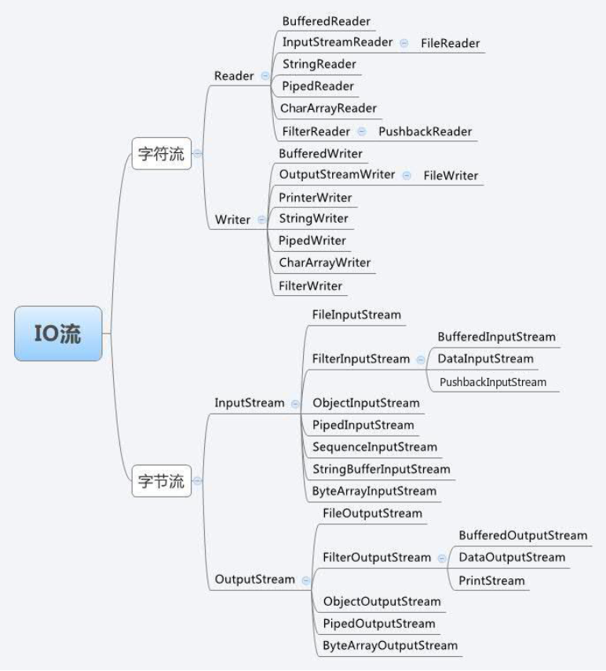
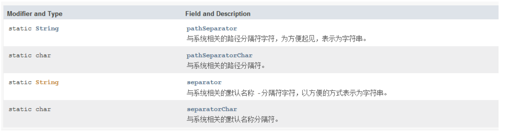

# Java Stream、File、IO

换行符转整型为10，所以使用BufferedReader的read方法实现readLine的写法：

```java
import java.io.BufferedReader;
import java.io.IOException;
import java.io.InputStreamReader;

public class FileTest {
    public static void main(String[] args) {
        BufferedReader reader = new BufferedReader(new InputStreamReader(System.in));
        StringBuilder s = new StringBuilder();
        int tempInt;
        try {
            while ((tempInt = reader.read()) != 10) {
                s.append((char) tempInt);
            }
        } catch (IOException e) {
            e.printStackTrace();
        }
        System.out.println(s);

    }
}
```

BufferedReader类的read方法返回值是整数（因为是字符流，所以范围是0到2的16词方），是作为一个整数读入的字符，一般处理时强转为char，例子，读取一个单词（不包含空格）：

```java
import java.io.BufferedReader;
import java.io.IOException;
import java.io.InputStreamReader;

public class FileTest {
    public static void main(String[] args) throws IOException {
        BufferedReader reader = new BufferedReader(new InputStreamReader(System.in));
        StringBuilder s = new StringBuilder();
        char c;
        while ((c = (char) reader.read()) != ' ') {
            s.append(c);
        }
        System.out.println(s);
    }
}
```



为什么区分字节流和字符流：

> 字符流处理的bai单元为2个字节的Unicode字符，du分别操作字符、字zhi符数组或字dao符串，zhuan而字节流处理单元为1个字节， 操作shu字节和字节数组。所以字符流是由Java虚拟机将字节转化为2个字节的Unicode字符为单位的字符而成的，所以它对多国语言支持性比较好！如果是 音频文件、图片、歌曲，就用字节流好点，如果是关系到中文（文本）的，用字符流好点.
> 所有文件的储存是都是字节（byte）的储存，在磁盘上保留的并不是文件的字符而是先把字符编码成字节，再储存这些字节到磁盘。在读取文件（特别是文本文件）时，也是一个字节一个字节地读取以形成字节序列.
> 字节流可用于任何类型的对象，包括二进制对象，而字符流只能处理字符或者字符串； 2. 字节流提供了处理任何类型的IO操作的功能，但它不能直接处理Unicode字符，而字符流就可以。

Java IO流分为流IO（java.io）和块IO（java.nio）

**三、根据功能分为节点流和包装流**

　　节点流：可以从或向一个特定的地方(节点)读写数据，直接连接数据源。如最常见的是文件的FileReader，还可以是数组、管道、字符串，关键字分别为ByteArray/CharArray，Piped，String。.

　　处理流（包装流）：并不直接连接数据源，是对一个已存在的流的连接和封装，是一种典型的装饰器设计模式，使用处理流主要是为了更方便的执行输入输出工作，如PrintStream，输出功能很强大，又如BufferedReader提供缓存机制，**推荐输出时都使用处理流包装。**

　　　　　　一个流对象经过其他流的多次包装，称为流的链接。

 注意：一个IO流可以即是输入流又是字节流又或是以其他方式分类的流类型，是不冲突的。比如FileInputStream，它既是输入流又是字节流还是文件节点流。


File类



> File.pathSeparator指的是分隔连续多个路径字符串的分隔符，例如:
> java  -cp  test.jar;abc.jar  HelloWorld
> 就是指“;”
>
> File.separator才是用来分隔同一个路径字符串中的目录的，例如：
> C:\Program Files\Common Files
> 就是指“\”