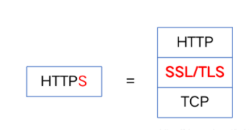
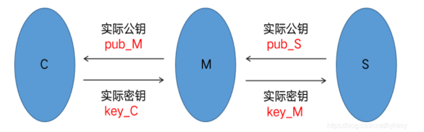
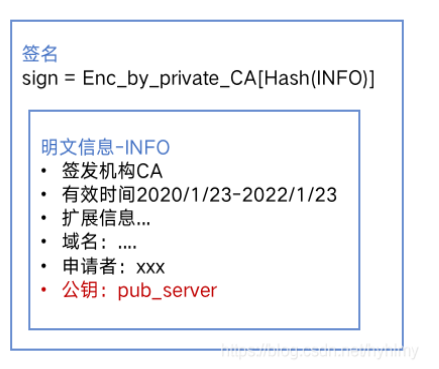
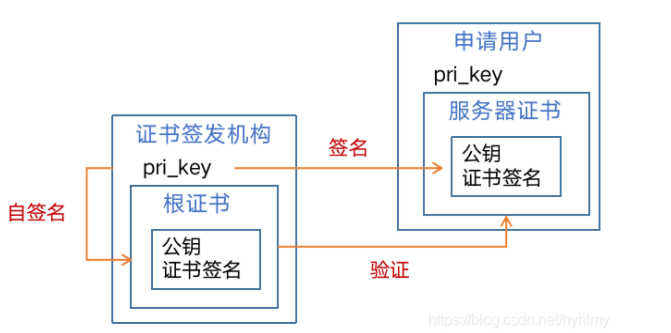

# Https原理

HTTPS(Secure Hypertext Transfer Protocol) 中文名叫安全超文本传输协议，它是基于http开发的，可以简单理解为具有数据加密功能的http，其对数据的加解密都是由ssl/tls完成。

SSL(Secure Sockets Layer )，及其继任者TLS（Transport Layer Security）是介于应用层和传输层之间的为网络通信提供加解密的一种安全协议。因为https的安全机制是依赖于ssl/tls实现的，所以要弄懂https主要是要搞清楚ssl/tls的原理。

## 加密数据

1. 对称加密：通信双方使用同一个密钥对数据进行加解密，因为只有一个密钥，且该密钥既能加密数据又能解密数据，所以密钥不能公开，应确保只有通信双方知道，要是密钥泄露就会有安全风险。常见的对称加密方式有**AES。**

2. 非对称加密：通信双方使用两个不同的密钥对数据进行加解密，这两个密钥分别是公钥和私钥，其中公钥加密的数据只有私钥能解，私钥加密的数据也只有公钥能解。私钥不能公开，因为可以根据私钥生成对应的公钥，如果私钥被别人知道这样就没有安全性可言，所以私钥通常会存放在服务端，相反的公钥是可以公开的，公钥通常会分发给客户端。常见的非对称加密方式有**RSA。**

   

在现实场景中我们倾向于用对称加密的方式加密数据，原因是非对称加密计算复杂，加密速度慢，性能低下，相比之下对称加密在性能上会有绝对优势。

## 密钥协商

基于数据加密的原理，使用对称加密通信，双方都需要持有密钥（key），密钥通常是由服务器和客户端其中一方生成然后下发给对方，这个过程我们通常称之为密钥协商。密钥协商有一个关键步骤就是密钥分发，怎么安全地把密钥发送给对方呢？如果密钥是跟随数据一起下发给对方，在分发过程中要是被第三方窃取，那么第三方就能够解密双方的数据往来，这样就有安全风险。

**如何安全分发密钥？**

密钥分发存在安全问题主要是由于对称加密的特性，即密钥可以解密通信双方的数据，一旦密钥泄露，那么双方加密的数据，第三方都能够破解。基于此考虑于是就有人想出了新的办法，引入非对称加密，一开始服务端先以明文方式下发公钥给客户端，私钥则保留在自己手上，客户端收到公钥后生成对称加密的密钥（本文中我们暂且都叫协商密钥），然后用公钥加密，发给服务端，服务端用私钥解密就能拿到协商密钥了，之后的通信就都基于此密钥加密。

因为公钥加密的数据只有私钥才能破解，所以即使公钥下发过程中被第三方窃取了也没关系，因为客户端生成的协商密钥会用公钥加密，加密后的数据只有私钥能解，第三方用公钥是解不了的，所以协商密钥就不会被泄露，也就保证了密钥分发安全。

总结下，在数据加密传输过程中，基于效率考虑我们通常会用对称加密的方式加密数据，但是因为对称加密需要进行密钥分发，在分发过程中会存在安全问题，所以又引入了非对称加密来保证密钥分发的安全，整个密钥协商的过程采用了非对称加密和对称加密相结合的技术。

## 公钥分发问题

使用公钥加密协商密钥的方式貌似解决了密钥分发的问题，但是却引入了新的问题，即公钥分发问题，因为需要事先把公钥发给客户端，在分发过程中是不能保证绝对安全的。

假如出现中间人攻击那么就有可能出现如下场景：

1. 服务器下发公钥pub_S给客户端
2. 被中间人截获替换成自己的公钥pub_M发给客户端
3. 客户端生成对称加密的密钥key_C用pub_M加密发给服务器
4. 中间人截获数据用pri_M解密得到key_C，然后将key_C替换成自己的key_M用pub_S加密发给服务器
5. 服务器拿到数据用pri_S解密得到key_M
6. 之后客户端的数据都会用key_C加密，服务端的数据都会用key_M加密，因为中间人同时拥有key_C和key_M，所以就能破解客户端和服务器之间的通信数据

在出现中间人攻击的情况下，公钥分发也是不安全的，**主要原因就在于客户端没办法验证服务器的身份**，即没办法验证接收到的公钥是一个合法的服务器下发的

## 服务器身份认证

**CA机构：**

CA机构就类似于派发“身份证”的第三方，它是由大家共同认可的权威机构，你可以理解为公安局或政府机构，只要在它这里进行认证的服务器都会被大家认为是合法，可靠的服务器。**CA机构对服务器进行身份认证是通过签发数字证书的方式进行的。**

**数字证书**：

1. 公钥
   公钥是必不可少的，因为数字证书本来就是为了解决公钥分发的安全问题，**公钥的作用是后面进行密钥协商时加密客户端生成的协商密钥发给服务器**。
2. 签名
   签名是由证书签发机构的私钥对明文信息的数字摘要进行加密后的一串数据，**主要作用是用于客户端检验证书合法性**。

数字证书可以简单概括为由以下几个部分组成：**证书 = 签名 + 公钥 + 其他信息**。

## 数字摘要

数字摘要是将任意长度的消息变成固定长度的短消息，它类似于一个自变量是消息的函数，也就是Hash函数。数字摘要就是采用单向Hash函数将需要加密的明文“摘要”成一串固定长度（128位）的密文这一串密文又称为数字指纹，它有固定的长度，而且不同的明文摘要成密文，其结果总是不同的，而同样的明文其摘要必定一致。除此之外数字摘要还具有不可逆性。常见的用于生成数字摘要的算法有md5，sha1，sha256等。

**数字摘要经常被用于进行数据完整性检验**。
通常服务器会下发一段明文和其对应的摘要给客户端，客户端拿到数据后对明文也进行同样的hash运算得出对应的摘要，再与服务端下发的摘要进行对比，如果相等就说明数据完整，否则就可以判定数据被篡改。

## 数字签名

数字签名是签发者用自己的私钥对一段信息的数字摘要进行加密后的一串数据。数字签名的主要作用是能够用它来验证签名签发者的身份。数据发送方下发一串签名，数据接收方必须用签名签发者私钥对应的公钥才能解密。所以如果数据接收方持有某个对象的公钥，那么它就只能解密该对象签发的签名，这样就能识别签名签发者的身份。

## 自签名证书

数字证书除了由第三方私钥签名（比如由ca机构签名），其实也可以用自己的私钥签名。
**用自己的私钥给自己的公钥签名的证书称为自签名证书**。自签名证书可以自我验证，即可以拿证书的公钥解证书的签名。由第三方私钥签名的证书就不是自签名证书，验证时需要由存放第三方公钥的证书验证。

### 如何验证证书有效性

因为证书中的签名是由其签发机构的私钥加密的，所以如果我们知道签发机构的公钥就可以通过公钥是否能解密签名判断证书是否由该机构签发。反过来，假如我们已经知道了一些合法机构的公钥，那么只要用这些公钥去解密证书的签名，通过是否可以解密成功判断证书是否由合法机构签发。

客户端要验证证书合法性首先需要内置合法签发机构的公钥，在通常情况下我们认为只有ca机构签发的证书是合法的，其他对象签发的证书则认为是非法，所以客户端会内置ca机构的公钥，当然不是直接以公钥形式存在客户端，而是以证书形式，即包含ca机构公钥的证书，通常我们称为根证书，也就是客户端会内置ca机构的根证书，主要作用是用于验证服务器证书合法性。

#### 1. 检验证书是否由合法机构签发

因为证书中的签名是由其签发机构的私钥加密的，所以如果我们知道签发机构的公钥就可以通过公钥是否能解密签名判断证书是否由该机构签发。反过来，假如我们已经知道了一些合法机构的公钥，那么只要用这些公钥去解密证书的签名，通过是否可以解密成功判断证书是否由合法机构签发。

客户端要验证证书合法性首先需要内置合法签发机构的公钥，在通常情况下我们认为只有ca机构签发的证书是合法的，其他对象签发的证书则认为是非法，所以客户端会内置ca机构的公钥，当然不是直接以公钥形式存在客户端，而是以证书形式，即包含ca机构公钥的证书，通常我们称为根证书，也就是客户端会内置ca机构的根证书，主要作用是用于验证服务器证书合法性。

**如何让客户端信任自签名证书？**
因为客户端默认只会内置ca机构的根证书，那么我们的自签名证书都会认为是非法的，在实际开发中，申请个ca证书往往会比较麻烦而且价格昂贵，所以有些公司会采取用自签名证书来认证服务器，那么怎么让客户端信任我们的自签名证书呢？
如果想让客户端信任我们的自签名证书，那么只需要将自签名证书导入到客户端的合法证书库里就可以，当然不同平台可能会有一些限制，比如Android7以上即使自己导入了证书也是不受信任的，需要通过代码手动开启。在Android中如何信任自签名证书请查看我的另一篇博客，Android信任Https自签名证书详细教程。

