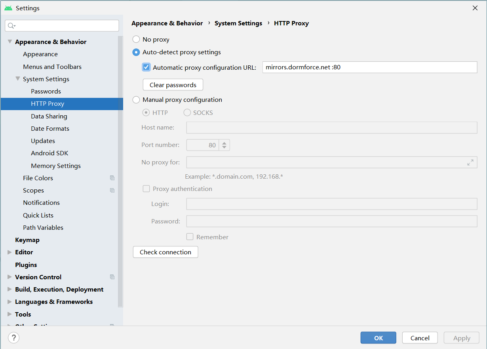
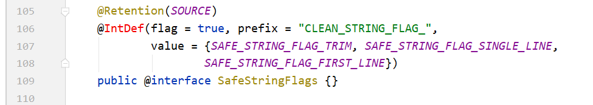
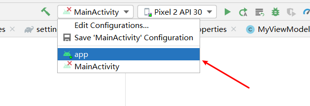

# 1. 解决无法运行Java main函数

Android Studio更新换代快，稳定版目前已经更新到了4.1，我用的也才到3.6.3，但是从3.6版本起，似乎都有一个问题，就是在正常没有修改的模式下，不能运行java main函数了，比如说你想写个简单的测试类都不行，可能这也是Google希望普及Kotlin吧。

报错如下：

```
16:56:29: Executing task 'JavaTest.main()'...

Executing tasks: [JavaTest.main()] in project D:\LearningStuding\Android_Edition_3\Unit_3_Kotlin


FAILURE: Build failed with an exception.

* Where:
Initialization script 'C:\Users\Administrator\AppData\Local\Temp\JavaTest_main__.gradle' line: 21

* What went wrong:
A problem occurred configuring project ':app'.
> Could not create task ':app:JavaTest.main()'.
   > SourceSet with name 'main' not found.

* Try:
Run with --stacktrace option to get the stack trace. Run with --info or --debug option to get more log output. Run with --scan to get full insights.

* Get more help at https://help.gradle.org

BUILD FAILED in 348ms
16:56:30: Task execution finished 'JavaTest.main()'.
```

解决这个问题很简单，在Project显示下，也就是文件的实际目录结构下，找到`.idea/gradel.xml`文件，在`GradleProjectSettings`下添加一条属性

```xml
<option name="delegatedBuild" value="false" />
```


# 2. 优化国内AS体验

分为三个方面

## 2.1 使用国内的代理

点击左上角File，依次打开`File/Setting/System Settings/Http Proxy`，设置国内的镜像地址，然后点击`clear passwords`



常用的国内镜像地址如下：

```
1、东软信息学院（笔者当前在用）

mirrors.neusoft.edu.cn     端口：80
2、北京化工大学

ubuntu.buct.edu.cn/ubuntu.buct.cn  端口：80
3、中国科学院开源协会

mirrors.opencas.cn (mirrors.opencas.org/mirrors.opencas.ac.cn)    端口：80
4、上海GDG镜像服务器

sdk.gdgshanghai.com   端口：8000
5、电子科技大学

mirrors.dormforce.net  端口：80
```


## 2.2 弃用jcenter仓库，改用国内仓库地址

这里需要知道，Jcenter是Google官方的仓库，里面拥有Google的许多内置组件，但是在国内访问是特别慢的，所以国内一般使用阿里巴巴提供的国内仓库；

找到外层的`build.gradle`文件，注释掉`dependencies`和`repositories`中的`jcenter()`，也可以不注释，添加上阿里的地址即可，保证在`jcenter()`上方

```kotlin
repositories {
        google()
        maven { url 'http://maven.aliyun.com/nexus/content/groups/public/' }
        jcenter()
    }

allprojects {
    repositories {
        google()
        maven { url 'http://maven.aliyun.com/nexus/content/groups/public/' }
        jcenter()
    }
}
```


## 2.3 使用离线Gradle

如果不是自己创建的项目的话，如fork别人的项目到本地，AS会检测本地是否存在对应的Gradle版本，但一般都会是不一样的，如果你直接使用AS打开这个项目，AS就会自动开始下载项目文件中对应的Gradle版本，而一般都接近1G，所以会很慢。

所以一般情况下都可以在使用AS打开项目之前，就修改文件中的Gradle版本，修改为本地中Gradle的位置，这样AS就不会自动去下载新的了；

1. 下载和自己AS版本对应的Gradle版本，必须对应版本才能正常运行；下载时选择后缀为`all`的文件，不要解压缩；

   > 查看AS版本对应Gradle版本的地址：https://developer.android.google.cn/studio/releases/gradle-plugin#updating-plugin
   >
   > 下载Gradle版本的地址：https://gradle.org/releases/

2. 将下载后的压缩文件放在你觉得的地方，以防万一，文件夹不要用中文和其他非字母字符，如D:\Gradle\gradle-6.5.all.zip

3. 打开你的项目所在文件夹，找到并打开`gradle/wapper/gradle-wrapper.properties`，修改`distributionUrl`的参数为上一步压缩文件存放的位置；

   ```kotlin
   distributionUrl=file:///D:\Gradle\gradle-6.5.all.zip
   ```

4. 同步一下或者重启即可


# 3. Android Studio 提示“你的主机中的软件中止了一个已建立的连接”问题解决方法

一般为某个应用占用了AS需要的ADB端口，一般都是安装了其他豌豆荚什么模拟器的；

或者是windows开启了热点，需要把热点关闭


# 4. 布局文件显示Design editor is unavailable until a successful build

打开`File` 找到–> `Sync Project with Gradle Files`点击 就可以出来了

如果Layout里的视图还是没有 一片空白

找到`res`，没错，就是资源文件夹的那个`res`，找到`styles.xml`文件 双击打开

将`Theme.AppCompat.Light.DarkActionBar`改为`Base.Theme.AppCompat.Light.NoActionBar`

然后打开`layout.xml`文件看看有没有预览视图


# **5. 能够运行，但是TextUtils工具类中注解爆红 



暂未解决


# 6. 其他活动不能设置为主活动

起初原因是我想设置其他如MainActivity2为主活动，这个问题很简单，只需要将之前在MainActivity中的`intent-filter`下的内容剪切到MainAvtivity2下面即可，如：

```xml
<manifest xmlns:android="http://schemas.android.com/apk/res/android"
    package="com.example.biliandroid">

    <application
        android:allowBackup="true"
        android:icon="@mipmap/ic_launcher"
        android:label="@string/app_name"
        android:roundIcon="@mipmap/ic_launcher_round"
        android:supportsRtl="true"
        android:theme="@style/Theme.BiliAndroid">
        <activity android:name=".MainActivity2">
            <intent-filter>
                <action android:name="android.intent.action.MAIN" />

                <category android:name="android.intent.category.LAUNCHER" />
            </intent-filter>
        </activity>
        <activity android:name=".MainActivity"></activity>
    </application>

</manifest>
```

但是运行会报错：

> Error running 'MainActivity': The activity must be exported or contain an intent-filter

原因在于我第一次启动模拟器的时候是使用快捷键alt+shift+F10来启动应用，但其实这个快捷键只是启动当前Activity，不是整个app，所以会报错。

解决方法是设置启动app，如下图所示：




# **7. ViewModel更新后Activity和Fragment的写法

详细博客待更新


# 8. 加载Github上下载的项目，但是很多地方爆红

要运行github上项目的基本思路：

1. 下载项目到本地；
2. 修改最外层build.gradle文件，修改classpath为本地下载了的文件，参看你本地机器其他可运行的项目（防止AS打开项目重新下载）；
3. 修改gradle-wrapper.properties文件，修改distributionUrl参数为本地下载了的文件，同上（防止AS打开项目重新下载）；

照理来说应该AS打开很快就能运行，但是我打开我以前的项目，项目Bundle等地方爆红，也无法运行，运行键是灰色；

**解决办法：**修改内层即Model层的build.gradle文件，添加适配的目标版本为30，然后添加buildToolsVersion属性，如下：

```gradle
android {
    compileSdkVersion 30
    buildToolsVersion "30.0.1"
    defaultConfig {
        applicationId "com.example.luis.login"
        minSdkVersion 21
        targetSdkVersion 30
        versionCode 1
        versionName "1.0"
        testInstrumentationRunner "android.support.test.runner.AndroidJUnitRunner"
    }
    buildTypes {
        release {
            minifyEnabled false
            proguardFiles getDefaultProguardFile('proguard-android.txt'), 'proguard-rules.pro'
        }
    }
}
```

# 9. Android 10.0不能运行HttpURLConnection

 Android 9不让客户端通过非https方式访问服务端数据(不允许发送明文http请求)，Google表示，为保证用户数据和设备的安全，针对下一代 Android 系统(Android P) 的应用程序，将要求默认使用加密连接，这意味着 Android P 将禁止 App 使用所有未加密的连接，因此运行 Android P 系统的安卓设备无论是接收或者发送流量，未来都不能明码传输，需要使用下一代(Transport Layer Security)传输层安全协议，而 Android 9.0以下不受影响

因此在Android9.0上 使用HttpUrlConnection进行http请求会出现以下异常：

```
W/System.err: java.io.IOException: Cleartext HTTP traffic to **** not permitted
```

**三种解决方法：**

1. App改用https请求

2. targetSdkVersion降到27以下

3. 在项目文件夹建一个子文件夹res/xml，添加network_security_config.xml文件，并保存到res/xml下。

   ```xml
   <?xml version="1.0" encoding="utf-8"?>
   <network-security-config>
       <base-config cleartextTrafficPermitted="true">
           <trust-anchors>
               <certificates src="system" />
           </trust-anchors>
       </base-config>
   </network-security-config>
   ```

   然后在AndroidManifest中引用

   ```xml
   <application
       android:networkSecurityConfig="@xml/network_security_config"
       ...">
       ...    
   </application>
   ```

   

# 10. 使用百度地图SDK的时，报错java.lang.UnsatisfiedLinkError

原因是导入so库不完整在，我是复制粘贴的，但我也忘记我第一次复制哪里的了。总之，注意以下：

1. 迅雷下载百度地图SDK时可能不完整，在下载之前和之后注意比对一下文件大小，如果不等，则是下载不完全，建议不要使用迅雷下载百度地图SDK
2. 也可能是Android Studio中复制粘贴，导致文件复制不完全，如果出现此异常，则比对一下so库中的内容是否缺少，不行的话建议在文件夹中复制粘贴百度地图SDK

# 11. 在RecyclerView单个item的点击事件中getAdapterPostion返回-1

原因：在onCreateViewHolder方法中，返回值之前写成

```java
return new ViewHolder(view)
```

但是添加了点击事件之后，我们自己已经创建了一个ViewHolder，并传入了view，所以需要直接返回我们创建的这个holder，如果还是返回new的ViewHolder，则在我们创建的ViewHolder的点击事件中就拿不到Position

解决：

```java
final ViewHolder holder = new ViewHolder(view);
...
return holder;
```

# **12. 研究新的theme和旧的theme的区别与联系

# **13. 详解Context

